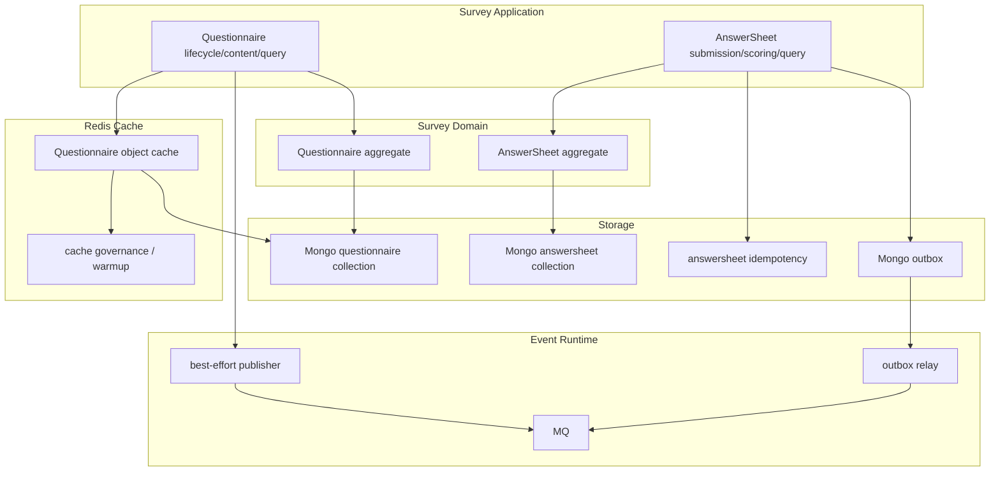
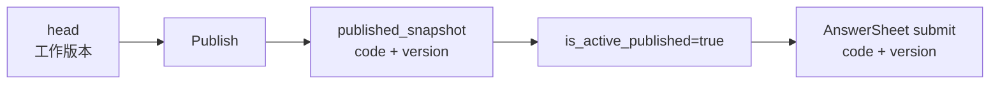
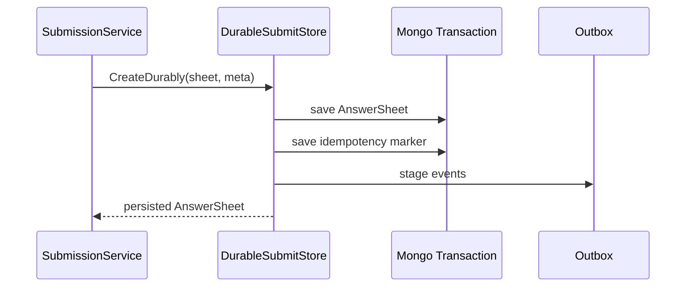
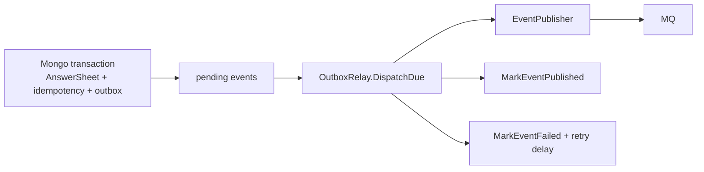

# 存储事件缓存边界

**本文回答**：Survey 模块中的 `Questionnaire` 与 `AnswerSheet` 分别如何落库，哪些事件是 best-effort、哪些事件必须走 durable outbox，Redis cache 在读取与治理中扮演什么角色，以及这些基础设施能力如何保持“优化归优化、事实归事实”的边界。

---

## 30 秒结论

| 能力 | 当前事实 |
| ---- | -------- |
| Questionnaire 主存储 | MongoDB，按 `head` 与 `published_snapshot` 区分工作版本和发布快照 |
| AnswerSheet 主存储 | MongoDB，答卷创建即提交，提交后作为不可变采集事实 |
| 问卷缓存 | Redis object cache 装饰 Questionnaire repository，加速 head、active published、code+version 查询 |
| 答卷提交事件 | `answersheet.submitted` 是评估主链起点，必须随答卷 durable submit 写入 outbox |
| 问卷变更事件 | `questionnaire.changed` 是生命周期通知，当前 delivery 为 `best_effort` |
| 统计足迹事件 | 答卷 durable submit 还会追加 footprint 类事件，供 statistics/behavior 投影 |
| 缓存边界 | Redis cache 只加速读和支持治理，不是问卷或答卷的事实来源 |
| 事件边界 | outbox 解决“写库成功但事件丢失”问题，不改变领域事件的业务语义 |

一句话概括：**Survey 的事实在 Mongo，事件出站通过 event catalog/outbox 分类管理，Redis 只做读优化和治理，不承担领域真值。**

---

## 1. Survey 为什么要单独说明存储、事件、缓存

Survey 看起来只是“问卷 + 答卷”，但它实际上踩在三类基础设施上：

```text
MongoDB   保存问卷结构和答卷事实
Event     把问卷变更、答卷提交、统计足迹传给后续链路
Redis     加速问卷读取、支持 cache governance，不承载主写事实
```

这三者必须分清，否则会出现几类典型错误：

| 错误理解 | 后果 |
| -------- | ---- |
| 把 Redis 当成问卷事实源 | 缓存不一致时会误判问卷结构 |
| 把 `questionnaire.changed` 当成强一致业务命令 | best-effort 事件失败后会被误判为主业务失败 |
| 把 `answersheet.submitted` direct publish | 答卷写库成功但事件发布失败会丢失评估起点 |
| 用当前 head 问卷解释历史答卷 | 后台编辑会污染已提交答卷 |
| 在 collection 侧保存答卷 | 会产生第二写模型，破坏 apiserver 权威边界 |

所以这篇文档的重点不是“用了 Mongo/Redis/MQ”，而是：**谁是事实源，谁是优化层，谁是异步出站机制。**

---

## 2. 总体关系图



---

## 3. Questionnaire 存储边界

### 3.1 为什么 Questionnaire 不只是一个文档

Questionnaire 要同时支持：

1. 后台继续编辑工作版本。
2. 前台只提交已发布版本。
3. 历史答卷按提交时的问卷版本被解释。
4. 当前对外可提交版本可以切换或下线。

因此当前 Mongo repository 不是简单按 `code` 存一条记录，而是引入了 record role：

| record role | 语义 |
| ----------- | ---- |
| `head` | 工作版本，供后台编辑、草稿保存、下一次发布使用 |
| `published_snapshot` | 已发布快照，供前台提交和历史答卷按版本回放使用 |

### 3.2 head 与 published_snapshot



发布流程会：

1. 更新 head。
2. 创建或更新 `published_snapshot`。
3. 将该版本设置为 active published version。
4. 后续未指定版本的提交会读取当前 active published version。

这保证了：

```text
后台可以继续编辑 head
前台提交只使用 active published snapshot
历史答卷使用 code + version 精确回放
```

### 3.3 查询语义

| 查询 | 语义 |
| ---- | ---- |
| `FindByCode` | 查工作版本 head |
| `FindPublishedByCode` | 查当前 active published version |
| `FindLatestPublishedByCode` | 查最新发布快照，用于恢复或兼容 |
| `FindByCodeVersion` | 优先查 published_snapshot，必要时兼容 head version |

这几个方法不能互换。提交答卷时，应该解析可提交的 published version，而不是直接拿 head。

---

## 4. AnswerSheet 存储边界

### 4.1 AnswerSheet 的事实源

AnswerSheet 是一次提交后的作答事实。它的主存储在 MongoDB。AnswerSheet 不是 Redis cache，不是 MQ 消息，也不是 collection 本地状态。

AnswerSheet 保存的核心信息包括：

| 信息 | 用途 |
| ---- | ---- |
| `questionnaire_code` | 指向问卷族 |
| `questionnaire_version` | 指向提交时使用的问卷版本 |
| `filler` | 谁填写 |
| `filled_at` | 何时填写 |
| `answers` | 题目编码、题型、答案值、分数 |
| `score` | 答卷总分，提交时可为 0，后续计分后更新 |

### 4.2 durable submit

AnswerSheet 不应通过普通 `Create` 直接保存。当前提交主路径使用 durable submit：



这个边界同时保存：

1. AnswerSheet 文档。
2. `idempotency_key` 对应的 completed submission 记录。
3. `answersheet.submitted` 事件。
4. 统计 footprint 事件。

### 4.3 业务幂等记录

当请求带 `idempotency_key` 时，durable submit 会先查 completed submission。如果已有结果，直接返回已有 AnswerSheet，避免重复创建答卷和重复产生事件。

并发情况下，如果插入或事务冲突，代码会短暂等待 completed submission，以便复用已有提交结果。

---

## 5. 事件边界

Survey 中至少有两类事件：

| 事件 | 来源 | delivery | 业务语义 |
| ---- | ---- | -------- | -------- |
| `questionnaire.changed` | Questionnaire 生命周期 | `best_effort` | 问卷配置变化通知 |
| `answersheet.submitted` | AnswerSheet durable submit | `durable_outbox` | 答卷已成为评估主链起点 |
| `footprint.answersheet_submitted` | AnswerSheet durable submit 附加统计足迹 | `durable_outbox` | 统计/行为投影输入 |

事件的 delivery class 来自 `configs/events.yaml`，不是文档口头约定。

### 5.1 questionnaire.changed

`questionnaire.changed` 是生命周期通知。它的典型用途包括：

- 缓存刷新。
- 二维码生成。
- 问卷治理通知。
- 发布后副作用。

它当前是 `best_effort`。这意味着它不适合承载必须强一致完成的主业务命令。

### 5.2 answersheet.submitted

`answersheet.submitted` 是后续异步评估主链的起点。它触发 worker 后续动作：

```text
CalculateAnswerSheetScore
CreateAssessmentFromAnswerSheet
```

因此它不能只是 direct publish。必须和 AnswerSheet 写入处在同一个 durable 边界内进入 outbox。

### 5.3 footprint.answersheet_submitted

答卷提交时还会追加 statistics footprint 事件。这个事件不改变 AnswerSheet 本身，但支持后续行为足迹和统计投影。

注意：统计投影失败不应该反向修改 AnswerSheet 事实。

---

## 6. Outbox relay 边界

Outbox 不是业务模型，而是可靠出站机制。



`OutboxRelay` 的核心流程是：

1. `ClaimDueEvents` 领取到期事件。
2. 运行 before-publish hooks。
3. 调用 publisher 发布事件。
4. 成功则 `MarkEventPublished`。
5. 失败则 `MarkEventFailed`，并设置下次重试时间。

这说明：**outbox 解决的是可靠出站，不是事件业务语义本身。**

---

## 7. Questionnaire 缓存边界

Questionnaire 读取有 Redis object cache 装饰器。

### 7.1 缓存了什么

缓存 repository 会缓存：

| key 语义 | 来源 |
| -------- | ---- |
| head questionnaire | `FindByCode` |
| active published questionnaire | `FindPublishedByCode` |
| code + version questionnaire | `FindByCodeVersion` |

### 7.2 缓存何时失效

当 Questionnaire 被更新、切换 active published version、清空 active published、删除、hard delete 时，缓存会按 code 删除相关 key 和版本 pattern。

这保证缓存不会长期覆盖 Mongo 中的最新事实。

### 7.3 缓存不是事实源

缓存只做 read-through：

```text
先查 Redis
miss 后查 Mongo
再回写 Redis
```

因此：

- Redis 不可用时，不应改变问卷事实。
- 缓存 miss 不代表问卷不存在。
- 缓存数据不应作为发布状态的最终判定。
- QuestionCache warmup 只是性能优化。

---

## 8. AnswerSheet 缓存边界

当前 Survey 的重点缓存主要落在 Questionnaire object cache。AnswerSheet 作为提交事实和评估输入，核心依赖 Mongo durable store 与 outbox，不应把 Redis 当成 AnswerSheet 权威源。

如果未来要给 AnswerSheet 查询加缓存，必须遵守：

| 原则 | 说明 |
| ---- | ---- |
| cache-aside / read-through | 缓存只服务查询 |
| 不缓存未确认提交 | collection 本地 queued/processing 不应进入业务缓存 |
| 分清 idempotency 与 query cache | 幂等记录不等于查询缓存 |
| 写后失效 | AnswerSheet score 更新后必须处理缓存失效 |
| 不影响 outbox | 缓存失败不应阻断 durable submit |

---

## 9. 事件与缓存的关系

事件和缓存经常同时出现，但它们不是同一类东西。

| 类型 | 解决的问题 | 失败影响 |
| ---- | ---------- | -------- |
| 缓存 | 读性能、热点保护 | 读慢一点或回源 Mongo |
| best-effort event | 通知类副作用 | 副作用可能延迟或丢失，不影响主事实 |
| durable outbox event | 主链路异步推进 | 需要重试和排障，否则下游状态卡住 |

因此，问卷发布后可以通过事件触发缓存刷新或二维码生成，但缓存刷新失败不应该改变“问卷是否已发布”的事实。

---

## 10. 存储、事件、缓存的设计模式

| 模式 / 技法 | 当前位置 | 作用 |
| ----------- | -------- | ---- |
| Repository | Mongo Questionnaire / AnswerSheet repository | 封装持久化细节 |
| Repository Decorator | CachedQuestionnaireRepository | 不改变业务调用面前提下增加缓存 |
| Snapshot | published_snapshot | 保护已发布问卷版本可追溯 |
| Transactional Outbox | AnswerSheet durable submit | 答卷与事件起点一致 |
| Event Catalog | `configs/events.yaml` | 统一事件类型、topic、handler、delivery |
| Read-through Cache | ObjectCacheStore | miss 后回源 Mongo 并回写 |
| Cache Governance | Warmup / family status | 让缓存能力可观测、可治理 |

---

## 11. 设计取舍

| 设计 | 收益 | 代价 |
| ---- | ---- | ---- |
| Questionnaire 使用 published_snapshot | 已发布版本可追溯，不被 head 修改污染 | Mongo 查询和缓存 key 更复杂 |
| AnswerSheet durable submit | 避免答卷保存成功但事件丢失 | 引入 outbox relay、重试和排障成本 |
| questionnaire.changed best-effort | 生命周期通知轻量 | 不能承载强一致业务命令 |
| Questionnaire cache decorator | 不污染应用层调用面 | 需要严谨失效策略 |
| 缓存不做事实源 | 降低一致性风险 | 缓存不可用时会回源 Mongo，性能下降 |
| footprint 事件随 durable submit 附加 | 统计投影不丢主链输入 | 统计系统需要处理异步最终一致性 |

---

## 12. 常见误区

### 12.1 “Redis 里有问卷，所以 Redis 是事实源”

错误。Redis 只是缓存。Mongo 中的 Questionnaire head 和 published_snapshot 才是事实源。

### 12.2 “questionnaire.changed 失败说明发布失败”

不准确。发布本身由 Mongo head/snapshot 和状态决定。`questionnaire.changed` 是通知类事件，当前 delivery 是 best-effort。

### 12.3 “answersheet.submitted 可以直接 publish”

不建议。这个事件是评估主链起点，必须和答卷持久化同边界进入 outbox，否则可能出现答卷已保存但后续评估永远不开始。

### 12.4 “历史答卷可以用当前 Questionnaire head 解释”

错误。历史答卷必须使用提交时保存的 `questionnaire_code + questionnaire_version`。

### 12.5 “缓存失效可以靠事件保证”

不严谨。事件可以辅助刷新，但缓存层仍必须有 TTL、失效、回源和治理机制。不能让事件成为唯一一致性机制。

---

## 13. 修改指南

### 13.1 修改 Questionnaire 存储结构

必须同步检查：

```text
domain/survey/questionnaire
infra/mongo/questionnaire/po.go
infra/mongo/questionnaire/mapper.go
infra/cache/questionnaire_cache.go
api/rest/apiserver.yaml
docs/02-业务模块/survey
```

如果影响 published_snapshot，还要补 read model / contract test。

### 13.2 修改 AnswerSheet 存储结构

必须同步检查：

```text
domain/survey/answersheet
infra/mongo/answersheet/po.go
infra/mongo/answersheet/mapper.go
infra/mongo/answersheet/durable_submit.go
application/survey/answersheet
internal/apiserver/interface/grpc/proto/answersheet
```

如果影响 `answersheet.submitted` payload，要同步检查 worker handler 和 `configs/events.yaml`。

### 13.3 新增 Survey 事件

必须同步检查：

```text
configs/events.yaml
event catalog tests
worker handler registry
publisher / outbox delivery class
docs/03-基础设施/event
```

如果该事件是主业务推进起点，默认应优先考虑 durable outbox；如果只是通知类副作用，可以评估 best-effort。

### 13.4 调整缓存策略

必须同步检查：

```text
infra/cache/questionnaire_cache.go
cachepolicy
cacheplane keyspace
cache governance docs
docs/03-基础设施/redis
```

不要只改 TTL 而不说明业务影响。

---

## 14. 代码锚点

### Questionnaire 存储与缓存

- Mongo repository：[../../../internal/apiserver/infra/mongo/questionnaire/repo.go](../../../internal/apiserver/infra/mongo/questionnaire/repo.go)
- Questionnaire mapper：[../../../internal/apiserver/infra/mongo/questionnaire/mapper.go](../../../internal/apiserver/infra/mongo/questionnaire/mapper.go)
- Questionnaire cache：[../../../internal/apiserver/infra/cache/questionnaire_cache.go](../../../internal/apiserver/infra/cache/questionnaire_cache.go)
- Questionnaire domain：[../../../internal/apiserver/domain/survey/questionnaire/](../../../internal/apiserver/domain/survey/questionnaire/)

### AnswerSheet 存储与 outbox

- AnswerSheet domain：[../../../internal/apiserver/domain/survey/answersheet/answersheet.go](../../../internal/apiserver/domain/survey/answersheet/answersheet.go)
- durable store port：[../../../internal/apiserver/application/survey/answersheet/durable_store.go](../../../internal/apiserver/application/survey/answersheet/durable_store.go)
- durable submit：[../../../internal/apiserver/infra/mongo/answersheet/durable_submit.go](../../../internal/apiserver/infra/mongo/answersheet/durable_submit.go)
- AnswerSheet mapper：[../../../internal/apiserver/infra/mongo/answersheet/mapper.go](../../../internal/apiserver/infra/mongo/answersheet/mapper.go)

### Event

- Event catalog：[../../../configs/events.yaml](../../../configs/events.yaml)
- Outbox relay：[../../../internal/apiserver/application/eventing/outbox.go](../../../internal/apiserver/application/eventing/outbox.go)
- Event runtime：[../../../internal/pkg/eventruntime/](../../../internal/pkg/eventruntime/)
- Worker dispatcher：[../../../internal/worker/integration/eventing/dispatcher.go](../../../internal/worker/integration/eventing/dispatcher.go)

### Cache governance

- Cache policy：[../../../internal/apiserver/infra/cachepolicy/](../../../internal/apiserver/infra/cachepolicy/)
- Cache plane：[../../../internal/pkg/cacheplane/](../../../internal/pkg/cacheplane/)
- Cache governance observability：[../../../internal/pkg/cachegovernance/observability/](../../../internal/pkg/cachegovernance/observability/)

---

## 15. Verify

```bash
go test ./internal/apiserver/infra/mongo/questionnaire
go test ./internal/apiserver/infra/mongo/answersheet
go test ./internal/apiserver/infra/cache
go test ./internal/apiserver/application/survey/answersheet
go test ./internal/pkg/eventcatalog
go test ./internal/apiserver/application/eventing
```

如果修改了事件配置：

```bash
make docs-hygiene
go test ./internal/worker/integration/eventing ./internal/worker/handlers
```

如果修改了缓存 key 或治理能力：

```bash
go test ./internal/pkg/cacheplane ./internal/pkg/cachegovernance/...
```

---

## 16. 下一跳

- AnswerSheet 提交与校验：[02-AnswerSheet提交与校验.md](./02-AnswerSheet提交与校验.md)
- 题型校验与计分扩展：[03-题型校验与计分扩展.md](./03-题型校验与计分扩展.md)
- 新增题型 SOP：[05-新增题型SOP.md](./05-新增题型SOP.md)
- 事件系统：[../../03-基础设施/event/README.md](../../03-基础设施/event/README.md)
- Redis 与缓存：[../../03-基础设施/redis/README.md](../../03-基础设施/redis/README.md)
