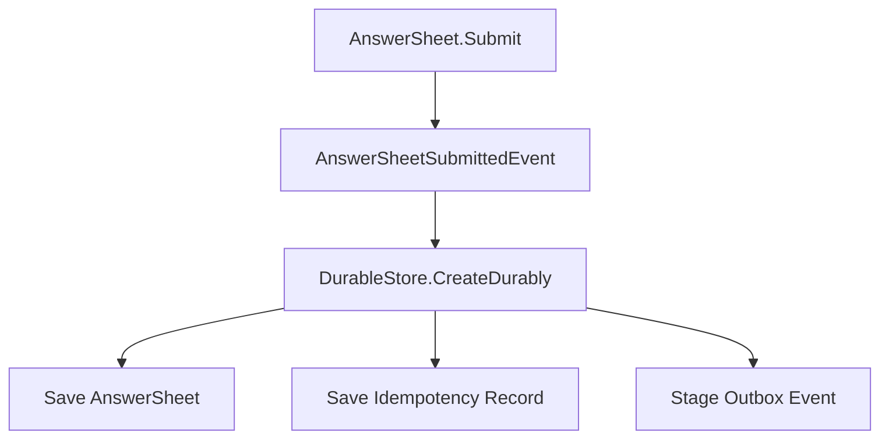
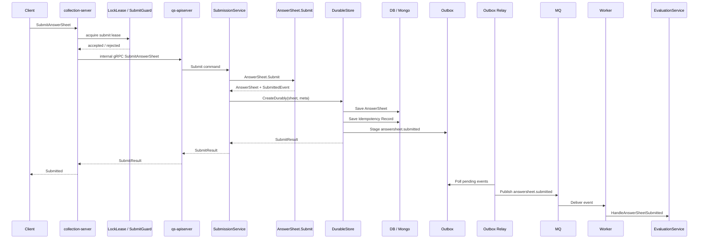

# 测评提交事件幂等与 Outbox 出站链路

> 本文是 Survey 模块文档的第五篇。
>
> 上一篇《03-测评服务查询与提交链路》说明了前台测评查询与答卷提交如何从 `collection-server` 进入 `qs-apiserver`，以及 `SubmissionService` 如何编排 `Questionnaire / SubmissionSpec / AnswerValidator / AnswerSheet.Submit`。
>
> 本文聚焦可靠提交与事件出站：`IdempotencyKey` 如何保证重复提交安全；`LockLease / SubmitGuard` 与持久化幂等记录有什么区别；`DurableStore` 如何同时保存 `AnswerSheet`、幂等记录和 `Outbox` 事件；`answersheet.submitted` 如何可靠出站；`Outbox relay / Worker / Evaluation` 如何处理重复事件与异步执行。

---

## 1. 结论先行

答卷提交不是只写一条 `AnswerSheet` 记录。

它至少要同时保证三件事：

```text
1. AnswerSheet 作答事实被保存；
2. 重复提交可以被安全识别和处理；
3. answersheet.submitted 事件可以可靠出站，驱动后续 Evaluation。
```

因此，Survey 提交链路需要一个可靠提交边界：

```text
AnswerSheet + Idempotency Record + Outbox Event
```

一句话概括：

> **答卷提交的事实源在 qs-apiserver，可靠性边界在 DurableStore，事件出站通过 Outbox 完成。**

注意：

```text
collection-server 负责入口保护和 IdempotencyKey 传递；
qs-apiserver 负责创建 AnswerSheet 事实；
DurableStore 负责持久化幂等与 Outbox staging；
Outbox relay 负责事件发布；
Worker / Evaluation 负责消费事件并保持下游幂等。
```

---

## 2. 本文边界

本文只讨论答卷提交的可靠性与事件出站。

本文重点：

```text
IdempotencyKey；
LockLease / SubmitGuard；
DurableStore；
AnswerSheet 保存；
持久化幂等记录；
Outbox staging；
answersheet.submitted；
Outbox relay；
Worker 消费；
Evaluation 幂等。
```

本文不展开：

```text
Questionnaire / SubmissionSpec 模型细节；
AnswerSheet / Answer / AnswerValue 模型细节；
collection-server 查询与提交应用链路；
Evaluation 计分、解释、报告生成细节。
```

这些分别由其他文档承接：

```text
01-Questionnaire模型-Questionnaire-Question-SubmissionSpec.md
02-AnswerSheet模型-AnswerSheet-Answer-AnswerValue.md
03-测评服务查询与提交链路.md
```

---

## 3. 为什么需要可靠提交边界

如果答卷提交只做：

```text
save AnswerSheet；
publish answersheet.submitted；
```

会出现典型双写问题。

### 3.1 答卷保存成功，但事件发布失败

```text
AnswerSheet 已经保存；
MQ publish 失败；
Worker 永远不知道这份答卷；
Evaluation 不会执行；
前台看到已提交，但报告一直不生成。
```

### 3.2 事件发布成功，但答卷事务失败

```text
MQ publish 成功；
AnswerSheet 保存失败或事务回滚；
Worker 收到事件后加载不到答卷；
下游进入异常状态。
```

### 3.3 重复提交导致多份答卷或重复评估

```text
用户重复点击提交；
网络重试；
collection-server 超时重发；
worker 重复消费；
outbox relay 重复发布。
```

如果没有幂等设计，可能出现：

```text
同一个业务提交生成多份 AnswerSheet；
同一份 AnswerSheet 创建多个 Assessment；
同一份答卷重复生成报告；
统计数据重复累加。
```

因此，需要把提交可靠性拆成三层：

```text
入口重复抑制；
提交事实幂等；
下游消费幂等。
```

---

## 4. 三层幂等模型

Survey 提交链路中的幂等不只是一处逻辑。

建议分成三层理解。

| 层次 | 位置 | 代表机制 | 解决问题 |
| --- | --- | --- | --- |
| 入口重复抑制 | collection-server | LockLease / SubmitGuard | 短时间重复点击、并发提交 |
| 提交事实幂等 | qs-apiserver DurableStore | Idempotency Record / Unique Key | 同一次提交请求不重复创建 AnswerSheet |
| 消费幂等 | Worker / Evaluation | Processed Event / Assessment Unique Key | outbox 或 MQ 重复事件不重复评估 |

三者不能互相替代。

```text
LockLease 不能替代 DurableStore 幂等；
DurableStore 幂等不能替代 Worker 消费幂等；
Worker 消费幂等也不能补救提交事实层的重复创建。
```

---

## 5. IdempotencyKey 的语义

`IdempotencyKey` 表示一次提交请求的去重身份。

它不是 AnswerSheetID。

```text
AnswerSheetID：答卷事实身份；
IdempotencyKey：提交请求幂等身份。
```

### 5.1 IdempotencyKey 从哪里来

通常可以由前端或 collection-server 生成。

来源包括：

```text
前端生成 request id；
collection-server 为一次提交生成 key；
基于 task_id + testee_id + questionnaire_ref + client_nonce 生成；
基于业务规则生成确定性幂等 key。
```

具体策略取决于业务需求。

关键要求是：

```text
同一次用户提交重试时，IdempotencyKey 保持一致；
不同业务提交不能误用同一个 key；
key 的作用域要明确，例如 org_id / task_id / filler / testee / questionnaire_ref。
```

### 5.2 IdempotencyKey 解决什么

它解决的是：

```text
请求重试；
重复点击；
网络超时后再次提交；
collection-server 与 qs-apiserver 之间调用不确定。
```

目标是：

```text
同一个 IdempotencyKey 对应同一个提交结果。
```

### 5.3 IdempotencyKey 不解决什么

它不解决：

```text
Outbox relay 重复发布；
MQ 至少一次投递导致 Worker 重复消费；
Evaluation 内部重复执行；
不同 IdempotencyKey 但业务上重复的提交。
```

这些需要下游幂等和业务唯一约束继续保证。

---

## 6. LockLease / SubmitGuard 与持久化幂等的区别

`LockLease / SubmitGuard` 主要挂在 `collection-server` 入口侧。

它解决的是短时间重复进入提交链路的问题。

例如：

```text
用户连续点击提交按钮；
同一端短时间内发起多个相同请求；
入口层希望先抑制明显重复请求。
```

它的语义是：

```text
某个提交 key 在短时间内只能有一个请求进入后端主链路。
```

但它不是持久化事实幂等。

| 机制 | 位置 | 语义 |
| --- | --- | --- |
| LockLease / SubmitGuard | collection-server / resilience | 短时间重复提交抑制 |
| Idempotency Record | qs-apiserver / DurableStore | 提交事实层持久化去重 |

### 6.1 为什么 LockLease 不能替代 Idempotency Record

因为 LockLease 通常有 TTL，而且属于入口保护。

可能出现：

```text
LockLease 已过期，但用户重试仍然是同一次提交；
collection-server 重启导致本地状态丢失；
多个入口节点之间锁状态不一致；
请求已经进入 qs-apiserver 后，入口锁不再控制事务结果。
```

因此，最终能否重复创建 AnswerSheet，必须由 `qs-apiserver` 的 DurableStore 幂等记录兜底。

### 6.2 为什么 Idempotency Record 不能替代 LockLease

Idempotency Record 在持久化阶段生效。

如果大量重复请求都打到 qs-apiserver，再依赖数据库幂等兜底，会造成：

```text
主业务服务压力升高；
数据库热 key 竞争；
重复请求占用连接池；
提交延迟升高。
```

所以入口侧仍需要 LockLease / SubmitGuard 做前置抑制。

---

## 7. DurableStore 的定位

`DurableStore` 是答卷提交的可靠持久化边界。

它不只是普通 repository。

它负责把一次提交的多个持久化动作放在同一个一致性边界中。

```text
AnswerSheet.Submit
  -> DomainEvents
  -> DurableStore.CreateDurably
      -> Save AnswerSheet
      -> Save Idempotency Record
      -> Stage Outbox Event
```



### 7.1 DurableStore 应该做什么

```text
检查 IdempotencyKey 是否已经处理；
保存 AnswerSheet；
保存幂等记录；
把 AnswerSheetSubmittedEvent 写入 Outbox；
处理并发提交下的唯一约束冲突；
在重复提交时返回已有结果；
清理或确认聚合事件已被 stage。
```

### 7.2 DurableStore 不应该做什么

```text
加载 Questionnaire；
执行题型校验；
计算 FactorScore；
创建 Assessment；
直接 publish MQ；
生成 Report。
```

这些职责分别属于 SubmissionService、AnswerValidator、Evaluation 和 Outbox relay。

---

## 8. DurableStore 的推荐写入语义

提交持久化可以抽象为：

```text
CreateDurably(sheet, meta)
```

其中 `meta` 包含：

```text
IdempotencyKey；
RequestID；
Filler / Testee / OrgID / TaskID；
TraceID；
SubmittedAt。
```

推荐语义：

```text
如果 IdempotencyKey 未出现：
    保存 AnswerSheet；
    保存 Idempotency Record；
    stage Outbox Event；
    返回新提交结果。

如果 IdempotencyKey 已成功处理：
    返回已有 AnswerSheetID 或已有提交结果。

如果 IdempotencyKey 正在处理中：
    返回处理中 / 冲突 / 稍后查询。

如果发生唯一约束冲突：
    尝试按 IdempotencyKey 或业务唯一键查询已有结果并返回。
```

这样可以应对：

```text
网络重试；
并发提交；
服务超时；
数据库唯一约束竞争。
```

---

## 9. Outbox 的定位

Outbox 是可靠事件出站边界。

它解决的问题是：

```text
业务数据写入数据库；
同时需要通知消息系统；
但数据库事务和消息 broker 之间不能天然保持原子一致。
```

在 Survey 中，Outbox 负责保存待发布的：

```text
answersheet.submitted
```

### 9.1 Outbox owner 是谁

Outbox owner 是 `qs-apiserver` 的 DurableStore 边界。

不是 collection-server。

边界如下：

```text
collection-server：接收请求、入口保护、传递 IdempotencyKey、调用 internal gRPC；
qs-apiserver：创建 AnswerSheet、保存幂等记录、stage Outbox；
Outbox relay：读取 outbox 并发布 MQ；
Worker：消费 MQ 并驱动 Evaluation。
```

### 9.2 为什么 collection-server 不拥有 Outbox

因为 collection-server 不拥有 AnswerSheet 持久化事务。

如果 collection-server 发布事件，会出现：

```text
collection-server 发布了 submitted；
但 qs-apiserver 保存 AnswerSheet 失败；
Worker 收到事件后找不到答卷。
```

所以，事件必须从创建事实的服务中出站。

也就是：

```text
谁创建 AnswerSheet 事实，谁负责 stage submitted outbox。
```

---

## 10. answersheet.submitted 的事件语义

`answersheet.submitted` 表达：

```text
一份 AnswerSheet 作答事实已经被正式提交并持久化。
```

它不表达：

```text
Assessment 已经创建；
Evaluation 已经完成；
Report 已经生成；
RiskLevel 已经计算；
Plan 已经完成。
```

### 10.1 推荐 payload

事件 payload 应包含后续模块启动处理所需的最小事实上下文。

```text
event_id；
event_type = answersheet.submitted；
answer_sheet_id；
questionnaire_code；
questionnaire_version；
filler；
testee；
org_id；
task_id；
submitted_at；
trace_id。
```

### 10.2 payload 来源

payload 应主要来自 AnswerSheet 自身：

```text
AnswerSheet.ID；
AnswerSheet.QuestionnaireRef；
AnswerSheet.SubmissionContext；
AnswerSheet.FilledAt。
```

如果 payload 还大量依赖 application 临时拼装，说明 AnswerSheet 模型本身还不完整。

---

## 11. Outbox relay

Outbox relay 负责：

```text
扫描待发布 outbox 记录；
将事件发布到 MQ；
标记发布成功；
失败后重试；
记录重试次数和错误原因；
必要时进入 dead-letter / failed 状态。
```

它不负责：

```text
创建 AnswerSheet；
校验提交幂等；
执行 Evaluation；
生成报告。
```

### 11.1 Outbox relay 可能重复发布

Outbox relay 有可能重复发布事件。

例如：

```text
事件已经发到 MQ；
relay 在标记 published 前崩溃；
重启后再次读取同一条 outbox；
同一个 event 被再次发布。
```

因此，不能依赖 Outbox 达成真正的 exactly-once。

必须要求下游消费者幂等。

---

## 12. Worker 消费与 Evaluation 幂等

Worker 消费 `answersheet.submitted` 后，通常会调用 Evaluation 应用服务。

推荐链路：

```text
Worker
  -> Evaluation application service
  -> Load AnswerSheet
  -> Resolve EvaluationModel
  -> Create / Load Assessment idempotently
  -> Execute Evaluation
  -> Save Result
```

Worker 本身是异步驱动器，不应该承载完整业务状态机。

### 12.1 Evaluation 下游幂等

Evaluation 至少要保证：

```text
同一个 AnswerSheet 不重复创建多个 Assessment；
同一个 event_id 重复消费不会重复产出结果；
同一个 Assessment 重复执行可以安全返回已有结果或被拒绝；
Report 不重复生成冲突版本；
Statistics 不重复累加。
```

常见方式：

```text
Assessment.AnswerSheetID 唯一约束；
processed_events 表；
业务实体中记录 processed event id；
状态机幂等检查；
结果表唯一键。
```

---

## 13. 提交链路全景图



这张图要表达的核心是：

```text
入口保护在 collection-server；
作答事实在 qs-apiserver；
Outbox staging 在 DurableStore；
事件发布由 relay 完成；
Evaluation 异步消费且必须幂等。
```

---

## 14. 状态语义：submitted 不等于 evaluated

答卷提交成功只表示：

```text
AnswerSheet 已保存；
answersheet.submitted 已进入可靠出站链路。
```

它不表示：

```text
Evaluation 已完成；
Assessment 已成功；
Report 已生成。
```

前台状态需要区分：

| 状态 | 归属 | 说明 |
| --- | --- | --- |
| submitted | Survey | 答卷已提交 |
| event_staged | Survey / Outbox | 提交事件已进入 outbox |
| event_published | Outbox relay | 事件已发布到 MQ |
| evaluating | Evaluation | 正在评估 |
| evaluated | Evaluation | 评估完成 |
| evaluation_failed | Evaluation | 评估失败 |

如果前台需要统一状态，可以由 collection-server 聚合 Survey / Evaluation 查询结果。

不要把 Evaluation 状态塞进 AnswerSheet。

---

## 15. 错误与重试边界

### 15.1 入口保护拒绝

例如 RateLimit / Backpressure / LockLease 拒绝。

语义是：

```text
请求没有进入正式提交事实创建。
```

此时不能认为 AnswerSheet 已提交。

### 15.2 DurableStore 写入失败

语义是：

```text
AnswerSheet 未能可靠保存，submitted 事件也不应出站。
```

客户端可以根据错误类型选择重试。

### 15.3 Outbox relay 发布失败

语义是：

```text
AnswerSheet 已保存；
事件仍在 outbox；
relay 后续继续重试。
```

此时提交事实已经成立，不能回滚 AnswerSheet。

### 15.4 Worker 消费失败

语义是：

```text
AnswerSheet 已提交；
Evaluation 暂时失败或等待重试。
```

这不是 Survey 提交失败。

---

## 16. 当前设计成熟度评价

| 方面 | 评价 |
| --- | --- |
| 入口重复抑制 | collection-server 可挂载 LockLease / SubmitGuard |
| 请求幂等 | IdempotencyKey 语义清楚 |
| 事实幂等 | DurableStore 可通过持久化记录保证重复提交安全 |
| 双写一致性 | Outbox staging 与 AnswerSheet 保存处于同一可靠边界 |
| 事件语义 | answersheet.submitted 只表达答卷已提交 |
| Outbox owner | qs-apiserver DurableStore 边界清楚，不属于 collection-server |
| 消费幂等 | Worker / Evaluation 需要自行保证重复事件安全 |
| 状态边界 | submitted 与 evaluated 已区分 |

综合判断：

```text
Survey 提交链路的可靠性设计应围绕 DurableStore + Outbox 展开；collection-server 负责入口保护，qs-apiserver 负责事实创建，Evaluation 负责消费幂等。
```

---

## 17. 后续演进方向

### 17.1 幂等记录状态机

可以为 Idempotency Record 明确状态：

```text
processing；
succeeded；
failed；
expired。
```

用于区分：

```text
请求正在处理；
请求已成功；
请求失败可重试；
key 已过期。
```

### 17.2 Outbox 可观测性

建议补充指标：

```text
pending outbox count；
publish retry count；
oldest pending age；
publish latency；
dead-letter count。
```

### 17.3 Worker 消费幂等索引

Evaluation 可以维护：

```text
processed_event_id；
answer_sheet_id unique；
assessment unique key；
report unique key。
```

### 17.4 统一提交状态查询

前台需要展示状态时，可以由 collection-server 聚合：

```text
Survey submitted；
Outbox published；
Evaluation processing；
Evaluation completed；
Evaluation failed。
```

不要把这些状态都塞进 AnswerSheet。

### 17.5 resilience 文档索引

入口侧 RateLimit / SubmitQueue / Backpressure / LockLease 的实现细节，应继续维护在：

```text
../../03-基础设施/resilience/README.md
```

Survey 只引用它们在提交链路中的位置。

---

## 18. 不建议做的事情

| 不建议 | 原因 |
| --- | --- |
| collection-server 直接发布 submitted 事件 | 它不拥有 AnswerSheet 持久化事务 |
| 保存 AnswerSheet 后直接 publish MQ | 会产生双写不一致窗口 |
| 把 LockLease 当成最终幂等 | LockLease 只是入口重复抑制，不是持久化事实幂等 |
| 只依赖 IdempotencyKey，不做下游幂等 | Outbox / MQ / Worker 仍可能重复投递 |
| Worker 直接写散 Evaluation 状态 | 业务状态机应收敛在 Evaluation application service |
| 把 submitted 当成 evaluated | 提交成功不等于评估完成 |
| 在 AnswerSheet 中保存所有 Evaluation 状态 | 会污染 Survey 作答事实边界 |
| 在 Survey 文档中展开 RateLimit / SubmitQueue 实现 | 这些属于基础设施 resilience 文档 |

---

## 19. 代码锚点

| 类型 | 路径 |
| --- | --- |
| 提交应用服务 | `internal/apiserver/application/survey/answersheet/submission_service.go` |
| DurableStore 接口 | `internal/apiserver/application/survey/answersheet/durable_store.go` |
| transactional durable store | `internal/apiserver/application/survey/answersheet/transactional_durable_store.go` |
| durable submit infra | `internal/apiserver/infra/mongo/answersheet/durable_submit.go` |
| AnswerSheet 聚合 | `internal/apiserver/domain/survey/answersheet/answersheet.go` |
| AnswerSheet 事件 | `internal/apiserver/domain/survey/answersheet/events.go` |
| Outbox 事件契约 | `configs/events.yaml` |
| collection-server 入口 | `internal/collection-server` |
| resilience 文档 | `docs/03-基础设施/resilience` |
| Worker 消费链路 | `internal/worker` |
| Evaluation 应用服务 | `internal/apiserver/application/evaluation` |
```

---

## 20. Verify

修改提交幂等、DurableStore 或 Outbox 链路后，建议执行：

```bash
go test ./internal/apiserver/application/survey/answersheet/...
go test ./internal/apiserver/domain/survey/answersheet/...
go test ./internal/apiserver/infra/mongo/answersheet/...
```

如果改动涉及 collection-server 入口保护：

```bash
go test ./internal/collection-server/...
```

如果改动涉及 worker / evaluation 消费：

```bash
go test ./internal/worker/...
go test ./internal/apiserver/application/evaluation/...
```

如果改动涉及事件契约或文档链接：

```bash
make docs-hygiene
```

全量质量入口：

```bash
make test
make lint
make docs-hygiene
```

---

## 21. 面试与宣讲口径

### 21.1 30 秒版本

```text
答卷提交不是只保存 AnswerSheet，还要保证幂等和事件可靠出站。
collection-server 负责入口保护和 IdempotencyKey 传递；qs-apiserver 的 SubmissionService 创建 AnswerSheet；DurableStore 在一个可靠边界内保存 AnswerSheet、幂等记录和 Outbox 事件；Outbox relay 再发布 answersheet.submitted；Worker 消费事件后驱动 Evaluation，并且下游必须保持幂等。
```

### 21.2 3 分钟版本

```text
Survey 的提交可靠性要分三层看。

第一层是入口重复抑制。collection-server 可以挂载 LockLease、SubmitGuard、RateLimit、SubmitQueue 等能力，先挡住短时间重复点击和瞬时流量。但这只是入口保护，不是最终业务幂等。

第二层是提交事实幂等。请求进入 qs-apiserver 后，SubmissionService 会创建 AnswerSheet 提交事实，然后交给 DurableStore。DurableStore 不只是普通 repository，它要在同一个可靠持久化边界内保存 AnswerSheet、保存 Idempotency Record，并把 AnswerSheetSubmittedEvent stage 到 Outbox。这样可以避免 AnswerSheet 保存成功但事件丢失的问题。

第三层是消费幂等。Outbox relay 可能重复发布事件，MQ 也通常是至少一次投递，所以 Worker 和 Evaluation 不能假设事件只来一次。Evaluation 应该通过 answer_sheet_id 唯一约束、processed_event_id 或 Assessment 幂等逻辑，保证同一份答卷不会重复生成多个评估结果。

所以 submitted 只表示答卷事实已提交，并不表示 Evaluation 已完成。Survey 到 submitted 为止，后续由 Worker 异步驱动 Evaluation。
```

### 21.3 高频追问

| 追问 | 回答要点 |
| --- | --- |
| IdempotencyKey 和 AnswerSheetID 区别？ | 前者是提交请求去重身份，后者是答卷事实身份 |
| LockLease 能替代幂等记录吗？ | 不能。LockLease 是入口重复抑制，幂等记录是持久化事实层去重 |
| 为什么需要 Outbox？ | 避免 AnswerSheet 保存和 MQ publish 之间的双写不一致 |
| Outbox owner 是谁？ | qs-apiserver DurableStore，不是 collection-server |
| answersheet.submitted 表达什么？ | 只表达答卷已提交，不表达评估已完成 |
| Outbox 会重复发布吗？ | 可能，所以 Worker / Evaluation 必须幂等 |
| Worker 可以直接写 Evaluation 表吗？ | 不建议，应调用 Evaluation application service 维护状态机 |
| submitted 和 evaluated 区别？ | submitted 是 Survey 事实，evaluated 是 Evaluation 结果状态 |
| SubmitQueue 属于 Survey 吗？ | 不属于，它是 collection-server 入口削峰能力，属于 resilience 基础设施 |

---

## 22. 下一篇文档

下一篇建议维护：

```text
05-Survey模块分层架构与事实源索引.md
```

重点回答：

```text
Survey 的 Domain / Application / Infra / Transport / Event / Test 事实源分别在哪里；
Questionnaire / AnswerSheet / SubmissionService / DurableStore / collection-server / Outbox 的代码事实源如何索引；
修改 Survey 模块时应同步检查哪些代码、测试、事件契约和文档。
```
