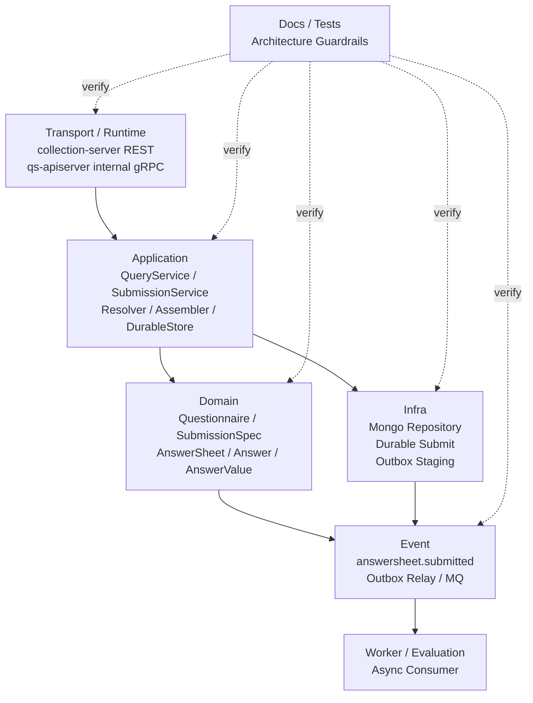

# Survey 模块分层架构与事实源索引

> 本文是 Survey 模块文档的收束篇。
>
> 前面几篇已经分别说明了 Survey 的模块总览、Questionnaire 模板侧模型、AnswerSheet 事实侧模型、测评查询与提交服务链路、提交事件幂等与 Outbox 出站链路。
>
> 本文不再重复业务模型细节，而是作为 Survey 模块的“维护地图”：索引 Domain / Application / Infra / Transport / Event / Test / Docs 的事实源，明确每一层负责什么、修改 Survey 时应该同步检查哪里，避免代码、文档、事件契约和测试发生漂移。

---

## 1. 结论先行

Survey 模块的事实源不能只看某一个文件。

它由多层共同构成：

```text
Domain       定义 Questionnaire / AnswerSheet 的领域模型和不变量
Application  编排查询、提交、幂等、DurableStore 等用例
Infra        实现 Mongo 持久化、Durable Submit、Outbox staging
Transport    暴露 internal gRPC / collection-server REST 入口
Event        定义 answersheet.submitted 事件契约和出站链路
Test         验证模型不变量、应用链路、持久化幂等和事件出站
Docs         解释架构边界、模型语义、链路和维护规则
```

一句话概括：

> **Survey 的核心事实源是 Domain 模型，可靠提交事实源是 Application + Infra，外部入口事实源是 collection-server，事件契约事实源是 configs/events.yaml。**

后续修改 Survey 时，不能只改代码。

必须同步检查：

```text
领域模型；
应用服务；
持久化映射；
collection-server 入口；
internal gRPC 契约；
Outbox 事件契约；
Worker / Evaluation 消费链路；
测试；
文档。
```

---

## 2. Survey 分层总览

Survey 的分层可以概括为：



核心原则：

```text
Transport 负责协议适配，不拥有业务事实；
Application 负责编排用例，不吞掉领域不变量；
Domain 负责模型语义和不变量；
Infra 负责持久化与出站实现，不决定业务语义；
Event 负责事实出站，不表达下游已经完成；
Worker / Evaluation 负责异步消费和结果生成；
Docs / Tests 负责防漂移。
```

---

## 3. Domain 层事实源

Domain 层是 Survey 的核心事实源。

它定义：

```text
什么是 Questionnaire；
什么是 Question；
什么是 SubmissionSpec；
什么是 AnswerSheet；
什么是 Answer；
什么是 AnswerValue；
什么是 AnswerSheetSubmittedEvent。
```

DDD 中 aggregate 是一组可作为整体处理的领域对象，aggregate root 负责保证聚合整体完整性，外部引用应指向 root，而不是随意访问聚合内部对象。这个原则正好对应 Survey 中的两个核心聚合：`Questionnaire` 和 `AnswerSheet`。

## 3.1 Questionnaire 事实源

| 主题 | 代码事实源 |
| --- | --- |
| Questionnaire 聚合根 | `internal/apiserver/domain/survey/questionnaire/questionnaire.go` |
| Questionnaire 生命周期 | `internal/apiserver/domain/survey/questionnaire/lifecycle.go` |
| Questionnaire 类型和值对象 | `internal/apiserver/domain/survey/questionnaire/types.go` |
| Question 模型 | `internal/apiserver/domain/survey/questionnaire/question.go` |
| SubmissionSpec | `internal/apiserver/domain/survey/questionnaire/submission_spec.go` |
| Questionnaire repository 端口 | `internal/apiserver/domain/survey/questionnaire/repository.go` |

Questionnaire 层应回答：

```text
问卷模板是什么；
问卷有哪些题；
题目是什么题型；
题目有哪些选项和校验规则；
问卷是否已发布；
已发布问卷如何生成 SubmissionSpec。
```

Questionnaire 层不应回答：

```text
某次用户提交了什么答案；
答卷如何持久化；
Outbox 如何出站；
Evaluation 如何计算结果。
```

---

## 3.2 AnswerSheet 事实源

| 主题 | 代码事实源 |
| --- | --- |
| AnswerSheet 聚合根 | `internal/apiserver/domain/survey/answersheet/answersheet.go` |
| SubmissionContext / QuestionnaireRef | `internal/apiserver/domain/survey/answersheet/types.go` |
| Answer / AnswerValue | `internal/apiserver/domain/survey/answersheet/answer.go` |
| AnswerSheet 领域事件 | `internal/apiserver/domain/survey/answersheet/events.go` |
| AnswerSheet repository 端口 | `internal/apiserver/domain/survey/answersheet/repository.go` |
| 答案校验适配 | `internal/apiserver/domain/survey/answersheet/validation_adapter.go` |

AnswerSheet 层应回答：

```text
这份答卷基于哪版问卷；
谁填的，为谁填的；
属于哪个组织和任务；
提交了哪些类型化答案；
单题基础分是什么；
提交事实产生了什么领域事件。
```

AnswerSheet 层不应回答：

```text
如何加载 Questionnaire；
如何执行 required/min/max 校验；
如何写 Mongo；
如何 stage Outbox；
如何创建 Assessment；
如何生成 Report。
```

---

## 3.3 Domain 层维护原则

修改 Domain 层时要遵守：

```text
Questionnaire 是模板聚合；
AnswerSheet 是事实聚合；
SubmissionSpec 是模板到提交链路的规格边界；
AnswerValue 是题型扩展的事实侧锚点；
Answer.Score 只是单题基础分；
AnswerSheetSubmittedEvent 只表达答卷已提交。
```

不建议：

```text
在 Questionnaire 中引用 Scale；
在 AnswerSheet 中保存 FactorScore；
在 AnswerSheet 中保存 Evaluation 状态；
让 Domain 直接依赖 Mongo / Redis / MQ；
让 Domain 直接处理 HTTP/gRPC DTO。
```

---

## 4. Application 层事实源

Application 层是 Survey 的用例编排事实源。

它负责把外部请求组织成领域模型协作。

```text
查询用例；
提交用例；
Questionnaire 解析；
答案准备；
答案校验；
提交 finalizer；
DurableStore 端口；
事务性 durable submit 编排。
```

| 主题 | 代码事实源 |
| --- | --- |
| 提交应用服务 | `internal/apiserver/application/survey/answersheet/submission_service.go` |
| 问卷解析 | `internal/apiserver/application/survey/answersheet/submission_questionnaire_resolver.go` |
| 答案准备 | `internal/apiserver/application/survey/answersheet/submission_answer_assembler.go` |
| 提交 finalizer | `internal/apiserver/application/survey/answersheet/submission_finalizer.go` |
| DurableStore 端口 | `internal/apiserver/application/survey/answersheet/durable_store.go` |
| Transactional DurableStore | `internal/apiserver/application/survey/answersheet/transactional_durable_store.go` |
| Survey 查询服务 | `internal/apiserver/application/survey` |

Application 层应回答：

```text
提交用例如何编排；
如何加载已发布 Questionnaire；
如何从 SubmissionSpec 准备答案；
如何调用 AnswerValidator；
如何调用 AnswerSheet.Submit；
如何调用 DurableStore.CreateDurably；
如何把领域结果转成应用结果。
```

Application 层不应回答：

```text
Questionnaire 内部不变量怎么保护；
AnswerSheet 内部不变量怎么保护；
Mongo 文档怎么映射；
Outbox relay 如何发布 MQ；
前端 REST 响应如何展示。
```

---

## 4.1 SubmissionService 事实源

`SubmissionService` 是答卷提交用例的编排入口。

它应保持轻量：

```text
validate command；
resolve published questionnaire；
build submission spec；
prepare answers；
validate answers；
finalize answer sheet；
create durably。
```

它不应变成：

```text
题型规则大杂烩；
Questionnaire 内部结构拆解器；
Mongo 写入器；
MQ publisher；
Evaluation 状态机。
```

---

## 4.2 DurableStore 端口事实源

DurableStore 是提交可靠性在 Application 层的端口。

它表达的是用例级需求：

```text
保存 AnswerSheet；
记录 IdempotencyKey；
stage AnswerSheetSubmittedEvent；
在重复提交时返回稳定结果。
```

具体怎么写 Mongo、怎么建唯一索引、怎么写 Outbox，是 Infra 的事情。

Application 只定义需要什么语义。

---

## 5. Infra 层事实源

Infra 层负责 Survey 的持久化实现和外部基础设施适配。

| 主题 | 代码事实源 |
| --- | --- |
| AnswerSheet Mongo 持久化 | `internal/apiserver/infra/mongo/answersheet` |
| durable submit infra | `internal/apiserver/infra/mongo/answersheet/durable_submit.go` |
| Questionnaire Mongo 持久化 | `internal/apiserver/infra/mongo/questionnaire` |
| Outbox 存储适配 | `internal/apiserver/infra` |
| Mongo model / mapper | `internal/apiserver/infra/mongo` |

Infra 层应回答：

```text
领域对象如何映射成 Mongo 文档；
如何保存 AnswerSheet；
如何保存 Idempotency Record；
如何 stage Outbox；
如何处理唯一索引冲突；
如何从存储还原领域对象或查询 DTO。
```

Infra 层不应回答：

```text
AnswerSheet 是否是合法提交事实；
Questionnaire 是否允许提交；
题型规则如何解释；
Evaluation 是否完成；
前台应该显示什么文案。
```

---

## 5.1 Durable Submit 的事实源

`durable_submit.go` 是答卷可靠提交实现的重要事实源。

它需要和以下语义保持一致：

```text
AnswerSheet 保存；
Idempotency Record 保存；
Outbox Event staging；
重复提交返回已有结果；
并发冲突兜底查询。
```

如果修改这里，需要同步检查：

```text
04-测评提交事件幂等与Outbox出站链路.md；
configs/events.yaml；
Worker / Evaluation 消费幂等；
相关 application tests；
Mongo indexes / migrations。
```

---

## 6. Transport / Runtime 事实源

Transport 层负责把外部协议转换为应用服务调用。

Survey 相关入口分两类：

```text
collection-server 面向前台；
qs-apiserver internal gRPC 面向内部调用。
```

| 主题 | 代码事实源 |
| --- | --- |
| collection-server REST 入口 | `internal/collection-server/transport/rest/handler/answersheet_handler.go` |
| collection-server application | `internal/collection-server/application/answersheet` |
| collection-server runtime | `internal/collection-server` |
| internal gRPC proto | `internal/apiserver/interface/grpc/proto/internalapi/internal.proto` |
| internal gRPC handler | `internal/apiserver/interface/grpc` |
| collection-server 运行时文档 | `docs/01-运行时/02-collection-server运行时.md` |

Transport 层应回答：

```text
前台请求如何进入系统；
REST DTO 如何映射到 internal gRPC；
collection-server 如何传递身份、组织、任务和 IdempotencyKey；
internal gRPC 如何调用 qs-apiserver 应用服务；
前台响应如何适配。
```

Transport 层不应回答：

```text
Questionnaire 聚合不变量；
AnswerSheet 聚合不变量；
DurableStore 如何写库；
Outbox 如何出站；
Evaluation 如何执行。
```

---

## 6.1 collection-server 事实源

collection-server 的定位是前台采集入口，不是 Survey 领域事实源。

它可以挂载：

```text
RateLimit；
SubmitQueue；
Backpressure；
LockLease / SubmitGuard。
```

但这些属于基础设施韧性能力，不属于 Survey 领域模型。

相关事实源：

```text
docs/03-基础设施/resilience/README.md
docs/03-基础设施/resilience/01-RateLimit入口限流.md
docs/03-基础设施/resilience/02-SubmitQueue提交削峰.md
docs/03-基础设施/resilience/03-Backpressure下游背压.md
docs/03-基础设施/resilience/04-LockLease重复提交抑制.md
```

Survey 文档中只应说明这些能力在链路中的位置，不应重复展开实现细节。

---

## 7. Event / Outbox 事实源

Event 层负责 Survey 事实出站。

| 主题 | 事实源 |
| --- | --- |
| AnswerSheetSubmittedEvent 领域事件 | `internal/apiserver/domain/survey/answersheet/events.go` |
| 事件契约 | `configs/events.yaml` |
| Outbox staging | `internal/apiserver/infra/mongo/answersheet/durable_submit.go` |
| Outbox relay | `internal/worker` / outbox relay runtime |
| Worker 消费链路 | `internal/worker` |
| Evaluation 消费 | `internal/apiserver/application/evaluation` |

事件语义必须稳定：

```text
answersheet.submitted 只表达 AnswerSheet 已提交；
不表达 Assessment 已创建；
不表达 Evaluation 已完成；
不表达 Report 已生成。
```

Transactional Outbox 模式的核心是：当一个服务需要同时更新数据库并发送消息时，先把待发送消息作为同一事务的一部分写入数据库，再由独立 relay 发布到 broker，以避免数据库写入和消息发送之间的双写不一致。Outbox relay 可能重复发布消息，因此下游消费者必须幂等。

---

## 7.1 Event 修改检查清单

修改 `answersheet.submitted` 时，必须同步检查：

```text
AnswerSheetSubmittedEvent 领域事件；
configs/events.yaml；
DurableStore outbox payload；
Outbox relay 反序列化；
Worker handler；
Evaluation application service；
文档 04-测评提交事件幂等与Outbox出站链路.md；
事件契约测试。
```

不要只改 payload 结构。

---

## 8. Worker / Evaluation 消费事实源

Survey 文档不展开 Evaluation 内部模型，但必须索引消费边界。

| 主题 | 代码事实源 |
| --- | --- |
| Worker 消费入口 | `internal/worker` |
| Evaluation 应用服务 | `internal/apiserver/application/evaluation` |
| Assessment 领域模型 | `internal/apiserver/domain/evaluation` |
| Scale 规则输入 | `internal/apiserver/domain/authoring/scale`（编排）+ `domain/ruleset/scale`（运行时 payload） |

消费边界：

```text
Worker 是异步驱动器；
Evaluation application service 是状态机入口；
Scale 提供规则输入；
Survey 只提供 AnswerSheet 事实。
```

Idempotent Consumer 模式要求消费者能够正确处理重复消息。常见方式是记录已处理消息 ID，或者在业务实体中记录处理过的事件，从而在重复投递时安全跳过或返回已有结果。

Survey 事件下游也应遵守这个原则：

```text
同一个 answersheet.submitted 事件可能被重复消费；
同一个 AnswerSheet 不应重复创建多个 Assessment；
同一个 Report 不应重复生成冲突版本；
Statistics 不应重复累加。
```

---

## 9. Test 事实源

Survey 的测试事实源应该覆盖四类。

```text
Domain tests；
Application tests；
Infra tests；
Transport / integration tests。
```

| 测试类型 | 应覆盖内容 |
| --- | --- |
| Domain tests | Questionnaire 生命周期、SubmissionSpec、AnswerSheet.Submit、AnswerValue、领域事件 |
| Application tests | SubmissionService 编排、QuestionnaireResolver、AnswerAssembler、AnswerValidator、DurableStore 端口语义 |
| Infra tests | Mongo 映射、durable submit、幂等记录、Outbox staging、唯一索引冲突 |
| Transport tests | collection-server handler、internal gRPC DTO 映射、错误码映射 |
| Event tests | configs/events.yaml、payload 兼容性、worker 消费契约 |

建议测试命令：

```bash
go test ./internal/apiserver/domain/survey/...
go test ./internal/apiserver/application/survey/...
go test ./internal/apiserver/infra/mongo/answersheet/...
go test ./internal/collection-server/...
go test ./internal/worker/...
```

---

## 10. Docs 事实源

Survey 文档分成六篇。

| 文档 | 事实主题 |
| --- | --- |
| `00-模块总览.md` | Survey 定位、职责边界、文档导航 |
| `01-Questionnaire模型-Questionnaire-Question-SubmissionSpec.md` | 模板侧模型、题型扩展、SubmissionSpec |
| `02-AnswerSheet模型-AnswerSheet-Answer-AnswerValue.md` | 事实侧模型、SubmissionContext、AnswerValue、SubmittedEvent |
| `03-测评服务查询与提交链路.md` | collection-server / qs-apiserver 服务链路、查询与提交 |
| `04-测评提交事件幂等与Outbox出站链路.md` | Idempotency、DurableStore、Outbox、Worker / Evaluation 幂等 |
| `05-Survey模块分层架构与事实源索引.md` | 分层事实源、维护清单、防漂移索引 |

相关外部文档索引：

```text
docs/01-运行时/02-collection-server运行时.md
docs/03-基础设施/resilience/README.md
docs/02-业务模块/scale/README.md
docs/02-业务模块/evaluation/README.md
```

---

## 11. 修改场景与同步检查清单

### 11.1 修改题型

如果修改或新增 QuestionType，需要检查：

```text
Question 模型；
SubmissionSpec；
RawSubmissionAnswer DTO；
AnswerValue；
AnswerAssembler；
AnswerValidator；
Mongo 映射；
Query DTO；
collection-server 响应；
前端 renderer；
Evaluation 输入适配；
01 文档；
02 文档；
测试。
```

### 11.2 修改 AnswerSheet 字段

需要检查：

```text
AnswerSheet 聚合；
AnswerSheetSnapshot / DTO；
Mongo schema / mapper；
SubmissionFinalizer；
DurableStore；
AnswerSheetSubmittedEvent payload；
configs/events.yaml；
Worker handler；
02 文档；
04 文档；
测试。
```

### 11.3 修改提交链路

需要检查：

```text
collection-server REST handler；
internal gRPC proto；
SubmissionService；
QuestionnaireResolver；
AnswerAssembler；
AnswerValidator；
SubmissionFinalizer；
DurableStore；
03 文档；
04 文档；
错误码映射；
测试。
```

### 11.4 修改幂等 / Outbox

需要检查：

```text
DurableStore 端口；
transactional durable store；
durable_submit.go；
Mongo indexes；
configs/events.yaml；
Outbox relay；
Worker / Evaluation 幂等；
04 文档；
resilience 文档；
测试。
```

### 11.5 修改 collection-server 入口保护

需要检查：

```text
collection-server runtime；
REST handler；
RateLimit / SubmitQueue / Backpressure / LockLease 配置；
internal gRPC client；
resilience 文档；
03 文档；
运行时文档；
观测指标；
测试。
```

### 11.6 修改 answersheet.submitted 事件契约

需要检查：

```text
AnswerSheetSubmittedEvent；
configs/events.yaml；
DurableStore outbox payload；
Outbox relay；
Worker event decoder；
Evaluation handler；
事件契约测试；
04 文档；
05 文档。
```

---

## 12. 架构边界护栏

### 12.1 Domain 不依赖 Infra

不允许：

```text
domain/survey -> infra/mongo
domain/survey -> redis
domain/survey -> mq
domain/survey -> transport dto
```

Domain 只能表达业务模型和端口。

### 12.2 Application 不直接处理 transport DTO

不建议：

```text
REST DTO 直接进入 Domain；
gRPC request 直接传给 AnswerSheet.Submit。
```

应保持：

```text
REST DTO -> gRPC request -> Application Command -> Domain Input
```

### 12.3 collection-server 不拥有业务事实

collection-server 不应：

```text
直接写 AnswerSheet；
直接 stage Outbox；
直接创建 Assessment；
直接执行 Evaluation。
```

它只负责入口、保护、适配和调用。

### 12.4 Survey 不解释测评结果

Survey 不应：

```text
保存 FactorScore；
保存 RiskLevelResult；
生成 InterpretReport；
决定 EvaluationModel。
```

Survey 只提供作答事实。

### 12.5 Outbox owner 不应漂移

Outbox owner 必须是创建业务事实的边界。

在 Survey 中就是：

```text
qs-apiserver DurableStore
```

不是 collection-server。

---

## 13. 常用 Verify 命令

Survey 模块基础验证：

```bash
go test ./internal/apiserver/domain/survey/...
go test ./internal/apiserver/application/survey/...
```

持久化与 durable submit：

```bash
go test ./internal/apiserver/infra/mongo/answersheet/...
go test ./internal/apiserver/infra/mongo/questionnaire/...
```

collection-server：

```bash
go test ./internal/collection-server/...
```

worker / evaluation 消费：

```bash
go test ./internal/worker/...
go test ./internal/apiserver/application/evaluation/...
```

事件契约与文档：

```bash
make docs-hygiene
```

全量质量入口：

```bash
make test
make lint
make docs-hygiene
```

---

## 14. 面试与宣讲口径

### 14.1 30 秒版本

```text
Survey 模块的分层很清楚：Domain 定义 Questionnaire 和 AnswerSheet 两个核心聚合；Application 编排查询和提交用例；Infra 实现 Mongo 持久化、DurableStore 和 Outbox staging；collection-server 是前台采集入口；configs/events.yaml 是 submitted 事件契约事实源。
后续维护 Survey 时不能只改一个文件，题型、答卷字段、提交链路、Outbox 事件和 worker 消费都要同步检查，避免代码和文档漂移。
```

### 14.2 3 分钟版本

```text
Survey 是 qs-server 的作答事实域，所以它的事实源分布在多个层次。

Domain 层是最核心的事实源。Questionnaire 管可提交模板，Question 管题目、题型、选项和校验规则，SubmissionSpec 管已发布问卷如何被提交。AnswerSheet 管一次正式提交事实，AnswerValue 管类型化答案，AnswerSheetSubmittedEvent 表达答卷已提交。

Application 层负责用例编排，尤其是 SubmissionService。它加载已发布 Questionnaire，构造 SubmissionSpec，准备 AnswerValue，调用 AnswerValidator，最后调用 AnswerSheet.Submit，并交给 DurableStore 持久化。

Infra 层负责具体实现，包括 Mongo repository、durable submit、幂等记录和 Outbox staging。Outbox owner 必须是 qs-apiserver DurableStore，因为它拥有 AnswerSheet 持久化事务，collection-server 不能直接发布 submitted 事件。

Transport 层包括 collection-server 和 internal gRPC。collection-server 是前台采集入口，可以挂载 RateLimit、SubmitQueue、Backpressure 和 LockLease，但这些属于基础设施 resilience，不属于 Survey 领域模型。

最后，事件契约和测试也必须纳入事实源。修改 answersheet.submitted 时，要同步检查 configs/events.yaml、DurableStore payload、Worker 消费、Evaluation 幂等和文档。
```

### 14.3 高频追问

| 追问 | 回答要点 |
| --- | --- |
| Survey 的核心事实源在哪里？ | Domain 层的 Questionnaire / AnswerSheet 聚合是核心事实源 |
| DurableStore 属于哪层？ | Application 端口 + Infra 实现，表达可靠提交边界 |
| collection-server 是业务域吗？ | 不是，它是前台采集运行时入口 |
| Outbox owner 是谁？ | qs-apiserver DurableStore，不是 collection-server |
| 修改题型要检查哪些地方？ | QuestionType、SubmissionSpec、AnswerValue、Validator、Storage、DTO、前端、测试和文档 |
| 修改 submitted 事件要检查什么？ | 领域事件、configs/events.yaml、Outbox payload、Worker、Evaluation、事件契约测试和文档 |
| 为什么 Survey 不保存 Evaluation 状态？ | Survey 是作答事实域，Evaluation 状态属于评估执行域 |
| resilience 文档和 Survey 文档怎么分？ | Survey 讲业务链路位置，resilience 讲 RateLimit / Queue / Backpressure / LockLease 实现 |

---

## 15. 最终判断

Survey 模块当前的文档体系已经可以按以下方式维护：

```text
00 说明模块定位；
01 说明 Questionnaire 模板侧模型；
02 说明 AnswerSheet 事实侧模型；
03 说明 collection-server 与 qs-apiserver 的查询/提交链路；
04 说明幂等与 Outbox 可靠出站；
05 说明分层事实源和防漂移索引。
```

后续维护重点不是继续扩大 Survey 职责，而是守住边界：

```text
Survey 管模板和答卷事实；
Scale 管规则；
Evaluation 管执行结果；
collection-server 管入口；
resilience 管保护能力；
Outbox 管可靠出站。
```

一句话收束：

> **Survey 的价值是提供稳定、可追溯、可可靠出站的作答事实；事实源索引的价值是保证这套语义在代码、测试、事件契约和文档中长期不漂移。**
