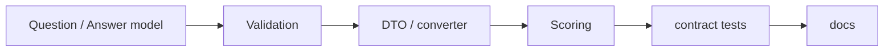
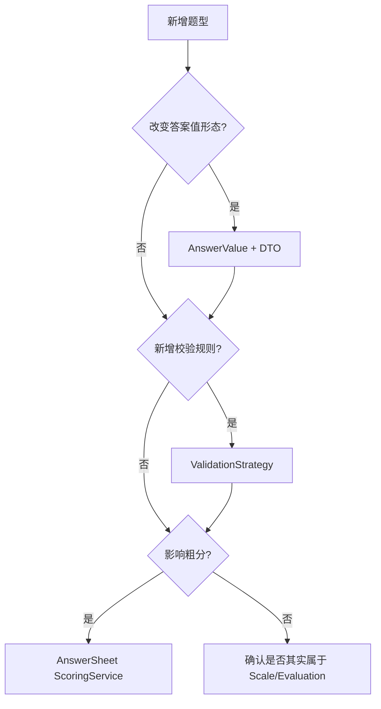

# 新增题型 SOP

**本文回答**：新增问卷题型时，应该按什么顺序改模型、校验、提交、计分、测试和文档。

## 30 秒结论

新增题型按这个顺序做：`领域模型 -> 校验 -> 答案 DTO/转换 -> 粗分 -> 契约/测试 -> 文档`。不要先改前端字段或 evaluation pipeline。



## 操作清单

| 步骤 | 必做 |
| ---- | ---- |
| 1. 模型 | 明确题型名称、答案值结构、选项结构和是否可计分 |
| 2. 校验 | 补 `questionnaire` 与 `answersheet` 侧校验 |
| 3. DTO | 更新 REST/gRPC 输入输出转换，不绕过领域校验 |
| 4. 计分 | 只处理 survey 粗分；医学解释交给 `scale/evaluation` |
| 5. 测试 | 补题目构造、提交合法/非法答案、兼容旧问卷版本 |
| 6. 文档 | 更新本目录、模块入口和必要的 OpenAPI 注释 |

## 设计判断清单

新增题型前先回答下面几个问题，避免把不属于 Survey 的逻辑塞进题型：

| 问题 | 如果答案是“是” | 应维护哪里 |
| ---- | -------------- | ---------- |
| 是否改变答案的 JSON 形态 | 是 | `AnswerValue`、DTO、OpenAPI |
| 是否改变提交合法性 | 是 | validation rule / strategy |
| 是否改变题级粗分 | 是 | answersheet scoring |
| 是否改变因子分或风险等级 | 是 | `scale` / `evaluation`，不是 Survey |
| 是否改变报告文案 | 是 | report / interpretation，不是 Question |



## 设计模式与取舍

| 模式 / 技法 | 什么时候使用 |
| ----------- | ------------ |
| 值对象 | 新答案值形态需要独立封装和校验 |
| 校验策略 | 新 rule type 或题型校验行为不同 |
| Factory | 从 raw JSON 创建领域答案值 |
| 领域服务 | 题目集合或顺序变更需要跨实体不变量 |

取舍是：新增题型不会只改一个文件。这个成本换来的是作答事实可验证、旧问卷版本可兼容、Evaluation 不被题型细节污染。

## 代码与测试锚点

| 能力 | 锚点 |
| ---- | ---- |
| 问卷题目模型 | [internal/apiserver/domain/survey/questionnaire/question.go](../../../internal/apiserver/domain/survey/questionnaire/question.go) |
| 题目管理服务 | [internal/apiserver/domain/survey/questionnaire/question_manager.go](../../../internal/apiserver/domain/survey/questionnaire/question_manager.go) |
| 答案值与校验 | [internal/apiserver/domain/survey/answersheet](../../../internal/apiserver/domain/survey/answersheet/) |
| 应用层提交 | [internal/apiserver/application/survey/answersheet](../../../internal/apiserver/application/survey/answersheet/) |

## 验收命令

```bash
go test ./internal/apiserver/domain/survey/... ./internal/apiserver/application/survey/...
python scripts/check_docs_hygiene.py
```
