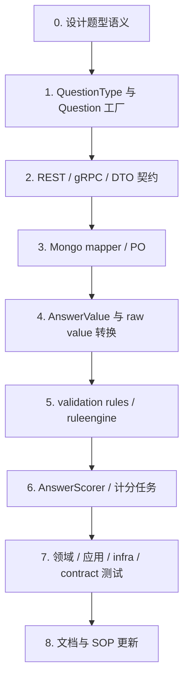

# 新增题型 SOP

**本文回答**：当 Survey 模块需要新增一个问卷题型时，应该按什么顺序修改领域模型、DTO/契约、AnswerValue、提交校验、计分、Mongo 映射、测试和文档，避免“只加枚举、能保存但不能提交/不能计分/不能读取”的半成品状态。

---

## 30 秒结论

新增题型不是单点改动，而是一条贯穿链路：

```text
QuestionType
  -> Question 工厂
  -> DTO / OpenAPI / proto
  -> Mongo mapper
  -> AnswerValue
  -> AnswerValueAdapter
  -> ruleengine validation
  -> AnswerScorer
  -> 提交 / 计分测试
  -> 文档
```

如果只做其中一部分，最常见的问题是：

| 漏改位置 | 结果 |
| -------- | ---- |
| 只加 `QuestionType` | 后台能识别类型名，但题目构造失败或无法提交 |
| 不改 `CreateAnswerValueFromRaw` | 前台提交时报 unsupported question type |
| 不改 mapper | 创建后无法正确持久化或读取 |
| 不改 adapter | 校验规则不生效或错误生效 |
| 不改 scorer | worker 计分后分数始终为 0 或语义不符合预期 |
| 不改契约 | 前端/调用方不知道该传什么 value |
| 不补测试 | 新题型在发布、提交、计分、读取任一环节悄悄失败 |

---

## 1. 新增题型前先做设计判断

开始写代码前，先回答这几个问题。

| 问题 | 必须明确的结论 |
| ---- | -------------- |
| 题型名称是什么 | 例如 `Date`、`MatrixRadio`、`Slider`，需要稳定的字符串值 |
| 前端 value 形态是什么 | string / number / array / object / nested array |
| 是否有 options | 没有 options、单层 options、矩阵行列 options，语义完全不同 |
| 是否有 validation rules | 是否需要 required、range、pattern，是否需要新增规则 |
| 是否参与答案级粗分 | 如果参与，选项分、数字值、区间分还是自定义分 |
| 是否影响因子分和风险等级 | 如果影响，后续要同步 Scale/Evaluation，而不是塞进 Survey |
| 是否兼容旧版本问卷 | published snapshot 中旧题型如何读取和解释 |
| 是否需要前端渲染支持 | 后端新增题型不等于前端已可展示 |
| 是否影响 OpenAPI/proto | 如果 value 形态变了，契约必须同步 |

建议用一句话定义题型：

```text
<Date> 是一种 <输入/选择/展示> 型题目，前端提交值为 <value shape>，提交时校验 <rule>，计分规则为 <scoring>，不会/会参与 Scale/Evaluation 的因子解释。
```

---

## 2. 总体改造流程



执行顺序不要反过来。尤其不要先改前端或 handler，然后再补领域模型；那样最容易产生绕过领域校验的逻辑。

---

## 3. 第一步：修改 QuestionType 与 Question 工厂

### 3.1 新增 QuestionType

先在 `domain/survey/questionnaire` 中新增题型常量。当前已有 `Section / Radio / Checkbox / Text / Textarea / Number` 等类型。

新增时要保持字符串稳定，因为它会进入：

- OpenAPI / proto。
- Mongo 文档。
- 前端配置。
- AnswerSheet 提交 payload。
- 历史问卷 published snapshot。

### 3.2 新增具体 Question 实现

当前 `Question` 是统一接口，所有题型要实现：

```go
GetType()
GetCode()
GetStem()
GetTips()
GetPlaceholder()
GetOptions()
GetValidationRules()
GetCalculationRule()
GetShowController()
```

如果新题型有 options、validation rules、calculation rule，需要按当前模式实现对应 getter。

例如：

| 题型类别 | 建议实现 |
| -------- | -------- |
| 纯展示题 | 类似 `SectionQuestion` |
| 单值输入题 | 类似 `TextQuestion` / `NumberQuestion` |
| 选项题 | 类似 `RadioQuestion` / `CheckboxQuestion` |
| 复杂组合题 | 新建独立结构，不要硬塞进已有题型 |

### 3.3 注册 Question factory

当前题型在 `init()` 中通过 `RegisterQuestionFactory(...)` 注册。新增题型必须注册自己的 factory。

factory 里应该做该题型的基本构造检查，例如：

| 题型 | factory 校验 |
| ---- | ------------ |
| 选项题 | options 不能为空 |
| 文本题 | placeholder 可选 |
| 数字题 | 数值范围规则由 validation 处理 |
| 矩阵题 | 行、列、选项结构必须完整 |
| 日期题 | 是否需要默认格式、范围规则，需单独定义 |

**原则**：factory 做“题型结构能否成立”的校验，validation strategy 做“用户答案是否合法”的校验。

---

## 4. 第二步：更新 DTO、OpenAPI 与 proto

新增题型会影响调用方，因此必须同步契约。

### 4.1 REST / OpenAPI

至少检查：

```text
api/rest/apiserver.yaml
api/rest/collection.yaml
```

如果 OpenAPI 是从 swagger 生成，还需要检查 handler 注释和 DTO 定义。

### 4.2 gRPC proto

至少检查：

```text
internal/apiserver/interface/grpc/proto/answersheet/answersheet.proto
internal/apiserver/interface/grpc/proto/questionnaire/
```

具体是否需要改 proto，取决于当前 proto 对 question type / answer value 是否使用 string / oneof / struct。如果只是 string type，可能不需要改字段结构，但必须更新枚举说明和文档。

### 4.3 DTO 转换

要确认 DTO 转领域模型时：

- 新题型 type 能被识别。
- options、validation rules、calculation rule 能正确进入 QuestionParams。
- show controller 不被破坏。
- value 的 JSON shape 能正确传到 `CreateAnswerValueFromRaw`。

不要在 DTO 层吞掉未知题型，否则领域层无法发现错误。

---

## 5. 第三步：更新 Mongo PO 与 mapper

Questionnaire 和 AnswerSheet 都可能受影响。

### 5.1 Questionnaire mapper

如果新题型只复用现有字段，例如：

```text
type + placeholder + validation rules
```

可能只需保证 mapper 不过滤该 type。

如果新题型引入新结构，例如：

```text
matrix rows / columns
range step
date format
upload constraints
```

就要修改 Questionnaire PO 与 mapper。

### 5.2 AnswerSheet mapper

如果新增 AnswerValue 的 raw value 仍是 string / number / []string，现有 mapper 可能可复用。

如果是 object / nested array / map，则必须确认：

- 能写入 Mongo。
- 能从 Mongo 还原到正确 AnswerValue。
- 历史数据读取不受影响。
- JSON 序列化不丢字段。

**经验规则**：只要 value shape 不是现有简单类型，就必须补 mapper 测试。

---

## 6. 第四步：新增或复用 AnswerValue

`AnswerValue` 是答案值的领域表达。当前有：

| AnswerValue | 适用 |
| ----------- | ---- |
| `StringValue` | Text / Textarea / Section |
| `NumberValue` | Number |
| `OptionValue` | Radio |
| `OptionsValue` | Checkbox |

### 6.1 复用还是新增

| 情况 | 建议 |
| ---- | ---- |
| 新题型 value 就是 string | 可以复用 `StringValue`，但要在文档说明语义 |
| 新题型 value 就是 number | 可以复用 `NumberValue` |
| 新题型 value 是单选 option code | 可以复用 `OptionValue` |
| 新题型 value 是多选 option codes | 可以复用 `OptionsValue` |
| 新题型 value 是结构化对象 | 新增专用 AnswerValue |
| 新题型 value 有领域含义，例如日期范围 | 优先新增专用 AnswerValue，而不是裸 map |

### 6.2 修改 CreateAnswerValueFromRaw

新增题型必须在 `CreateAnswerValueFromRaw` 中明确处理：

```go
case questionnaire.TypeDate:
    // parse / validate raw shape
    return NewDateValue(...), nil
```

这里负责的是“raw value 形态是否合法”。例如：

- Date 必须是 ISO date string。
- Range 必须是 `{min,max}`。
- Matrix 必须是二维结构。
- Upload 必须是文件 ID 列表或对象列表。

这里不要做复杂业务校验，例如年龄范围、医学阈值、风险等级，那些应交给 validation 或 Scale/Evaluation。

---

## 7. 第五步：更新 AnswerValueAdapter

`AnswerValueAdapter` 是提交校验连接 ruleengine 的适配层。新增题型后要确认：

| 方法 | 需要考虑 |
| ---- | -------- |
| `IsEmpty()` | 新题型什么情况下算空 |
| `AsString()` | pattern / length 等规则如何读取 |
| `AsNumber()` | min_value / max_value 是否适用 |
| `AsArray()` | min_selections / max_selections 是否适用 |

### 7.1 简单题型

如果新题型底层复用 string / number / []string，现有 adapter 可能无需修改。

### 7.2 复杂题型

如果新题型是 object / nested array，需要至少做一个判断：

- 是新增 adapter 表面？
- 还是将 object 转成 string/array/number 参与现有规则？
- 是否需要新增 ruleengine port 方法？

不要让 `AsString()` 随便 `fmt.Sprintf` 一个结构体来通过 pattern 校验，除非这是明确设计。

---

## 8. 第六步：新增或复用 validation rule

当前 ruleengine validation 支持：

```text
required
min_length
max_length
min_value
max_value
min_selections
max_selections
pattern
```

### 8.1 复用现有规则

| 新题型 | 可能复用 |
| ------ | -------- |
| Date as string | `required`、`pattern` |
| Slider as number | `required`、`min_value`、`max_value` |
| Tag multi-select | `required`、`min_selections`、`max_selections` |
| Phone / email | `required`、`pattern` |

### 8.2 新增规则

如果现有规则无法表达，就新增 rule type 和 strategy。

示例：

| 规则 | 适用场景 |
| ---- | -------- |
| `date_min` / `date_max` | 日期范围 |
| `matrix_required_each_row` | 矩阵题每行必答 |
| `file_max_size` | 上传题 |
| `option_group_limit` | 分组选项限制 |

新增规则时至少改：

```text
internal/apiserver/port/ruleengine/ruleengine.go
internal/apiserver/infra/ruleengine/validation_strategies.go
internal/apiserver/infra/ruleengine/validation_test.go
docs/02-业务模块/survey/03-题型校验与计分扩展.md
```

---

## 9. 第七步：更新答卷计分

不是所有题型都要计分。先明确：

| 题型 | 计分策略 |
| ---- | -------- |
| 纯展示题 | 不计分 |
| 文本题 | 通常不计分，除非有特殊评分规则 |
| 数字题 | 当前可直接使用数值 |
| 单选题 | option score |
| 多选题 | option scores 求和 |
| 复杂题型 | 需要明确是否转为数值或 option score |

### 9.1 修改 ScorableValue

如果新题型能被现有 `ScorableValue` 表面表达，就无需改 port：

```go
AsSingleSelection()
AsMultipleSelections()
AsNumber()
```

如果不能表达，例如矩阵题，可能需要：

1. 新增 ruleengine port 方法。
2. 或把矩阵题拆成多个单题分数。
3. 或在 Scale/Evaluation 侧解释，不在 Survey 计分。

### 9.2 修改 AnswerScorer

当前 `AnswerScorer` 支持：

| 值形态 | 计分 |
| ------ | ---- |
| single selection | 查 option score |
| multiple selections | option scores 求和 |
| number | 直接使用数值 |
| empty / unknown | 0 |

新增题型如果参与 Survey 粗分，需要扩展 `AnswerScorer` 或 `ScorableValue`。

### 9.3 修改 scoring task assembler

`buildAnswerScoreTasks` 当前从 Question options 构造 `option_code -> score`。如果新题型不使用 options，却需要计分，必须明确计分输入从哪里来。

例如：

- Slider：直接用 answer number。
- Date：一般不计分。
- Matrix：可能每行选项分相加，需要额外结构。
- Upload：一般不计分。

---

## 10. 第八步：更新提交链路测试

至少补这些测试。

### 10.1 AnswerValue 测试

覆盖：

- 合法 raw value。
- 非法 raw value。
- nil value。
- 空值。
- 边界值。

### 10.2 validation 测试

覆盖：

- required。
- 与新题型相关的规则。
- 空值与非必填规则的交互。
- 错误消息。
- 未注册 rule 的行为是否符合预期。

### 10.3 SubmissionService 测试

覆盖：

- 新题型答案能提交。
- 新题型非法答案会失败。
- 新题型与已发布问卷版本配合正常。
- 新题型在指定 questionnaire_version 时仍可提交。

### 10.4 scoring 测试

覆盖：

- 新题型不计分时是否返回 0。
- 新题型计分时是否正确生成 AnswerScoreTask。
- 答卷总分是否正确。
- 无对应 question 时是否跳过或报错，按当前语义测试。

### 10.5 mapper 测试

覆盖：

- Questionnaire 写入再读出。
- AnswerSheet 写入再读出。
- published_snapshot 中包含新题型时可读。
- 历史版本与新版本并存。

---

## 11. 第九步：更新契约和文档

### 11.1 必改文档

至少更新：

```text
docs/02-业务模块/survey/03-题型校验与计分扩展.md
docs/02-业务模块/survey/05-新增题型SOP.md
```

如果影响提交 value 形态，还要更新：

```text
docs/04-接口与运维/
api/rest/
proto
```

如果影响 Scale/Evaluation，继续更新：

```text
docs/02-业务模块/scale/
docs/02-业务模块/evaluation/
```

### 11.2 文档中必须写清楚

新增题型说明至少包含：

| 字段 | 说明 |
| ---- | ---- |
| 题型名称 | 稳定字符串 |
| 前端 value 形态 | JSON 示例 |
| 是否有 options | 选项结构 |
| 支持的 validation rules | required、range、pattern 等 |
| 是否计分 | 计分方式 |
| 存储形态 | Mongo 中如何保存 |
| 兼容性 | 旧问卷和旧答卷影响 |
| 测试锚点 | 对应测试文件 |

---

## 12. 示例：新增 Date 题型

### 12.1 设计说明

```text
题型：date
value：YYYY-MM-DD 字符串
校验：required、pattern；可选 date_min / date_max
计分：默认不计分
存储：AnswerValue.Raw() 返回 string
```

### 12.2 修改路径

```text
domain/survey/questionnaire/types.go
domain/survey/questionnaire/question.go
domain/survey/answersheet/answer.go
domain/survey/answersheet/validation_adapter.go
infra/ruleengine/validation_strategies.go   # 如新增 date_min/date_max
application/survey/answersheet/submission_answer_assembler.go
infra/mongo/questionnaire/mapper.go
infra/mongo/answersheet/mapper.go
api/rest/*.yaml
```

### 12.3 验收

```text
能创建 date 题型问卷
能发布 date 题型问卷
能提交合法 date 答案
非法日期格式能失败
AnswerSheet 能正确保存和读取
计分结果符合“默认不计分”
历史 published_snapshot 可按版本读取
```

---

## 13. 示例：新增 MatrixRadio 题型

### 13.1 设计风险

MatrixRadio 不是普通单选题。它可能是：

```text
每一行一个单选
最终 value 是 row_code -> option_code 的 map
```

这会影响：

- Question 结构：需要 rows 和 columns。
- AnswerValue：不能用单个 OptionValue。
- Validation：需要每行必答、行列合法性。
- Scoring：每行 option score 求和，还是整题一个分？
- Mongo mapper：需要结构化保存。
- OpenAPI/proto：value shape 必须明确。

### 13.2 判断

如果只是为了前端展示方便，不建议直接加入复杂 Matrix 类型。可以考虑在问卷配置阶段把矩阵拆成多个 RadioQuestion，Survey 仍保持一题一答案模型。

如果业务明确需要矩阵作为一个题目，就必须完整走新增复杂题型流程。

---

## 14. 合并前检查清单

提交 PR 前逐项检查：

| 检查项 | 是否完成 |
| ------ | -------- |
| 新题型名称稳定且写入文档 | ☐ |
| QuestionType 已新增 | ☐ |
| Question factory 已注册 | ☐ |
| DTO / OpenAPI / proto 已更新 | ☐ |
| Questionnaire mapper 已覆盖 | ☐ |
| AnswerValue / CreateAnswerValueFromRaw 已覆盖 | ☐ |
| AnswerValueAdapter 行为已确认 | ☐ |
| validation rule 已复用或新增 | ☐ |
| AnswerScorer 行为已确认 | ☐ |
| AnswerSheet scoring task 已覆盖 | ☐ |
| Mongo 写读测试已补 | ☐ |
| 提交合法/非法测试已补 | ☐ |
| 发布快照兼容测试已补 | ☐ |
| 文档已更新 | ☐ |
| `make docs-hygiene` 通过 | ☐ |

---

## 15. 推荐测试命令

```bash
go test ./internal/apiserver/domain/survey/questionnaire
go test ./internal/apiserver/domain/survey/answersheet
go test ./internal/apiserver/application/survey/answersheet
go test ./internal/apiserver/infra/ruleengine
go test ./internal/apiserver/infra/mongo/questionnaire
go test ./internal/apiserver/infra/mongo/answersheet
```

如果影响 REST/gRPC 契约：

```bash
make docs-rest
make docs-verify
```

如果影响 worker 计分链路：

```bash
go test ./internal/apiserver/transport/grpc/service
go test ./internal/worker/handlers
```

---

## 16. 代码锚点

### 题型与问卷

- Question 接口与具体题型：[../../../internal/apiserver/domain/survey/questionnaire/question.go](../../../internal/apiserver/domain/survey/questionnaire/question.go)
- QuestionType：[../../../internal/apiserver/domain/survey/questionnaire/types.go](../../../internal/apiserver/domain/survey/questionnaire/types.go)
- Questionnaire mapper：[../../../internal/apiserver/infra/mongo/questionnaire/mapper.go](../../../internal/apiserver/infra/mongo/questionnaire/mapper.go)

### 答案值、提交与校验

- Answer / AnswerValue：[../../../internal/apiserver/domain/survey/answersheet/answer.go](../../../internal/apiserver/domain/survey/answersheet/answer.go)
- AnswerValueAdapter：[../../../internal/apiserver/domain/survey/answersheet/validation_adapter.go](../../../internal/apiserver/domain/survey/answersheet/validation_adapter.go)
- 提交答案装配：[../../../internal/apiserver/application/survey/answersheet/submission_answer_assembler.go](../../../internal/apiserver/application/survey/answersheet/submission_answer_assembler.go)
- ruleengine port：[../../../internal/apiserver/port/ruleengine/ruleengine.go](../../../internal/apiserver/port/ruleengine/ruleengine.go)
- validation strategies：[../../../internal/apiserver/infra/ruleengine/validation_strategies.go](../../../internal/apiserver/infra/ruleengine/validation_strategies.go)

### 计分

- AnswerScorer：[../../../internal/apiserver/infra/ruleengine/scoring.go](../../../internal/apiserver/infra/ruleengine/scoring.go)
- AnswerSheetScoringService：[../../../internal/apiserver/application/survey/answersheet/scoring_app_service.go](../../../internal/apiserver/application/survey/answersheet/scoring_app_service.go)
- scoring task assembler：[../../../internal/apiserver/application/survey/answersheet/scoring_task_assembler.go](../../../internal/apiserver/application/survey/answersheet/scoring_task_assembler.go)

### 契约

- REST 契约：[../../../api/rest/](../../../api/rest/)
- gRPC proto：[../../../internal/apiserver/interface/grpc/proto/](../../../internal/apiserver/interface/grpc/proto/)

---

## 17. 下一跳

- 题型校验与计分扩展：[03-题型校验与计分扩展.md](./03-题型校验与计分扩展.md)
- AnswerSheet 提交与校验：[02-AnswerSheet提交与校验.md](./02-AnswerSheet提交与校验.md)
- 存储事件缓存边界：[04-存储事件缓存边界.md](./04-存储事件缓存边界.md)
- Scale 规则与因子计分：[../scale/01-规则与因子计分.md](../scale/01-规则与因子计分.md)
