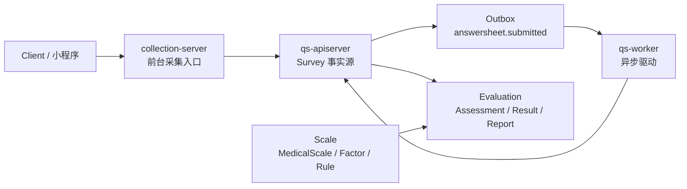
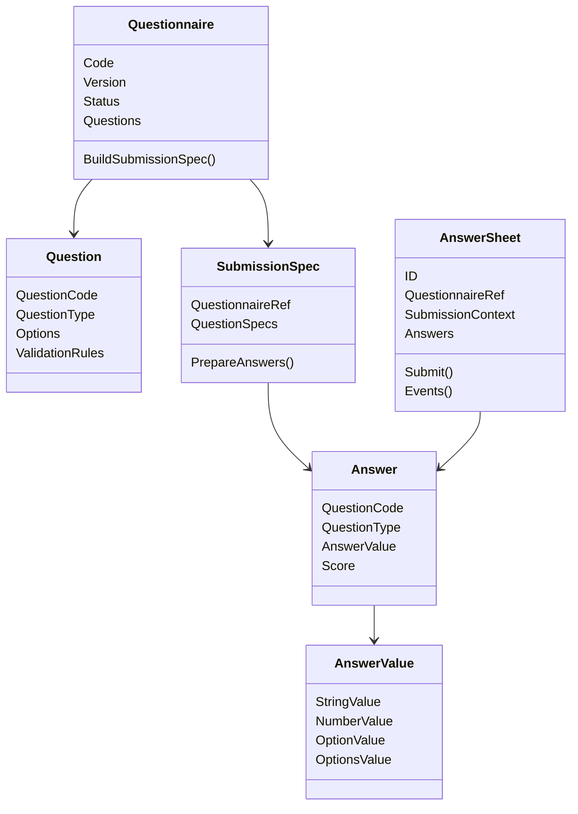

# Survey 模块总览

> 本文是 Survey 模块文档的入口文档。
>
> Survey 是 qs-server 的作答事实域。它负责问卷模板、答卷事实、测评服务查询与提交入口，以及答卷提交后的可靠事件出站。
>
> 本文不展开具体模型细节，而是先说明 Survey 在系统中的定位、核心职责、文档结构、运行链路、分层边界和后续维护原则。

---

## 1. 结论先行

Survey 模块负责回答两个核心问题：

```text
1. 用户可以填写什么问卷？
2. 用户实际提交了什么答卷？
```

它围绕两类事实展开：

```text
Questionnaire：问卷模板事实
AnswerSheet：答卷提交事实
```

Survey 不负责解释答案。

```text
Survey 不计算因子分；
Survey 不判断风险等级；
Survey 不生成报告；
Survey 不推进完整 Assessment 状态机。
```

这些职责属于 Scale / Evaluation。

一句话概括：

> **Survey 管问卷模板与答卷事实，是 Evaluation 的事实输入，不是测评解释中心。**

---

## 2. Survey 在 qs-server 中的位置

qs-server 的业务主线可以拆成三段：

```text
Survey      管“填什么”和“实际填了什么”
Scale       管“怎么算”和“怎么解释”
Evaluation  管“这一次测评执行后的结果”
```

项目整体定位中也明确了三进程协作模式：`collection-server` 是前台 BFF 与提交保护层，`qs-apiserver` 是主业务中心与领域事实源，`qs-worker` 是事件消费者与异步评估驱动器。citeturn915693view0

Survey 位于前台采集和异步评估之间。



Survey 的运行时入口通常是：

```text
Client
  -> collection-server
  -> qs-apiserver internal gRPC
  -> Survey application service
  -> Survey domain model
  -> DurableStore / Outbox
```

---

## 3. Survey 的核心职责

Survey 模块主要负责五类事情。

| 职责 | 说明 |
| --- | --- |
| 问卷模板建模 | 管理 Questionnaire、Question、Option、ValidationRule 等模板结构 |
| 问卷版本与提交规格 | 通过 QuestionnaireVersion 与 SubmissionSpec 表达已发布问卷如何被提交 |
| 答卷事实建模 | 通过 AnswerSheet、Answer、AnswerValue 表达一次正式提交事实 |
| 测评服务查询与提交 | 支持前台查询问卷、提交答卷、查询提交状态等服务链路 |
| 提交事件可靠出站 | 通过幂等、DurableStore、Outbox 和 answersheet.submitted 驱动后续 Evaluation |

Survey 不负责以下事情。

| 不负责 | 应由谁负责 |
| --- | --- |
| 医学量表因子、计分规则、解读规则 | Scale |
| 某次因子分、总分、风险等级命中结果 | Evaluation |
| Assessment 完整生命周期 | Evaluation |
| 报告生成和报告章节组织 | Evaluation / ReportBuilder |
| 用户、儿童、受试者完整生命周期 | Actor / IAM |
| 测评计划、任务调度、任务完成状态 | Plan / Evaluation |
| 统计视图、读侧投影、运营看板 | Statistics |

---

## 4. Survey 的模型边界

Survey 领域层围绕两个核心模型群展开。

```text
Questionnaire 模型群：模板侧
AnswerSheet 模型群：事实侧
```



核心关系是：

```text
Questionnaire 定义可提交模板；
Question 定义题目结构、题型、选项、校验规则；
SubmissionSpec 定义已发布问卷的可提交规格；
AnswerSheet 保存一次提交事实；
Answer 保存单题答案事实；
AnswerValue 保存类型化答案值。
```

---

## 5. 文档目录

Survey 模块文档重新定义为六篇。

```text
00-模块总览.md
01-Questionnaire模型-Questionnaire-Question-SubmissionSpec.md
02-AnswerSheet模型-AnswerSheet-Answer-AnswerValue.md
03-测评服务查询与提交链路.md
04-测评提交事件幂等与Outbox出站链路.md
05-Survey模块分层架构与事实源索引.md
```

各篇职责如下。

| 文档 | 定位 | 核心问题 |
| --- | --- | --- |
| `00-模块总览.md` | 模块入口 | Survey 是什么、管什么、不管什么、文档如何阅读 |
| `01-Questionnaire模型-Questionnaire-Question-SubmissionSpec.md` | 模板侧模型 | Questionnaire 聚合根、Question 题型扩展、SubmissionSpec |
| `02-AnswerSheet模型-AnswerSheet-Answer-AnswerValue.md` | 事实侧模型 | AnswerSheet、SubmissionContext、Answer、AnswerValue、基础分值边界 |
| `03-测评服务查询与提交链路.md` | 服务链路 | collection-server、qs-apiserver、问卷查询、答卷提交、DTO 到应用服务 |
| `04-测评提交事件幂等与Outbox出站链路.md` | 可靠事件 | 幂等、DurableStore、Outbox、answersheet.submitted、Worker 驱动 |
| `05-Survey模块分层架构与事实源索引.md` | 维护索引 | Domain / Application / Infra / Transport / Event / Test 的事实源索引 |

推荐阅读顺序：

```text
00 -> 01 -> 02 -> 03 -> 04 -> 05
```

如果只想快速理解模块：

```text
00-模块总览.md
05-Survey模块分层架构与事实源索引.md
```

如果要理解提交主链路：

```text
01-Questionnaire模型-Questionnaire-Question-SubmissionSpec.md
02-AnswerSheet模型-AnswerSheet-Answer-AnswerValue.md
03-测评服务查询与提交链路.md
04-测评提交事件幂等与Outbox出站链路.md
```

---

## 6. 01 篇：Questionnaire 模型

`01-Questionnaire模型-Questionnaire-Question-SubmissionSpec.md` 负责说明模板侧模型。

这一篇只讲三件事。

```text
1. Questionnaire 聚合根的模型设计与生命周期；
2. Question 与 Answer 中的题型扩展设计、题型扩展 SOP；
3. SubmissionSpec 的设计与使用。
```

核心句子是：

> **Questionnaire 管“可提交的问卷模板”，SubmissionSpec 管“这份已发布问卷如何被提交”。**

这篇不重点讲：

```text
AnswerSheet 提交事实；
collection-server 服务链路；
DurableStore / Outbox；
Evaluation 执行结果。
```

这些分别放在 02、03、04 中讲。

---

## 7. 02 篇：AnswerSheet 模型

`02-AnswerSheet模型-AnswerSheet-Answer-AnswerValue.md` 负责说明事实侧模型。

这一篇聚焦：

```text
AnswerSheet；
SubmissionContext；
Answer；
AnswerValue；
Answer.Score；
AnswerSheetSubmittedEvent 的领域来源。
```

核心句子是：

> **AnswerSheet 是一次作答事实，不是草稿、不是测评结果、不是报告。**

这篇只讲模型，不展开完整 collection-server 链路，也不展开 Outbox 出站细节。

边界是：

```text
AnswerSheet 保存提交事实；
Answer 保存单题答案事实；
AnswerValue 保存类型化答案；
Answer.Score 只表达单题基础分；
FactorScore / RiskLevelResult / Report 属于 Evaluation。
```

---

## 8. 03 篇：测评服务查询与提交链路

`03-测评服务查询与提交链路.md` 负责说明服务链路。

这一篇需要把 Survey 和 `collection-server` 紧密贴合起来讲。

重点包括：

```text
collection-server 的前台采集入口职责；
collection-server 到 qs-apiserver 的 internal gRPC 调用；
问卷查询链路；
答卷提交链路；
SubmissionService 的应用层编排；
DTO / Command / Domain 的转换边界；
提交状态查询。
```

核心句子是：

> **collection-server 是外部采集入口，qs-apiserver 是 Survey 领域模型与持久化边界。**

这一篇不重点讲 Outbox 细节。

Outbox 放到 04 篇讲。

---

## 9. 04 篇：测评提交事件幂等与 Outbox 出站链路

`04-测评提交事件幂等与Outbox出站链路.md` 负责说明可靠提交与事件出站。

重点包括：

```text
IdempotencyKey；
DurableStore；
AnswerSheet 保存；
提交幂等记录；
Outbox staging；
answersheet.submitted；
Outbox relay；
Worker 消费；
Evaluation 幂等。
```

核心句子是：

> **答卷提交不仅要保存 AnswerSheet，还要可靠地产生 answersheet.submitted。**

这篇重点解决的是双写一致性问题：

```text
答卷保存成功，但事件丢失；
事件发布成功，但答卷事务失败。
```

因此，Survey 需要通过 DurableStore + Outbox 将业务事实和待出站事件放入可靠提交边界。

---

## 10. 05 篇：Survey 模块分层架构与事实源索引

`05-Survey模块分层架构与事实源索引.md` 是收口文档。

它不再重复业务模型，而是用于后续维护。

重点包括：

```text
Domain 事实源；
Application 事实源；
Infra 事实源；
Transport / collection-server 事实源；
Event / Outbox 事实源；
测试事实源；
文档事实源；
修改 Survey 时应该同步检查哪些代码和文档。
```

核心句子是：

> **05 篇不是业务讲解，而是 Survey 模块的维护地图。**

它的价值是防止代码、文档、测试、事件契约漂移。

---

## 11. 运行链路总览

Survey 的核心运行链路可以分成两类。

```text
查询链路：前台查询可填写问卷 / 提交状态
提交链路：前台提交 AnswerSheet，触发后续 Evaluation
```

### 11.1 查询链路

```text
Client
  -> collection-server
  -> qs-apiserver
  -> Survey query service
  -> Questionnaire / AnswerSheet read model
```

查询链路重点是：

```text
前台需要拿到可填写问卷；
前台需要知道提交状态；
collection-server 提供外部接口；
qs-apiserver 提供主业务事实源。
```

### 11.2 提交链路

```text
Client
  -> collection-server
  -> qs-apiserver internal gRPC
  -> SubmissionService
  -> Questionnaire.BuildSubmissionSpec
  -> AnswerValidator
  -> AnswerSheet.Submit
  -> DurableStore
  -> Outbox answersheet.submitted
  -> worker
  -> Evaluation
```

提交链路重点是：

```text
AnswerSheet 必须基于已发布 QuestionnaireVersion；
答案必须通过 SubmissionSpec 与 AnswerValidator；
提交事实必须通过 DurableStore 可靠保存；
answersheet.submitted 必须可靠出站；
Evaluation 后续异步执行。
```

---

## 12. Survey 与其他模块的边界

### 12.1 与 Scale

Survey 不知道因子、计分策略和解读规则。

```text
Survey 提供 QuestionnaireRef 和 AnswerSheet；
Scale 定义 MedicalScale / Factor / ScoringSpec / InterpretationRules。
```

边界：

| 问题 | 归属 |
| --- | --- |
| 题目和选项是什么 | Survey |
| 用户提交了什么答案 | Survey |
| 这些题如何组成因子 | Scale |
| 因子如何计分 | Scale / Evaluation |
| 分数如何解释 | Scale / Evaluation |

### 12.2 与 Evaluation

Survey 只声明：

```text
answersheet.submitted
```

Evaluation 负责：

```text
创建 Assessment；
选择 EvaluationModel；
执行计分和解释；
保存结果；
生成报告；
处理失败与重试。
```

Survey 不应该直接创建完整 Assessment 状态机，也不应该直接生成报告。

### 12.3 与 Actor / IAM

Survey 保存提交时需要的参与者引用。

```text
Filler；
Testee；
OrgID。
```

但用户身份、监护关系、受试者生命周期不属于 Survey 主模型。

### 12.4 与 Plan

Survey 可以保存 TaskID 作为提交来源。

但任务是否开放、是否完成、是否过期、是否需要提醒，属于 Plan / Evaluation 的协作范围。

### 12.5 与 Statistics

Survey 事件可以成为统计输入。

但统计读模型、风险分布、任务完成率等不由 Survey 直接维护。

---

## 13. 设计原则

Survey 文档和代码维护时，应遵守以下原则。

### 13.1 模板与事实分离

```text
Questionnaire 是模板；
AnswerSheet 是事实。
```

模板可以演进，事实必须可追溯。

### 13.2 题型事实来自模板

```text
QuestionType 的事实源是 Questionnaire / SubmissionSpec；
客户端提交的 question_type 只能作为待校验输入。
```

### 13.3 提交事实轻量化

AnswerSheet 提交不是复杂状态机。

它只负责：

```text
保存合法答案事实；
记录提交上下文；
产生 submitted 事件。
```

### 13.4 事件出站可靠化

答卷保存和事件出站不能分离成不可靠双写。

```text
AnswerSheet + Idempotency + Outbox
```

应该在同一个 durable boundary 中处理。

### 13.5 Survey 不解释结果

Survey 不做：

```text
FactorScore；
RiskLevelResult；
InterpretReport。
```

Survey 只提供 Evaluation 所需事实输入。

---

## 14. 后续演进方向

Survey 主边界已经稳定，后续演进应聚焦小步增强。

### 14.1 题型扩展矩阵

为每种题型维护：

```text
QuestionType -> QuestionSpec -> AnswerValue -> Validator -> Storage -> QueryDTO -> Frontend
```

新增题型时按矩阵检查，不要只加枚举。

### 14.2 AnswerValue 语义增强

减少 `Raw() any` 扩散，逐步增强：

```text
Kind()
IsEmpty()
AsString()
AsNumber()
OptionCode()
OptionCodes()
```

### 14.3 Query / Submit 服务链路测试

补充：

```text
collection-server DTO；
internal gRPC；
SubmissionService；
SubmissionSpec；
AnswerValidator；
DurableStore；
Outbox staging。
```

### 14.4 EvaluationModelRef 协作

未来支持 MBTI、Big Five、DISC 时，Survey 不应该大改。

Survey 仍然提供：

```text
QuestionnaireRef；
AnswerSheet；
answersheet.submitted。
```

具体用哪个模型解释，由 Plan / EvaluationModelResolver / Evaluation 决定。

---

## 15. 不建议做的事情

| 不建议 | 原因 |
| --- | --- |
| 在 Survey 中加入因子、风险、报告 | 会污染作答事实域 |
| 把 Questionnaire 与 AnswerSheet 合并 | 模板和事实生命周期不同 |
| 把 AnswerSheet 做成复杂状态机 | 后端答卷创建即提交，草稿属于前端体验 |
| 让 collection-server 直接写 AnswerSheet | 会绕过 qs-apiserver 的领域事实源边界 |
| 让 Survey 决定 EvaluationModel | Survey 不知道答案后续应如何解释 |
| 保存答卷后直接 publish MQ | 会产生答卷保存成功但事件丢失的双写窗口 |
| 只为新增题型加枚举 | 题型扩展涉及模型、校验、存储、查询和前端 |
| 为 MBTI 修改 Survey 主模型 | MBTI 是测评规则模型，不是 Survey 作答事实职责变化 |

---

## 16. 代码锚点

| 类型 | 路径 |
| --- | --- |
| Questionnaire 聚合 | `internal/apiserver/domain/survey/questionnaire/questionnaire.go` |
| Question 模型 | `internal/apiserver/domain/survey/questionnaire/question.go` |
| SubmissionSpec | `internal/apiserver/domain/survey/questionnaire/submission_spec.go` |
| AnswerSheet 聚合 | `internal/apiserver/domain/survey/answersheet/answersheet.go` |
| Answer / AnswerValue | `internal/apiserver/domain/survey/answersheet/answer.go` |
| SubmissionContext / QuestionnaireRef | `internal/apiserver/domain/survey/answersheet/types.go` |
| AnswerSheet 事件 | `internal/apiserver/domain/survey/answersheet/events.go` |
| 提交应用服务 | `internal/apiserver/application/survey/answersheet/submission_service.go` |
| 问卷解析 | `internal/apiserver/application/survey/answersheet/submission_questionnaire_resolver.go` |
| 答案准备 | `internal/apiserver/application/survey/answersheet/submission_answer_assembler.go` |
| DurableStore 接口 | `internal/apiserver/application/survey/answersheet/durable_store.go` |
| durable submit infra | `internal/apiserver/infra/mongo/answersheet/durable_submit.go` |
| collection 提交入口 | `internal/collection-server/transport/rest/handler/answersheet_handler.go` |
| internal gRPC 契约 | `api/grpc/gen/internalapi/internal.proto` |
| 事件契约 | `configs/events.yaml` |

---

## 17. Verify

Survey 模块常用验证命令：

```bash
go test ./internal/apiserver/domain/survey/...
go test ./internal/apiserver/application/survey/...
go test ./internal/apiserver/infra/mongo/answersheet/...
```

涉及 collection-server：

```bash
go test ./internal/collection-server/application/answersheet/...
go test ./internal/collection-server/transport/rest/handler/...
```

涉及 Evaluation 消费提交事件：

```bash
go test ./internal/apiserver/application/evaluation/...
go test ./internal/worker/...
```

涉及文档链接或事件契约：

```bash
make docs-hygiene
```

全量质量入口：

```bash
make test
make lint
make docs-hygiene
```

---

## 18. 宣讲口径

### 18.1 30 秒版本

```text
Survey 是 qs-server 的作答事实域，负责问卷模板和答卷事实。
它以 Questionnaire 表达可提交模板，以 AnswerSheet 表达一次正式提交事实。
collection-server 是前台采集入口，qs-apiserver 是 Survey 领域模型和持久化边界。
提交成功后，Survey 通过 DurableStore + Outbox 可靠产生 answersheet.submitted，后续由 worker 驱动 Evaluation 执行评估。
```

### 18.2 3 分钟版本

```text
Survey 模块解决的是“作答事实可信”的问题。

它不负责测评解释，不计算因子分，也不生成报告。它只负责两类事实：第一，Questionnaire 定义用户可以填写什么问卷；第二，AnswerSheet 保存用户实际提交了什么答案。

Questionnaire 是模板侧模型，包含 Question、QuestionType、Option、ValidationRule，并通过 SubmissionSpec 暴露已发布问卷的可提交规格。AnswerSheet 是事实侧模型，包含 QuestionnaireRef、SubmissionContext、Answer、AnswerValue，并在 Submit 时产生 answersheet.submitted。

运行时上，前台请求先进入 collection-server。collection-server 是外部采集入口，负责前台协议、限流、提交保护和 internal gRPC 调用；qs-apiserver 才是 Survey 领域事实源。qs-apiserver 的 SubmissionService 会加载已发布 Questionnaire、生成 SubmissionSpec、准备 AnswerValue、执行 AnswerValidator，然后通过 DurableStore 保存答卷、幂等记录和 Outbox 事件。

这样 Survey 就能稳定地向 Evaluation 提供事实输入，而不污染 Scale 和 Evaluation 的规则解释职责。
```

### 18.3 高频追问

| 追问 | 回答要点 |
| --- | --- |
| Survey 的核心职责是什么？ | 定义可提交问卷模板，保存正式答卷事实，可靠发出提交事件 |
| Questionnaire 和 AnswerSheet 为什么分开？ | 一个是模板，一个是历史事实，生命周期和不变量不同 |
| SubmissionSpec 解决什么？ | 显式表达已发布问卷如何被提交，避免应用层直接拆 Questionnaire |
| AnswerSheet 是什么？ | 一次正式作答事实，不是草稿、不是报告、不是测评结果 |
| collection-server 和 qs-apiserver 怎么分？ | collection-server 是采集入口，qs-apiserver 是领域事实源和持久化边界 |
| 为什么需要 Outbox？ | 保证答卷保存和 submitted 事件可靠出站，避免双写不一致 |
| Survey 和 Scale 怎么分？ | Survey 管题目和答案事实，Scale 管因子、计分和解读规则 |
| Survey 和 Evaluation 怎么分？ | Survey 发出 submitted 事实，Evaluation 创建 Assessment、计算结果和生成报告 |
| MBTI 会影响 Survey 主模型吗？ | 不应该。Survey 仍只提供 QuestionnaireRef、AnswerSheet 和 submitted 事件 |
