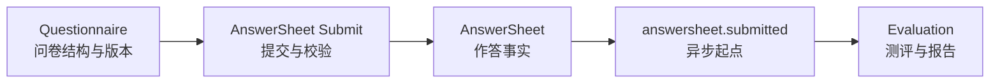
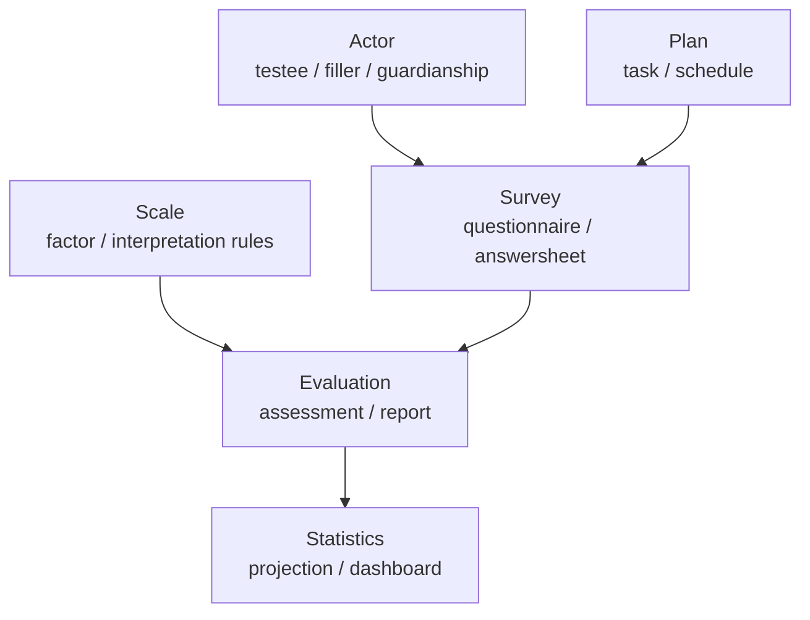

# Survey 深讲阅读地图

**本文回答**：`survey` 子目录这一组文档应该如何阅读；Survey 模块负责什么、不负责什么；`Questionnaire`、`AnswerSheet`、题型校验、存储事件缓存、新增题型 SOP 分别应该去哪里看。

---

## 30 秒结论

| 维度 | 结论 |
| ---- | ---- |
| 模块定位 | `survey` 是 qs-server 的**采集事实域**，负责问卷定义、题目结构、答卷事实、提交校验和答案级粗分 |
| 核心对象 | `Questionnaire` 表达问卷模板与发布版本；`AnswerSheet` 表达一次作答事实 |
| 主业务边界 | Survey 保存“用户答了什么”，不负责“这些答案意味着什么” |
| 协作方向 | `actor` 提供参与者上下文，`scale` 提供量表规则，`evaluation` 负责测评、风险、报告 |
| 异步起点 | `answersheet.submitted` 是从采集事实进入测评链路的事件起点 |
| 真值锚点 | `internal/apiserver/domain/survey`、`application/survey`、`infra/mongo/*`、`infra/cache/*`、`configs/events.yaml` |
| 推荐读法 | 先读 `00-整体模型`，再读生命周期、提交校验、题型扩展、存储事件缓存，最后读新增题型 SOP |

一句话概括：

> **Survey 的职责是把“可配置的问卷模板”和“已提交的作答事实”稳定建模，并把可靠的答卷事实交给后续 Evaluation 链路。**

---

## 1. Survey 模块负责什么

Survey 模块解决的是**采集事实可信**问题。

它要回答：

```text
问卷长什么样？
问卷哪个版本可以被提交？
某个填写者基于哪个问卷版本提交了哪些答案？
提交的答案值形态是否符合题型？
答案是否满足题目校验规则？
答卷提交后如何可靠触发后续测评？
```

Survey 内部最重要的两个聚合是：

| 聚合 | 负责 | 不负责 |
| ---- | ---- | ------ |
| `Questionnaire` | 问卷编码、版本、状态、题目结构、选项、校验规则、发布快照 | 不记录某个用户的具体作答 |
| `AnswerSheet` | 一次提交的作答事实、填写人、受试者、问卷版本引用、答案、答案级分数 | 不保存风险等级、解读文案、报告结论 |

---

## 2. Survey 不负责什么

Survey 的边界要守住，否则模型会越来越脏。

| 不属于 Survey 的内容 | 应归属 |
| -------------------- | ------ |
| 受试者、监护人、治疗师、操作者等参与者模型 | `actor` |
| 医学量表、因子、阈值、解读规则 | `scale` |
| 测评状态、风险等级、报告、解释结果 | `evaluation` |
| 计划任务、周期测评、任务开放/过期/完成 | `plan` |
| 统计看板、行为漏斗、服务过程投影 | `statistics` |
| REST/gRPC/mTLS/IAM/MQ/Redis runtime 的机制细节 | `01-运行时`、`03-基础设施`、`04-接口与运维` |

一句话边界：

```text
Survey 负责“采集事实”；
Scale 负责“解释规则”；
Evaluation 负责“结果产出”。
```

---

## 3. 本目录文档地图

```text
survey/
├── README.md
├── 00-整体模型.md
├── 01-Questionnaire生命周期与版本.md
├── 02-AnswerSheet提交与校验.md
├── 03-题型校验与计分扩展.md
├── 04-存储事件缓存边界.md
└── 05-新增题型SOP.md
```

| 顺序 | 文档 | 先回答什么 |
| ---- | ---- | ---------- |
| 1 | [00-整体模型.md](./00-整体模型.md) | Survey 的总体职责、两个聚合、模块边界和协作关系 |
| 2 | [01-Questionnaire生命周期与版本.md](./01-Questionnaire生命周期与版本.md) | 问卷如何创建、保存草稿、发布、下线、归档，以及版本如何保护历史答卷 |
| 3 | [02-AnswerSheet提交与校验.md](./02-AnswerSheet提交与校验.md) | 从 collection 提交到 apiserver durable submit 的完整提交链路 |
| 4 | [03-题型校验与计分扩展.md](./03-题型校验与计分扩展.md) | 题型如何影响答案值、校验规则和答案级计分 |
| 5 | [04-存储事件缓存边界.md](./04-存储事件缓存边界.md) | Questionnaire / AnswerSheet 如何落 Mongo、发事件、使用缓存 |
| 6 | [05-新增题型SOP.md](./05-新增题型SOP.md) | 新增题型时按什么步骤改代码、契约、测试和文档 |

---

## 4. 推荐阅读路径

### 4.1 第一次理解 Survey

按顺序读：

```text
00-整体模型
  -> 01-Questionnaire生命周期与版本
  -> 02-AnswerSheet提交与校验
```

读完后应能回答：

1. `Questionnaire` 和 `AnswerSheet` 为什么不能做成一个聚合？
2. 为什么 AnswerSheet 必须引用 `questionnaire_code + questionnaire_version`？
3. 为什么提交成功不等于测评完成？

### 4.2 要改问卷编辑 / 发布

读：

```text
01-Questionnaire生命周期与版本
  -> 04-存储事件缓存边界
```

重点看：

- `draft / published / archived` 状态机。
- `head / published_snapshot` 存储边界。
- `questionnaire.changed` 事件语义。
- active published version 如何切换。
- 已发布版本如何保护历史答卷。

### 4.3 要改答卷提交

读：

```text
02-AnswerSheet提交与校验
  -> 04-存储事件缓存边界
  -> ../../00-总览/03-核心业务链路.md
```

重点看：

- collection `SubmitQueue` 与 apiserver durable submit 的区别。
- `request_id` 与 `idempotency_key` 的区别。
- `AnswerValue` 与批量校验任务如何构造。
- `answersheet.submitted` 为什么必须走 outbox。

### 4.4 要新增题型

读：

```text
03-题型校验与计分扩展
  -> 05-新增题型SOP
```

重点看：

- `QuestionType`、Question factory、QuestionParams。
- `AnswerValue` 和 `CreateAnswerValueFromRaw`。
- `AnswerValueAdapter`。
- validation strategy。
- `AnswerScorer`。
- Mongo mapper、OpenAPI/proto、测试。

### 4.5 要排查“提交了但没有报告”

不要只看 Survey。按这个顺序：

```text
02-AnswerSheet提交与校验
  -> 04-存储事件缓存边界
  -> ../../01-运行时/03-qs-worker运行时.md
  -> ../evaluation/02-EnginePipeline.md
```

先判断问题卡在哪：

| 现象 | 优先检查 |
| ---- | -------- |
| 前端拿到 429 | collection SubmitQueue / RateLimit |
| submit-status 一直 processing | collection 本地 queue / apiserver gRPC |
| AnswerSheet 已保存但无 Assessment | `answersheet.submitted` outbox / worker handler |
| Assessment 已创建但无报告 | `assessment.submitted` / Evaluation pipeline |
| 报告有但统计不对 | statistics behavior projection / sync |

---

## 5. Survey 的主业务轴线



其中：

1. `Questionnaire` 决定用户能答什么。
2. `AnswerSheet` 记录用户答了什么。
3. `answersheet.submitted` 告诉系统可以进入后续测评。
4. Evaluation 决定这些答案意味着什么。

Survey 只覆盖前 3 步。

---

## 6. 与其它模块的协作



| 方向 | 协作方式 | 边界 |
| ---- | -------- | ---- |
| Actor -> Survey | 提供 testee、filler、org、监护关系上下文 | Survey 不维护 actor 的完整生命周期 |
| Plan -> Survey | task 提交场景会携带 `task_id` | Survey 只记录答卷来源，不推进任务状态机 |
| Survey -> Evaluation | 通过 `answersheet.submitted` 触发后续链路 | Survey 不直接生成 Assessment 报告 |
| Scale -> Evaluation | Evaluation 加载量表规则和因子解释 | Scale 规则不应写入 AnswerSheet |
| Survey -> Statistics | durable submit 附加 footprint 事件 | 统计投影不反向改变作答事实 |

---

## 7. Survey 的三条关键链路

### 7.1 问卷发布链路

```text
Create / Edit
  -> SaveDraft
  -> Publish
  -> CreatePublishedSnapshot
  -> SetActivePublishedVersion
  -> questionnaire.changed
```

对应文档：

- [01-Questionnaire生命周期与版本.md](./01-Questionnaire生命周期与版本.md)
- [04-存储事件缓存边界.md](./04-存储事件缓存边界.md)

### 7.2 答卷提交链路

```text
collection REST
  -> SubmitQueue
  -> apiserver gRPC SaveAnswerSheet
  -> SubmissionService
  -> resolve published Questionnaire
  -> build AnswerValue
  -> ValidateAnswers
  -> NewAnswerSheet
  -> CreateDurably
  -> answersheet.submitted outbox
```

对应文档：

- [02-AnswerSheet提交与校验.md](./02-AnswerSheet提交与校验.md)
- [04-存储事件缓存边界.md](./04-存储事件缓存边界.md)

### 7.3 答案级计分链路

```text
worker consumes answersheet.submitted
  -> InternalService.CalculateAnswerSheetScore
  -> AnswerSheetScoringService
  -> load AnswerSheet
  -> load exact Questionnaire version
  -> build AnswerScoreTask
  -> AnswerScorer
  -> UpdateScores
```

对应文档：

- [03-题型校验与计分扩展.md](./03-题型校验与计分扩展.md)
- [../../01-运行时/03-qs-worker运行时.md](../../01-运行时/03-qs-worker运行时.md)

---

## 8. Survey 的事实源

| 事实 | 事实源 |
| ---- | ------ |
| 问卷工作版本 | Mongo `Questionnaire head` |
| 问卷已发布版本 | Mongo `published_snapshot` |
| 当前可提交问卷版本 | active published snapshot |
| 答卷事实 | Mongo AnswerSheet |
| 答卷业务幂等 | Mongo answersheet idempotency |
| 答卷提交事件起点 | Mongo outbox |
| 问卷读取加速 | Redis object cache |
| 事件配置 | `configs/events.yaml` |
| REST 契约 | `api/rest/*.yaml` |
| gRPC 契约 | `internal/apiserver/interface/grpc/proto/*` |

一句话原则：

```text
Mongo 是事实源；
Redis 是缓存；
Event 是出站机制；
docs 是解释，不是事实源。
```

---

## 9. 维护原则

### 9.1 一个事实只在一个地方讲透

| 事实 | 主文档 |
| ---- | ------ |
| Survey 总体边界 | [00-整体模型.md](./00-整体模型.md) |
| Questionnaire 生命周期与版本 | [01-Questionnaire生命周期与版本.md](./01-Questionnaire生命周期与版本.md) |
| AnswerSheet 提交与校验 | [02-AnswerSheet提交与校验.md](./02-AnswerSheet提交与校验.md) |
| 题型校验与计分 | [03-题型校验与计分扩展.md](./03-题型校验与计分扩展.md) |
| 存储、事件、缓存 | [04-存储事件缓存边界.md](./04-存储事件缓存边界.md) |
| 新增题型操作步骤 | [05-新增题型SOP.md](./05-新增题型SOP.md) |

其它文档需要引用时，只做摘要并回链。

### 9.2 不要把跨模块链路塞进 Survey

Survey 文档可以说明“这里会发 `answersheet.submitted`”，但不要在 Survey 里完整展开 Evaluation pipeline。完整端到端链路应回到：

- [../../00-总览/03-核心业务链路.md](../../00-总览/03-核心业务链路.md)
- [../evaluation/README.md](../evaluation/README.md)

### 9.3 新题型必须按 SOP 走

新增题型时，不允许只改后端枚举。必须同步检查：

```text
QuestionType
Question factory
DTO / OpenAPI / proto
AnswerValue
AnswerValueAdapter
validation strategy
AnswerScorer
Mongo mapper
tests
docs
```

---

## 10. 常见误区

### 10.1 “Survey 就是 Questionnaire CRUD”

错误。Survey 同时包括问卷定义和答卷事实，并且答卷提交是整个测评链路的事实入口。

### 10.2 “AnswerSheet 是临时提交表”

错误。AnswerSheet 是作答事实聚合，是后续测评和审计的事实输入。

### 10.3 “Questionnaire 当前版本可以解释所有答卷”

错误。答卷必须携带 `questionnaire_code + questionnaire_version`，历史答卷应按提交时版本解释。

### 10.4 “新增题型只改前端和枚举”

错误。新增题型至少影响 Question、AnswerValue、validation、scoring、mapper、contract 和测试。

### 10.5 “Redis cache 命中了，所以不用看 Mongo”

错误。Redis 只做读优化。Mongo 的 head、published_snapshot、AnswerSheet、idempotency、outbox 才是主事实。

---

## 11. 代码锚点

### Domain

- Questionnaire：[../../../internal/apiserver/domain/survey/questionnaire/](../../../internal/apiserver/domain/survey/questionnaire/)
- AnswerSheet：[../../../internal/apiserver/domain/survey/answersheet/](../../../internal/apiserver/domain/survey/answersheet/)

### Application

- Questionnaire application：[../../../internal/apiserver/application/survey/questionnaire/](../../../internal/apiserver/application/survey/questionnaire/)
- AnswerSheet application：[../../../internal/apiserver/application/survey/answersheet/](../../../internal/apiserver/application/survey/answersheet/)

### Infrastructure

- Questionnaire Mongo：[../../../internal/apiserver/infra/mongo/questionnaire/](../../../internal/apiserver/infra/mongo/questionnaire/)
- AnswerSheet Mongo：[../../../internal/apiserver/infra/mongo/answersheet/](../../../internal/apiserver/infra/mongo/answersheet/)
- Questionnaire cache：[../../../internal/apiserver/infra/cache/questionnaire_cache.go](../../../internal/apiserver/infra/cache/questionnaire_cache.go)
- Rule engine：[../../../internal/apiserver/infra/ruleengine/](../../../internal/apiserver/infra/ruleengine/)

### Runtime / Contract

- collection AnswerSheet handler：[../../../internal/collection-server/transport/rest/handler/answersheet_handler.go](../../../internal/collection-server/transport/rest/handler/answersheet_handler.go)
- apiserver gRPC proto：[../../../internal/apiserver/interface/grpc/proto/](../../../internal/apiserver/interface/grpc/proto/)
- REST contracts：[../../../api/rest/](../../../api/rest/)
- Events：[../../../configs/events.yaml](../../../configs/events.yaml)

---

## 12. Verify

```bash
go test ./internal/apiserver/domain/survey/...
go test ./internal/apiserver/application/survey/...
go test ./internal/apiserver/infra/mongo/questionnaire
go test ./internal/apiserver/infra/mongo/answersheet
go test ./internal/apiserver/infra/cache
go test ./internal/apiserver/infra/ruleengine
```

如果修改了 collection 前台提交链路：

```bash
go test ./internal/collection-server/application/answersheet
go test ./internal/collection-server/transport/rest/handler
```

如果修改了契约或文档链接：

```bash
make docs-rest
make docs-verify
make docs-hygiene
```

---

## 13. 下一跳

| 目标 | 下一篇 |
| ---- | ------ |
| 理解 Survey 整体设计 | [00-整体模型.md](./00-整体模型.md) |
| 理解问卷发布与版本 | [01-Questionnaire生命周期与版本.md](./01-Questionnaire生命周期与版本.md) |
| 理解答卷提交 | [02-AnswerSheet提交与校验.md](./02-AnswerSheet提交与校验.md) |
| 理解题型与计分 | [03-题型校验与计分扩展.md](./03-题型校验与计分扩展.md) |
| 理解存储事件缓存 | [04-存储事件缓存边界.md](./04-存储事件缓存边界.md) |
| 新增题型 | [05-新增题型SOP.md](./05-新增题型SOP.md) |
| 看完整业务主链路 | [../../00-总览/03-核心业务链路.md](../../00-总览/03-核心业务链路.md) |
