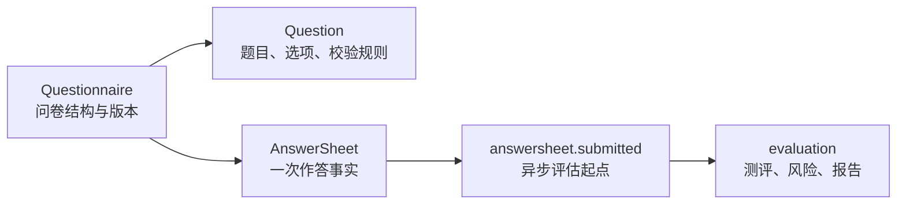

# Survey 深讲阅读地图

**本文回答**：`survey` 深讲目录如何阅读；哪些内容在这里维护，哪些内容回链到 Event / Evaluation / Resilience 真值层。

## 30 秒结论

| 维度 | 当前事实 |
| ---- | -------- |
| 模块定位 | `survey` 负责问卷定义、题目结构、答卷事实、提交校验和答卷侧粗分 |
| 核心边界 | `survey` 保存采集事实，不保存医学解读、风险等级或报告 |
| 关键对象 | `Questionnaire`、`Question`、`AnswerSheet`、`Answer` |
| 关键链路 | 后台维护问卷；collection 提交答卷；apiserver durable submit 写答卷、幂等记录和 outbox |
| 真值锚点 | `domain/survey`、`application/survey`、Mongo answersheet durable submit、`answersheet.submitted` event |



## 阅读顺序

1. [00-整体模型](./00-整体模型.md)：先建立对象与边界。
2. [01-Questionnaire生命周期与版本](./01-Questionnaire生命周期与版本.md)：理解后台编辑、发布、归档和版本。
3. [02-AnswerSheet提交与校验](./02-AnswerSheet提交与校验.md)：理解提交、校验、幂等和 outbox。
4. [03-题型校验与计分扩展](./03-题型校验与计分扩展.md)：理解题型扩展点。
5. [04-存储事件缓存边界](./04-存储事件缓存边界.md)：理解 Mongo、事件和缓存。
6. [05-新增题型SOP](./05-新增题型SOP.md)：新增题型时按此走。

## 代码与测试锚点

- 问卷领域模型：[`domain/survey/questionnaire`](../../../internal/apiserver/domain/survey/questionnaire/)
- 答卷领域模型：[`domain/survey/answersheet`](../../../internal/apiserver/domain/survey/answersheet/)
- 问卷应用服务：[`application/survey/questionnaire`](../../../internal/apiserver/application/survey/questionnaire/)
- 答卷应用服务：[`application/survey/answersheet`](../../../internal/apiserver/application/survey/answersheet/)
- durable submit：[`infra/mongo/answersheet/durable_submit.go`](../../../internal/apiserver/infra/mongo/answersheet/durable_submit.go)

## Verify

```bash
go test ./internal/apiserver/domain/survey/... ./internal/apiserver/application/survey/...
python scripts/check_docs_hygiene.py
```
