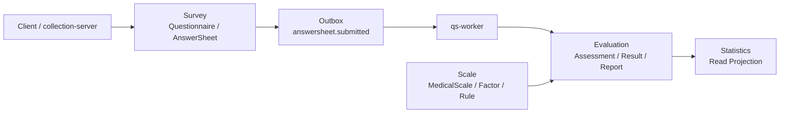
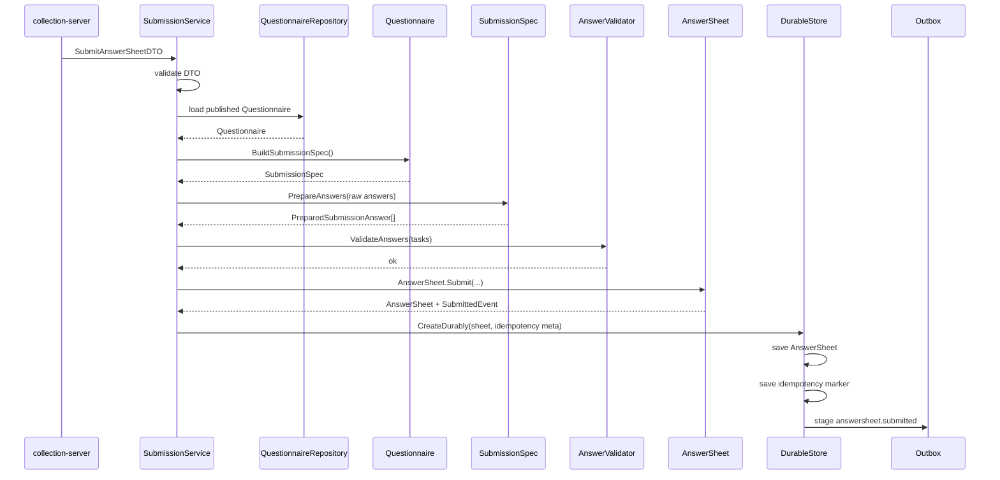

# Survey 模块文档

> Survey 是 qs-server 的作答事实域。
>
> 本目录用于系统化说明 Survey 模块的模型、服务、提交链路、事务幂等、Outbox 出站，以及后续演进边界。

---

## 1. 模块定位

Survey 负责回答一个核心问题：

```text
谁，在什么业务上下文中，基于哪份问卷版本，提交了什么答案。
```

Survey 不负责解释这些答案。

也就是说，Survey 管的是：

```text
可填写的问卷模板；
合法的提交规格；
已经发生的作答事实；
答卷提交事件；
提交幂等与事件可靠出站。
```

Survey 不管：

```text
因子分；
量表总分；
风险等级；
解读结论；
报告生成；
Assessment 生命周期。
```

这些分别属于 Scale 与 Evaluation。

一句话概括：

> **Survey 是作答事实源，不是测评解释中心。**

---

## 2. Survey 在 qs-server 中的位置

qs-server 的核心主线可以拆成三段：

```text
Survey      管“填什么”和“实际填了什么”
Scale       管“怎么算”和“怎么解释”
Evaluation  管“这一次测评如何执行、归档和产出报告”
```

Survey 位于整条链路的入口。



核心链路：

```text
Client
  -> collection-server
  -> qs-apiserver SubmissionService
  -> Questionnaire.BuildSubmissionSpec
  -> AnswerValidator
  -> AnswerSheet.Submit
  -> SubmissionDurableStore.CreateDurably
  -> Outbox answersheet.submitted
  -> qs-worker
  -> Evaluation
```

---

## 3. 核心模型

Survey 模块围绕两个核心聚合展开：

```text
Questionnaire：问卷模板聚合
AnswerSheet：答卷提交事实聚合
```

### 3.1 Questionnaire

`Questionnaire` 负责定义一份可维护、可发布、可提交的问卷模板。

它包含：

```text
QuestionnaireCode；
QuestionnaireVersion；
Status；
Questions；
Options；
ValidationRules；
SubmissionSpec。
```

它回答：

```text
这份问卷有哪些题目？
每道题是什么题型？
每道题有哪些选项？
每道题有哪些校验规则？
当前版本是否允许提交？
这份已发布问卷如何生成可提交规格？
```

### 3.2 SubmissionSpec

`SubmissionSpec` 是 Questionnaire 到 AnswerSheet 之间的提交规格边界。

它负责：

```text
固化 QuestionnaireRef；
固化 QuestionSpec；
校验 question_code 是否属于当前问卷版本；
校验 question_type 是否与模板一致；
提供 validation rules；
输出 PreparedSubmissionAnswer。
```

它的价值是：

```text
防止 application service 直接拆 Questionnaire 内部结构；
防止客户端 DTO 成为题型事实源；
让“已发布问卷如何被提交”成为显式模型。
```

### 3.3 AnswerSheet

`AnswerSheet` 负责表达一次已经发生的提交事实。

它包含：

```text
AnswerSheetID；
QuestionnaireRef；
SubmissionContext；
Answers；
FilledAt；
DomainEvents。
```

它回答：

```text
这份答卷基于哪版问卷提交？
谁填的？
为谁填的？
属于哪个组织？
是否来自某个任务？
提交了哪些答案？
提交后产生了什么事件？
```

### 3.4 SubmissionContext

`SubmissionContext` 是 AnswerSheet 的提交上下文。

它用于表达：

```text
Filler：填写动作执行者；
Testee：被测评对象；
OrgID：组织 / 机构上下文；
TaskID：测评任务来源。
```

没有 SubmissionContext，AnswerSheet 就无法完整表达一次提交事实。

### 3.5 Answer / AnswerValue

`Answer` 是 AnswerSheet 内部的答案值对象。

它包含：

```text
QuestionCode；
QuestionType；
AnswerValue；
Score。
```

`AnswerValue` 是题型扩展的事实侧模型。

典型映射：

| QuestionType | AnswerValue | 说明 |
| --- | --- | --- |
| Radio | OptionValue | 单选答案 |
| Checkbox | OptionsValue | 多选答案 |
| Text / Textarea | StringValue | 文本答案 |
| Number | NumberValue | 数值答案 |

---

## 4. 题型校验与基础分值边界

题型校验应该在 Survey 中讲清楚。

因为它回答的是：

```text
用户提交的答案是否能成为一份合法作答事实？
```

题型校验分两层。

第一层是规格校验：

```text
question_code 是否属于当前 QuestionnaireVersion；
question_type 是否与 SubmissionSpec 一致；
raw value 是否能被当前题型解析；
raw value 是否能转换成对应 AnswerValue。
```

第二层是规则校验：

```text
required；
min/max；
min_length/max_length；
min_selected/max_selected；
option exists；
pattern。
```

边界如下：

| 概念 | 是否属于 Survey | 说明 |
| --- | --- | --- |
| QuestionType | 是 | 模板侧题型语义 |
| ValidationRule | 是 | 作答合法性约束 |
| AnswerValue | 是 | 事实侧类型化答案 |
| Option score | 是 | 模板侧基础分值 |
| Answer.Score | 可以是 | 作答事实上的单题基础分 |
| FactorScore | 否 | Scale / Evaluation 聚合结果 |
| TotalScore | 否 | Scale / Evaluation 聚合结果 |
| RiskLevel | 否 | Scale / Evaluation 解释结果 |
| ReportConclusion | 否 | Evaluation / Report 输出 |

一句话：

> **Survey 可以保存基础分值，但不能解释测评结果。**

---

## 5. 提交链路

一次 AnswerSheet 提交链路如下：



提交成功只代表：

```text
AnswerSheet 已可靠保存；
answersheet.submitted 已进入 Outbox 出站链路。
```

不代表：

```text
Assessment 已完成；
报告已生成；
风险等级已计算。
```

---

## 6. 事务幂等与 Outbox

Survey 提交不是简单写库。

它需要保证：

```text
AnswerSheet 保存；
IdempotencyKey 记录；
AnswerSheetSubmittedEvent 进入 Outbox。
```

三者构成一个 durable boundary。

如果只保存 AnswerSheet 后直接 publish MQ，会出现：

```text
答卷保存成功；
MQ publish 失败；
后续 Evaluation 永远不知道这份答卷。
```

因此正确链路是：

```text
AnswerSheet.Submit
  -> sheet.Events()
  -> SubmissionDurableStore.CreateDurably
  -> Save AnswerSheet
  -> Save Idempotency Record
  -> Stage Outbox Events
  -> Outbox Relay
  -> MQ
  -> Worker
```

### 6.1 IdempotencyKey

`IdempotencyKey` 用于处理重复提交。

它属于提交请求去重机制，不属于 AnswerSheet 核心领域模型。

```text
AnswerSheetID 表示答卷事实身份；
IdempotencyKey 表示一次提交请求的去重身份。
```

### 6.2 Outbox

Outbox 负责业务数据库与消息出站之间的一致性。

它不保证 MQ exactly-once。

因此下游 Evaluation 仍然需要业务幂等。

---

## 7. 与其他模块的边界

### 7.1 与 Scale

Survey 不知道 Scale。

Survey 不保存：

```text
ScaleID；
FactorID；
RiskLevel；
InterpretationRule。
```

Scale 可以基于 AnswerSheet 的作答事实做计分与解释，但 Survey 不依赖 Scale。

### 7.2 与 Evaluation

Survey 不创建 Assessment，不生成报告。

Survey 只发布：

```text
answersheet.submitted
```

Evaluation 负责：

```text
创建 Assessment；
推进 Assessment 状态机；
执行 Evaluator；
保存 Result / Report；
发布 Evaluation 生命周期事件。
```

### 7.3 与 Actor

Survey 通过 SubmissionContext 保存 Filler / Testee 等引用。

但 Actor 生命周期由 Actor 模块负责。

### 7.4 与 Plan

Survey 可以保存 TaskID。

但任务是否开放、是否完成、是否逾期、是否触发提醒，属于 Plan / Evaluation。

### 7.5 与 Statistics

Survey 通过事件为 Statistics 提供输入。

Statistics 负责读侧投影，不应该反向侵入 Survey 提交主链路。

---

## 8. 文档目录

| 文档 | 说明 |
| --- | --- |
| [00-模型总览.md](./00-模型总览.md) | Survey 模块整体定位、聚合拆分、边界说明 |
| [01-Questionnaire模型与SubmissionSpec.md](./01-Questionnaire模型与SubmissionSpec.md) | 模板侧模型、SubmissionSpec、题型扩展模板侧边界 |
| [02-AnswerSheet提交事实模型.md](./02-AnswerSheet提交事实模型.md) | 事实侧模型、SubmissionContext、AnswerValue、基础分值边界 |
| [03-答卷提交链路分析.md](./03-答卷提交链路分析.md) | 从 collection-server 到 Outbox 的完整提交链路 |
| [04-事务幂等与Outbox出站.md](./04-事务幂等与Outbox出站.md) | durable boundary、IdempotencyKey、Outbox 与 Worker 边界 |
| [05-Survey模块总结与后续演进.md](./05-Survey模块总结与后续演进.md) | 模块总结、成熟度评价、后续演进和宣讲口径 |

推荐阅读顺序：

```text
00 -> 01 -> 02 -> 03 -> 04 -> 05
```

如果只想快速理解模块，可以读：

```text
README.md
00-模型总览.md
05-Survey模块总结与后续演进.md
```

如果要理解源码链路，可以读：

```text
01-Questionnaire模型与SubmissionSpec.md
02-AnswerSheet提交事实模型.md
03-答卷提交链路分析.md
04-事务幂等与Outbox出站.md
```

---

## 9. 代码锚点

| 主题 | 路径 |
| --- | --- |
| Questionnaire 聚合 | `internal/apiserver/domain/survey/questionnaire/questionnaire.go` |
| Questionnaire 生命周期 | `internal/apiserver/domain/survey/questionnaire/lifecycle.go` |
| Question 模型 | `internal/apiserver/domain/survey/questionnaire/question.go` |
| SubmissionSpec | `internal/apiserver/domain/survey/questionnaire/submission_spec.go` |
| AnswerSheet 聚合 | `internal/apiserver/domain/survey/answersheet/answersheet.go` |
| SubmissionContext / QuestionnaireRef | `internal/apiserver/domain/survey/answersheet/types.go` |
| Answer / AnswerValue | `internal/apiserver/domain/survey/answersheet/answer.go` |
| AnswerSheetSubmittedEvent | `internal/apiserver/domain/survey/answersheet/events.go` |
| AnswerValue 校验适配 | `internal/apiserver/domain/survey/answersheet/validation_adapter.go` |
| 提交服务主流程 | `internal/apiserver/application/survey/answersheet/submission_service.go` |
| 问卷解析 | `internal/apiserver/application/survey/answersheet/submission_questionnaire_resolver.go` |
| 答案准备 | `internal/apiserver/application/survey/answersheet/submission_answer_assembler.go` |
| 提交 finalizer | `internal/apiserver/application/survey/answersheet/submission_finalizer.go` |
| durable store 接口 | `internal/apiserver/application/survey/answersheet/durable_store.go` |
| durable store wrapper | `internal/apiserver/application/survey/answersheet/transactional_durable_store.go` |
| Mongo durable submit | `internal/apiserver/infra/mongo/answersheet/durable_submit.go` |
| collection 入口 | `internal/collection-server/transport/rest/handler/answersheet_handler.go` |
| 事件契约 | `configs/events.yaml` |
| internal gRPC 契约 | `internal/apiserver/interface/grpc/proto/internalapi/internal.proto` |

---

## 10. Verify

Survey 模块常用验证命令：

```bash
go test ./internal/apiserver/domain/survey/...
go test ./internal/apiserver/application/survey/...
go test ./internal/apiserver/infra/mongo/answersheet/...
```

涉及 collection-server：

```bash
go test ./internal/collection-server/application/answersheet/...
go test ./internal/collection-server/transport/rest/handler/...
```

涉及事件、文档或契约：

```bash
make docs-hygiene
make docs-verify
```

全量质量入口：

```bash
make test
make lint
make docs-hygiene
```

---

## 11. 后续演进

Survey 当前主边界已经基本稳定。

短期补强点：

```text
AnswerValue 增加 Kind / IsEmpty / 强类型访问方法；
getter 返回 clone，避免内部 slice 泄漏；
统一 nil sheet 错误处理；
补充题型扩展测试矩阵；
补充端到端提交链路测试。
```

中期演进重点不在 Survey，而在 Evaluation：

```text
引入 EvaluationModelRef；
抽象 Evaluator；
将当前 Scale 流程包装为 ScaleEvaluator；
为未来 MBTI / Big Five / DISC 接入做准备。
```

未来支持 MBTI 时，Survey 不应该大改。

MBTI 属于新的测评解释模型，不是作答事实模型。

Survey 只需要继续提供：

```text
Questionnaire；
SubmissionSpec；
AnswerSheet；
AnswerValue；
answersheet.submitted。
```

---

## 12. 宣讲口径

### 12.1 30 秒版本

```text
Survey 是 qs-server 的作答事实域，不负责报告和风险解释。
我把它拆成 Questionnaire 和 AnswerSheet 两个聚合：Questionnaire 负责可发布、可提交的问卷模板，并通过 SubmissionSpec 暴露提交规格；AnswerSheet 负责一次完整提交事实，通过 SubmissionContext 保存填写人、受试者、组织和任务上下文，并在 Submit 时产生 answersheet.submitted。
提交链路最后通过 DurableStore 同时保存答卷、幂等记录和 outbox 事件，保证后续 Evaluation 能被可靠驱动。
```

### 12.2 3 分钟版本

```text
Survey 模块解决的是“作答事实可信”的问题。

在 qs-server 里，Survey 不等于整个测评系统。Survey 只管用户填了什么，Scale 管怎么算和怎么解释，Evaluation 管这次测评执行后的结果。

Survey 内部我拆成两个核心聚合。Questionnaire 是模板聚合，管理问卷 code、version、status、questions、validation rules。它通过 BuildSubmissionSpec 暴露“已发布问卷如何被提交”的规格。SubmissionSpec 会校验 question_code 是否属于当前问卷版本、question_type 是否与模板一致，并输出 PreparedSubmissionAnswer。

AnswerSheet 是事实聚合，表达某个填写人在某个业务上下文中，基于某个确定问卷版本提交了一组答案。它通过 QuestionnaireRef 绑定问卷版本，通过 SubmissionContext 保存 filler、testee、org、task，通过 Answer / AnswerValue 保存类型化答案，并在 AnswerSheet.Submit 时产生 answersheet.submitted 领域事件。

提交链路上，collection-server 负责限流、排队、重复提交保护；qs-apiserver 的 SubmissionService 负责编排；AnswerValidator 负责执行规则校验；DurableStore 在一个持久化边界内保存 AnswerSheet、写入幂等记录，并把事件 stage 到 Outbox。这样即使 MQ 暂时不可用，事件也不会丢。

所以 API 返回提交成功，只代表作答事实已经可靠保存、事件已经进入出站链路，不代表 Evaluation 或报告已经完成。
```
