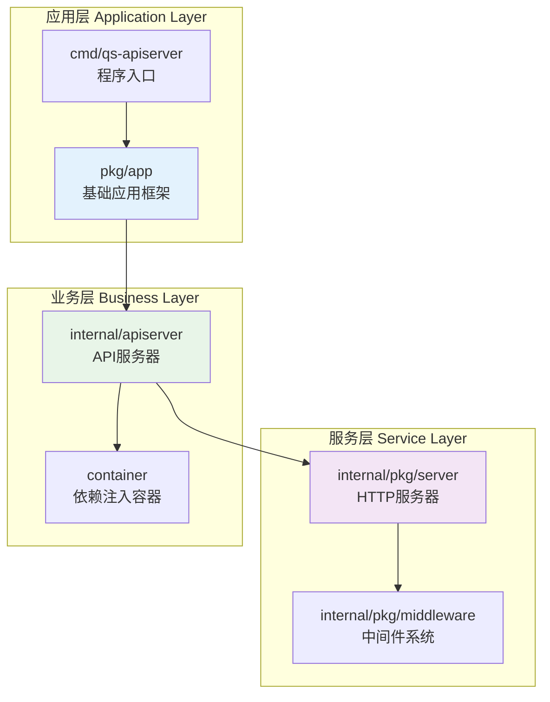
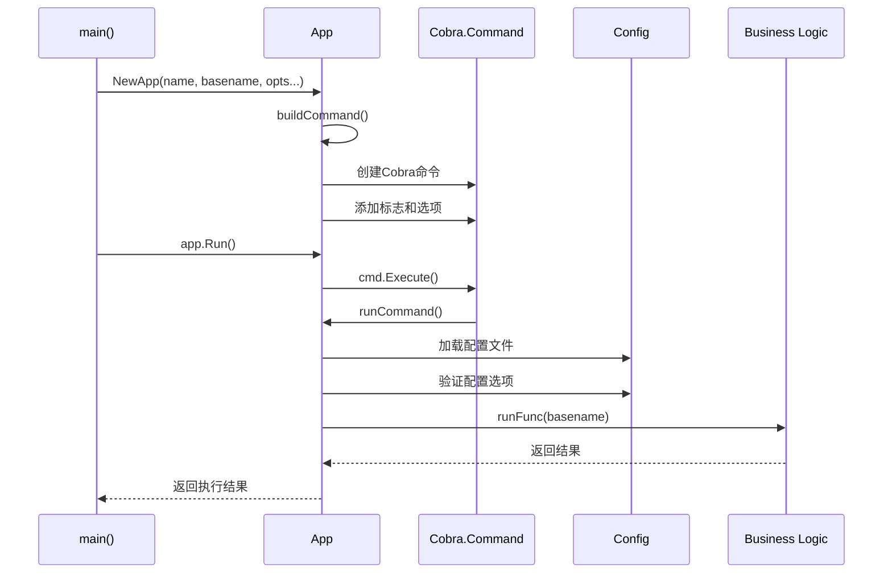
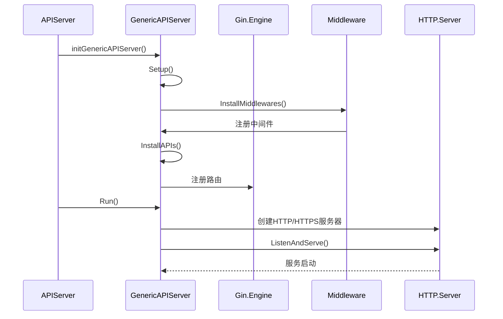
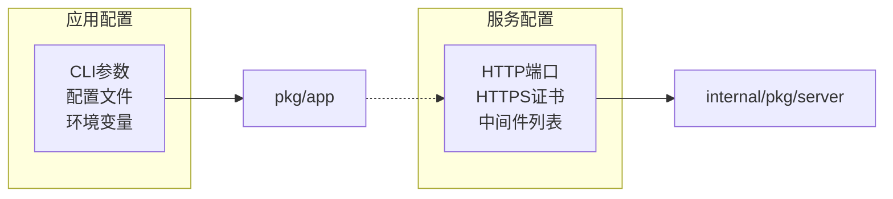

# 🚀 基础应用与HTTP服务分离设计

## 📋 目录

- [设计概述](#design-overview)
- [基础应用框架设计](#application-framework-design)
- [HTTP服务器设计](#http-server-design)
- [分离架构的优势](#separation-architecture-advantages)
- [实际应用案例](#practical-use-cases)

## 🎯 设计概述 {#design-overview}

本系统采用**基础应用框架**与**HTTP服务器**分离的设计模式，实现了应用生命周期管理与网络服务的解耦。这种设计模式使得系统具备更好的可扩展性和可测试性。

### 🏗️ 分离架构图



### 🎨 设计原则

1. **单一职责分离**: 应用框架专注于生命周期，HTTP服务器专注于网络处理
2. **接口抽象**: 通过接口定义清晰的职责边界
3. **配置统一**: 集中化的配置管理和验证
4. **生命周期管理**: 完整的应用启动、运行、关闭流程

## 🛠️ 基础应用框架设计 {#application-framework-design}

### 📦 App 核心结构

```go
// pkg/app/app.go
type App struct {
    basename    string          // 应用基名
    name        string          // 应用名称
    description string          // 应用描述
    noVersion   bool           // 是否禁用版本信息
    noConfig    bool           // 是否禁用配置文件
    silence     bool           // 是否静默模式
    options     CliOptions     // CLI选项接口
    cmd         *cobra.Command // Cobra命令
    args        cobra.PositionalArgs // 位置参数验证
    commands    []*Command     // 子命令列表
    runFunc     RunFunc        // 运行函数
}
```

### 🔧 关键接口设计

#### 1. CLI选项接口

```go
// pkg/app/options.go
type CliOptions interface {
    // Flags 返回命令行标志集合
    Flags() cliflag.NamedFlagSets
    // Validate 验证选项的有效性
    Validate() []error
}

// 可完成选项接口
type CompleteableOptions interface {
    Complete() error
}

// 可打印选项接口
type PrintableOptions interface {
    String() string
}
```

#### 2. 运行函数类型

```go
// RunFunc 定义应用程序的启动回调函数
type RunFunc func(basename string) error
```

### 🚀 应用构建流程



### 📝 核心功能实现

#### 1. 应用创建

```go
// NewApp 创建应用
func NewApp(name string, basename string, opts ...Option) *App {
    a := &App{
        name:     name,
        basename: basename,
    }
    
    // 应用选项
    for _, opt := range opts {
        opt(a)
    }
    
    // 构建命令
    a.buildCommand()
    
    return a
}
```

#### 2. 命令构建

```go
func (a *App) buildCommand() {
    cmd := &cobra.Command{
        Use:           FormatBaseName(a.basename),
        Short:         a.name,
        Long:          a.description,
        SilenceUsage:  true,
        SilenceErrors: true,
        Args:          a.args,
    }
    
    // 设置输出
    cmd.SetOut(os.Stdout)
    cmd.SetErr(os.Stderr)
    
    // 初始化标志
    cliflag.InitFlags(cmd.Flags())
    
    // 添加选项标志
    if a.options != nil {
        namedFlagSets := a.options.Flags()
        for _, f := range namedFlagSets.FlagSets {
            cmd.Flags().AddFlagSet(f)
        }
    }
    
    // 设置运行函数
    if a.runFunc != nil {
        cmd.RunE = a.runCommand
    }
    
    a.cmd = cmd
}
```

#### 3. 运行命令处理

```go
func (a *App) runCommand(cmd *cobra.Command, args []string) error {
    // 1. 打印工作目录
    printWorkingDir()
    
    // 2. 打印命令行参数
    cliflag.PrintFlags(cmd.Flags())
    
    // 3. 处理版本信息
    if !a.noVersion {
        verflag.PrintAndExitIfRequested()
    }
    
    // 4. 绑定配置
    if !a.noConfig {
        if err := viper.BindPFlags(cmd.Flags()); err != nil {
            return err
        }
        if err := viper.Unmarshal(a.options); err != nil {
            return err
        }
    }
    
    // 5. 应用选项规则
    if err := a.applyOptionRules(); err != nil {
        return err
    }
    
    // 6. 执行业务逻辑
    if a.runFunc != nil {
        return a.runFunc(a.basename)
    }
    
    return nil
}
```

### 🔍 选项验证机制

```go
func (a *App) applyOptionRules() error {
    // 完成选项配置
    if completeableOptions, ok := a.options.(CompleteableOptions); ok {
        if err := completeableOptions.Complete(); err != nil {
            return err
        }
    }
    
    // 验证选项
    if errs := a.options.Validate(); len(errs) != 0 {
        return errors.NewAggregate(errs)
    }
    
    // 打印配置信息
    if printableOptions, ok := a.options.(PrintableOptions); ok && !a.silence {
        log.Infof("%v Config: `%s`", progressMessage, printableOptions.String())
    }
    
    return nil
}
```

## 🌐 HTTP服务器设计 {#http-server-design}

### 📦 Server 核心结构

```go
// internal/pkg/server/genericapiserver.go
type GenericAPIServer struct {
    middlewares         []string              // 中间件列表
    SecureServingInfo   *SecureServingInfo   // HTTPS配置
    InsecureServingInfo *InsecureServingInfo // HTTP配置
    ShutdownTimeout     time.Duration        // 关闭超时
    *gin.Engine                              // Gin引擎
    healthz                      bool        // 健康检查开关
    enableMetrics                bool        // 指标开关
    enableProfiling              bool        // 性能分析开关
    insecureServer, secureServer *http.Server // HTTP服务器实例
}
```

### 🔧 服务器配置

#### 1. 服务信息结构

```go
// 非安全服务配置
type InsecureServingInfo struct {
    Address string // 监听地址，如 "127.0.0.1:8080"
}

// 安全服务配置
type SecureServingInfo struct {
    BindAddress string    // 绑定地址
    BindPort    int      // 绑定端口
    CertKey     CertKey  // 证书配置
}

type CertKey struct {
    CertFile string // 证书文件路径
    KeyFile  string // 私钥文件路径
}
```

### 🚀 服务器初始化流程



### 🛠️ 核心功能实现

#### 1. 服务器设置

```go
func (s *GenericAPIServer) Setup() {
    // 设置路由调试信息
    gin.DebugPrintRouteFunc = func(httpMethod, absolutePath, handlerName string, nuHandlers int) {
        log.Infof("%-6s %-s --> %s (%d handlers)", 
            httpMethod, absolutePath, handlerName, nuHandlers)
    }
}
```

#### 2. 中间件安装

```go
func (s *GenericAPIServer) InstallMiddlewares() {
    // 必要的中间件
    s.Use(middleware.RequestID())  // 请求ID
    s.Use(middleware.Context())    // 上下文

    // 自定义中间件
    for _, m := range s.middlewares {
        mw, ok := middleware.Middlewares[m]
        if !ok {
            log.Warnf("can not find middleware: %s", m)
            continue
        }
        log.Infof("install middleware: %s", m)
        s.Use(mw)
    }
}
```

#### 3. 通用API安装

```go
func (s *GenericAPIServer) InstallAPIs() {
    // 健康检查
    if s.healthz {
        s.GET("/healthz", func(c *gin.Context) {
            core.WriteResponse(c, nil, map[string]string{"status": "ok"})
        })
    }

    // 指标收集
    if s.enableMetrics {
        prometheus := ginprometheus.NewPrometheus("gin")
        prometheus.Use(s.Engine)
    }

    // 版本信息
    s.GET("/version", func(c *gin.Context) {
        core.WriteResponse(c, nil, version.Get())
    })
}
```

#### 4. 双协议服务运行

```go
func (s *GenericAPIServer) Run() error {
    // 创建服务器实例
    s.insecureServer = &http.Server{
        Addr:    s.InsecureServingInfo.Address,
        Handler: s,
    }
    s.secureServer = &http.Server{
        Addr:    s.SecureServingInfo.Address(),
        Handler: s,
    }

    var eg errgroup.Group

    // HTTP服务器
    eg.Go(func() error {
        log.Infof("Start to listening on http address: %s", 
            s.InsecureServingInfo.Address)
        if err := s.insecureServer.ListenAndServe(); err != nil && 
           !errors.Is(err, http.ErrServerClosed) {
            return err
        }
        return nil
    })

    // HTTPS服务器
    eg.Go(func() error {
        cert, key := s.SecureServingInfo.CertKey.CertFile, 
                   s.SecureServingInfo.CertKey.KeyFile
        if cert == "" || key == "" {
            return nil // 跳过HTTPS
        }
        
        log.Infof("Start to listening on https address: %s", 
            s.SecureServingInfo.Address())
        if err := s.secureServer.ListenAndServeTLS(cert, key); err != nil && 
           !errors.Is(err, http.ErrServerClosed) {
            return err
        }
        return nil
    })

    // 健康检查
    if s.healthz {
        ctx, cancel := context.WithTimeout(context.Background(), 10*time.Second)
        defer cancel()
        if err := s.ping(ctx); err != nil {
            return err
        }
    }

    return eg.Wait()
}
```

#### 5. 优雅关闭

```go
func (s *GenericAPIServer) Close() {
    ctx, cancel := context.WithTimeout(context.Background(), 10*time.Second)
    defer cancel()

    // 关闭HTTPS服务器
    if err := s.secureServer.Shutdown(ctx); err != nil {
        log.Warnf("Shutdown secure server failed: %s", err.Error())
    }

    // 关闭HTTP服务器
    if err := s.insecureServer.Shutdown(ctx); err != nil {
        log.Warnf("Shutdown insecure server failed: %s", err.Error())
    }
}
```

## 🎯 分离架构的优势 {#separation-architecture-advantages}

### 1. **职责清晰**

| 组件 | 职责 | 不负责 |
|------|------|--------|
| **pkg/app** | 应用生命周期、CLI处理、配置管理 | 网络服务、业务逻辑 |
| **internal/pkg/server** | HTTP服务、中间件、路由 | CLI处理、配置验证 |

### 2. **可测试性增强**

```go
// 应用框架测试
func TestApp_Run(t *testing.T) {
    app := NewApp("test", "test", 
        WithRunFunc(func(basename string) error {
            return nil  // 模拟成功
        }),
    )
    
    // 测试应用运行逻辑，无需启动HTTP服务器
    err := app.runCommand(app.cmd, []string{})
    assert.NoError(t, err)
}

// HTTP服务器测试
func TestGenericAPIServer_InstallMiddlewares(t *testing.T) {
    server := &GenericAPIServer{
        Engine: gin.New(),
        middlewares: []string{"logger", "recovery"},
    }
    
    // 测试中间件安装，无需完整应用上下文
    server.InstallMiddlewares()
    // 验证中间件是否正确安装
}
```

### 3. **配置隔离**



### 4. **扩展性支持**

- **新的服务协议**: 可以添加gRPC、WebSocket等服务器而不影响应用框架
- **新的CLI命令**: 可以添加新的子命令而不影响HTTP服务器
- **新的配置源**: 可以支持不同的配置来源而不影响服务运行

## 📚 实际应用案例 {#practical-use-cases}

### 1. API服务器集成

```go
// internal/apiserver/app.go
func NewApp(basename string) *app.App {
    opts := options.NewOptions()
    application := app.NewApp("Questionnaire Scale API Server",
        basename,
        app.WithDescription(commandDesc),
        app.WithDefaultValidArgs(),
        app.WithOptions(opts),
        app.WithRunFunc(run(opts)),  // 传入运行函数
    )
    return application
}

func run(opts *options.Options) app.RunFunc {
    return func(basename string) error {
        // 初始化日志
        log.Init(opts.Log)
        defer log.Flush()

        // 创建服务器配置
        cfg, err := config.CreateConfigFromOptions(opts)
        if err != nil {
            return err
        }

        // 运行服务器
        return Run(cfg)
    }
}
```

### 2. 服务器创建和运行

```go
// internal/apiserver/server.go
func createAPIServer(cfg *config.Config) (*apiserver, error) {
    // 创建通用服务器
    genericServer := server.NewGenericAPIServer(cfg.GenericServerRunOptions)
    
    // 创建业务服务器
    apiServer := &apiserver{
        GenericAPIServer: genericServer,
        container:        container.NewContainer(cfg.MySQLOptions),
    }
    
    return apiServer, nil
}

func (s *apiserver) PrepareRun() preparedAPIServer {
    // 初始化通用服务器
    initGenericAPIServer(s.GenericAPIServer)
    
    // 注册业务路由
    s.installAPIServerRoutes()
    
    return preparedAPIServer{s}
}
```

### 3. 配置结构示例

```go
// internal/apiserver/options/options.go
type Options struct {
    GenericServerRunOptions *server.ServerRunOptions `json:"server" mapstructure:"server"`
    MySQLOptions           *mysql.MySQLOptions      `json:"mysql" mapstructure:"mysql"`
    Log                    *log.Options             `json:"log" mapstructure:"log"`
}

func (o *Options) Flags() cliflag.NamedFlagSets {
    fss := cliflag.NamedFlagSets{}
    
    o.GenericServerRunOptions.AddFlags(fss.FlagSet("generic"))
    o.MySQLOptions.AddFlags(fss.FlagSet("mysql"))
    o.Log.AddFlags(fss.FlagSet("logs"))
    
    return fss
}
```

## 🏆 设计总结

基础应用与HTTP服务分离设计实现了：

1. **清晰的职责边界**: 应用管理与网络服务分离
2. **高度的可配置性**: 统一的配置管理机制
3. **优秀的可测试性**: 各组件可独立测试
4. **良好的扩展性**: 支持多种服务协议和配置源
5. **完整的生命周期**: 从启动到优雅关闭的完整流程

这种设计模式为构建企业级Go应用提供了坚实的基础。
