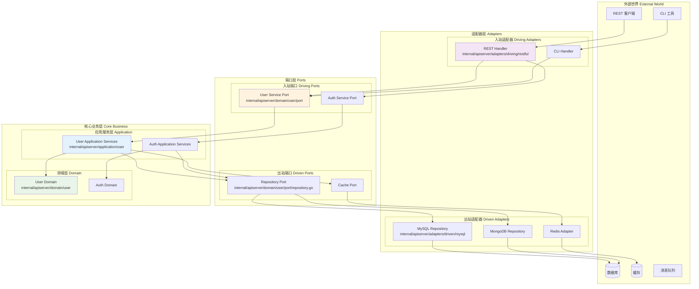
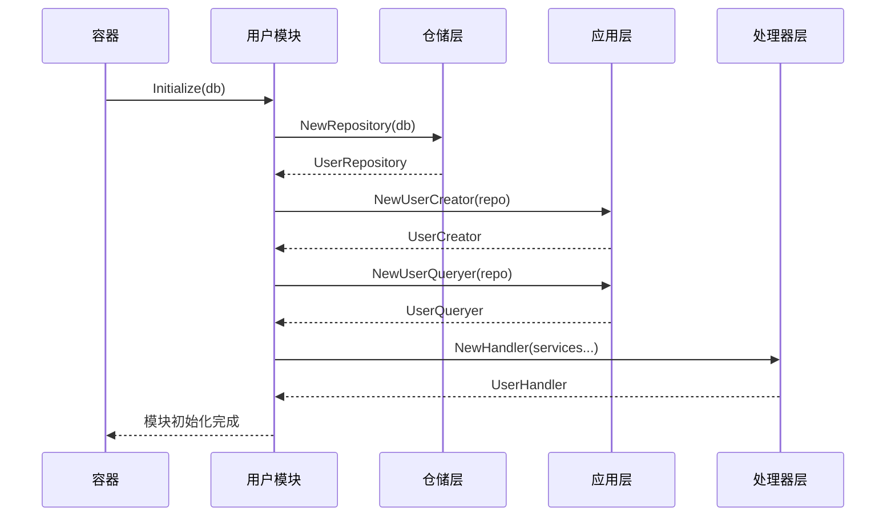
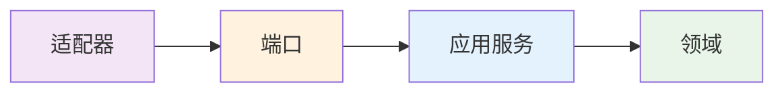

# 🔷 基于六边形架构的模块化设计

## 📋 目录

- [六边形架构概述](#hexagonal-architecture-overview)
- [端口与适配器设计](#ports-adapters-design)
- [领域层设计](#domain-layer-design)
- [应用服务层设计](#application-service-design)
- [模块化系统设计](#modular-system-design)
- [依赖注入容器](#dependency-injection-container)

## 🎯 六边形架构概述 {#hexagonal-architecture-overview}

本系统采用六边形架构（Hexagonal Architecture），也称为端口和适配器架构（Ports and Adapters），实现了业务逻辑与外部依赖的完全解耦。

### 🏗️ 架构层次图



### 🎨 核心设计原则

1. **依赖倒置**: 业务逻辑不依赖外部技术实现
2. **端口抽象**: 通过接口定义业务边界
3. **适配器隔离**: 外部技术变化不影响业务逻辑
4. **测试友好**: 可以轻松替换外部依赖进行测试

## 🔌 端口与适配器设计 {#ports-adapters-design}

### 📥 入站端口设计

入站端口定义了外部世界调用业务逻辑的接口契约。

#### 1. 用户服务端口

```go
// internal/apiserver/domain/user/port/service.go

// UserCreator 用户创建接口
type UserCreator interface {
    CreateUser(ctx context.Context, req UserCreateRequest) (*UserResponse, error)
}

// UserQueryer 用户查询接口
type UserQueryer interface {
    GetUser(ctx context.Context, req UserIDRequest) (*UserResponse, error)
    GetUserByUsername(ctx context.Context, username string) (*UserResponse, error)
    ListUsers(ctx context.Context, page, pageSize int) (*UserListResponse, error)
}

// UserEditor 用户编辑接口
type UserEditor interface {
    UpdateBasicInfo(ctx context.Context, req UserBasicInfoRequest) (*UserResponse, error)
    UpdateAvatar(ctx context.Context, req UserAvatarRequest) error
}

// PasswordChanger 密码管理接口
type PasswordChanger interface {
    ChangePassword(ctx context.Context, req UserPasswordChangeRequest) error
}

// UserActivator 用户状态管理接口
type UserActivator interface {
    ActivateUser(ctx context.Context, req UserIDRequest) error
    BlockUser(ctx context.Context, req UserIDRequest) error
    DeactivateUser(ctx context.Context, req UserIDRequest) error
}
```

#### 2. 请求响应数据传输对象

```go
// UserCreateRequest 创建用户请求
type UserCreateRequest struct {
    Username     string `json:"username" valid:"required"`
    Password     string `json:"password" valid:"required,stringlength(6|50)"`
    Nickname     string `json:"nickname" valid:"required"`
    Email        string `json:"email" valid:"required,email"`
    Phone        string `json:"phone" valid:"required"`
    Introduction string `json:"introduction" valid:"optional"`
}

// UserResponse 用户响应
type UserResponse struct {
    ID           uint64 `json:"id"`
    Username     string `json:"username"`
    Nickname     string `json:"nickname"`
    Phone        string `json:"phone"`
    Avatar       string `json:"avatar"`
    Introduction string `json:"introduction"`
    Email        string `json:"email"`
    Status       string `json:"status"`
    CreatedAt    string `json:"created_at"`
    UpdatedAt    string `json:"updated_at"`
}
```

### 📤 出站端口设计

出站端口定义了业务逻辑对外部依赖的接口需求。

#### 1. 仓储端口

```go
// internal/apiserver/domain/user/port/repository.go

// UserRepository 用户存储库接口（出站端口）
type UserRepository interface {
    // 基础 CRUD 操作
    Save(ctx context.Context, user *user.User) error
    FindByID(ctx context.Context, id user.UserID) (*user.User, error)
    Update(ctx context.Context, user *user.User) error
    Remove(ctx context.Context, id user.UserID) error

    // 查询操作
    FindByUsername(ctx context.Context, username string) (*user.User, error)
    FindByPhone(ctx context.Context, phone string) (*user.User, error)
    FindByEmail(ctx context.Context, email string) (*user.User, error)
    FindAll(ctx context.Context, limit, offset int) ([]*user.User, error)

    // 存在性检查
    ExistsByID(ctx context.Context, id user.UserID) bool
    ExistsByUsername(ctx context.Context, username string) bool
    ExistsByEmail(ctx context.Context, email string) bool
    ExistsByPhone(ctx context.Context, phone string) bool

    // 统计操作
    Count(ctx context.Context) (int64, error)
    CountByStatus(ctx context.Context, status user.Status) (int64, error)

    // 批量操作
    FindByIDs(ctx context.Context, ids []user.UserID) ([]*user.User, error)
    FindByStatus(ctx context.Context, status user.Status, limit, offset int) ([]*user.User, error)
}
```

### 🔄 入站适配器实现

入站适配器将外部请求转换为业务调用。

#### 1. REST适配器

```go
// internal/apiserver/adapters/driving/restful/user/handler.go

// Handler 用户HTTP处理器
type Handler struct {
    restful.BaseHandler
    userCreator         port.UserCreator
    userQueryer         port.UserQueryer
    userEditor          port.UserEditor
    userActivator       port.UserActivator
    userPasswordChanger port.PasswordChanger
}

// NewHandler 创建用户处理器
func NewHandler(
    userCreator port.UserCreator,
    userQueryer port.UserQueryer,
    userEditor port.UserEditor,
    userActivator port.UserActivator,
    userPasswordChanger port.PasswordChanger,
) *Handler {
    return &Handler{
        userCreator:         userCreator,
        userQueryer:         userQueryer,
        userEditor:          userEditor,
        userActivator:       userActivator,
        userPasswordChanger: userPasswordChanger,
    }
}

// GetUser 获取用户
func (h *Handler) GetUser(c *gin.Context) {
    var req port.UserIDRequest
    if err := h.BindQuery(c, &req); err != nil {
        h.ErrorResponse(c, err)
        return
    }

    userResponse, err := h.userQueryer.GetUser(c.Request.Context(), req)
    if err != nil {
        h.ErrorResponse(c, err)
        return
    }

    h.SuccessResponse(c, userResponse)
}
```

### 🔧 出站适配器实现

出站适配器将业务调用转换为外部服务调用。

#### 1. 泛型基础仓储

```go
// internal/apiserver/adapters/driven/mysql/base.go

// 泛型结构体，支持任意实现了 Syncable 的实体类型
type BaseRepository[T Syncable] struct {
    db *gorm.DB
}

func NewBaseRepository[T Syncable](db *gorm.DB) BaseRepository[T] {
    return BaseRepository[T]{db: db}
}

// CreateAndSync 将实体插入数据库，并通过回调函数同步字段回 domain 层
func (r *BaseRepository[T]) CreateAndSync(ctx context.Context, entity T, sync func(T)) error {
    result := r.db.WithContext(ctx).Create(entity)
    if result.Error != nil {
        return result.Error
    }
    sync(entity)
    return nil
}

// UpdateAndSync 更新实体并同步时间戳等字段
func (r *BaseRepository[T]) UpdateAndSync(ctx context.Context, entity T, sync func(T)) error {
    result := r.db.WithContext(ctx).Save(entity)
    if result.Error != nil {
        return result.Error
    }
    sync(entity)
    return nil
}
```

#### 2. 用户仓储实现

```go
// internal/apiserver/adapters/driven/mysql/user/repo.go

// Repository 用户存储库实现
type Repository struct {
    mysql.BaseRepository[*UserEntity]
    mapper *UserMapper
}

// NewRepository 创建用户存储库
func NewRepository(db *gorm.DB) port.UserRepository {
    return &Repository{
        BaseRepository: mysql.NewBaseRepository[*UserEntity](db),
        mapper:         NewUserMapper(),
    }
}

// Save 保存用户
func (r *Repository) Save(ctx context.Context, userDomain *user.User) error {
    entity := r.mapper.ToEntity(userDomain)
    return r.CreateAndSync(ctx, entity, func(saved *UserEntity) {
        userDomain.SetID(user.NewUserID(saved.ID))
        userDomain.SetCreatedAt(saved.CreatedAt)
        userDomain.SetUpdatedAt(saved.UpdatedAt)
    })
}

// FindByUsername 根据用户名查询用户
func (r *Repository) FindByUsername(ctx context.Context, username string) (*user.User, error) {
    var entity UserEntity
    err := r.BaseRepository.FindByField(ctx, &entity, "username", username)
    if err != nil {
        if errors.Is(err, gorm.ErrRecordNotFound) {
            return nil, pkgerrors.WithCode(code.ErrUserNotFound, "user not found: %s", username)
        }
        return nil, err
    }
    return r.mapper.ToDomain(&entity), nil
}
```

## 🏛️ 领域层设计 {#domain-layer-design}

领域层包含业务的核心逻辑，完全独立于外部技术实现。

### 📊 领域模型

```go
// internal/apiserver/domain/user/model.go

// User 用户聚合根
type User struct {
    id           UserID
    username     string
    password     string
    nickname     string
    avatar       string
    email        string
    phone        string
    introduction string
    status       Status
    createdAt    time.Time
    updatedAt    time.Time
}

// 业务方法
func (u *User) ChangePassword(newPassword string) error {
    if len(newPassword) < 6 {
        return errors.WithCode(code.ErrUserBasicInfoInvalid, 
            "password must be at least 6 characters")
    }

    hashedPassword, err := auth.Encrypt(newPassword)
    if err != nil {
        return errors.WithCode(code.ErrEncrypt, "failed to encrypt password")
    }

    u.password = hashedPassword
    u.updatedAt = time.Now()
    return nil
}

func (u *User) ValidatePassword(password string) bool {
    err := auth.Compare(u.password, password)
    return err == nil
}

func (u *User) IsActive() bool {
    return u.status == StatusActive
}

func (u *User) Block() error {
    if u.status == StatusBlocked {
        return errors.WithCode(code.ErrUserStatusInvalid, "user is already blocked")
    }
    u.status = StatusBlocked
    return nil
}
```

### 🏗️ 建造者模式

```go
// internal/apiserver/domain/user/builder.go

// UserBuilder 用户建造者
type UserBuilder struct {
    user *User
}

// NewUserBuilder 创建用户建造者
func NewUserBuilder() *UserBuilder {
    return &UserBuilder{
        user: &User{
            status:    StatusInit,
            createdAt: time.Now(),
            updatedAt: time.Now(),
        },
    }
}

// WithUsername 设置用户名
func (b *UserBuilder) WithUsername(username string) *UserBuilder {
    b.user.username = username
    return b
}

// WithPassword 设置密码（自动加密）
func (b *UserBuilder) WithPassword(password string) *UserBuilder {
    hashedPassword, _ := auth.Encrypt(password)
    b.user.password = hashedPassword
    return b
}

// Build 构建用户对象
func (b *UserBuilder) Build() *User {
    return b.user
}
```

### 📋 值对象

```go
// internal/apiserver/domain/user/vo.go

// UserID 用户ID值对象
type UserID struct {
    value uint64
}

func NewUserID(value uint64) UserID {
    return UserID{value: value}
}

func (id UserID) Value() uint64 {
    return id.value
}

func (id UserID) IsZero() bool {
    return id.value == 0
}

// Status 用户状态值对象
type Status int

const (
    StatusInit Status = iota
    StatusActive
    StatusInactive
    StatusBlocked
)

func (s Status) String() string {
    switch s {
    case StatusInit:
        return "init"
    case StatusActive:
        return "active"
    case StatusInactive:
        return "inactive"
    case StatusBlocked:
        return "blocked"
    default:
        return "unknown"
    }
}
```

## 🔧 应用服务层设计 {#application-service-design}

应用服务层协调领域对象和外部依赖，实现用例逻辑。

### 🏭 用户创建器

```go
// internal/apiserver/application/user/creator.go

// UserCreator 用户创建器
type UserCreator struct {
    userRepo port.UserRepository
}

// NewUserCreator 创建用户创建器
func NewUserCreator(userRepo port.UserRepository) port.UserCreator {
    return &UserCreator{userRepo: userRepo}
}

// CreateUser 创建用户
func (c *UserCreator) CreateUser(ctx context.Context, req port.UserCreateRequest) (*port.UserResponse, error) {
    // 1. 业务规则验证
    if c.usernameExists(ctx, req.Username) {
        return nil, errors.WithCode(code.ErrUserAlreadyExists, "username already exists")
    }
    if c.emailExists(ctx, req.Email) {
        return nil, errors.WithCode(code.ErrUserAlreadyExists, "email already exists")
    }
    if c.phoneExists(ctx, req.Phone) {
        return nil, errors.WithCode(code.ErrUserAlreadyExists, "phone already exists")
    }

    // 2. 创建领域对象
    user := user.NewUserBuilder().
        WithUsername(req.Username).
        WithPassword(req.Password).
        WithNickname(req.Nickname).
        WithEmail(req.Email).
        WithPhone(req.Phone).
        WithStatus(user.StatusInit).
        WithIntroduction(req.Introduction).
        Build()

    // 3. 持久化
    if err := c.userRepo.Save(ctx, user); err != nil {
        return nil, fmt.Errorf("failed to save user: %w", err)
    }

    // 4. 返回响应
    return &port.UserResponse{
        ID:           user.ID().Value(),
        Username:     user.Username(),
        Nickname:     user.Nickname(),
        Avatar:       user.Avatar(),
        Introduction: user.Introduction(),
        Email:        user.Email(),
        Phone:        user.Phone(),
        Status:       user.Status().String(),
        CreatedAt:    user.CreatedAt().Format(time.DateTime),
        UpdatedAt:    user.UpdatedAt().Format(time.DateTime),
    }, nil
}

// 私有辅助方法
func (c *UserCreator) usernameExists(ctx context.Context, username string) bool {
    return c.userRepo.ExistsByUsername(ctx, username)
}

func (c *UserCreator) emailExists(ctx context.Context, email string) bool {
    return c.userRepo.ExistsByEmail(ctx, email)
}

func (c *UserCreator) phoneExists(ctx context.Context, phone string) bool {
    return c.userRepo.ExistsByPhone(ctx, phone)
}
```

### 🔍 应用服务特点

1. **薄层设计**: 不包含业务逻辑，只协调调用
2. **事务管理**: 处理跨聚合的事务操作
3. **数据转换**: 在端口数据和领域对象间转换
4. **异常处理**: 将领域异常转换为适当的错误响应

## 📦 模块化系统设计 {#modular-system-design}

### 🏗️ 模块接口

```go
// internal/apiserver/module/module.go

// Module 模块接口
type Module interface {
    Initialize(params ...interface{}) error
    CheckHealth() error
    Cleanup() error
    ModuleInfo() ModuleInfo
}

// ModuleInfo 模块信息
type ModuleInfo struct {
    Name        string
    Version     string
    Description string
}
```

### 👤 用户模块实现

```go
// internal/apiserver/module/user/module.go

// Module 用户模块
type Module struct {
    // repository 层
    UserRepo port.UserRepository

    // handler 层
    UserHandler *userAdapter.Handler

    // service 层
    UserCreator         port.UserCreator
    UserQueryer         port.UserQueryer
    UserEditor          port.UserEditor
    UserActivator       port.UserActivator
    UserPasswordChanger port.PasswordChanger
}

// Initialize 初始化模块
func (m *Module) Initialize(params ...interface{}) error {
    db := params[0].(*gorm.DB)
    if db == nil {
        return errors.WithCode(code.ErrModuleInitializationFailed, 
            "database connection is nil")
    }

    // 初始化 repository 层
    m.UserRepo = userInfra.NewRepository(db)

    // 初始化 service 层
    m.UserCreator = userApp.NewUserCreator(m.UserRepo)
    m.UserQueryer = userApp.NewUserQueryer(m.UserRepo)
    m.UserEditor = userApp.NewUserEditor(m.UserRepo)
    m.UserActivator = userApp.NewUserActivator(m.UserRepo)
    m.UserPasswordChanger = userApp.NewPasswordChanger(m.UserRepo)

    // 初始化 handler 层
    m.UserHandler = userAdapter.NewHandler(
        m.UserCreator,
        m.UserQueryer,
        m.UserEditor,
        m.UserActivator,
        m.UserPasswordChanger,
    )

    return nil
}

// ModuleInfo 返回模块信息
func (m *Module) ModuleInfo() module.ModuleInfo {
    return module.ModuleInfo{
        Name:        "user",
        Version:     "1.0.0",
        Description: "用户管理模块",
    }
}
```

### 🔄 模块组装流程



## 🏛️ 依赖注入容器 {#dependency-injection-container}

### 📦 容器结构

```go
// internal/apiserver/container/container.go

// Container 主容器
type Container struct {
    // 基础设施
    mysqlDB     *gorm.DB
    mongoClient *mongo.Client
    mongoDB     string

    // 业务模块
    AuthModule *authModule.Module
    UserModule *userModule.Module

    // 容器状态
    initialized bool
}

// NewContainer 创建容器
func NewContainer(mysqlDB *gorm.DB, mongoClient *mongo.Client, mongoDB string) *Container {
    return &Container{
        mysqlDB:     mysqlDB,
        mongoClient: mongoClient,
        mongoDB:     mongoDB,
        initialized: false,
    }
}

// Initialize 初始化容器
func (c *Container) Initialize() error {
    if c.initialized {
        return nil
    }

    // 初始化用户模块
    if err := c.initUserModule(); err != nil {
        return fmt.Errorf("failed to initialize user module: %w", err)
    }

    // 初始化认证模块
    if err := c.initAuthModule(); err != nil {
        return fmt.Errorf("failed to initialize auth module: %w", err)
    }

    c.initialized = true
    return nil
}
```

### 🔧 模块初始化

```go
// initUserModule 初始化用户模块
func (c *Container) initUserModule() error {
    userModule := userModule.NewModule()
    if err := userModule.Initialize(c.mysqlDB); err != nil {
        return fmt.Errorf("failed to initialize user module: %w", err)
    }

    c.UserModule = userModule
    return nil
}

// 健康检查
func (c *Container) HealthCheck(ctx context.Context) error {
    // 检查MySQL连接
    if c.mysqlDB != nil {
        sqlDB, err := c.mysqlDB.DB()
        if err != nil {
            return fmt.Errorf("failed to get mysql db: %w", err)
        }
        if err := sqlDB.PingContext(ctx); err != nil {
            return fmt.Errorf("mysql ping failed: %w", err)
        }
    }

    return nil
}
```

## 🎯 架构优势总结

### 1. **业务逻辑保护**

- 核心业务逻辑与外部技术完全隔离
- 领域模型专注于业务规则表达
- 技术栈变更不影响业务逻辑

### 2. **高度可测试性**

```go
// 领域层测试 - 无需外部依赖
func TestUser_ChangePassword(t *testing.T) {
    user := user.NewUserBuilder().
        WithUsername("test").
        WithPassword("oldpass").
        Build()
    
    err := user.ChangePassword("newpass")
    assert.NoError(t, err)
}

// 应用层测试 - 使用Mock仓储
func TestUserCreator_CreateUser(t *testing.T) {
    mockRepo := &MockUserRepository{}
    creator := NewUserCreator(mockRepo)
    
    // 测试业务逻辑
    resp, err := creator.CreateUser(ctx, req)
    assert.NoError(t, err)
}
```

### 3. **灵活的技术选择**

- 数据库可以从MySQL切换到PostgreSQL
- 缓存可以从Redis切换到Memcached
- Web框架可以从Gin切换到Echo

### 4. **清晰的依赖方向**



依赖方向始终指向内部，外层依赖内层，内层不依赖外层。

### 5. **模块化扩展**

- 新业务功能以模块形式添加
- 模块间通过明确的接口交互
- 支持独立开发和测试
