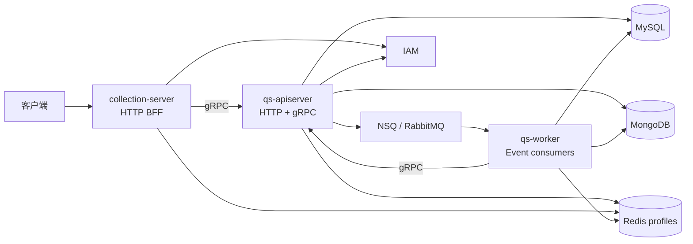
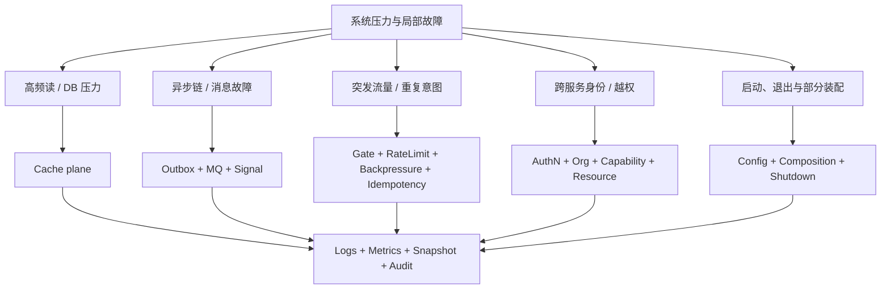

# 基础设施总览

qs-server 的基础设施目标不是展示组件数量，而是在三进程、多存储、异步执行和突发流量条件下，维持明确的事实所有权、失败语义、容量边界与恢复路径。

## 1. 运行拓扑



这张图只表示运行依赖：

- collection-server 是面向客户端的准入与协议适配层，不拥有答卷/测评数据库事实。
- apiserver 是业务模块和数据访问的主要 composition root。
- worker 消费 Event 并通过 apiserver application/gRPC 推进业务；其 MySQL/Mongo 只承载明确的投递治理或投影责任。
- Redis 横跨三个进程，但业务事实仍归 MySQL/Mongo。

## 2. 四类事实

| 类型 | 例子 | 可否丢失/重建 | owner |
| --- | --- | --- | --- |
| 业务事实 | AnswerSheet、Assessment、Outcome、Report | 不可因缓存/MQ 故障丢失 | Mongo/MySQL domain repository |
| 可靠协作事实 | Outbox、dead letter、retry hold、checkpoint | 必须持久化并可恢复 | Event/Data Access/Governance |
| 运行时协调 | rate bucket、lease、ready-index、cache、signal | 多数可降级或重建，语义逐项声明 | Redis runtime/Resilience/Cache |
| 观测投影 | metrics、runtime snapshot、governance view | 可丢失或重新采集 | Observability |

最容易犯的错误，是把第三或第四类当成第一类。例如 Redis SubmitCoalescer 成功不等于答卷已提交，`/readyz` 为 200 也不等于 Mongo transaction 可用。

## 3. 问题地图



## 4. 正确性与性能保护分层

```text
client / message arrival
        ↓
admission: Gate / RateLimit
        ↓
coordination: SubmitCoalescer / LockLease / ready-index / Signal
        ↓
dependency protection: Backpressure / pool / timeout
        ↓
correctness: transaction / unique key / claim / CAS / fingerprint
        ↓
recovery: Outbox / bounded delivery / dead letter / checkpoint / audit
```

- 上层机制可减少下层压力，但不能成为绕过下层正确性约束的理由。
- 越靠近用户入口越适合快速拒绝和公平性；越靠近存储越适合判定最终冲突和事实。
- 每层都要声明 scope：单进程、单实例、Redis 跨实例、还是数据库全局。

## 5. 失败分类

| 失败 | 典型处理 | 不能做 |
| --- | --- | --- |
| 客户端超额/入口饱和 | 429/503、有界等待、retry-after/backoff | 伪造业务冲突 |
| 同业务意图重复 | 回放同一持久结果 | 因第 n 次请求撤销第 1 次事实 |
| 同 key 不同意图 | 409 | 覆盖第一次 payload |
| 可选加速依赖故障 | degraded-open/DB fallback/TTL，按能力声明 | 把缓存命中当事实 |
| 权威存储/事务故障 | 不确认成功、保留可重试证据 | 返回 202/200 假成功 |
| MQ/consumer 故障 | 有界 NACK、hold/dead letter、人工 replay | 无限重试或 ACK 后无记录 |
| 权限事实不可确认 | 401/403/503 | 使用旧角色扩大权限 |
| status source 不可用 | `available=false/unknown` | 解释为 0 或 healthy |

## 6. 当前值得持续治理的风险

- apiserver `/health` 是静态响应，`/readyz` 只覆盖 Redis，status service 出错时还会 fallback ready。
- apiserver MQ publisher 初始化失败会继续以 fallback/logging mode 运行，必须通过 Event status 和 Outbox 证据识别能力缺失。
- HTTP 安全 middleware 在 IAM disabled/verifier nil 时存在 fail-open 装配。
- collection 默认详细记录 request/response body，可能泄露答案和报告。
- apiserver 当前正常关闭时先清理依赖、最后停止 HTTP/gRPC；gRPC drain 无 timeout。
- worker 有双重 POSIX signal listener；production 日志配置仍是 debug/console/development。

这些是代码事实，不表示接受为终局设计；具体证据与改造方向分别记录在 Security、Observability 和 Runtime 文档。

## 7. 阅读导航

- 高频读取、TTL、失效与预热：[Cache](./cache/README.md)
- Outbox、MQ、Signal、死信与重放：[Event](./event/README.md)
- 限流、并发、幂等、背压与租约：[Concurrency / Resilience](./concurrency/README.md)
- 事务、repository、migration 与存储所有权：[Data Access](./data-access/README.md)
- 用户/服务身份、组织和资源授权：[Security](./security/README.md)
- 指标、状态、审计和排障：[Observability](./observability/README.md)
- 三进程配置、装配和关闭：[Runtime](./runtime/README.md)
