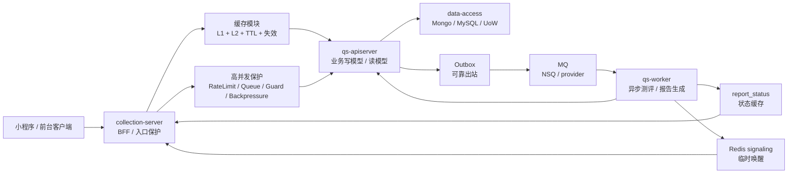

# 基础设施总览

**本文回答**：qs-server 的基础设施共同解决什么系统问题；缓存、事件、高并发保护如何围绕“高并发测评链路”协作；哪些能力是主线，哪些能力是支撑层。

---

## 30 秒结论

qs-server 的基础设施不是简单堆 Redis、MQ 和限流组件，而是围绕**高并发测评链路**做了三层治理：

第一层是**读侧治理**。通过 L1 本地缓存、L2 Redis 缓存、缓存预热、TTL 分层和变更失效机制，降低问卷、模型、报告状态等高频查询对 MongoDB / MySQL 的压力。

第二层是**事件驱动治理**。通过领域事件、Outbox、MQ 和 worker 消费，把答卷提交、测评执行、报告生成拆成可追踪、可重试、可补偿的异步链路；同时用一次性信令唤醒等待中的报告查询请求。

第三层是**高并发保护**。通过入口限流、SubmitQueue 提交削峰、SubmitGuard 重复提交抑制、下游背压和 report 查询治理，避免突发流量、重复提交和查询风暴把系统打穿。

---

## 总图

这张图表达四个边界：

- 缓存减少读侧穿透，但不保存业务主事实。
- Outbox 保存不能丢的业务事件，MQ 负责异步消费。
- Redis signaling 只唤醒在线等待请求，不承担可靠投递。
- 高并发保护先挡入口和削峰，再保护下游处理能力。

---

## 三条主线

| 主线 | 系统问题 | 核心机制 | 典型链路 |
| ---- | -------- | -------- | -------- |
| 缓存模块 | 高频读请求放大 DB 压力 | L1 本地缓存、L2 Redis、预热、TTL、信令失效、降级回源 | 问卷查询、目录查询、模型查询、报告状态查询 |
| 事件模块 | 答卷提交后不能同步阻塞，也不能丢业务事件 | Event、Outbox、MQ、Worker、Ack/Nack、一次性信令 | 答卷提交、测评执行、报告生成、状态通知 |
| 高并发保护模块 | 突发提交、重复提交、查询风暴、下游积压 | RateLimit、SubmitQueue、SubmitGuard、Backpressure、report 查询治理 | 提交、查询、报告等待、worker 消费 |

---

## 支撑层

| 支撑层 | 提供什么 | 和三条主线的关系 |
| ------ | -------- | ---------------- |
| data-access | Mongo、MySQL、Repository、UnitOfWork、Migration、ReadModel、Outbox store | 缓存 miss 回源、业务写入、Outbox stage 的事实层 |
| security | Principal、OrgScope、AuthzSnapshot、CapabilityDecision、ServiceIdentity | 所有入口、内部调用和 report 查询的身份权限边界 |
| integrations | WeChat、ObjectStorage、Notification、外部 adapter | 登录、通知、资源外链等外部能力 |
| runtime | ProcessStage、ResourceBootstrap、Container、ConfigOptions、Lifecycle | 把缓存、事件、高并发保护装配到三个进程 |
| observability | Metrics、Healthz、Pprof、Logging、Audit、Governance Endpoint | 判断缓存命中、outbox 积压、限流/背压是否生效 |

---

## 失败时怎么降级

| 场景 | 正确降级方向 | 不应该做什么 |
| ---- | ------------ | ------------ |
| L1 miss 或信令丢失 | 走 L2 或等 TTL 兜底 | 把 L1 当强一致事实源 |
| Redis L2 异常 | 允许回源 DB，但要受 singleflight / backpressure / rate limit 保护 | 无保护地把所有 miss 打到 DB |
| Outbox relay 失败 | 事件留在 outbox pending/failed，按 relay 和补偿治理排水 | 用 Redis signal 替代可靠业务事件 |
| MQ 重投 | worker handler 幂等，必要时用 duplicate suppression 降低重复副作用 | 承诺 exactly-once |
| wait-report 超时 | 返回当前非终态和 `next_poll_after_ms`，客户端退避 | 让客户端紧循环长轮询 |
| SubmitQueue 满 | 快速返回 429 / queue full，让客户端按退避重试 | 无限排队拖垮 collection-server |

---

## 代码事实源

| 主题 | 事实源 |
| ---- | ------ |
| 事件目录与 delivery | `configs/events.yaml` |
| 一次性信令 | `configs/signals.yaml`、`internal/pkg/cachesignal` |
| 目录 L1/L2 缓存 | `internal/collection-server/application/catalogl1`、`internal/apiserver/infra/cache` |
| Cache governance | `internal/apiserver/application/cachegovernance`、`internal/pkg/cachegovernance` |
| Outbox | `internal/apiserver/outboxcore`、`internal/apiserver/infra/mongo/eventoutbox`、`internal/apiserver/infra/mysql/eventoutbox` |
| 高并发保护 | `internal/pkg/resilienceplane`、`internal/pkg/locklease` |
| SubmitQueue / SubmitGuard | `internal/collection-server/application/answersheet/submit_queue.go`、`internal/collection-server/infra/redisops` |
| report 查询契约 | `api/rest/collection.yaml`、`docs/04-接口与运维/12-小程序报告等待接入指南.md` |
