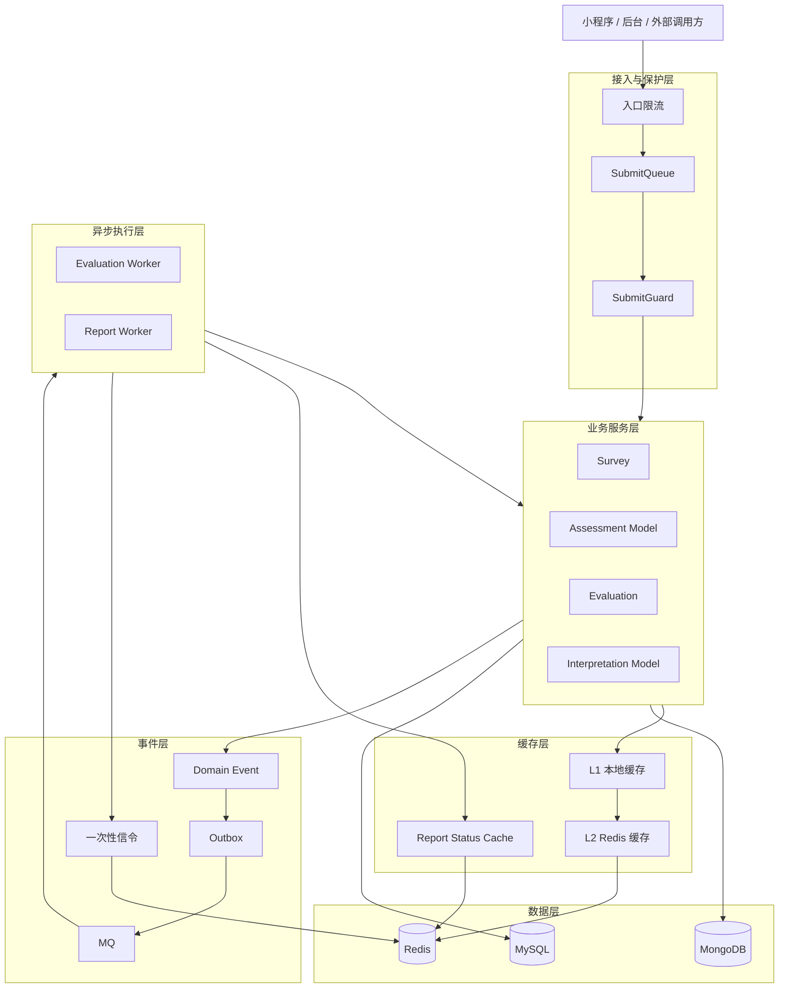

# 基础设施总览

qs-server 的基础设施围绕测评系统的热路径设计：读侧查询要稳，提交链路要短，异步测评要可靠，报告查询不能把系统放大成查询风暴。

## 1. 总体架构

## 2. 三条主线

| 主线 | 系统问题 | 关键机制 |
| --- | --- | --- |
| cache | 问卷目录、测评模型、报告状态等读请求远高于写入，直接查库会放大 DB 压力 | L1 本地缓存、L2 Redis 缓存、预热、TTL 分层、失效刷新、降级 |
| event | 答卷提交不能同步等待测评和报告生成，也不能丢业务事件 | Domain Event、Outbox、MQ、Worker、一次性信令、幂等补偿 |
| concurrency | 突发提交、重复点击、下游处理慢和 report 查询风暴会打穿服务 | 入口限流、SubmitQueue、SubmitGuard、Backpressure、report 查询治理 |

支撑模块提供运行所需的证据和边界：

| 支撑模块 | 作用 |
| --- | --- |
| observability | 让缓存命中、队列深度、Outbox 积压、worker 延迟、报告等待可观测 |
| data-access | 明确 Mongo / MySQL 访问模式、事务边界和读写模型 |
| security | 消费 IAM 身份、服务间认证和权限上下文 |
| runtime | 负责配置加载、模块装配、生命周期、worker 启停和资源约束 |

## 3. 事实源

| 事实 | 现行来源 |
| --- | --- |
| durable event / best effort / signal 分类 | [../../configs/events.yaml](../../configs/events.yaml)、[../../configs/signals.yaml](../../configs/signals.yaml) |
| 缓存治理、L1/L2 与 signal watcher | [../../internal/apiserver/application/cachegovernance](../../internal/apiserver/application/cachegovernance)、[../../internal/pkg/cacheplane](../../internal/pkg/cacheplane)、[../../internal/collection-server/application/catalogl1](../../internal/collection-server/application/catalogl1) |
| SubmitQueue 与 SubmitGuard | [../../internal/collection-server/application/answersheet](../../internal/collection-server/application/answersheet)、[../../internal/collection-server/infra/redisops](../../internal/collection-server/infra/redisops) |
| 报告等待和查询接入 | [../04-接口与运维/12-小程序报告等待接入指南.md](../04-接口与运维/12-小程序报告等待接入指南.md) |
