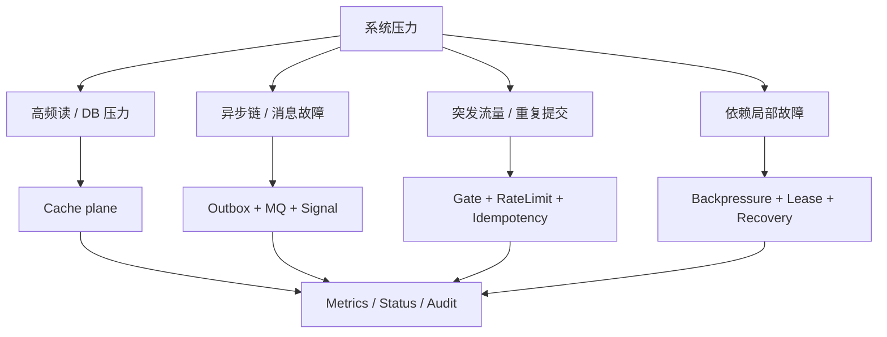

# 基础设施总览

## 1. 结论

qs-server 的基础设施目标不是展示组件数量，而是在高并发、异步执行和多存储条件下维持明确的失败语义与可恢复边界。

## 2. 问题地图

```mermaid
flowchart TB
    Pressure["系统压力"] --> Read["高频读 / DB 压力"]
    Pressure --> Async["异步链 / 消息故障"]
    Pressure --> Burst["突发流量 / 重复提交"]
    Pressure --> Partial["依赖局部故障"]
    Read --> Cache["Cache plane"]
    Async --> Event["Outbox + MQ + Signal"]
    Burst --> Guard["Gate + RateLimit + Idempotency"]
    Partial --> Resilience["Backpressure + Lease + Recovery"]
    Cache --> Obs["Metrics / Status / Audit"]
    Event --> Obs
    Guard --> Obs
    Resilience --> Obs
```

## 3. 共同约束

所有机制都必须说明：保护什么链路、失败时是否丢事实、如何降级、谁拥有恢复动作、怎样验证有效。
