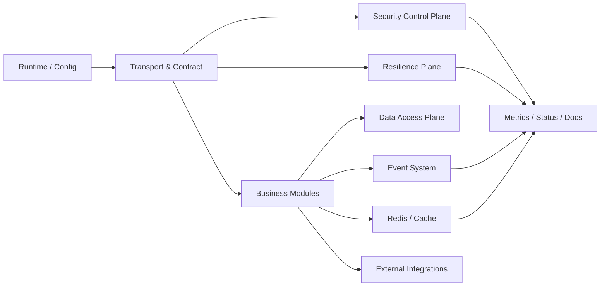

# 横切能力与观测矩阵

**本文回答**：Redis/Event/Resilience/Security/Data Access/External Integration 等非业务核心 plane 的能力边界、观测入口、状态接口和维护门禁在哪里。

## 30 秒结论

| Plane | 解决什么 | 观测 / 状态入口 | 治理动作边界 | Truth layer |
| ----- | -------- | --------------- | ------------ | ----------- |
| Redis / Non-structured Storage | cache、lock、hotset、warmup、cache governance | cache governance status、Prometheus、Redis family status | 允许缓存治理读写；不修改业务主状态 | [redis/README.md](./redis/README.md) |
| Event System | publish/subscribe、outbox、worker dispatch | event metrics、outbox status、worker consume outcomes | 当前只读状态，不做 replay/repair | [event/README.md](./event/README.md) |
| Resilience Plane | rate limit、SubmitQueue、backpressure、lock、幂等、降级 | resilience metrics、multi-process status | 当前只读摘要，不做动态调参/drain | [resilience/README.md](./resilience/README.md) |
| Security Control Plane | JWT、IAM、authz snapshot、capability、service identity、mTLS/ACL | health/ready、authz contract tests、security docs | 不提供权限热修改；权限真值在 IAM | [security/README.md](./security/README.md) |
| Transport & Contract | REST、gRPC、OpenAPI、proto、route matrix | route matrix tests、OpenAPI/proto contract tests | 不做运行时变更；契约变更需显式更新 | [transport/README.md](./transport/README.md) |
| Runtime / Config | process、container、ModuleGraph、ClientBundle、Options | config contract tests、process health | 不动态改启动图 | [runtime/README.md](./runtime/README.md) |
| Data Access | MySQL、Mongo、migration、read model、outbox store | repository tests、migration files、DB metrics | 不提供 DB 手工治理 API | [data-access/README.md](./data-access/README.md) |
| External Integration | WeChat、OSS、Notification、SDK adapters | adapter tests、SDK cache status、业务日志 | 不提供第三方治理面板 | [integrations/README.md](./integrations/README.md) |

## 主图



## 排障顺序

1. **先判定 plane**：接口失败先看 Transport/Security/Resilience；异步失败看 Event；读写失败看 Data Access；外部消息失败看 Integrations。
2. **再看状态入口**：优先使用已有 status / metrics / contract tests，不直接猜业务代码。
3. **最后进入模块**：只有 plane 层证据指向业务不变量时，才进入 `02-业务模块`。

## 否定边界

- 本矩阵不新增治理 API。
- Operating / Grafana 负责只读状态和趋势，不承担业务修复动作。
- component-base 只作为 primitive provider，不是 qs-server 业务治理真值层。

## Verify

```bash
go test ./internal/pkg/architecture ./internal/pkg/eventruntime ./internal/pkg/resilienceplane ./internal/pkg/securityplane ./internal/apiserver/transport/rest ./internal/apiserver/transport/grpc
python scripts/check_docs_hygiene.py
```
