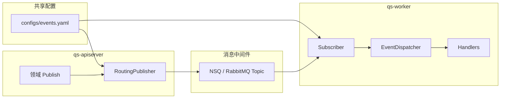
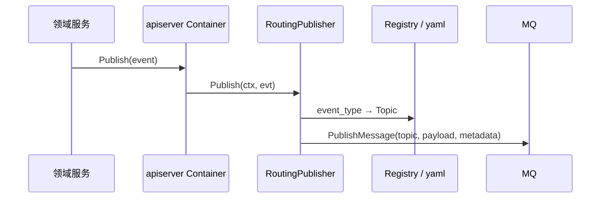
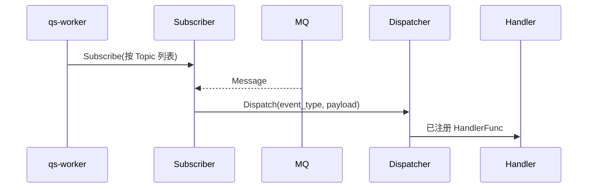
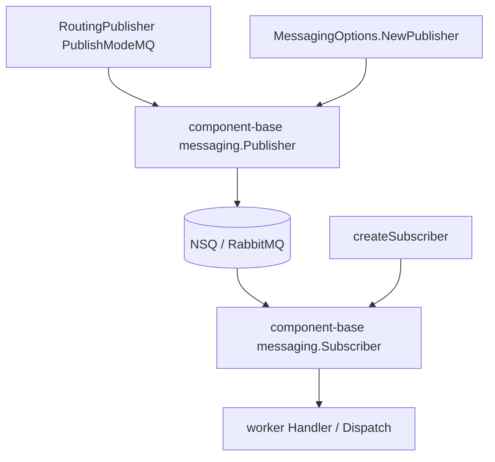

# 事件系统

**本文回答**：这篇文档解释 `qs-server` 的事件系统到底由哪些部分组成，`events.yaml`、发布端、订阅端和 worker 分发链是怎么接起来的，以及 Topic 路由、消息抽象和幂等边界应该从哪些代码入口验证。

---

## 30 秒了解系统

### 概览

事件系统**不是**独立进程，而是由 **`qs-apiserver`（发布）+ `configs/events.yaml`（拓扑）+ `qs-worker`（订阅与分发）** 组成的基础设施：领域产生事件 → 按配置路由到 Topic → MQ → worker 按 `event_type` 调 handler。消息抽象支持 **NSQ / RabbitMQ**，仓库默认路径以 **NSQ** 为主。本文只覆盖 **QS 业务事件总线**；`IAM -> QS` 的 **`iam.authz.version`** 控制面通知不在本文范围内。

### 基础设施边界

| | 内容 |
| -- | ---- |
| **负责（摘要）** | Topic 与 `event_type → topic` 的配置化路由；发布端与消费端共享 Registry；worker 侧按 `event_type` 分发 handler |
| **不负责（摘要）** | 事件 payload 的 JSON Schema（以各领域 `events.go` 为准）；**同步业务事务**；「只投递一次」保证（见幂等） |
| **关联** | 异步链路叙事 [05-专题/02](../05-专题分析/02-异步评估链路：从答卷提交到报告生成.md)；各模块发布/消费 [02-业务模块](../02-业务模块/)；IAM 授权同步见 [04-IAM与认证](./04-IAM与认证.md) |

### 契约入口

- **拓扑与 handler 名**：[`configs/events.yaml`](../../configs/events.yaml)（版本、topics、events、handlers）。
- **发布/订阅实现**：[`internal/pkg/eventconfig/`](../../internal/pkg/eventconfig/)（`RoutingPublisher`、`Subscriber`、`Registry`）。
- **MQ 实现选型（连接真实 Broker）**：[`internal/pkg/options/messaging_options.go`](../../internal/pkg/options/messaging_options.go)（`MessagingOptions.NewPublisher`）；worker 侧 [`createSubscriber`](../../internal/worker/server.go)（`messaging.Subscriber`）。这里的 `messaging.*` 只对应 **QS 业务事件总线**。
- **装配**：[`internal/apiserver/container/container.go`](../../internal/apiserver/container/container.go)、[`internal/worker/container/container.go`](../../internal/worker/container/container.go)、[`internal/worker/server.go`](../../internal/worker/server.go)。
- **外部库**：`github.com/FangcunMount/component-base/pkg/messaging`（及 `.../nsq`、`.../rabbitmq`）— 版本见仓库根 [`go.mod`](../../go.mod) 中 `require`。

### 运行时示意图

#### 图说明

配置同时驱动**发哪几个 Topic**与**订哪几个 Topic**；具体处理函数由 `event_type` 在 worker 内映射（与 yaml `handlers:` 元数据对照）。

### 主要代码入口（索引）

| 关注点 | 路径 |
| ------ | ---- |
| 事件配置 | [configs/events.yaml](../../configs/events.yaml) |
| 发布封装 | [internal/pkg/eventconfig/publisher.go](../../internal/pkg/eventconfig/publisher.go) |
| MQ 工厂 | [internal/pkg/options/messaging_options.go](../../internal/pkg/options/messaging_options.go) |
| 订阅与分发 | [internal/pkg/eventconfig/subscriber.go](../../internal/pkg/eventconfig/subscriber.go)、[application/event_dispatcher.go](../../internal/worker/application/event_dispatcher.go)、[server.go](../../internal/worker/server.go) |
| apiserver 装配 | [internal/apiserver/container/container.go](../../internal/apiserver/container/container.go) |
| worker 装配 | [internal/worker/container/container.go](../../internal/worker/container/container.go) |

---

## 事件系统到底由哪几层组成

### 核心契约：`events.yaml` 与代码（Verify）

维护行为时以 **yaml 与代码** 同时为真值。

| yaml 承担 | 代码承担 |
| --------- | -------- |
| Topic 名、`event_type → topic`、消费者组与并发、**consumers 列表**、**handler 注册名** | 各领域 `events.go` 载荷语义；`worker` 内 `Register("handler_name", ...)` 与 **主 handler 再调子 handler**（如测评 → 统计，见 [02/06-statistics](../02-业务模块/06-statistics.md) Verify 表） |

**Verify 清单**：

1. 新增/改名 **事件类型字符串**：改 yaml `events:`、发布点、`worker` `Register`，并对照 **consumers**。  
2. **handler 名字符串**：yaml `handlers:` 的 key 与 `Register` 一致。  
3. **Topic**：发布端 `RoutingPublisher` 解析结果与 worker 订阅列表一致（同 Registry）。

### 当前运行时事件集合

按最新代码，运行时有效事件已经收口为 11 个：

| Topic | 事件 |
| ---- | ---- |
| `qs.survey.lifecycle` | `questionnaire.changed`、`scale.changed` |
| `qs.evaluation.lifecycle` | `answersheet.submitted`、`assessment.submitted`、`assessment.interpreted`、`assessment.failed`、`report.generated` |
| `qs.plan.task` | `task.opened`、`task.completed`、`task.expired`、`task.canceled` |

补充两点：

- `questionnaire.changed` 的 `action` 目前只允许 `published | unpublished | archived`。  
- `scale.changed` 的 `action` 目前只允许 `published | unpublished | updated | archived`。  

`configs/events.yaml` 里仍保留 `qs.plan.lifecycle` 这个 Topic 定义，但当前已经没有任何运行时事件挂到该 Topic；worker 也不会为它建立订阅。

## 发布和消费怎样串成一条链

### 核心数据流：发布与消费

#### 发布

发布时附带 `event_type`、聚合类型等 **metadata**（实现见 `publisher`），便于消费端路由。

#### 消费

若 metadata 缺 `event_type`，worker 可能从 payload 信封解析（兼容路径）；**生产侧仍应保证 metadata 完整**。

## `component-base` 和本仓封装怎么分工

### 核心分层：`component-base` messaging 与本仓封装

**是否要在本文「详尽」展开 component-base？**  
**不建议**：`component-base` **不在本仓库**，连接重试、NSQ 客户端细节、RabbitMQ 拓扑等以 **该库源码 / 团队文档 / pkg.go.dev** 为准；本文只固定 **qs-server 如何接线**，避免与上游实现漂移。

#### 依赖关系（从领域到 Broker）

- **发布**：[`RoutingPublisher`](../../internal/pkg/eventconfig/publisher.go) 在 `PublishModeMQ` 下调用 **`messaging.Publisher.PublishMessage`**，消息体由 **`messaging.NewMessage`** 构造（同文件 `publishToMQ`）。**具体 `Publisher` 实例**来自 [`MessagingOptions.NewPublisher`](../../internal/pkg/options/messaging_options.go)：`provider=nsq` → `nsq.NewPublisher(NSQAddr, …)`；`rabbitmq` → `rabbitmq.NewPublisher(RabbitMQURL)`。  
- **消费**：[`createSubscriber`](../../internal/worker/server.go) 返回 **`messaging.Subscriber`**：`nsq` → `cbnsq.NewSubscriber([]string{NSQLookupdAddr}, nsq.Config{MaxInFlight:…})`；`rabbitmq` → `rabbitmq.NewSubscriber(RabbitMQURL)`。收到消息后由 **`messaging.Handler`**（`func(ctx, *messaging.Message) error`）进入 worker 内分发逻辑。

#### 本仓与 component-base 职责对照

| 层次 | 位置 | 职责 |
| ---- | ---- | ---- |
| 事件拓扑与 handler 名 | `configs/events.yaml` + [`eventconfig.Registry`](../../internal/pkg/eventconfig/) | `event_type` → Topic；加载 yaml |
| 发布模式（是否真发 MQ） | [`RoutingPublisher`](../../internal/pkg/eventconfig/publisher.go) `PublishMode` | `mq` / `logging` / `nop`；与 [container 装配](../../internal/apiserver/container/container.go) 组合使用 |
| Broker 选型与连接参数 | [`MessagingOptions`](../../internal/pkg/options/messaging_options.go)、worker `MessagingConfig` | `enabled`、`provider`、`nsq-addr`、`rabbitmq-url` 等；只服务 **QS 业务事件**（与 [05-配置体系](./05-配置体系.md) 对照） |
| 传输与客户端语义 | `component-base/pkg/messaging{,/nsq,/rabbitmq}` | `Publisher` / `Subscriber` / `Message` 行为、重试、错误分类 — **详查上游** |

**Verify**：升级 `component-base` 后除跑集成测试外，应对照 **Breaking changes** 检查 `NewPublisher` / `NewSubscriber` / `Message` 字段是否仍与 [publisher.go](../../internal/pkg/eventconfig/publisher.go)、[server.go](../../internal/worker/server.go) 用法一致。

## 发布模式、MQ 抽象和幂等该怎么理解

### 核心模式：发布模式、MQ 抽象与幂等

| 模式 | 用途 |
| ---- | ---- |
| `mq` | 生产路径进入 MQ（`messaging` 初始化成功时） |
| `logging` | 调试：仅日志，不依赖 MQ |
| `nop` | 关闭发布 |

`apiserver` 创建容器时按环境与 `messaging` 初始化结果选择（见 [container.go](../../internal/apiserver/container/container.go) 相关逻辑）。**底层 Broker** 由 [`MessagingOptions`](../../internal/pkg/options/messaging_options.go) 与 worker [`createSubscriber`](../../internal/worker/server.go) 选择 **component-base** 的 NSQ / RabbitMQ 实现；默认运维与 Topic 预创建多围绕 **NSQ**。`collection-server` 不再复用这组配置；它若需要授权版本失效通知，走单独的 **`iam.authz-sync.*`**。

**投递语义**：至少一次；业务幂等自建，例如：

- 统计：`event:processed:{event_id}`（[statistics 模块](../02-业务模块/06-statistics.md)）  
- 其它路径可能配合 Redis 锁（见各 handler）

## 排障和改造时先看什么

### 核心代码锚点索引

| 关注点 | 路径 | 说明 |
| ------ | ---- | ---- |
| Registry | [internal/pkg/eventconfig](../../internal/pkg/eventconfig/) | 事件类型注册与 Topic 映射 |
| apiserver | [internal/apiserver/server.go](../../internal/apiserver/server.go)、[container.go](../../internal/apiserver/container/container.go) | Publisher 注入 |
| worker | [internal/worker/server.go](../../internal/worker/server.go) | `createSubscriber`、与 `messaging.Handler` 对接 |
| MQ 选项 | [internal/pkg/options/messaging_options.go](../../internal/pkg/options/messaging_options.go) | `NewPublisher` |
| 外部依赖 | `go.mod` → `github.com/FangcunMount/component-base` | `pkg/messaging` 及 nsq/rabbitmq 实现包 |

---

## 边界与注意事项

- **payload 形态**不在 yaml 定义；以各域 `events.go` 与 **发布端序列化** 为准。  
- **主业务状态**先落库再发事件；事件不是跨模块同步 RPC。  
- **并非所有 handler 都已「强业务实现」**；例如 `questionnaire.changed` / `scale.changed` 目前只有 `action=published` 有二维码副作用，其余 action 基本只记日志。  
- 当前真正承担跨域编排的核心事件是：`answersheet.submitted`、`assessment.submitted`、`assessment.interpreted`、`assessment.failed`、`report.generated`、`task.*`。  
- `plan.*` 与 `report.exported` 已经从运行时契约删除；不要再把它们讲成当前系统的一部分。  
- 与 **保护层、排队** 的关系：入口削峰在 **collection-server** 与 [03-缓存与限流](./03-缓存与限流.md)；异步执行在 **worker + MQ**。

---

*写作约定见 [CONTRIBUTING-DOCS.md](../CONTRIBUTING-DOCS.md)。*
