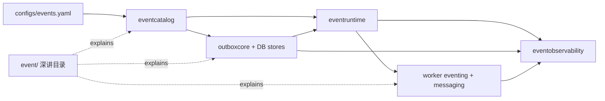

# 事件系统文档中心

**本文回答**：这篇文档是 `qs-server` 事件系统的兼容入口和摘要页；详细解释已经拆到 [event/README.md](./event/README.md)，本文只保留真值优先级、当前事件清单、可靠性分层和下钻路径。

## 30 秒结论

| 维度 | 当前事实 |
| ---- | -------- |
| 契约真值 | [`configs/events.yaml`](../../configs/events.yaml) |
| 深讲目录 | [event/README.md](./event/README.md) |
| 事件模型 | [`pkg/event`](../../pkg/event/) + [`internal/pkg/eventcatalog`](../../internal/pkg/eventcatalog/) |
| 编解码 | [`internal/pkg/eventcodec`](../../internal/pkg/eventcodec/) |
| 发布/订阅运行时 | [`internal/pkg/eventruntime`](../../internal/pkg/eventruntime/) |
| 观测模型 | [`internal/pkg/eventobservability`](../../internal/pkg/eventobservability/) |
| 可靠性分层 | `best_effort` direct publish；`durable_outbox` outbox relay |
| 默认 MQ | 当前仓库默认 NSQ；RabbitMQ 是代码支持分支 |
| 当前通用消费者 | `qs-worker` |



## 真值来源

| 优先级 | 来源 |
| ------ | ---- |
| 1 | 源码与运行行为：`internal/`、`pkg/`、`cmd/` |
| 2 | 机器契约与配置：[`configs/events.yaml`](../../configs/events.yaml)、OpenAPI、proto |
| 3 | 当前 docs：本页和 [event/](./event/) |
| 4 | 宣讲层 |
| 5 | `_archive`，只作历史背景 |

如果 prose 与代码或 `events.yaml` 冲突，以代码和配置为准。

## 当前 topic 与事件摘要

| Topic key | 运行时 topic | 事件 |
| --------- | ------------ | ---- |
| `questionnaire-lifecycle` | `qs.survey.lifecycle` | `questionnaire.changed`、`scale.changed` |
| `assessment-lifecycle` | `qs.evaluation.lifecycle` | `answersheet.submitted`、`assessment.submitted`、`assessment.interpreted`、`assessment.failed`、`report.generated` |
| `analytics-behavior` | `qs.analytics.behavior` | 全部 `footprint.*` |
| `task-lifecycle` | `qs.plan.task` | `task.opened`、`task.completed`、`task.expired`、`task.canceled` |

完整的 event、delivery、handler 清单见 [01-事件契约与Catalog.md](./event/01-事件契约与Catalog.md)。

## 可靠性分层摘要

| delivery | 当前事件 | 出站方式 | 深讲 |
| -------- | -------- | -------- | ---- |
| `best_effort` | `questionnaire.changed`、`scale.changed`、`task.*` | 应用服务持久化后 direct publish | [02-Publish与Outbox.md](./event/02-Publish与Outbox.md) |
| `durable_outbox` | `answersheet.submitted`、`assessment.*`、`report.generated`、`footprint.*` | 先写 MySQL/Mongo outbox，再由 relay 发布 | [02-Publish与Outbox.md](./event/02-Publish与Outbox.md) |

关键边界：

- 当前不是所有事件都 outbox 化。
- `RoutingPublisher` 不禁止 durable 事件，因为 outbox relay 最终也通过它发布。
- NSQ 不提供 exactly-once；当前正确性靠 outbox、业务幂等和 handler 侧保护。
- `events.yaml` 不承载 worker 并发、重试策略或 consumer 元数据。
- `collection-server` 的 `SubmitQueue` 不是业务事件 MQ。

## 阅读地图

| 问题 | 文档 |
| ---- | ---- |
| 事件系统总体怎么分层 | [event/00-整体架构.md](./event/00-整体架构.md) |
| `events.yaml` 怎么建模 | [event/01-事件契约与Catalog.md](./event/01-事件契约与Catalog.md) |
| direct publish 与 outbox 怎么分 | [event/02-Publish与Outbox.md](./event/02-Publish与Outbox.md) |
| worker 怎么订阅和 Ack/Nack | [event/03-Worker消费与AckNack.md](./event/03-Worker消费与AckNack.md) |
| 新增事件怎么做 | [event/04-新增事件SOP.md](./event/04-新增事件SOP.md) |
| 怎么排障 | [event/05-观测与排障.md](./event/05-观测与排障.md) |
| 为什么默认 NSQ | [event/06-MQ 选型与分析--讨论市面主流 MQ 的实现方式与优缺点，分析为什么选择 NSQ .md](./event/06-MQ 选型与分析--讨论市面主流 MQ 的实现方式与优缺点，分析为什么选择 NSQ .md) |

## Verify

```bash
python scripts/check_docs_hygiene.py
GOTOOLCHAIN=local /Users/yangshujie/.gvm/gos/go1.25.9/bin/go test ./internal/pkg/eventcatalog ./internal/pkg/eventcodec ./internal/pkg/eventruntime ./internal/pkg/eventobservability
GOTOOLCHAIN=local /Users/yangshujie/.gvm/gos/go1.25.9/bin/go test ./internal/apiserver/application/eventing ./internal/apiserver/outboxcore ./internal/apiserver/infra/mysql/eventoutbox ./internal/apiserver/infra/mongo/eventoutbox
GOTOOLCHAIN=local /Users/yangshujie/.gvm/gos/go1.25.9/bin/go test ./internal/worker/integration/eventing ./internal/worker/integration/messaging ./internal/worker/handlers
```
