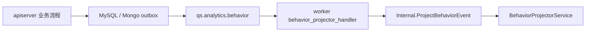

# 事件系统

**本文回答**：`qs-server` 当前运行时到底有哪些事件、`configs/events.yaml` 现在怎样描述事件契约、事件如何从 `qs-apiserver` 发布到 MQ 并由 `qs-worker` 消费、关键链路哪些已经进入 outbox，以及 `collection-server` 的 `SubmitQueue` 与业务 MQ 的边界是什么。

---

## 30 秒结论

先记住这张表：

| 维度 | 当前事实 |
| ---- | -------- |
| 事件契约文件 | [`configs/events.yaml`](../../configs/events.yaml) 是唯一真值文件 |
| YAML schema | 只有 `version`、`topics`、`events` 三层；`events.*.handler` 仅用于 worker 侧处理器绑定 |
| 有效 Topic | 4 个：`qs.survey.lifecycle`、`qs.evaluation.lifecycle`、`qs.analytics.behavior`、`qs.plan.task` |
| 有效事件 | 19 个：问卷/量表 2 个、评估主链 5 个、行为事件 8 个、任务 4 个 |
| 契约模型 | `internal/pkg/eventcatalog` 是 `events.yaml` 的代码真值层；`internal/pkg/eventruntime` 是发布/订阅运行时 |
| 编解码 | `internal/pkg/eventcodec` 统一 domain event JSON payload 与 MQ metadata |
| 发布者 | 业务事件统一由 `qs-apiserver` 发布；底层 MQ 连接由 `component-base/pkg/messaging` 驱动 |
| 通用消费者 | 当前仓库内唯一通用业务事件消费者是 `qs-worker` |
| MQ 提供者 | 代码支持 `nsq` / `rabbitmq`；仓库默认配置走 NSQ |
| 可靠性分层 | 评估主链关键事件与部分行为事件已进入 outbox / relay；`questionnaire.changed`、`scale.changed`、`task.*` 仍是 best-effort direct publish |
| 队列边界 | `collection-server` 的 `SubmitQueue` 是进程内有界队列，不是业务 MQ 总线 |

---

## 真值来源

文档结论以这些实现为准：

- 拓扑与事件清单：[`configs/events.yaml`](../../configs/events.yaml)
- 契约解析与查询：[`internal/pkg/eventcatalog/`](../../internal/pkg/eventcatalog/)
- 事件 payload / metadata 编解码：[`internal/pkg/eventcodec/`](../../internal/pkg/eventcodec/)
- 发布/订阅运行时：[`internal/pkg/eventruntime/`](../../internal/pkg/eventruntime/)
- Worker 订阅与分发：[`internal/worker/integration/eventing/dispatcher.go`](../../internal/worker/integration/eventing/dispatcher.go)、[`internal/worker/integration/messaging/runtime.go`](../../internal/worker/integration/messaging/runtime.go)、[`internal/worker/process/runtime_bootstrap.go`](../../internal/worker/process/runtime_bootstrap.go)
- 共享事件模型：[`pkg/event/event.go`](../../pkg/event/event.go)
- Outbox 与 relay：[`internal/apiserver/application/eventing/outbox.go`](../../internal/apiserver/application/eventing/outbox.go)、[`internal/apiserver/infra/mysql/eventoutbox/store.go`](../../internal/apiserver/infra/mysql/eventoutbox/store.go)、[`internal/apiserver/infra/mongo/eventoutbox/store.go`](../../internal/apiserver/infra/mongo/eventoutbox/store.go)
- 评估主链 durable 出站：[`internal/apiserver/infra/mongo/answersheet/durable_submit.go`](../../internal/apiserver/infra/mongo/answersheet/durable_submit.go)、[`internal/apiserver/infra/mysql/evaluation/assessment_repository.go`](../../internal/apiserver/infra/mysql/evaluation/assessment_repository.go)、[`internal/apiserver/application/evaluation/engine/pipeline/interpretation.go`](../../internal/apiserver/application/evaluation/engine/pipeline/interpretation.go)
- 行为投影：[`internal/apiserver/application/statistics/journey.go`](../../internal/apiserver/application/statistics/journey.go)、[`internal/worker/handlers/behavior_handler.go`](../../internal/worker/handlers/behavior_handler.go)

如果 prose 文档与这些代码不一致，以代码为准。

---

## 当前配置结构

### `events.yaml` 只表达三件事

1. 有哪些 Topic
2. 每个事件属于哪个 Topic
3. 每个事件在 worker 侧绑定哪个 handler 名

当前结构可概括为：

```yaml
version: "1.0"

topics:
  questionnaire-lifecycle:
    name: qs.survey.lifecycle
  assessment-lifecycle:
    name: qs.evaluation.lifecycle
  analytics-behavior:
    name: qs.analytics.behavior
  task-lifecycle:
    name: qs.plan.task

events:
  questionnaire.changed:
    topic: questionnaire-lifecycle
    handler: questionnaire_changed_handler
  footprint.entry_opened:
    topic: analytics-behavior
    handler: behavior_projector_handler
  task.completed:
    topic: task-lifecycle
    handler: task_completed_handler
```

`events.yaml` 当前不承载：

- 下游进程名录
- per-topic 并发配置
- 重试策略元数据
- 历史 `handlers` 顶层元信息

这些运行时行为要回到 worker 配置、MQ 实现和具体代码中核对，而不是从 YAML 推断。

---

## 当前运行时 Topic 与事件

### Topic 列表

| Topic key | 运行时 Topic 名 | 用途 |
| --------- | --------------- | ---- |
| `questionnaire-lifecycle` | `qs.survey.lifecycle` | 问卷与量表生命周期广播 |
| `assessment-lifecycle` | `qs.evaluation.lifecycle` | 答卷提交、测评提交、测评成功/失败、报告生成 |
| `analytics-behavior` | `qs.analytics.behavior` | 行为足迹与投影事件 |
| `task-lifecycle` | `qs.plan.task` | 任务开放、完成、过期、取消 |

### 事件清单

#### `qs.survey.lifecycle`

| 事件 | 说明 | handler |
| ---- | ---- | ------- |
| `questionnaire.changed` | 问卷生命周期变化 | `questionnaire_changed_handler` |
| `scale.changed` | 量表生命周期变化 | `scale_changed_handler` |

#### `qs.evaluation.lifecycle`

| 事件 | 说明 | handler |
| ---- | ---- | ------- |
| `answersheet.submitted` | 答卷已提交 | `answersheet_submitted_handler` |
| `assessment.submitted` | 测评已提交 | `assessment_submitted_handler` |
| `assessment.interpreted` | 测评已解读 | `assessment_interpreted_handler` |
| `assessment.failed` | 测评失败 | `assessment_failed_handler` |
| `report.generated` | 报告已生成 | `report_generated_handler` |

#### `qs.analytics.behavior`

| 事件 | 说明 | handler |
| ---- | ---- | ------- |
| `footprint.entry_opened` | 用户成功打开入口 | `behavior_projector_handler` |
| `footprint.intake_confirmed` | 用户完成一次接入 | `behavior_projector_handler` |
| `footprint.testee_profile_created` | 新建受试者档案 | `behavior_projector_handler` |
| `footprint.care_relationship_established` | 建立看护/服务关系 | `behavior_projector_handler` |
| `footprint.care_relationship_transferred` | 转移看护/服务关系 | `behavior_projector_handler` |
| `footprint.answersheet_submitted` | 提交答卷 | `behavior_projector_handler` |
| `footprint.assessment_created` | 形成测评 | `behavior_projector_handler` |
| `footprint.report_generated` | 产出报告 | `behavior_projector_handler` |

#### `qs.plan.task`

| 事件 | 说明 | handler |
| ---- | ---- | ------- |
| `task.opened` | 任务已开放 | `task_opened_handler` |
| `task.completed` | 任务已完成 | `task_completed_handler` |
| `task.expired` | 任务已过期 | `task_expired_handler` |
| `task.canceled` | 任务已取消 | `task_canceled_handler` |

---

## 发布和消费怎样接起来

### 共享事件模型

所有业务事件都遵守 [`pkg/event/event.go`](../../pkg/event/event.go) 中的 `DomainEvent` 约束：

- `event_id`
- `event_type`
- `occurred_at`
- `aggregate_type`
- `aggregate_id`

领域聚合可通过 `EventCollector` 收集待发布事件，发布端和 outbox 都消费这一抽象，而不是各模块各自定义消息格式。

### 发布端：`qs-apiserver`

`qs-apiserver` 启动时先根据 `messaging.*` 创建底层 `messaging.Publisher`，再装配成 [`RoutingPublisher`](../../internal/pkg/eventruntime/publisher.go)。`RoutingPublisher` 只负责运行时发布路由；事件契约查询来自 [`eventcatalog.Catalog`](../../internal/pkg/eventcatalog/catalog.go)，payload 与 metadata 构造来自 [`eventcodec`](../../internal/pkg/eventcodec/codec.go)。

发布路径的关键点：

1. 应用服务或 outbox relay 调用统一的 `event.EventPublisher`
2. `RoutingPublisher` 按 `event_type` 到 catalog 查 topic
3. MQ 模式下把事件 JSON 发到对应 topic，并附带 `event_type` 等 metadata
4. 若 MQ 未启用或初始化失败，则按配置退回 logging 模式

代码支持 `nsq` 和 `rabbitmq` 两种 provider，见 [`MessagingOptions`](../../internal/pkg/options/messaging_options.go)。当前仓库的 dev/prod 配置默认都走 NSQ。NSQ 本身没有 headers，`PublishMessage` 会通过 component-base 的 message envelope 保留 UUID、metadata 与 payload；legacy raw payload 仍兼容消费。

### 消费端：`qs-worker`

`qs-worker` 启动时会：

1. 加载 `configs/events.yaml`
2. 通过 handler 自注册机制组装处理器工厂
3. 按 topic 生成订阅列表
4. 为每个 topic 建立一次订阅，并以 `worker.service-name` 作为 channel 名

`worker.concurrency` 决定 subscriber 的 `maxInFlight`；多实例共享同一 backlog 的关键是相同的 `worker.service-name`，而不是 YAML 里再配一套旧式下游元数据。

### Ack / Nack 语义

worker 的消息处理逻辑在 `createDispatchHandler`：

| 情况 | 行为 |
| ---- | ---- |
| 能解析 `event_type` 且 handler 执行成功 | `Ack()` |
| handler 返回错误 | `Nack()` |
| 既无 `event_type` metadata，payload 也无法解析为事件信封 | `Ack()`，避免毒消息永久堆积 |

是否重投、重投次数、是否竞争消费，由底层 MQ 与 `component-base` 的 messaging 实现决定；本文不把它包装成统一固定的投递承诺。

component-base 的 `Message.Ack()` / `Message.Nack()` 当前带 settlement guard：业务 handler 手动确认后，NSQ/RabbitMQ adapter 的自动确认不会再次触发底层 ack/nack。这只解决重复确认问题，不改变 MQ 的 at-least-once 语义，也不提供 exactly-once。

### `SubmitQueue` 不是业务 MQ

`collection-server` 的 [`SubmitQueue`](../../internal/collection-server/application/answersheet/submit_queue.go) 只是：

- 进程内 buffered channel
- 本地 worker goroutine
- 内存态 `request_id -> status` 映射

它只用于前台答卷提交通路的削峰，不属于 `qs.*` 业务事件总线，也不参与 `events.yaml` 的拓扑。

---

## 可靠性边界：哪些走 direct publish，哪些走 outbox

当前事件系统不是“全量统一 outbox”，而是按业务边界分层：

| 事件 / 事件族 | 当前出站方式 | 说明 |
| ------------- | ------------ | ---- |
| `questionnaire.changed` | direct publish | 持久化后 best-effort 发布 |
| `scale.changed` | direct publish | 持久化后 best-effort 发布 |
| `task.*` | direct publish | 任务状态落库后 best-effort 发布 |
| `answersheet.submitted` | Mongo durable submit + Mongo outbox | 答卷落库与 outbox staging 同事务 |
| `assessment.submitted` / `assessment.failed` | MySQL outbox | Assessment 持久化与 outbox staging 同事务 |
| `assessment.interpreted` / `report.generated` | Mongo outbox | 报告成功落库后写入 Mongo outbox |
| `footprint.*` | 按产生边界写入 MySQL 或 Mongo outbox | 行为事件已纳入 shared relay，而非独立总线 |

### Shared relay 的真实边界

当前并不是“每类事件一个 relay”，而是按存储边界共享 relay：

- Mongo relay 负责发布 Mongo `domain_event_outbox` 中的事件
- MySQL relay 负责发布 MySQL `domain_event_outbox` 中的事件

因此它们承载的并不只有评估主链事件，也包括行为事件：

- 答卷 durable submit 会同时 stage `answersheet.submitted` 与 `footprint.answersheet_submitted`
- Assessment 创建会 stage `footprint.assessment_created`
- 报告成功会 stage `footprint.report_generated`
- actor / statistics 侧的部分行为事件也会进入 MySQL outbox

如果要判断某个事件是否可靠补发，不要只看事件名，要看它在代码里是否经由 outbox store `StageEventsTx` 落库。

---

## 行为事件与 projector

`qs.analytics.behavior` 这组 topic 已经是当前运行时真实链路的一部分，不是未来设计。

其基本路径是：



worker 侧统一由 `behavior_projector_handler` 消费，再通过 internal gRPC 回调 `apiserver` 的 `ProjectBehaviorEvent`。投影与补偿细节见：

- [05-专题分析/04-行为投影与assessment_episode：当前projector方案.md](../05-专题分析/04-行为投影与assessment_episode：当前projector方案.md)
- [05-专题分析/02-异步评估链路：从答卷提交到报告生成.md](../05-专题分析/02-异步评估链路：从答卷提交到报告生成.md)

---

## 排障时先核对什么

1. 事件是否仍在 [`configs/events.yaml`](../../configs/events.yaml) 中定义，且 `event_type -> topic -> handler` 三者一致
2. 发布侧是否真的走到了 `RoutingPublisher` 或 outbox relay，而不是只收集了聚合事件却未发布
3. `messaging.*` 是否与目标进程配置一致，尤其 provider、地址和 `worker.service-name`
4. 若事件声称“可靠”，是否实际进入了 MySQL/Mongo outbox
5. 若是行为事件，是否已经被 `behavior_projector_handler` 消费并回调 projector
6. 若问题发生在 `collection-server` 提交答卷，请先区分是 `SubmitQueue` 问题还是 MQ / worker 问题

---

## 代码索引

| 关注点 | 路径 |
| ------ | ---- |
| 事件配置 | [`configs/events.yaml`](../../configs/events.yaml) |
| 事件契约模型 | [`internal/pkg/eventcatalog/`](../../internal/pkg/eventcatalog/) |
| 事件编解码 | [`internal/pkg/eventcodec/`](../../internal/pkg/eventcodec/) |
| 发布端 | [`internal/pkg/eventruntime/publisher.go`](../../internal/pkg/eventruntime/publisher.go) |
| Worker 分发 | [`internal/worker/integration/eventing/dispatcher.go`](../../internal/worker/integration/eventing/dispatcher.go)、[`internal/worker/integration/messaging/runtime.go`](../../internal/worker/integration/messaging/runtime.go)、[`internal/worker/process/runtime_bootstrap.go`](../../internal/worker/process/runtime_bootstrap.go) |
| 共享事件模型 | [`pkg/event/event.go`](../../pkg/event/event.go) |
| Outbox relay | [`internal/apiserver/application/eventing/outbox.go`](../../internal/apiserver/application/eventing/outbox.go) |
| 行为投影 | [`internal/apiserver/application/statistics/journey.go`](../../internal/apiserver/application/statistics/journey.go)、[`internal/worker/handlers/behavior_handler.go`](../../internal/worker/handlers/behavior_handler.go) |
| collection 提交队列 | [`internal/collection-server/application/answersheet/submit_queue.go`](../../internal/collection-server/application/answersheet/submit_queue.go) |

---

*写作约定见 [CONTRIBUTING-DOCS.md](../CONTRIBUTING-DOCS.md)。*
