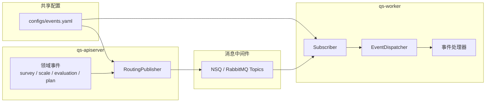
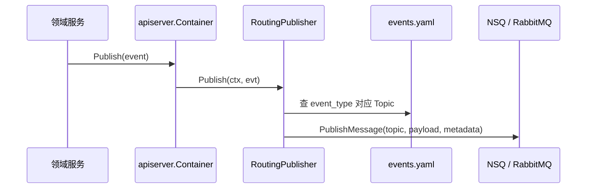
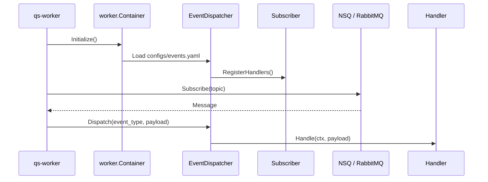

# 事件系统

本文介绍 `qs-server` 事件系统的职责、运行链路和关键设计。

## 30 秒了解系统

`qs-server` 的事件系统不是一个独立服务，而是一套由 `apiserver + configs/events.yaml + worker` 共同组成的基础设施能力。

它当前主要完成三件事：

- `apiserver` 在领域事件产生后，按配置把事件路由到对应 Topic
- `worker` 启动时加载同一份配置，自动决定要订阅哪些 Topic
- 收到消息后，`worker` 再按 `event_type` 分发到对应处理器

当前代码默认把 `configs/events.yaml` 作为发布端和消费端共享的事件拓扑来源。消息中间件抽象支持 `NSQ` 和 `RabbitMQ`，但当前开发和生产配置默认都以 `NSQ` 为主。

核心代码入口：

- [../../configs/events.yaml](../../configs/events.yaml)
- [../../internal/pkg/eventconfig/publisher.go](../../internal/pkg/eventconfig/publisher.go)
- [../../internal/pkg/eventconfig/subscriber.go](../../internal/pkg/eventconfig/subscriber.go)
- [../../internal/apiserver/container/container.go](../../internal/apiserver/container/container.go)
- [../../internal/apiserver/server.go](../../internal/apiserver/server.go)
- [../../internal/worker/server.go](../../internal/worker/server.go)
- [../../internal/worker/container/container.go](../../internal/worker/container/container.go)

## 核心架构

## 核心设计原则

- 配置是事件拓扑的单一来源。`Topic`、`event_type -> topic` 映射、消费者组和并发度都集中在 `configs/events.yaml`。
- 领域模型只定义事件语义，不负责决定发到哪个 Topic。事件结构体仍然放在各领域包的 `events.go` 中。
- 发布与消费共享同一份配置，避免“发布端知道一套 Topic，消费端再手写一套订阅关系”。
- `worker` 只订阅 Topic，真正的处理选择仍然落在 `event_type -> handler` 的分发表上。
- 事件系统强调最终一致和异步解耦，不提供跨模块同步事务。

## 配置与代码如何分工

### 配置负责什么

`configs/events.yaml` 当前负责定义：

- Topic 名称，例如 `assessment.lifecycle`、`questionnaire.lifecycle`
- 消费者组和并发度
- 每个事件映射到哪个 Topic
- 每个事件默认由哪个 handler 名称处理

这使得事件拓扑能从一份 YAML 直接读出来。

### 代码负责什么

代码层仍然负责两类事情：

- 在各领域包里定义事件结构体、事件类型和载荷语义
- 在 `worker` 中实现具体处理器

换句话说，配置解决的是“怎么路由和怎么订阅”，代码解决的是“事件到底表示什么、收到后要做什么”。

## 核心运行链路

### 发布链路

发布时，`RoutingPublisher` 会做两件关键工作：

- 用 `event_type` 从注册表里查出目标 Topic
- 把事件序列化为消息体，并在 metadata 里附带 `event_type / aggregate_type / aggregate_id / occurred_at / source`

### 消费链路

`worker` 启动时会先根据配置生成需要订阅的 Topic 列表，再建立订阅；消息真正到达后，才根据 metadata 里的 `event_type` 继续分发。

## 关键设计点

### 1. 事件拓扑是配置驱动的，不是代码常量驱动的

`RoutingPublisher` 和 `Subscriber` 都依赖 `eventconfig.Registry`。这意味着：

- 新增事件时，除了定义事件结构体和处理器，还必须补配置
- 调整 Topic 映射时，可以不改领域代码
- 发布端和消费端会自然共享同一份拓扑

这比“代码里写一套 Topic 常量，Worker 再手动写一套订阅逻辑”更稳定。

### 2. 发布模式会随运行环境和配置切换

事件发布器当前有三种模式：

- `mq`
- `logging`
- `nop`

`apiserver` 在创建容器时，会先按环境推导默认模式；如果 `messaging` 真正初始化成功，就切到 `mq`。因此：

- 开发和调试时，可以只打日志，不依赖 MQ
- 生产模式下，如果 MQ publisher 可用，事件会真正进入 Topic

### 3. Worker 的订阅关系来自配置，而不是 handler 自己决定

`worker` 不直接按“有哪些处理器实现”来决定订阅什么，而是：

1. 从 `events.yaml` 取出所有 Topic
2. 为每个 Topic 建立订阅
3. 收到消息后，再看 `event_type` 找处理器

这保证了 Topic 级别的订阅关系是显式的，而不是散落在 handler 注册代码里。

### 4. 当前系统默认以 NSQ 为主，但保留 MQ 抽象

`MessagingOptions` 和 `worker.createSubscriber` 都支持 `nsq` 和 `rabbitmq`。但从当前仓库里的配置、Topic 预创建逻辑和部署约定看，运行时主路径仍然是 `NSQ`：

- `apiserver` 通过 `MessagingOptions.NewPublisher()` 创建发布器
- `worker` 在 `nsq` 模式下会预创建 Topics，避免 `TOPIC_NOT_FOUND`

所以 MQ 抽象是真实存在的，但默认实现仍然围绕 `NSQ` 组织。

### 5. 事件系统提供至少一次投递语义，幂等由业务自己处理

事件链路里已经能看到两类典型幂等手段：

- 统计模块在 Redis 里记录 `event:processed:{event_id}`
- 答卷分数补算等路径会配合 Redis 锁做去重

这说明事件系统本身不承诺“只处理一次”，而是要求具体业务在处理侧做受控幂等。

## 边界与注意事项

- `configs/events.yaml` 只定义路由和消费关系，不定义事件 payload schema；真正的载荷语义仍以各领域的 `events.go` 为准。
- 事件系统是跨模块解耦层，不是同步 RPC 的替代物；主业务状态仍然先落库，再发布事件。
- `worker` 里并不是所有事件都已经有强实现，一部分消费逻辑仍然停留在日志或弱协同阶段。
- `report.exported`、`assessment.failed` 这类事件已经定义，但不等于它们都在当前主运行时链路中占同等权重。
- 如果消息 metadata 缺少 `event_type`，`worker` 会尝试从 payload 里解析事件信封做兼容处理。
