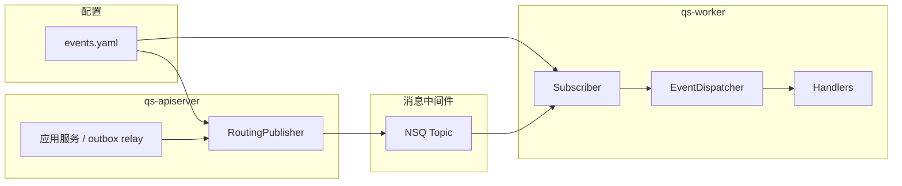
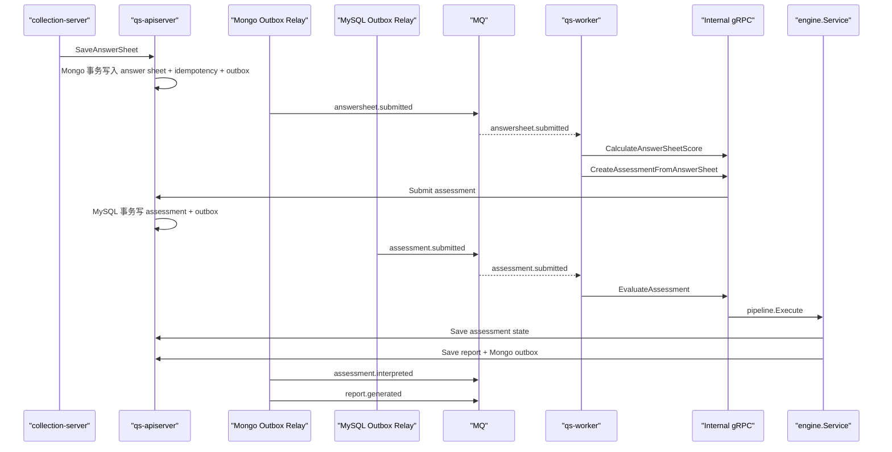

# 事件系统

**本文回答**：`qs-server` 当前到底有哪些运行时事件、`configs/events.yaml` 现在长什么样、事件如何发布和消费、哪些事件已经进入可靠出站链路、worker 的真实并发模型是什么。

---

## 30 秒结论

先记住这张表：

| 维度 | 当前事实 |
| ---- | -------- |
| 事件配置 | `events.yaml` 现在只有 `topics` 和 `events` 两层；没有旧版的顶层 handler 元信息，也没有 per-topic consumer 元数据这类运行时字段 |
| 有效 Topic | 只有 3 个：`qs.survey.lifecycle`、`qs.evaluation.lifecycle`、`qs.plan.task` |
| 有效事件 | 只有 11 个：`questionnaire.changed`、`scale.changed`、`answersheet.submitted`、`assessment.submitted`、`assessment.interpreted`、`assessment.failed`、`report.generated`、`task.opened`、`task.completed`、`task.expired`、`task.canceled` |
| 发布者 | 主要是 `qs-apiserver`；其中评估主链关键事件已经按持久化边界进入 outbox / relay |
| 消费者 | 当前仓库内唯一真实通用消费者是 `qs-worker` |
| worker 并发 | 真正控制 NSQ in-flight 的是 `worker.concurrency`；多实例共享 backlog 的关键是相同的 `worker.service-name`，因为它决定同一个 channel |
| 可靠性分层 | `answersheet.submitted` 走 Mongo durable idempotency + Mongo outbox；`assessment.submitted / failed` 走 MySQL outbox；`assessment.interpreted / report.generated` 在报告成功落 Mongo 后进入 Mongo outbox；`questionnaire.changed` / `scale.changed` / `task.*` 仍是 best-effort direct publish |

---

## 这篇文档的真值来源

当前事件系统以这几处为准：

- 拓扑与事件契约：[`configs/events.yaml`](../../configs/events.yaml)
- 事件配置解析与校验：[`internal/pkg/eventconfig/config.go`](../../internal/pkg/eventconfig/config.go)
- 事件类型常量：[`internal/pkg/eventconfig/types.go`](../../internal/pkg/eventconfig/types.go)
- 发布端路由：[`internal/pkg/eventconfig/publisher.go`](../../internal/pkg/eventconfig/publisher.go)
- 订阅与分发：[`internal/pkg/eventconfig/subscriber.go`](../../internal/pkg/eventconfig/subscriber.go)、[`internal/worker/application/event_dispatcher.go`](../../internal/worker/application/event_dispatcher.go)
- worker 启动与 NSQ channel / in-flight：[`internal/worker/server.go`](../../internal/worker/server.go)
- 评估主链 outbox 边界：
  - answersheet：[`internal/apiserver/infra/mongo/answersheet/durable_submit.go`](../../internal/apiserver/infra/mongo/answersheet/durable_submit.go)
  - assessment submit / fail：[`internal/apiserver/infra/mysql/evaluation/assessment_repository.go`](../../internal/apiserver/infra/mysql/evaluation/assessment_repository.go)
  - report success：[`internal/apiserver/infra/mongo/evaluation/repo.go`](../../internal/apiserver/infra/mongo/evaluation/repo.go)

如果 prose 文档和这些代码不一致，以代码为准。

---

## 当前配置结构

### `events.yaml` 现在只表达三件事

1. 有哪些 Topic
2. 每个事件属于哪个 Topic
3. 每个事件在 worker 侧对应哪个 handler 名

当前结构可以概括成：

```yaml
version: 1
topics:
  questionnaire-lifecycle:
    name: qs.survey.lifecycle
  assessment-lifecycle:
    name: qs.evaluation.lifecycle
  task-lifecycle:
    name: qs.plan.task
events:
  questionnaire.changed:
    topic: questionnaire-lifecycle
    handler: questionnaire_changed_handler
  ...
```

阅读旧文档或旧讨论时，只记一条：**当前 schema 里已经没有旧版 `handlers` / `consumers` / `priority` / topic consumer 元数据**；如果看到这些说法，应视为历史信息，而不是当前运行时事实。

---

## 当前运行时有效 Topic 与事件

### Topic 列表

| Topic key | 运行时 Topic 名 | 用途 |
| --------- | --------------- | ---- |
| `questionnaire-lifecycle` | `qs.survey.lifecycle` | 问卷 / 量表生命周期广播 |
| `assessment-lifecycle` | `qs.evaluation.lifecycle` | 答卷提交、测评提交、测评成功/失败、报告生成 |
| `task-lifecycle` | `qs.plan.task` | 任务开放、完成、过期、取消 |

### 事件列表

| Topic | 事件 | 说明 |
| ----- | ---- | ---- |
| `qs.survey.lifecycle` | `questionnaire.changed` | `action=published|unpublished|archived` |
| `qs.survey.lifecycle` | `scale.changed` | `action=published|unpublished|updated|archived` |
| `qs.evaluation.lifecycle` | `answersheet.submitted` | 异步评估链的第一跳 |
| `qs.evaluation.lifecycle` | `assessment.submitted` | 测评已提交，进入评估主链 |
| `qs.evaluation.lifecycle` | `assessment.interpreted` | 评估成功并且报告已经成功落库后出站 |
| `qs.evaluation.lifecycle` | `assessment.failed` | 测评进入失败态后出站 |
| `qs.evaluation.lifecycle` | `report.generated` | 报告已生成并且已成功落库后出站 |
| `qs.plan.task` | `task.opened` | 任务开放通知 |
| `qs.plan.task` | `task.completed` | 任务完成通知 |
| `qs.plan.task` | `task.expired` | 任务过期通知 |
| `qs.plan.task` | `task.canceled` | 任务取消通知 |

如果你在旧材料里还看到离散的 `questionnaire.*`、`scale.*`、`plan.*` 或 `report.exported`，应按当前契约做映射：`questionnaire.* / scale.*` 已并入 `*.changed`，`plan.*` 与 `report.exported` 已退出运行时。

---

## 发布和消费是怎么接起来的

### 总体形态



### 发布端

- 直接发布与 outbox relay 最终都会调用 [`RoutingPublisher.Publish`](../../internal/pkg/eventconfig/publisher.go)
- `RoutingPublisher` 会根据 `event_type` 到 registry 里找 Topic
- 底层 MQ publisher 由 [`internal/pkg/options/messaging_options.go`](../../internal/pkg/options/messaging_options.go) 创建

### 消费端

- worker 启动时根据 registry 生成订阅列表
- 每个 Topic 只订阅一次
- 收到消息后按 `event_type` 分发到已注册 handler
- 当前 worker 注册入口在 [`internal/worker/handlers/registry.go`](../../internal/worker/handlers/registry.go)

---

## 可靠性分层：现在不要把所有事件讲成一个等级

这是当前事件系统最需要讲清的地方。

### 一张表看清可靠性边界

| 事件 | 当前出站边界 | 说明 |
| ---- | ------------ | ---- |
| `answersheet.submitted` | Mongo durable idempotency + Mongo outbox | 答卷、幂等记录、outbox 同事务；真正出站靠 relay |
| `assessment.submitted` | MySQL outbox | assessment 状态更新和 outbox 同事务 |
| `assessment.failed` | MySQL outbox | assessment 失败状态和 outbox 同事务 |
| `assessment.interpreted` | Mongo outbox | 报告成功落 Mongo 时一起出站 |
| `report.generated` | Mongo outbox | 报告成功落 Mongo 时一起出站 |
| `questionnaire.changed` | best-effort direct publish | 当前只有 `published` 有二维码副作用 |
| `scale.changed` | best-effort direct publish | 当前只有 `published` 有二维码副作用 |
| `task.*` | best-effort direct publish | 当前主要承担通知类异步副作用 |

### 评估主链为什么分成 MySQL outbox 和 Mongo outbox

因为这条链天然跨两类持久化边界：

- `assessment` 状态和分数主要落在 MySQL
- `report` 主要落在 Mongo

所以当前系统并不伪装成“全链路单事务原子”，而是把每个持久化边界内部的状态与出站一致性做硬：

- assessment 提交 / 失败：MySQL 边界内做硬
- report 成功：Mongo 边界内做硬

这也是为什么 `assessment.interpreted` 和 `report.generated` 现在绑定在“报告保存成功”这个时刻出站，而不是在 assessment save 后提前 direct publish。

---

## 当前异步评估主链

### 主链示意图



### 当前 pipeline 顺序

当前评估 pipeline 的真实顺序是：

1. `ValidationHandler`
2. `FactorScoreHandler`
3. `RiskLevelHandler`
4. `InterpretationHandler`
5. `WaiterNotifyHandler`

对应代码见：

- [`internal/apiserver/application/evaluation/engine/service.go`](../../internal/apiserver/application/evaluation/engine/service.go)
- [`internal/apiserver/application/evaluation/engine/pipeline/waiter_notify.go`](../../internal/apiserver/application/evaluation/engine/pipeline/waiter_notify.go)

当前已经不存在“pipeline 末端还有一个旧发布 handler 负责 direct publish”的现状描述。

---

## worker 的真实消费模型

### worker 到底按什么控制并发

当前真正控制 NSQ in-flight 的是：

- `worker.concurrency`

而不是：

- 旧版 yaml 里的 per-topic consumer 并发字段
- 旧版 yaml 里的 per-topic consumer 重试字段
- 任何已经从 yaml schema 中删除的 consumer 元数据

代码锚点：

- [`internal/worker/options/options.go`](../../internal/worker/options/options.go)
- [`internal/worker/server.go`](../../internal/worker/server.go)

### 多实例为什么能共享同一个 backlog

因为 worker 订阅 NSQ 时使用的是：

- `topic`
- `worker.service-name` 作为 channel 名

所以多个 worker 实例如果使用相同的 `worker.service-name`，它们会共同消费同一个 channel 的 backlog。

这也是“同 channel 扩 worker”的真实机制。

### 当前不应继续写进文档的旧说法

- “每个 Topic 的并发直接由 `events.yaml` 控制”
- “旧 consumer 重试字段就是最终重试策略真值”
- “更换 worker 实例名也能帮同一个 backlog 排空”

---

## 当前仓库里谁在消费这些事件

### worker handler 侧的真实消费形态

| 事件 | 当前 handler | 主要副作用 |
| ---- | ------------ | ---------- |
| `questionnaire.changed` | `questionnaire_changed_handler` | `published` 时生成问卷二维码；其他 action 记日志 |
| `scale.changed` | `scale_changed_handler` | `published` 时生成量表二维码；其他 action 记日志 |
| `answersheet.submitted` | `answersheet_submitted_handler` | Redis gate，计分，创建测评 |
| `assessment.submitted` | `assessment_submitted_handler` | 统计更新；有量表时触发 `EvaluateAssessment` |
| `assessment.interpreted` | `assessment_interpreted_handler` | 统计更新；高风险日志 |
| `assessment.failed` | `assessment_failed_handler` | 失败日志 |
| `report.generated` | `report_generated_handler` | 拉报告、提取高风险因子、给受试者打标签 |
| `task.*` | `task_*_handler` | 打通知 |

当前仓库里没有另一套和 `qs-worker` 同等级的通用业务事件消费者。

---

## 当前边界：哪些话不能讲过头

### 可以明确讲成“当前已实现”的

- 当前运行时只有 3 个 Topic、11 个有效事件
- `answersheet.submitted` 已有 durable idempotency + outbox
- 评估主链关键事件已经按 MySQL / Mongo 边界 outbox 化
- worker 真正的 NSQ 并发控制来自 `worker.concurrency`
- 多 worker 共享 backlog 的关键是相同的 `worker.service-name`

### 不能讲过头的

- 不能把所有事件讲成都已 outbox 化
- 不能把 `questionnaire.changed`、`scale.changed`、`task.*` 讲成和评估主链一样的可靠等级
- 不能把 durable idempotency 讲成“所有提交默认都成立”；当前仍然是显式 `idempotency_key` opt-in
- 不能再把旧的 `events.yaml consumer.*` 心智讲成现状

---

## 代码索引

### 配置与契约

- [configs/events.yaml](../../configs/events.yaml)
- [internal/pkg/eventconfig/config.go](../../internal/pkg/eventconfig/config.go)
- [internal/pkg/eventconfig/types.go](../../internal/pkg/eventconfig/types.go)

### 发布端

- [internal/pkg/eventconfig/publisher.go](../../internal/pkg/eventconfig/publisher.go)
- [internal/pkg/options/messaging_options.go](../../internal/pkg/options/messaging_options.go)

### 消费端

- [internal/pkg/eventconfig/subscriber.go](../../internal/pkg/eventconfig/subscriber.go)
- [internal/worker/application/event_dispatcher.go](../../internal/worker/application/event_dispatcher.go)
- [internal/worker/server.go](../../internal/worker/server.go)
- [internal/worker/handlers/registry.go](../../internal/worker/handlers/registry.go)

### 可靠出站

- [internal/apiserver/infra/mongo/answersheet/durable_submit.go](../../internal/apiserver/infra/mongo/answersheet/durable_submit.go)
- [internal/apiserver/infra/mysql/evaluation/assessment_repository.go](../../internal/apiserver/infra/mysql/evaluation/assessment_repository.go)
- [internal/apiserver/infra/mongo/evaluation/repo.go](../../internal/apiserver/infra/mongo/evaluation/repo.go)
- [internal/apiserver/application/eventing/outbox.go](../../internal/apiserver/application/eventing/outbox.go)
- [internal/apiserver/server.go](../../internal/apiserver/server.go)

---

*写作约定见 [CONTRIBUTING-DOCS.md](../CONTRIBUTING-DOCS.md)。*
