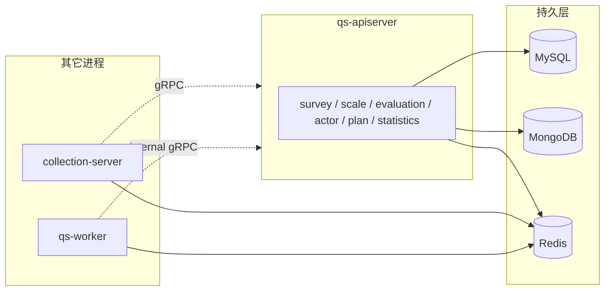

# 存储模型

**本文回答**：这篇文档解释 `qs-server` 为什么同时使用 MySQL、MongoDB 和 Redis，三种存储分别承载什么类型的数据，三进程实际各连哪几种存储，以及这些接入点在代码里从哪里落地。

---

## 30 秒了解系统

### 概览

运行时采用 **MySQL（事务与结构化查询）+ MongoDB（大文档与灵活结构）+ Redis（缓存、短期状态、统计预聚合与幂等）**。**完整持久化平面**在 **`qs-apiserver`**；`collection-server` 以 **gRPC** 调用 apiserver 写主数据；`worker` 以 **internal gRPC + Redis** 为主，主业务写入仍回到 apiserver。

### 基础设施边界

| | 内容 |
| -- | ---- |
| **负责（摘要）** | 说明数据按何种特征分库、各进程持有哪些连接、迁移如何独立演进 |
| **不负责（摘要）** | 各表字段与领域不变量（见 02）；统计读路径键级清单（见 [06-statistics](../02-业务模块/06-statistics.md)） |
| **关联** | [05-专题/03](../05-专题分析/03-保护层与读侧架构：限流、背压、缓存、统计预聚合.md)（读侧）；[03-缓存与限流](./03-缓存与限流.md) |

### 契约入口

- **连接与迁移**：[`internal/apiserver/database.go`](../../internal/apiserver/database.go)、[`internal/pkg/migration/`](../../internal/pkg/migration/)（MySQL / MongoDB 分离目录）。
- **仓储实现**：[`internal/apiserver/infra/mysql/`](../../internal/apiserver/infra/mysql/)、[`internal/apiserver/infra/mongo/`](../../internal/apiserver/infra/mongo/)、[`internal/apiserver/infra/cache/`](../../internal/apiserver/infra/cache/)。

### 运行时示意图

#### 图说明

**只有 apiserver** 同时初始化三存储并跑迁移；其它进程不复制一套写库规则。

### 主要代码入口（索引）

| 关注点 | 路径 |
| ------ | ---- |
| apiserver DB | [internal/apiserver/database.go](../../internal/apiserver/database.go) |
| collection / worker DB | [internal/collection-server/server.go](../../internal/collection-server/server.go)、[internal/worker/database.go](../../internal/worker/database.go) |
| 迁移 | [internal/pkg/migration/migrations/mysql](../../internal/pkg/migration/migrations/mysql)、[mongodb](../../internal/pkg/migration/migrations/mongodb) |

---

## 为什么要按三种存储分层

先回答“为什么不是一库到底”，再看具体模块怎么分布到 MySQL / MongoDB / Redis。

### 核心数据分布：按存储介质

| 介质 | 典型用途 | 模块入口（infra） |
| ---- | -------- | ------------------ |
| **MySQL** | `Testee`/`Staff`、`Assessment`/`Score`/任务与计划、`statistics_*` 读模型表 | [infra/mysql/actor](../../internal/apiserver/infra/mysql/actor)、[evaluation](../../internal/apiserver/infra/mysql/evaluation)、[plan](../../internal/apiserver/infra/mysql/plan)、[statistics](../../internal/apiserver/infra/mysql/statistics) |
| **MongoDB** | `Questionnaire`、`AnswerSheet`、`MedicalScale`、`Report` 等 | [infra/mongo/questionnaire](../../internal/apiserver/infra/mongo/questionnaire)、[answersheet](../../internal/apiserver/infra/mongo/answersheet)、[scale](../../internal/apiserver/infra/mongo/scale)、[evaluation](../../internal/apiserver/infra/mongo/evaluation) |
| **Redis** | 通用缓存、统计预聚合与 `stats:query:*`、幂等键等 | [infra/cache](../../internal/apiserver/infra/cache)、[infra/statistics/cache.go](../../internal/apiserver/infra/statistics/cache.go) |

**同一模块跨库**的典型例子：**evaluation** 的 `Assessment` 在 MySQL、`Report` 在 MongoDB——按访问形态分，**不是**按模块名一刀切（见 [03-evaluation](../02-业务模块/03-evaluation.md)）。

## 三个进程实际分别连什么

这一节只回答“谁真正初始化了哪些存储、谁没有”，避免从配置文件误判运行时行为。

### 核心数据分布：按进程（Verify）

| 进程 | MySQL | MongoDB | Redis | 说明 |
| ---- | ----- | ------- | ----- | ---- |
| **qs-apiserver** | ✅ 初始化 + 迁移 | ✅ 初始化 + 迁移 | ✅ | 主数据平面 |
| **collection-server** | ❌ | ❌ | ✅ | 经 gRPC 调 apiserver 写主数据 |
| **qs-worker** | ❌（配置字段可能残留） | ❌ | ✅ | 落库主路径走 **internal gRPC → apiserver** |

**Verify**：以各进程 `database.go` / `DatabaseManager` 实际注册为准；勿仅凭 yaml 字段推断「已接 MySQL」。

## 读模型、可重建层和迁移为什么要分开看

### 核心模式：读模型、可重建层与迁移独立

1. **Redis 非业务真值**：缓存、统计预聚合、幂等可丢可重建；与 [06-statistics](../02-业务模块/06-statistics.md) 三层读一致。  
2. **MySQL 与 MongoDB 迁移版本独立**：可只升其一，不强制双库同版本迁移。  
3. **统计读模型**：Redis 预聚合 + MySQL `statistics_*` + 原始表回源——**机制**在本文与缓存文；**键与同步顺序**在 **06-statistics**。

## 排障和改造时先看什么

### 核心代码锚点索引

| 关注点 | 路径 |
| ------ | ---- |
| 迁移 | [internal/pkg/migration](../../internal/pkg/migration/) |
| 分库领域逻辑 | 各 [02-业务模块](../02-业务模块/) 内「核心存储」或装配节 |

---

## 边界与注意事项

- **worker / collection** 的 Redis 用途与 apiserver **不同**：collection 偏入口与限流配套；worker 偏统计增量、锁、幂等——**不**承担主查询缓存真相。  
- **单实例 Redis** 约定：当前不区分多实例角色；若部署演进，需另文约定。  
- **跨库数据修复**（如历史 `scale_id` → `scale_code`）可能需脚本 + 人工步骤，见 **02-scale** 与迁移注释。  
- **统计模块**：勿在本文展开 **Redis 键模板**；以 [06-statistics](../02-业务模块/06-statistics.md) 为准。

---

*写作约定见 [CONTRIBUTING-DOCS.md](../CONTRIBUTING-DOCS.md)。*
