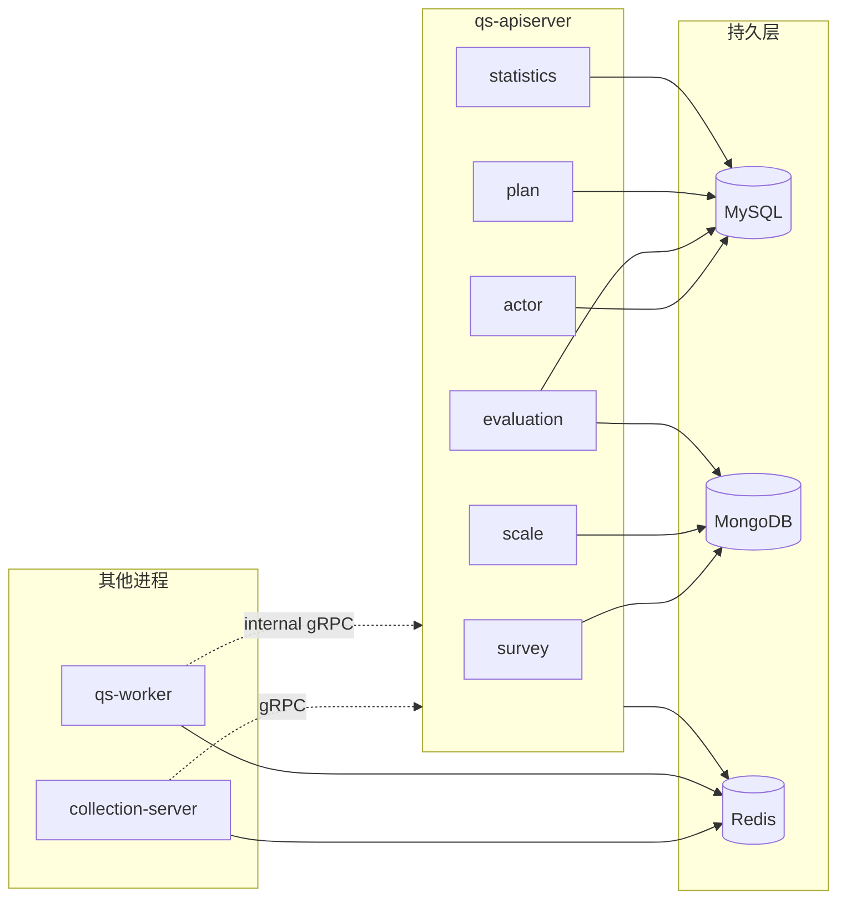

# 存储模型

本文介绍 `qs-server` 当前的存储分布、数据归属和运行时读写关系。

## 30 秒了解系统

`qs-server` 不是“所有数据都落一个库”的系统。当前运行时采用的是：

- `MySQL`：事务型、关系型、需要结构化查询的数据
- `MongoDB`：文档型、结构较大或形态更灵活的数据
- `Redis`：缓存、短期状态、预聚合和幂等辅助数据

其中，真正持有完整持久化数据平面的只有 `qs-apiserver`。`collection-server` 当前只初始化 `Redis`；`worker` 当前也只直接初始化 `Redis`，其余核心写入仍然通过 internal gRPC 回到 `apiserver` 完成。

核心代码入口：

- [../../internal/apiserver/database.go](../../internal/apiserver/database.go)
- [../../internal/collection-server/database.go](../../internal/collection-server/database.go)
- [../../internal/worker/database.go](../../internal/worker/database.go)
- [../../internal/pkg/migration](../../internal/pkg/migration)
- [../../internal/apiserver/infra/mysql](../../internal/apiserver/infra/mysql)
- [../../internal/apiserver/infra/mongo](../../internal/apiserver/infra/mongo)
- [../../internal/apiserver/infra/cache](../../internal/apiserver/infra/cache)

## 核心架构

## 核心设计原则

- 数据按访问特征分布，而不是强制每个模块只对应一种数据库。
- `apiserver` 是唯一真正拥有完整持久化能力的进程；其他进程更多是入口层和异步执行层。
- `Redis` 是缓存和短期状态层，不是业务真值来源。
- `MySQL` 和 `MongoDB` 迁移是独立管理的，两套版本不会绑定在一起。
- 读模型可以额外落库或缓存重建，例如统计模块的 `Redis + MySQL 统计表 + 原始表回源`。

## 数据放在哪里

### MySQL 负责什么

当前更偏向事务型和结构化查询的数据，主要落在 `MySQL`：

- `actor`
  - `Testee`
  - `Staff`
- `evaluation`
  - `Assessment`
  - `AssessmentScore`
- `plan`
  - `AssessmentPlan`
  - `AssessmentTask`
- `statistics`
  - `statistics_daily`
  - `statistics_accumulated`
  - `statistics_plan`

对应入口主要在：

- [../../internal/apiserver/infra/mysql/actor](../../internal/apiserver/infra/mysql/actor)
- [../../internal/apiserver/infra/mysql/evaluation](../../internal/apiserver/infra/mysql/evaluation)
- [../../internal/apiserver/infra/mysql/plan](../../internal/apiserver/infra/mysql/plan)
- [../../internal/apiserver/infra/mysql/statistics](../../internal/apiserver/infra/mysql/statistics)

### MongoDB 负责什么

当前更偏向文档型、结构较大或层级更灵活的数据，主要落在 `MongoDB`：

- `survey`
  - `Questionnaire`
  - `AnswerSheet`
- `scale`
  - `MedicalScale`
- `evaluation`
  - `Report`

对应入口主要在：

- [../../internal/apiserver/infra/mongo/questionnaire](../../internal/apiserver/infra/mongo/questionnaire)
- [../../internal/apiserver/infra/mongo/answersheet](../../internal/apiserver/infra/mongo/answersheet)
- [../../internal/apiserver/infra/mongo/scale](../../internal/apiserver/infra/mongo/scale)
- [../../internal/apiserver/infra/mongo/evaluation](../../internal/apiserver/infra/mongo/evaluation)

### Redis 负责什么

`Redis` 当前主要承担三类数据：

- 通用缓存
  - 问卷、量表、测评详情、测评状态、计划、受试者
- 统计预聚合和查询结果缓存
  - `stats:daily:*`
  - `stats:accum:*`
  - `stats:query:*`
- 幂等与协同状态
  - `event:processed:*`
  - 分数补算与异步处理配套的 Redis 锁

## 进程如何接入这些存储

### apiserver

`apiserver` 会在启动时初始化：

- `MySQL`
- `Redis`
- `MongoDB`

并在连接初始化完成后执行迁移：

- MySQL 迁移
- MongoDB 迁移

所以它既是业务写入面，也是唯一拥有完整持久层初始化逻辑的进程。

### collection-server

`collection-server` 当前只初始化 `Redis`。它不直接持有 `MySQL / MongoDB` 连接，而是通过 gRPC 去调用 `apiserver` 的业务能力。

这说明它是入口与编排层，不是第二套业务数据平面。

### worker

`worker` 当前运行时只直接初始化 `Redis`。尽管配置结构里仍然保留了 `MySQL / MongoDB` 字段，真正的 `DatabaseManager` 现在只注册了 Redis 连接。

这意味着：

- 事件处理时需要落主业务数据，通常仍通过 gRPC 回调 `apiserver`
- `worker` 更像异步执行层，而不是独立写库服务

## 关键设计点

### 1. apiserver 才是完整数据平面

三个运行时里，只有 `apiserver` 会同时初始化 `MySQL + MongoDB + Redis` 并装配所有 Repository。这保证了：

- 业务真值集中在一个主服务里
- `collection-server` 和 `worker` 不会各自维护一套写库规则
- 异步链路最终仍能回到同一个数据平面

### 2. 数据是按特性分库，不是按模块整齐切库

最典型的例子是 `evaluation`：

- `Assessment / Score` 在 MySQL
- `Report` 在 MongoDB

这说明数据分布的依据不是“模块名”，而是：

- 状态流转与结构化查询更适合 MySQL
- 报告正文和灵活文档结构更适合 MongoDB

### 3. MySQL 与 MongoDB 迁移是独立演进的

迁移框架当前把两类迁移明确拆开：

- [../../internal/pkg/migration/migrations/mysql](../../internal/pkg/migration/migrations/mysql)
- [../../internal/pkg/migration/migrations/mongodb](../../internal/pkg/migration/migrations/mongodb)

这意味着：

- 两边版本号独立
- 可以只升级 MySQL，不触发 MongoDB 迁移
- 混合存储不会被强行绑成“一次迁移必须同时改两库”

### 4. Redis 从设计上就是“可重建层”

无论是通用缓存、统计预聚合还是事件幂等标记，`Redis` 当前都不是主业务真值来源：

- 缓存丢失可以回源重建
- 统计结果可以由原始表或统计表恢复
- 幂等键是运行时保护，不是业务主记录

这也是为什么当前仓库只保留单实例 Redis，而没有把 Redis 当作持久业务存储来建模。

### 5. 统计模块是最典型的读模型分层

`statistics` 当前把读链拆成三层：

1. Redis 查询缓存和预聚合
2. MySQL 统计表
3. 原始业务表回源

这说明系统并不是单纯“用 Redis 做缓存”，而是已经在统计场景里明确采用了读模型分层。

## 边界与注意事项

- `worker` 配置里虽然保留了 `MySQL / MongoDB` 字段，但当前实现并不会真的初始化这两类连接。
- `collection-server` 当前没有自己的持久化数据库；它的 Redis 更多是入口层配套能力，而不是业务主存储。
- `Redis` 当前采用单实例使用约定，不区分 `cache/store` 两套运行时实例。
- 部分跨库迁移仍然带有人工步骤，例如 `scale_id -> scale_code` 的数据修正脚本就明确要求结合 Mongo 数据做人工迁移。
