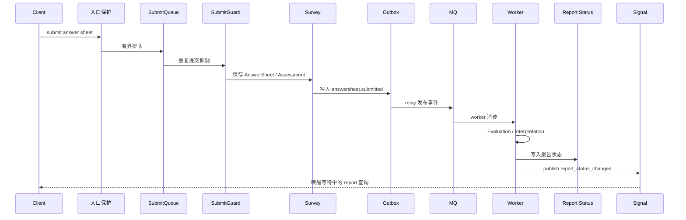
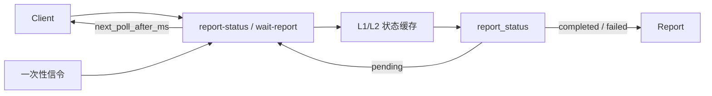

# 核心链路全景

本篇只串两条主链路：答卷提交到报告生成、报告查询。其它基础设施能力都服务于这两条链路。

## 1. 答卷提交到报告生成

关键点：

| 阶段 | 基础设施职责 |
| --- | --- |
| 接入 | 限流和 SubmitQueue 让提交洪峰进入有界处理能力 |
| 防重 | SubmitGuard 把同一业务动作识别为同一次提交 |
| 出站 | Outbox 把业务写入和事件发布拆开，并保证事件可重试 |
| 异步 | MQ 和 worker 把测评、报告生成从提交接口剥离 |
| 通知 | 一次性信令只唤醒正在等待的请求，不作为业务事实源 |

## 2. 报告查询

报告查询是最容易被放大的读流量。短轮询必须走 Redis report status 和 `next_poll_after_ms`；长轮询最多等待一段时间，收到信令则立即返回，超时则返回下一次查询建议；WebSocket / SSE 属于规划增强或按配置启用的推送模式，不能写成所有环境默认能力。

## 3. 代码事实源

| 链路 | 事实源 |
| --- | --- |
| 提交受理与状态 | [../../internal/collection-server/application/answersheet](../../internal/collection-server/application/answersheet)、[../../api/rest/collection.yaml](../../api/rest/collection.yaml) |
| Outbox 与事件发布 | [../../internal/apiserver/application/eventing](../../internal/apiserver/application/eventing)、[../../internal/apiserver/outboxcore](../../internal/apiserver/outboxcore)、[../../configs/events.yaml](../../configs/events.yaml) |
| worker 消费 | [../../internal/worker/handlers](../../internal/worker/handlers)、[../../internal/pkg/eventcatalog](../../internal/pkg/eventcatalog) |
| 报告等待 | [../../internal/collection-server/application/reportwait](../../internal/collection-server/application/reportwait)、[../04-接口与运维/12-小程序报告等待接入指南.md](../04-接口与运维/12-小程序报告等待接入指南.md) |
