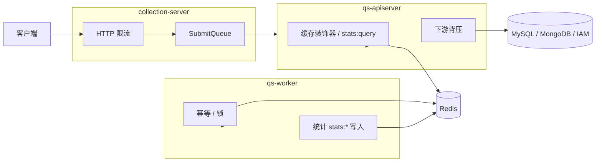

# 缓存与限流

本文档按 [CONTRIBUTING-DOCS.md](../CONTRIBUTING-DOCS.md) 的讲解维度组织。**「为什么」要分层保护**（入口 vs 依赖 vs 读侧）见 [05-专题分析/03-保护层与读侧架构](../05-专题分析/03-保护层与读侧架构：限流、背压、缓存、统计预聚合.md)；本文补齐 **What / Where / Verify**：机制落在哪个进程、关键配置与代码锚点。

---

## 30 秒了解系统

### 概览

「保护层」是 **多层协同**：**HTTP 限流**（入口）、**提交排队**（collection 短时削峰）、**Redis 缓存**（热点读与统计读模型）、**下游背压**（apiserver 对 MySQL / MongoDB / IAM 的 in-flight 限制）。**不是**单一全局开关。

### 基础设施边界

| | 内容 |
| -- | ---- |
| **负责（摘要）** | 说明各机制所在进程、与 Redis/路由的关系；指向实现文件 |
| **不负责（摘要）** | 业务模块内 API 列表；**统计 Redis 键名全表**（见 [06-statistics](../02-业务模块/06-statistics.md)） |
| **关联** | [05-专题/03](../05-专题分析/03-保护层与读侧架构：限流、背压、缓存、统计预聚合.md)；[02-业务模块](../02-业务模块/) |

### 契约入口

- **限流中间件**：[`internal/pkg/middleware/limit.go`](../../internal/pkg/middleware/limit.go)；路由挂载见各进程 `routers` / `server`。
- **背压**：[`internal/pkg/backpressure/limiter.go`](../../internal/pkg/backpressure/limiter.go)；注入 MySQL / Mongo / IAM 适配层（见 [apiserver/server.go](../../internal/apiserver/server.go) 与 infra）。
- **提交队列**：[`internal/collection-server/application/answersheet/submit_queue.go`](../../internal/collection-server/application/answersheet/submit_queue.go)。
- **通用缓存**：[`internal/apiserver/infra/cache/`](../../internal/apiserver/infra/cache/)。

### 运行时示意图

#### 图说明

**尖峰**优先在 **collection** 限流 + 排队消化；**慢依赖**在 **apiserver** 背压；**worker** 写 Redis 以统计与幂等为主，不承担主查询缓存体系。

### 主要代码入口（索引）

| 关注点 | 路径 |
| ------ | ---- |
| 通用缓存 | [internal/apiserver/infra/cache](../../internal/apiserver/infra/cache) |
| 统计 Redis | [internal/apiserver/infra/statistics/cache.go](../../internal/apiserver/infra/statistics/cache.go) |
| 限流 | [internal/pkg/middleware/limit.go](../../internal/pkg/middleware/limit.go) |
| 背压 | [internal/pkg/backpressure/limiter.go](../../internal/pkg/backpressure/limiter.go) |
| 提交队列 | [internal/collection-server/application/answersheet/submit_queue.go](../../internal/collection-server/application/answersheet/submit_queue.go) |

---

## 核心设计

### 核心分层：谁在做什么

| 层 | 进程 | 作用 | 与 05-专题/03 的对应 |
| -- | ---- | ---- | -------------------- |
| 入口限流 + 排队 | **collection-server** | `Limit` / `LimitByKey`；`SubmitQueue` 有界队列、`200`/`202`/`429` 语义 | 入口保护层 |
| 热点读缓存 | **apiserver** | `infra/cache`：问卷、量表、测评详情、状态、计划、受试者等；命名空间、TTL 抖动、可选压缩 | 读侧缓存 |
| 统计相关 Redis | **apiserver + worker** | apiserver 写 **`stats:query:*`**；worker 写 **`stats:daily:*` 等**（见 [06-statistics](../02-业务模块/06-statistics.md)） | 读模型 + 预聚合 |
| 下游背压 | **apiserver** | `backpressure.Limiter` 包在 MySQL / Mongo / IAM 适配器上 | 依赖保护 |

### 核心契约：限流与队列（Verify）

**Verify**：以各进程 **路由注册** 与 **配置 `rate_limit` / `submit_queue`** 为准；OpenAPI 路径与 `collection.yaml` / `apiserver.yaml` 对读。

#### `rate_limit.*` 字段与路由语义（锚点）

实现上均为 **`Limit`（全局限速）+ `LimitByKey`（按 key 限速）**，key 为 `user:{id}` 或 `ip:`（见 `requestLimitKey`）。**字段名表达「配额类别」**，同一类别内多路由共用一套 QPS/Burst。

| 配置字段前缀 | 语义 | apiserver（[`routers.go`](../../internal/apiserver/routers.go)） | collection（[`routers.go`](../../internal/collection-server/routers.go)） |
| ------------ | ---- | ------------------------------------------------------------------ | -------------------------------------------------------------------------- |
| **`Submit*`** | 写类 / 重计算提交 | **仅**已挂 `rateLimitedHandlers` 的写操作（如 plan/tasks、staff `POST`、testees `PUT`、statistics `sync` `POST`、`batch-evaluate` 等）；**问卷/量表等管理 `POST` 多数未挂限流** | `POST /answersheets`（提交答卷） |
| **`AdminSubmit*`** | 后台代填等更高配额 | 仅 `POST /answersheets/admin-submit` | — |
| **`Query*`** | 读类 | **仅**已挂 `rateLimitedHandlers` 的 `GET`（及其它读类挂点） | `GET` 答卷/测评查询（含 `submit-status`、`/:id/assessment`） |
| **`WaitReport*`** | 轮询等报告就绪 | — | 仅 `GET .../assessments/:id/wait-report` |

未出现在上表的路由可能**未**挂限流中间件（以 `routers.go` 为准）。

**SubmitQueue**（要点）：

1. 先限流，再入队；有界内存队列，**非**跨实例持久队列。  
2. 满 → **429**；已受理异步 → **202**（语义以 [submit_queue.go](../../internal/collection-server/application/answersheet/submit_queue.go) 为准）。  
3. 与 **worker + MQ** 区分：前者是**入口削峰**，后者是**跨进程异步**。

### 核心模式：缓存治理与统计读模型

**通用缓存**（apiserver `infra/cache`）已包含：命名空间、单飞、指标、TTL jitter、可选压缩等——**不是**裸 `GET/SET`。

**统计**：Redis 同时承担预聚合、事件幂等、**查询结果短 TTL**；**键模板与 apiserver/worker 分工** 见 [06-statistics](../02-业务模块/06-statistics.md)「Redis 写入/读取分工」；**worker 默认关闭统计缓存** 时行为见该文 **边界**。

### 核心代码锚点索引

| 关注点 | 路径 | 说明 |
| ------ | ---- | ---- |
| apiserver 装配缓存/背压/限流 | [internal/apiserver/server.go](../../internal/apiserver/server.go)、[app.go](../../internal/apiserver/app.go) | 初始化顺序与注入 |
| MySQL 背压 | [internal/pkg/database/mysql/base.go](../../internal/pkg/database/mysql/base.go) | 与连接池协同 |
| Mongo 背压 | [internal/apiserver/infra/mongo/base.go](../../internal/apiserver/infra/mongo/base.go) | |
| IAM 背压 | [internal/apiserver/infra/iam/client.go](../../internal/apiserver/infra/iam/client.go) | |

### 预热（What / Where / Verify）

**目的**：进程启动后把 **已发布量表/问卷** 等热点装入 Redis 缓存；可选预热 **统计查询结果**（`stats:query:*`），减少首击冷读。

| 步骤 | 锚点 |
| ---- | ---- |
| 启动后触发 | [server.go](../../internal/apiserver/server.go) 中异步调用 `container.WarmupCache` |
| 量表 + 问卷 | [container.go](../../internal/apiserver/container/container.go) `WarmupCache` → [warmup.go](../../internal/apiserver/infra/cache/warmup.go) `WarmupService.WarmupAllPublished` |
| 统计缓存（可选） | `cache.statistics_warmup`（见 [options.go](../../internal/apiserver/options/options.go) `StatisticsWarmupOptions`）→ `WarmupStatisticsCache`（同 [warmup.go](../../internal/apiserver/infra/cache/warmup.go)） |

**Verify**：改预热范围时对照 **`cache.statistics_warmup`** 与各 `Warmup*` 实现；默认 dev 配置可能未启用统计预热。

---

## 边界与注意事项

- **并非所有读路径都缓存**（例如答卷本体可能直查存储）。  
- **背压**当前主要接 **MySQL / MongoDB / IAM**，未扩展到所有下游。  
- **LimitByKey** 多为用户或 IP 维度，**不是**完整多租户配额系统。  
- 与 **事件系统** 解耦：MQ 消费与入口排队是两类能力。

---

*写作约定见 [CONTRIBUTING-DOCS.md](../CONTRIBUTING-DOCS.md)。*
