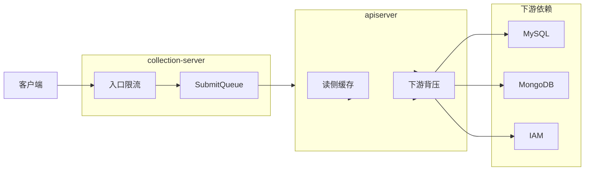

# 缓存与限流

**本文回答**：`qs-server` 的保护层到底有哪些层、分别落在哪个进程、应先看哪些代码和配置；这篇文档现在是 Resilience Plane 的兼容入口，只保留保护层总览和排障入口。

---

## 30 秒结论

`qs-server` 的“保护层”不是单一缓存，也不是单一限流开关，而是三层协同：

1. **入口保护**：HTTP 限流 + `SubmitQueue`，先在接入层削平突发流量。
2. **依赖保护**：对 MySQL / MongoDB / IAM 做 in-flight 背压，避免下游变慢时把堆积放大到全链路。
3. **读侧加速**：`apiserver` 用 Redis 做对象缓存、查询缓存和热点预热，减少热点读与统计查询压力。

Redis 的详细设计、family 路由、缓存业务清单、分布式锁和治理接口已经单独整理到新文档，不再在本文重复展开：

- Resilience 深讲入口： [resilience/README.md](./resilience/README.md)
- 总览与当前实现： [06-Redis使用情况](./06-Redis使用情况.md)
- 三层设计与落地流程： [11-Redis三层设计与落地手册](./11-Redis三层设计与落地手册.md)
- 文档入口： [12-Redis文档中心](./12-Redis文档中心.md)
- 业务缓存盘点： [13-Redis缓存业务清单](./13-Redis缓存业务清单.md)

---

## 本文边界

### 本文负责

- 说明保护层的三段职责和进程边界
- 给出限流、排队、背压、读侧加速的核心代码锚点
- 说明排障时应该先看哪些配置和日志

### 本文不负责

- Redis family、namespace、governance payload 的完整说明
- 各缓存业务对象的 TTL、失效、warmup 细节
- 分布式锁、LockSpec、manual warmup 的完整设计

这些内容统一看 Redis 中心页及其下属文档，不再在这里保留第二份说明。

---

## 保护层全景

### 一句话理解

- **入口保护**优先挡住“瞬时冲高”。
- **依赖保护**优先挡住“下游变慢”。
- **读侧加速**优先挡住“热点重复读”和“重查询”。

这三层解决的是三类不同压力，不能混成一个“缓存层”概念。

---

## 第一层：入口保护

### HTTP 限流

核心实现：

- [internal/pkg/middleware/limit.go](../../internal/pkg/middleware/limit.go)

当前语义：

- `Limit` 提供全局令牌桶限流。
- `LimitByKey` 提供按用户或 IP 的令牌桶限流。
- 超限直接返回 `429`，并写入 `Retry-After`。

当前进程分工：

- `apiserver`：路由上仍主要使用本地 `Limit + LimitByKey`
- `collection-server`：优先使用 Redis 分布式限流；当 `ops_runtime` Redis 不可用或未配置时，回退到本地 `Limit + LimitByKey`

路由锚点：

- [internal/apiserver/transport/rest](../../internal/apiserver/transport/rest)
- [internal/collection-server/transport/rest/router.go](../../internal/collection-server/transport/rest/router.go)

### SubmitQueue

核心实现：

- [internal/collection-server/application/answersheet/submit_queue.go](../../internal/collection-server/application/answersheet/submit_queue.go)

当前语义：

- 这是 `collection-server` 内部的**本地内存有界队列**
- 作用是给答卷提交路径做短时削峰
- 它不是跨实例持久队列，也不是 Redis durable queue

需要特别注意：

- 限流和排队是两件事：通常是**先限流，再入队**
- 队列满时仍可能返回 `429`
- 它的职责是入口削峰，不承担分布式消息系统职责

---

## 第二层：依赖保护

### 下游背压

核心实现：

- [internal/pkg/backpressure/limiter.go](../../internal/pkg/backpressure/limiter.go)

当前语义：

- 用信号量限制“同时占用下游依赖的逻辑操作数”
- 目标不是限制入口 QPS，而是限制下游资源并发占用
- timeout 只约束“等槽位”阶段，不覆盖后续业务执行时间

典型接入点：

- MySQL： [internal/pkg/database/mysql/base.go](../../internal/pkg/database/mysql/base.go)
- MongoDB： [internal/apiserver/infra/mongo/base.go](../../internal/apiserver/infra/mongo/base.go)
- IAM： [internal/apiserver/infra/iam/client.go](../../internal/apiserver/infra/iam/client.go)
- 启动注入： [internal/apiserver/process/resource_bootstrap.go](../../internal/apiserver/process/resource_bootstrap.go)

一条实用判断：

- 如果问题表现为 `429`，先看入口限流和 SubmitQueue
- 如果问题表现为请求排队、超时、数据库或 IAM 调用变慢，先看背压与下游依赖

---

## 第三层：读侧加速

### 这里只保留高层结论

`apiserver` 的读侧加速已经形成单独的 Redis 文档体系，本文只保留两条结论：

1. `apiserver` 是当前唯一完整消费 Redis Cache 层的进程。
2. `worker` 和 `collection-server` 当前不承担对象读缓存体系。

代码锚点：

- 缓存实现目录： [internal/apiserver/infra/cache](../../internal/apiserver/infra/cache)
- 策略层： [internal/apiserver/infra/cachepolicy](../../internal/apiserver/infra/cachepolicy)
- 治理层： [internal/apiserver/application/cachegovernance](../../internal/apiserver/application/cachegovernance)

如需继续看细节，直接跳转：

- 当前 Redis 使用总览： [06-Redis使用情况](./06-Redis使用情况.md)
- 三层设计与新增缓存流程： [11-Redis三层设计与落地手册](./11-Redis三层设计与落地手册.md)
- 业务缓存清单： [13-Redis缓存业务清单](./13-Redis缓存业务清单.md)

---

## 配置入口

排障和调参时，优先看这些配置块：

| 关注点 | 主要配置位置 | 说明 |
| ------ | ------------ | ---- |
| 入口限流 | `rate_limit` | `apiserver` 与 `collection-server` 分别配置 |
| 提交排队 | `submit_queue` | 仅 `collection-server` |
| 下游背压 | `backpressure` | 仅 `apiserver` |
| Redis runtime 路由 | `redis_runtime` | 具体见 Redis 中心页 |
| 对象级缓存策略 | `cache.*` | TTL、negative、compression、warmup 等 |

环境样例：

- [configs/apiserver.dev.yaml](../../configs/apiserver.dev.yaml)
- [configs/apiserver.prod.yaml](../../configs/apiserver.prod.yaml)
- [configs/collection-server.dev.yaml](../../configs/collection-server.dev.yaml)
- [configs/collection-server.prod.yaml](../../configs/collection-server.prod.yaml)

---

## 排障顺序

### 1. 先判断是哪一层的问题

- `429`、瞬时尖峰、同一用户频繁刷接口：先看入口限流
- 请求进入后排很久、答卷提交大量堆积：先看 `SubmitQueue`
- DB / Mongo / IAM 变慢、超时增多：先看背压和下游依赖
- 热点读慢、统计查询慢：再看 Redis Cache 层和 warmup

### 2. 再看对应锚点

| 场景 | 先看哪里 |
| ---- | -------- |
| 限流命中 | [internal/pkg/middleware/limit.go](../../internal/pkg/middleware/limit.go) + 进程 REST transport |
| collection 分布式限流 | [internal/collection-server/transport/rest/router.go](../../internal/collection-server/transport/rest/router.go) + `cacheplane.NewDistributedLimiter` |
| 提交排队 | [internal/collection-server/application/answersheet/submit_queue.go](../../internal/collection-server/application/answersheet/submit_queue.go) |
| 背压 | [internal/pkg/backpressure/limiter.go](../../internal/pkg/backpressure/limiter.go) + 下游适配层 |
| Redis 缓存与预热 | [12-Redis文档中心](./12-Redis文档中心.md) |

---

## 与 Redis 文档的关系

这篇文档现在只负责“保护层全景图”和排障入口。限流、SubmitQueue、背压、Lock lease、幂等、重复抑制和降级的深讲统一进入 [Resilience Plane 文档中心](./resilience/README.md)。

凡是下面这些问题，都不要在本文继续展开，而应直接跳 Redis 文档中心：

- Redis Foundation、Cache、Lock、Governance 四层如何分工
- `redis_runtime` family 如何路由
- 哪些业务对象已经接入缓存
- TTL 抖动、negative cache、warmup、manual warmup 怎么做
- 分布式锁和 LockSpec 如何设计

统一入口见： [12-Redis文档中心](./12-Redis文档中心.md)

---

## 相关文档

- [02-异步评估链路：从答卷提交到报告生成](../05-专题分析/02-异步评估链路：从答卷提交到报告生成.md)
- [03-保护层与读侧架构：限流、背压、缓存、统计预聚合](../05-专题分析/03-保护层与读侧架构：限流、背压、缓存、统计预聚合.md)
- [Resilience Plane 文档中心](./resilience/README.md)
- [06-Redis使用情况](./06-Redis使用情况.md)
- [11-Redis三层设计与落地手册](./11-Redis三层设计与落地手册.md)
- [12-Redis文档中心](./12-Redis文档中心.md)
- [13-Redis缓存业务清单](./13-Redis缓存业务清单.md)

---

*写作约定见 [CONTRIBUTING-DOCS.md](../CONTRIBUTING-DOCS.md)。*
