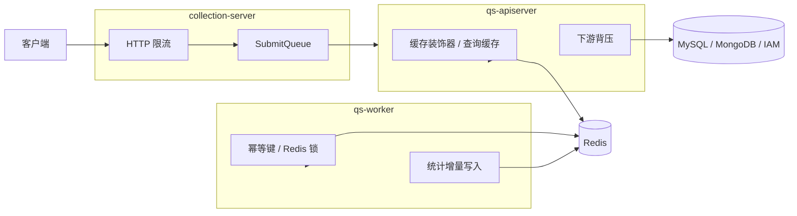

# 缓存与限流

本文介绍 `qs-server` 当前的缓存、限流、排队和背压设计。

## 30 秒了解系统

`qs-server` 的“保护层”不是单一机制，而是四层协同：

- `Redis` 缓存：保护热点读
- HTTP 限流：保护入口流量
- 提交排队：吸收前台短时突发提交
- 下游背压：保护 `MySQL / MongoDB / IAM` 这类慢依赖

这些机制分布在不同进程里：

- `apiserver` 负责大多数缓存和下游背压
- `collection-server` 负责前台请求限流和答卷提交排队
- `worker` 负责利用 Redis 做事件幂等和统计增量写入

核心代码入口：

- [../../internal/apiserver/infra/cache](../../internal/apiserver/infra/cache)
- [../../internal/apiserver/infra/statistics/cache.go](../../internal/apiserver/infra/statistics/cache.go)
- [../../internal/pkg/middleware/limit.go](../../internal/pkg/middleware/limit.go)
- [../../internal/collection-server/application/answersheet/submit_queue.go](../../internal/collection-server/application/answersheet/submit_queue.go)
- [../../internal/apiserver/server.go](../../internal/apiserver/server.go)
- [../../internal/pkg/backpressure/limiter.go](../../internal/pkg/backpressure/limiter.go)

## 核心架构

## 核心设计原则

- 热点读优先用缓存保护，强写链路优先保留主存储语义。
- 限流尽量放在入口层，而不是把压力直接传给下游。
- 排队只用于平滑短时尖峰，不承担长期积压任务。
- 背压针对的是慢依赖，而不是单纯“限制业务协程数”。
- 缓存键、TTL 和命名空间统一由基础设施层管理，避免模块各自发散。

## 缓存是如何组织的

### 通用缓存层

`apiserver` 当前的缓存能力集中在 `internal/apiserver/infra/cache`，主要提供：

- 统一缓存接口
- Redis 实现
- 类型化缓存封装
- 指标采集
- 单飞保护
- 压缩和命名空间
- TTL 抖动

当前已经明确落地的缓存对象包括：

- 问卷
- 量表
- 测评详情
- 测评状态
- 受试者信息
- 计划信息

### 统计缓存层

统计模块使用的是另一类更偏读模型的缓存：

- 查询结果缓存：`stats:query:*`
- 预聚合键：`stats:daily:*`、`stats:accum:*`、`stats:window:*`、`stats:dist:*`
- 事件幂等标记：`event:processed:*`

这层缓存不只是“加速查询”，还承担了统计读模型的中间层角色。

### 缓存预热

`apiserver` 启动后会异步预热两类数据：

- 已发布量表
- 已发布问卷

并可以按配置决定是否预热统计查询结果缓存。预热失败不会阻塞服务启动。

## 入口限流与提交排队

### HTTP 限流

`apiserver` 和 `collection-server` 都复用了同一套 Gin 中间件：

- `Limit`
  - 全局令牌桶
- `LimitByKey`
  - 按用户或 IP 维度的独立令牌桶

其中，`collection-server` 把这套限流重点放在：

- `POST /answersheets`
- `GET /answersheets/submit-status`
- 评估查询、趋势查询等高频接口

### 提交排队

答卷提交还有一层额外保护：`SubmitQueue`。

它的语义是：

1. 请求先过限流
2. 再进入有界内存队列
3. 如果在短等待窗口内完成，返回 `200`
4. 如果已入队但未及时完成，返回 `202 accepted`
5. 队列满时返回 `429`

这套机制解决的是“短时突发提交把同步 gRPC 和后端写入瞬间打满”的问题。

## 下游背压

`apiserver` 在启动时会为三个下游依赖注入 `backpressure.Limiter`：

- MySQL
- MongoDB
- IAM

这些 limiter 不是放在入口路由上，而是直接放在依赖适配层：

- [../../internal/pkg/database/mysql/base.go](../../internal/pkg/database/mysql/base.go)
- [../../internal/apiserver/infra/mongo/base.go](../../internal/apiserver/infra/mongo/base.go)
- [../../internal/apiserver/infra/iam/client.go](../../internal/apiserver/infra/iam/client.go)

因此它更像“依赖保护阀”，而不是业务限流器。

## 关键设计点

### 1. 缓存主要集中在 apiserver，而不是分散到所有进程

当前真正成体系的缓存装饰器都落在 `apiserver`。这意味着：

- 业务主读路径的缓存策略集中在一个地方
- `collection-server` 不会再维护第二套业务缓存真相
- `worker` 使用 Redis 主要是为了幂等、锁和统计增量，而不是承担主查询缓存

### 2. 缓存键支持命名空间、TTL 抖动和可选压缩

基础缓存层当前已经提供三种通用保护：

- `namespace`
  - 给整套 key 加统一前缀
- `TTL jitter`
  - 避免热点键同一时刻同时失效
- `compress_payload`
  - 控制缓存内容是否压缩

这说明缓存已经不是简单的 `Get/Set`，而是有意识地在做运行时治理。

### 3. 限流和排队放在 collection-server，是为了保护前台入口

`SubmitQueue` 和按用户限流都落在 `collection-server`，不是落在 `apiserver`。这背后的运行时判断是：

- 尖峰流量首先出现在前台提交入口
- 应尽量在入口层完成削峰，而不是把大量排队请求直接传到主业务服务

因此，`collection-server` 在这里承担的是“入口保护层”角色。

### 4. 排队解决的是短时尖峰，不是持久任务调度

`SubmitQueue` 当前是进程内有界内存队列，具有几个明确边界：

- 进程重启后队列状态会丢失
- 适合短时间缓冲
- 不适合做持久任务系统

所以它和 `worker` 的消息队列不是同一类能力：前者是入口削峰，后者是跨进程异步执行。

### 5. 背压放在依赖适配层，更接近真正的瓶颈

如果 MySQL、MongoDB 或 IAM 变慢，仅靠 HTTP 层限流并不能细粒度保护这些下游。当前做法是直接在依赖层包一层 in-flight limiter，这样：

- 依赖慢时可以更早拒绝或超时返回
- 不必把所有压力都堆到数据库连接池或 IAM gRPC 连接上
- MySQL、Mongo、IAM 可以分别配置不同阈值

### 6. 统计缓存是缓存与读模型的混合体

统计场景里，Redis 不只是简单旁路缓存，还承担：

- 事件驱动预聚合
- 查询结果短 TTL 缓存
- 累计值与日维度中间层

这让统计模块成为当前仓库里最典型的“缓存和读模型一起设计”的基础设施场景。

## 边界与注意事项

- 当前并不是所有业务对象都做了缓存。最明显的是答卷本体仍然主要直接走存储。
- `worker` 默认可以通过配置关闭统计缓存；关闭后，统计更依赖 MySQL 统计表和原始表回源。
- `SubmitQueue` 是入口保护机制，不提供跨实例共享排队，也不提供持久化恢复。
- `LimitByKey` 的键当前主要来自用户 ID 或客户端 IP，它提供的是轻量保护，不是复杂租户配额系统。
- 背压能力目前只在 `apiserver` 接到了 `MySQL / MongoDB / IAM` 三类依赖，没有扩展到所有下游组件。
