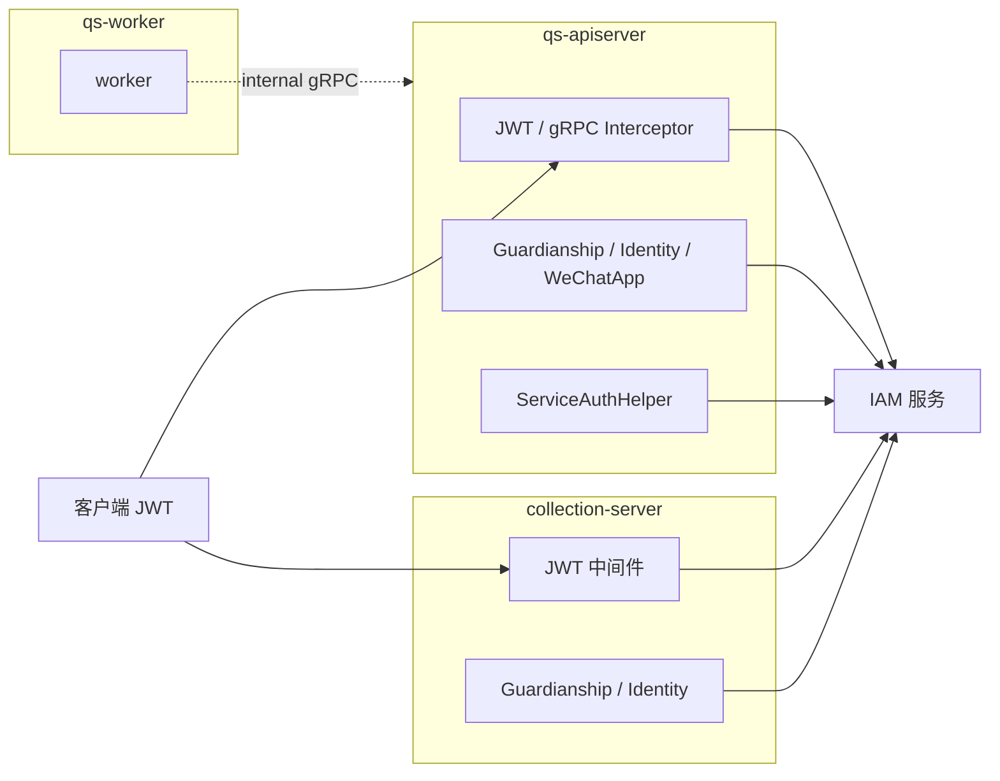

# IAM 与认证

本文档按 [CONTRIBUTING-DOCS.md](../CONTRIBUTING-DOCS.md) 的讲解维度组织。**端到端身份链路与运行时顺序**见 [01-运行时/05-IAM认证与身份链路.md](../01-运行时/05-IAM认证与身份链路.md)；本文固定 **IAM 在仓库中的接入形态**、**与用户态/服务态两套语义**及 **Verify 要点**。

---

## 30 秒了解系统

### 概览

**IAM 不是**本仓库第四个进程，而是 **apiserver / collection-server** 引入的**外部能力**：JWT 校验（JWKS 本地优先、gRPC 降级）、服务间 token、`Identity` / `Guardianship` 等业务查询、可选 **gRPC mTLS 与身份一致性**。**qs-worker** 一般不直连 IAM，事件处理经 **internal gRPC**：`apiserver` 侧再验。

### 基础设施边界

| | 内容 |
| -- | ---- |
| **负责（摘要）** | 模块装配、Token 验证策略、服务间与用户态分界、与 gRPC 拦截器关系 |
| **不负责（摘要）** | 领域聚合内的 `user_id` 持久化（见 [actor](../02-业务模块/05-actor.md)）；各 REST 的权限矩阵逐条列举 |
| **关联** | [actor](../02-业务模块/05-actor.md) 业务侧 IAM 引用；[01-运行时/05](../01-运行时/05-IAM认证与身份链路.md) |

### 契约入口

- **apiserver**：[`internal/apiserver/container/iam_module.go`](../../internal/apiserver/container/iam_module.go)、[`internal/apiserver/infra/iam/`](../../internal/apiserver/infra/iam/)。
- **collection-server**：[`internal/collection-server/container/iam_module.go`](../../internal/collection-server/container/iam_module.go)、[`internal/collection-server/infra/iam/`](../../internal/collection-server/infra/iam/)。
- **HTTP/gRPC**：[`internal/pkg/middleware/jwt_auth.go`](../../internal/pkg/middleware/jwt_auth.go)、[`internal/pkg/grpc/interceptor_auth.go`](../../internal/pkg/grpc/interceptor_auth.go)。

### 运行时示意图

#### 图说明

**collection** 与 **apiserver** 都需验用户 JWT；**collection → apiserver** 的 gRPC 使用 **服务间认证**（`ServiceAuthHelper`）。**worker** 不重复接 IAM 用户态。

### 主要代码入口（索引）

| 关注点 | 路径 |
| ------ | ---- |
| apiserver IAM 模块 | [internal/apiserver/container/iam_module.go](../../internal/apiserver/container/iam_module.go) |
| collection IAM 模块 | [internal/collection-server/container/iam_module.go](../../internal/collection-server/container/iam_module.go) |
| 共享拦截器 | [internal/pkg/grpc/interceptor_auth.go](../../internal/pkg/grpc/interceptor_auth.go) |

---

## 核心设计

### 核心契约：JWT、JWKS 与配置键（Verify）

| 能力 | 配置面（键名层级） | 行为摘要 |
| ---- | ------------------ | -------- |
| IAM gRPC | `iam.grpc.*` | 远程验证、业务查询客户端 |
| JWT 声明 | `iam.jwt.*` | issuer、audience、algorithms、required claims |
| JWKS | `iam.jwks.*` | 公钥拉取、刷新、缓存 TTL |
| 总开关 | `iam.enabled` | 关闭时整体退化路径（以代码为准） |

**Verify**：以各进程 **`configs/*.yaml` + `Options` 绑定** 为准；修改后对照 [05-配置体系](./05-配置体系.md) 与运行时日志。

**验证顺序**（`TokenVerifier`）：**本地 JWKS 验签优先** → **远程 gRPC 验证降级**，减少 IAM 在线依赖。

### 核心模式：用户态与服务态

| 语义 | 用途 | 典型入口 |
| ---- | ---- | -------- |
| **用户态 JWT** | 小程序/后台用户请求 | Gin 中间件、gRPC `authorization` metadata |
| **服务间认证** | `collection-server → apiserver`、与其它服务 | `ServiceAuthHelper` |

二者都依赖 IAM SDK，但**解决的问题不同**：「令牌声明是否可信」vs「调用方服务身份」。

### 核心模式：gRPC 与可选 mTLS

`IAMAuthInterceptor`（见 [interceptor_auth.go](../../internal/pkg/grpc/interceptor_auth.go)）典型步骤：提取 `authorization` → `TokenVerifier` 验 JWT → 若开启 **`RequireIdentityMatch`**，再比对 **JWT 服务身份与 mTLS 证书身份** → 注入 context。**mTLS 不是**所有 gRPC 的默认前提，由配置开启。

### 核心模式：internal gRPC（apiserver 侧）

- **拦截器链顺序**（ Unary）：Recovery → RequestID → Logging →（可选）mTLS Identity →（可选）**IAMAuth** →（可选）ACL →（可选）Audit，见 [server.go `buildUnaryInterceptors`](../../internal/pkg/grpc/server.go)。
- **`grpc.auth.enabled`**：为 `true` 且注入了 `TokenVerifier` 时挂载 `IAMAuthInterceptor`；否则跳过认证（或仅打 warn）。
- **默认跳过认证**：gRPC **Health**、**Reflection**（前缀匹配），见 `NewIAMAuthInterceptor` 内 `skipMethods`；**业务 RPC 不在默认白名单**，需带 JWT 或运行时扩展 `AddSkipMethod`。
- **worker → apiserver**：[`InternalClient`](../../internal/worker/infra/grpcclient/internal_client.go) 调用 **未**附加 `authorization` metadata；[`Manager`](../../internal/worker/infra/grpcclient/manager.go) 仅 TLS/mTLS 传输凭证。故 **生产若开启 `grpc.auth.enabled`**，需 **PerRPC 注入服务 JWT** 或调整拦截器/白名单；示例 [`configs/apiserver.dev.yaml`](../../configs/apiserver.dev.yaml) 中 **`auth.enabled: false`** 与当前客户端行为一致。

### 与 [01-运行时/05-IAM认证与身份链路.md](../01-运行时/05-IAM认证与身份链路.md) 对照

| 主题 | 01-运行时/05（运行时顺序） | 本文档（仓库接入与 Verify） |
| ---- | --------------------------- | --------------------------- |
| IAM 是否独立进程 | 明确否，横切能力 | 同左；模块装配与配置键 |
| HTTP JWT | `JWTAuthMiddleware` → 各进程 `UserIdentityMiddleware` | 共享 [`jwt_auth.go`](../../internal/pkg/middleware/jwt_auth.go)；进程差异见 05 |
| gRPC JWT | metadata `authorization` → `IAMAuthInterceptor` | 同上 + **`grpc.*` 与 mTLS/ACL 开关**、**skip 列表** |
| collection → apiserver gRPC | 服务间调用、监护与业务查询 | **ServiceAuthHelper**（服务态）；与 HTTP 用户 JWT 区分 |
| worker | 不持 IAM 模块；依赖 apiserver gRPC 是否鉴权 | **internal 调用当前无 JWT**；与 05「依赖 gRPC 是否开启认证」一致 |
| 配置 Verify | `iam.*` 影响验签与缓存 | 同左 + 对照 [05-配置体系](./05-配置体系.md) |

### 核心代码锚点索引

| 关注点 | 路径 | 说明 |
| ------ | ---- | ---- |
| Identity / Guardianship | [internal/apiserver/infra/iam](../../internal/apiserver/infra/iam) | 监护关系、用户资料补全 |
| WeChatApp | apiserver 侧装配 | collection 模块通常不初始化（见原架构说明） |

---

## 边界与注意事项

- **IAM ≠ 第四进程**；文档与架构图勿与三进程并列。  
- **Claims / Principal** 停在中间件与 context，**不**当领域聚合内不变量（见 [actor](../02-业务模块/05-actor.md)）。  
- **启用 IAM ≠ 每条路径强依赖 IAM 在线**（存在降级与兼容分支）。  
- **worker**：不逐条消息验用户 JWT 是**有意收敛**；身份与授权在 apiserver 内 gRPC 侧处理。

---

*写作约定见 [CONTRIBUTING-DOCS.md](../CONTRIBUTING-DOCS.md)。*
