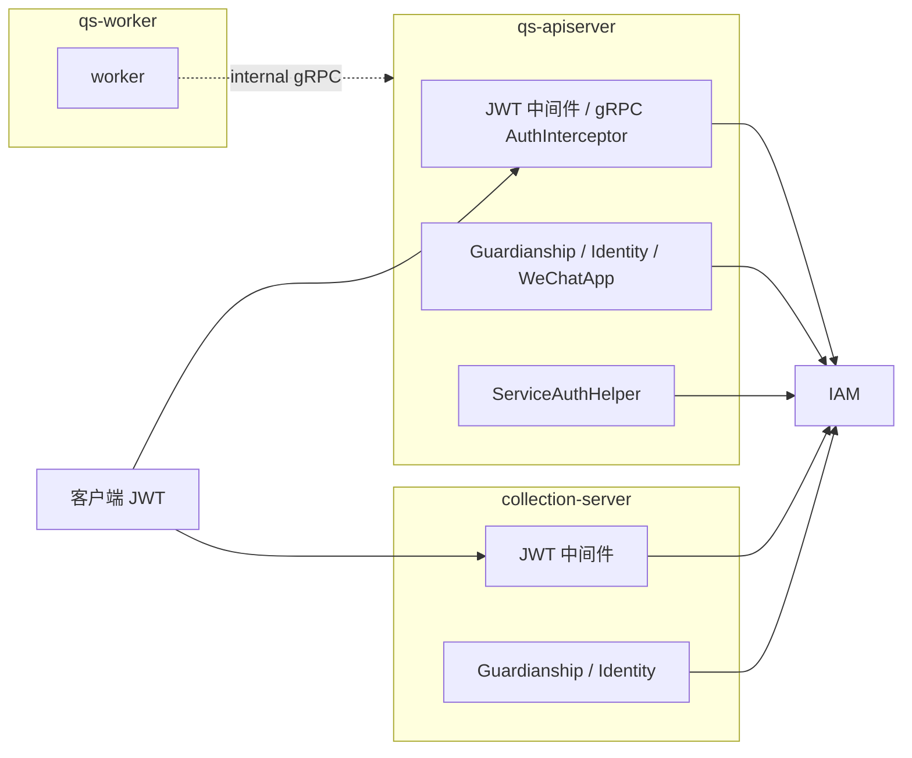

# IAM 与认证

本文介绍 `qs-server` 当前的 IAM 接入方式、认证能力和服务间身份机制。

## 30 秒了解系统

在当前实现里，IAM 不是仓库内的第四个运行时进程，而是一组被 `apiserver` 和 `collection-server` 引入的外部基础设施能力。

这组能力主要包括：

- JWT 验证
- JWKS 本地验签
- IAM gRPC 远程降级验证
- 服务间认证 token
- 监护关系与用户身份查询
- 可选的 mTLS 身份校验

`worker` 当前基本不直接对接 IAM；它的主工作是消费事件，再通过 internal gRPC 回调 `apiserver`。

核心代码入口：

- [../../internal/apiserver/container/iam_module.go](../../internal/apiserver/container/iam_module.go)
- [../../internal/collection-server/container/iam_module.go](../../internal/collection-server/container/iam_module.go)
- [../../internal/apiserver/infra/iam](../../internal/apiserver/infra/iam)
- [../../internal/collection-server/infra/iam](../../internal/collection-server/infra/iam)
- [../../internal/pkg/grpc/interceptor_auth.go](../../internal/pkg/grpc/interceptor_auth.go)
- [../../internal/pkg/middleware/jwt_auth.go](../../internal/pkg/middleware/jwt_auth.go)

## 核心架构

## 核心设计原则

- IAM 能力通过模块化接入，而不是把 IAM 逻辑直接塞进业务 Handler。
- Token 验证优先走本地 `JWKS`，远程 IAM 验证作为降级路径。
- 服务间调用与用户态调用分开建模：前者走 `ServiceAuthHelper`，后者走 JWT claims。
- `Principal`、JWT claims 和会话态停留在中间件或拦截器层，不进入领域模型。
- `mTLS` 解决的是服务身份可信性，JWT 解决的是令牌语义和声明验证，两者并不互相替代。

## IAM 模块提供什么

### apiserver

`apiserver` 的 `IAMModule` 当前会按配置初始化这些能力：

- `Client`
- `TokenVerifier`
- `ServiceAuthHelper`
- `IdentityService`
- `GuardianshipService`
- `WeChatAppService`

因此它既能做用户态认证，也能做服务间认证和业务查询补充。

### collection-server

`collection-server` 的 `IAMModule` 当前会初始化：

- `Client`
- `TokenVerifier`
- `ServiceAuthHelper`
- `IdentityService`
- `GuardianshipService`

它没有 `WeChatAppService`，因为这块能力属于 `apiserver` 侧更靠近业务装配的位置。

## JWT、JWKS 与远程降级

### 本地验签优先

`TokenVerifier` 当前统一封装了 IAM SDK 的 `auth.TokenVerifier`。验证策略优先顺序是：

1. 本地 `JWKS` 验签
2. 远程 gRPC 验证降级

这意味着：

- 正常情况下，令牌验证不必每次都打 IAM
- IAM 仍然保留远程兜底验证通道

### 背后的配置面

IAM 认证当前主要依赖四类配置：

- `iam.enabled`
- `iam.grpc.*`
- `iam.jwt.*`
- `iam.jwks.*`

其中：

- `grpc`
  - 负责对接 IAM gRPC 服务
- `jwt`
  - 负责 issuer、audience、algorithms、required claims
- `jwks`
  - 负责公钥地址、刷新间隔和缓存 TTL

## gRPC 认证与 mTLS

`internal/pkg/grpc/IAMAuthInterceptor` 当前负责 gRPC 入口认证，它会做这几件事：

1. 从 metadata 提取 `authorization`
2. 用 IAM SDK 的 `TokenVerifier` 验证 JWT
3. 如果开启了 `RequireIdentityMatch`，再校验 JWT 中的服务身份与 mTLS 证书身份是否一致
4. 把用户信息注入 context

这说明 gRPC 认证链当前是“JWT 语义校验 + 可选 mTLS 身份一致性校验”的组合。

## 关键设计点

### 1. IAM 接入是模块化的，不是散落式的

`IAMModule` 把：

- client 初始化
- token verifier 初始化
- service auth 初始化
- identity / guardianship / wechat app service 初始化

统一收进一个容器模块里。这样做的好处是：

- 认证和 IAM 集成有单一装配点
- 运行时可以按服务差异选择接入哪些 IAM 能力
- 关闭 IAM 时可以整体退化，而不是到处留判断

### 2. 本地 JWKS 验签是主路径，远程验证是降级路径

这套顺序解决的是两个目标：

- 正常情况下减少 IAM 网络调用开销
- IAM 或 JWKS 局部波动时，仍保留远程校验兜底

因此 `qs-server` 当前并不是“每个请求都依赖 IAM 在线校验”的设计。

### 3. 服务间认证和用户态认证是两套语义

`ServiceAuthHelper` 面向的是服务身份：

- `collection-server -> apiserver`
- 其他 QS 服务 -> IAM

JWT claims 面向的是用户或服务令牌本身的声明验证。两者虽然都依赖 IAM，但职责并不相同：

- 一个解决“我是谁这个服务”
- 一个解决“这个 token 是否可信、带了什么声明”

### 4. 监护关系和用户身份查询是 IAM 集成的重要组成部分

`qs-server` 接 IAM 不只是为了验 Token。当前业务里，`GuardianshipService` 和 `IdentityService` 也很关键：

- `collection-server` 依赖它判断当前用户是否有权替某个孩子填报
- `apiserver` 依赖它补全后台查看时的监护关系和用户资料

因此 IAM 同时承担了认证层和业务辅助查询层的角色。

### 5. worker 基本不直接接 IAM，是有意收敛

`worker` 当前主工作是：

- 消费 MQ 事件
- 调 internal gRPC
- 使用 Redis 做锁和幂等

它没有被设计成“每处理一条消息都自己验 IAM”。这让异步执行层保持更简单，也避免把用户态身份链路带进事件消费者。

## 边界与注意事项

- `IAM` 是外部依赖，不是本仓库内独立运行时；写文档时不应把它与 `apiserver / collection-server / worker` 并列成第四个进程。
- JWT claims 和当前请求用户上下文只停留在接口层，不属于 `actor`、`survey` 等领域模型。
- `mTLS` 只在开启相关配置时参与 gRPC 身份一致性检查，不应默认理解为所有 gRPC 调用都在做双重校验。
- 即使启用了 IAM 集成，仓库中仍保留了部分降级和兼容逻辑；因此“接了 IAM”不等于所有路径都强依赖 IAM 在线可用。
- 运行时链路层面的 IAM 参与方式，建议同时参考 [../01-运行时/05-IAM认证与身份链路.md](../01-运行时/05-IAM认证与身份链路.md)。
