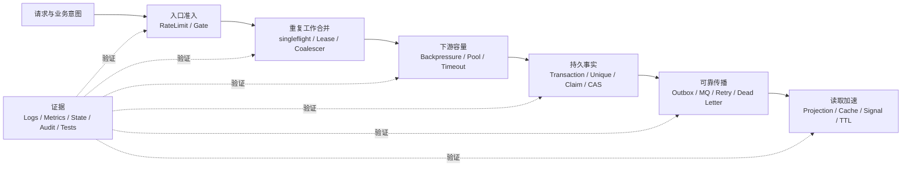
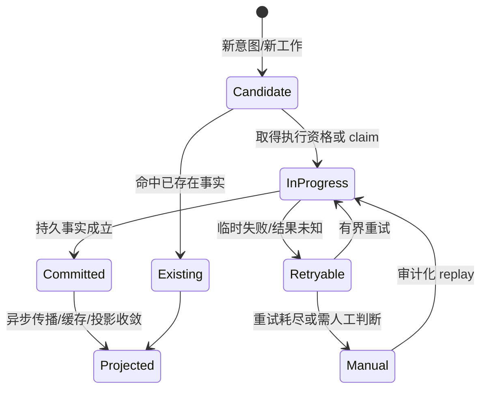

# 基础设施统一模型与推理方法

这不是一张组件清单，而是一套用来分析 qs-server 基础设施问题的方法。后续 Cache、Event、Concurrency 文档都沿用本页的概念、推理顺序和证据标准。

## 1. 先给出统一结论

一次请求从到达到产生可查询结果，会依次经过七类问题：



这七层并非每条链都必须完整经过，但顺序揭示了一个关键原则：

> 靠前的机制负责少做工作、尽早拒绝和降低代价；靠后的持久机制负责决定什么事实可以被系统承认。优化层失效时，正确性必须仍能由事实层收敛。

因此：

- RateLimit、Gate 和 Backpressure 不能裁决一个业务意图是否已经成功；
- singleflight、Redis lease 和 Signal 不能代替数据库唯一约束、事务或状态机；
- Outbox 不能保证业务处理 exactly-once，只能把“业务事实已提交”和“事件最终可出站”绑定在同一事实边界；
- Cache 不能拥有业务事实，命中、miss 和失效都只改变读取成本或新鲜度；
- metrics、snapshot 和 readiness 是观测证据，不是业务完成证明。

## 2. 六个必须分开的概念

### 2.1 请求尝试（request attempt）

一次 HTTP/gRPC 调用。`request_id` 用来串联这次尝试的日志和跨服务调用。网络超时后重试，通常是新的请求尝试，也应有新的 `request_id`。

### 2.2 业务意图（business intent）

用户想完成的一次业务动作，例如“提交这份答卷”。同一意图的网络重试必须复用稳定的 `idempotency_key`。它和 `request_id` 不是同一个生命周期。

### 2.3 内容身份（content identity）

幂等 key 只能说明调用方声称“这是同一意图”，不能证明内容相同。canonical fingerprint 用来区分：

- 同 key、同内容：重复投递同一意图；
- 同 key、不同内容：调用方把同一 key 用在了两个意图上。

客户端指纹可以帮助前端稳定重试，但服务端只有基于实际收到内容计算并随事实持久化的指纹，才能参与最终裁决。

### 2.4 协调资格（coordination eligibility）

singleflight、lease、leader election、Signal 回答“谁先做”“谁可以少等一会儿”“谁应被唤醒”。它们通常可过期、可丢失或可降级，因此不能回答“谁的业务结果最终有效”。

### 2.5 持久事实（durable fact）

transaction、unique constraint、claim、CAS、version/fencing 回答“系统最终承认了什么”。事实必须跨进程、跨实例、跨重启成立，并有稳定的读取路径。

### 2.6 派生读取与观测证据（derived read and evidence）

Cache、projection、ready-index、Signal、metrics 和 runtime snapshot 是事实的派生物。它们可以加速判断或帮助排障，但必须明确：

- 派生物的事实源在哪里；
- 丢失后怎样回源或重建；
- 陈旧时怎样收敛；
- “不可用”是否会被错误解释成“空、零、健康或完成”。

## 3. 四个平面，而不是一个 Redis 平面

同一个 Redis 集群可以同时承载不同语义，不能因为物理组件相同就混为一谈。

| 平面 | 典型数据 | 允许的失败语义 | 不允许承担的责任 |
| --- | --- | --- | --- |
| 业务事实平面 | AnswerSheet、Assessment、Outcome、Report | 失败时不能确认成功 | 不能由 Cache/Signal 代替 |
| 可靠协作平面 | Outbox、delivery、dead letter、retry hold、checkpoint | 必须可恢复、可审计 | 不能只存于 Pub/Sub 或内存 |
| 运行时协调平面 | rate bucket、lease、cache、ready-index、Signal | 可按 workload 降级或重建 | 不能决定业务唯一性 |
| 观测与治理平面 | metrics、snapshot、operator action audit | 可以部分缺失，但必须显式 unknown | 不能把观测值当业务事实 |

划分平面的目的不是按数据库分组，而是先确定丢失代价和恢复责任。设计 fail-open/fail-closed 时，问的也不是“Redis 能不能挂”，而是“这项 Redis 能力失效后，放行和拒绝各自会造成什么业务损失”。

## 4. 三类不变量

### 4.1 安全性不变量：不能发生什么

例：

- 同一 `writer_id + idempotency_key` 不能产生两个互相冲突的 AnswerSheet 事实；
- 一个事件不能在没有 durable settlement 证据时被当成已完成；
- 缓存 miss 或 Redis 故障不能扩大用户权限；
- 失去 lease 的旧 owner 不能在强互斥场景中继续提交可接受结果。

安全性不变量通常必须由 transaction、unique constraint、claim、CAS、ownership check 或 fencing 在最终写入点保证。

### 4.2 活性不变量：最终必须发生什么

例：

- 已与业务事实同事务落盘的 Outbox 最终应被 relay 发现；
- Signal 丢失后，轮询或 durable readback 仍应让等待者收敛；
- Cache 失效消息丢失后，TTL 最终应淘汰旧值；
- retry 耗尽后必须进入可查询、可重放或 `manual_required` 状态，不能无限消失在日志里。

活性必须包含时间、重试上限和终态。只说“会重试”没有定义系统。

### 4.3 容量不变量：最多允许多少工作进入哪一层

例：

- RateLimit 限制时间窗口内的到达速率；
- Gate 限制某类路由在本进程中的在途请求；
- Backpressure 限制发往某个依赖的并发操作；
- driver pool 限制实际连接；
- timeout 限制等待或执行占用的时间。

这些量的单位和 scope 不同，不能合并成一个“并发数”。

## 5. 从失败窗口推导机制

基础设施设计不是先选 Redis、MQ 或锁，而是先枚举“事实与副作用之间有哪些断点”。

### 5.1 同步写入的典型窗口

```text
收到请求
  → 校验
  → 写业务事实
  → 返回响应
```

- 写前失败：没有事实，可以重试；
- commit 明确失败：没有成功承诺，可以重试；
- commit 成功、响应丢失：客户端不知道结果，必须以同一幂等 key 回读；
- commit outcome unknown：服务端也不知道，先用持久回读恢复；仍无法确认时返回未确认状态，不能猜测成功。

这推导出 `idempotency_key + fingerprint + unique constraint + durable readback`，而不是推导出“加一把 Redis 锁”。

### 5.2 业务写入与消息发布的典型窗口

```text
写业务事实
  → 发布 MQ
```

- 先写 DB 后发布：DB 成功、publish 失败会漏事件；
- 先 publish 后写 DB：consumer 可能看到不存在或最终回滚的事实；
- 分布式事务：能绑定两边，但复杂度、可用性和组件支持成本高；
- Transactional Outbox：业务事实与待发布意图本地原子提交，再异步发布，接受 at-least-once 并要求消费幂等。

这解释了为什么 Outbox 是本地事务问题的答案，而不是 MQ 本身的“可靠开关”。

### 5.3 事实与缓存更新的典型窗口

```text
更新 DB
  → 更新或删除 Cache
```

两者无法天然原子。当前体系选择让 DB/read model 拥有事实，Cache 通过写后失效、Signal 和 TTL 收敛。若业务需要单调读、read-your-write 或零陈旧窗口，就必须明确增加版本、同步失效确认或改用其他读取模型，不能只把 TTL 调短。

## 6. 一套通用状态机

HTTP 重试、Outbox delivery、Cache 刷新和治理 action 表面不同，都可以用同一组问题审查：



审查每个状态机时必须回答：

1. 状态记录在哪里，是否跨重启？
2. 谁能推进状态，靠什么 claim/CAS 防止并发推进？
3. 哪些错误可重试，退避和上限是什么？
4. 哪个状态允许向调用方承诺成功？
5. 终态能否查询、审计和人工恢复？
6. 重复 delivery 或请求如何回放已有结果？

## 7. 状态码是协议结论，不是异常翻译

在可靠提交链中：

| 状态 | 表达的结论 | 客户端动作 |
| --- | --- | --- |
| 202 | 当前业务事实与 Outbox 已 durable；后续处理仍异步 | 保存业务 ID，查询后续状态 |
| 409 | 同一幂等 key 已绑定不同内容，协议冲突 | 停止用该 key 重试这份新内容 |
| 429 | 时间预算或入口在途容量暂时不足 | 按 `Retry-After` 退避，复用原 key |
| 503 | 服务未能确认本次结果或依赖不可用 | 退避并复用原 key，借持久回读收敛 |

两个常见误区：

- “发现重复就返回 429”：把业务幂等与流量控制混淆；
- “503 表示一定没有写入”：忽略 commit-unknown 窗口，可能让客户端换 key 制造第二个事实。

其他路由可以有不同协议。例如 wait-report Gate 饱和时返回 `200 pending`，因为等待只是优化，报告事实没有被改写。状态码必须从该链路的不变量推导，不能全局机械统一。

## 8. 机制选择矩阵

| 机制 | 回答的问题 | 典型 scope | 故障后的正确性来源 | 不适合解决 |
| --- | --- | --- | --- | --- |
| RateLimit | 一段时间允许多少到达 | 进程或 Redis 跨实例 | 下游 Gate/事实层 | 在途并发、业务幂等 |
| Gate | 当前允许多少请求执行/等待 | 单进程、按路由 | 下游事实层 | 集群总 QPS、DB 最终容量 |
| Backpressure | 当前允许多少依赖操作 | 单进程、按依赖 | DB/远端事实层 | 客户端公平性、业务唯一性 |
| Pool | 允许多少物理连接/worker | driver/进程 | 存储约束 | 过早拒绝、跨依赖预算 |
| singleflight | 同进程同 key 是否只回源一次 | 单进程 | DB/read model | 跨实例合并、持久幂等 |
| Redis lease | 谁暂时取得执行资格 | 跨实例、TTL 内 | unique/CAS/fencing | 最终互斥证明 |
| Signal/PubSub | 谁应尽快醒来或刷新 | 在线订阅者 | durable readback/周期 reconcile | 持久交付、事实保存 |
| Transactional Outbox | 业务事实与出站意图能否原子成立 | 单个本地存储事务 | Outbox + relay | 消费 exactly-once |
| Unique/Claim/CAS | 谁的事实或状态推进有效 | 权威存储全局 | 自身 | 削峰、降低重复成本 |
| Cache | 能否更便宜地读取派生值 | L1 进程/L2 Redis | DB/read model | 主事实、授权放大 |

如果一个方案同时声称解决表中五六个问题，通常是责任边界没有拆开。

## 9. 方案演化：从“能工作”到“可证明”

以下演化不是按组件复杂度升级，而是按失败模型逐步补齐。

### 9.1 重复提交治理

| 阶段 | 方案 | 解决了什么 | 仍然缺什么 |
| --- | --- | --- | --- |
| A | 只校验请求并直接保存 | 正常路径可用 | 超时重试可能重复写 |
| B | `request_id` 去重 | 同一次传输尝试可追踪 | 新 request ID 的同意图重试仍重复 |
| C | 稳定 idempotency key + unique | 同一意图只能建立一个 key 事实 | key 被复用到不同内容时会静默混淆 |
| D | key + server fingerprint + durable readback | 区分重复与冲突，并恢复 commit-unknown | 并发重复仍会展开昂贵校验和事务竞争 |
| E | SubmitCoalescer + completion signal | 跨实例合并昂贵工作 | Redis 仍不能成为正确性来源 |

当前实现位于 E，但正确性仍由 D 保证。关闭或失去 Coalescer，只应退化效率，不应退化幂等语义。

### 9.2 异步传播治理

| 阶段 | 方案 | 主要问题 |
| --- | --- | --- |
| A | 业务代码直接 publish | DB 与 MQ 之间有双写窗口 |
| B | Outbox + relay | 解决可靠发现，但会重复发布 |
| C | at-least-once + consumer 幂等/claim | 重复可收敛，但失败可能无限重试 |
| D | attempt、hold、dead letter、manual replay | 失败成为可查询状态，需要治理权限与审计 |

当前文档不把 D 写成“重试配置”，而把它视为一组持久状态机。

### 9.3 缓存治理

| 阶段 | 方案 | 主要问题 |
| --- | --- | --- |
| A | 直接 Cache-Aside | 穿透、击穿、雪崩与配置漂移 |
| B | negative cache + singleflight + TTL jitter | 降低回源放大，但多实例 L1 仍可能陈旧 |
| C | 写后失效 + Signal + TTL | 更快收敛，但 Signal 丢失仍依赖 TTL |
| D | capability registry + runtime snapshot + warmup governance | 能统一配置和运营，但 registry 仍不是业务事实 |

是否进入更强一致性方案，应由陈旧窗口的业务损失决定，而不是因为“Redis 支持更多特性”。

## 10. 证据驱动的决策闭环

一个基础设施结论至少要经过以下闭环：

```text
问题与损失
  → 不变量
  → 候选机制与失败窗口
  → 当前选择及其代价
  → 代码/配置/契约事实
  → 指标、测试、故障注入或压测证据
  → 重新决策条件
```

### 10.1 证据强度

| 证据 | 能证明什么 | 不能证明什么 |
| --- | --- | --- |
| unit/contract test | 局部行为、注册表和配置契约 | 真实依赖与多实例时序 |
| integration test | 存储约束、事务和 adapter 协作 | 生产拓扑与容量 |
| K6/故障注入 | 特定负载和故障假设下的行为 | 所有生产流量分布 |
| runtime metrics/snapshot | 某窗口中系统发生了什么 | 未观测路径和长期安全性 |
| durable state/audit | 最终事实、结算与动作结果 | 为什么发生、性能是否健康 |

“配置是 300 QPS”“测试通过”“指标为零”都不是独立的架构验收结论。必须说明 scope、时间窗口、流量模型和不可观测部分。

### 10.2 重新决策条件

文档中的当前方案不是永久答案。满足以下任一条件时，应重新走完整推理链：

- 业务不变量变化，例如从“最终一致”升级为“读己之写”；
- 进程或实例拓扑变化，使本地预算不再代表安全集群预算；
- 新旁路绕过共享 Backpressure、Outbox 或权限链；
- P99、timeout、reject、dead letter、cache staleness 等证据持续越过阈值；
- Redis/MQ/DB 的故障损失模型变化；
- 人工恢复频率表明自动状态机的终态设计不足。

## 11. 后续专题如何使用本页

- [Concurrency / Resilience](./concurrency/README.md) 重点研究“到达—在途—协调—事实裁决”，从流量方程走到可靠提交与租约。
- [Event](./event/README.md) 重点研究“事实—出站意图—投递—业务结算—恢复”，把每次重试放进持久状态机。
- [Cache](./cache/README.md) 重点研究“事实—派生值—新鲜度—回源放大—失效收敛”，明确每项 capability 的业务损失。
- [Data Access](./data-access/README.md) 回答本地事务、唯一约束、claim/CAS 和多存储所有权。
- [Observability](./observability/README.md) 回答每个结论需要什么证据，而不是只列指标名称。
- [Runtime](./runtime/README.md) 回答机制如何被三个 composition root 真正装配、启动与停止。
- [Security](./security/README.md) 回答谁有权读取事实、推进状态和执行恢复动作。

读任何专题时，都可以用七个问题复述一遍：事实是什么、谁拥有、优化层是什么、断点在哪里、失败后怎样收敛、用什么证据证明、何时重新决策。
