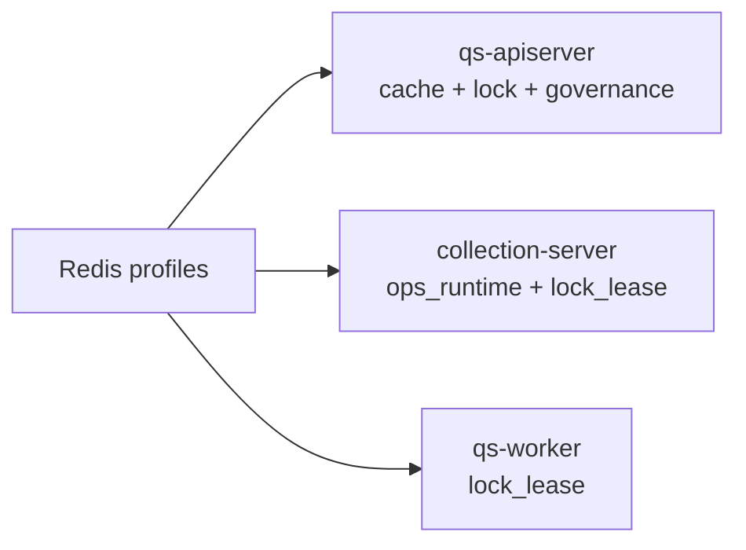

# Redis 当前使用情况

**本文回答**：`qs-server` 当前三进程怎样使用 Redis、使用哪些 family、暴露哪些治理接口；详细架构与模型请进入 [Redis 深讲目录](./redis/README.md)。

## 30 秒结论

| 维度 | 当前结论 |
| ---- | -------- |
| apiserver | 完整 Redis Cache、Cache Governance、scheduler lock、SDK token cache |
| collection-server | `ops_runtime + lock_lease`，用于限流、提交幂等和 in-flight guard |
| worker | `lock_lease`，用于事件处理重复抑制 |
| 不做的事 | collection-server 不做领域读缓存；worker 不做 object/query cache |
| 深讲入口 | runtime 看 [redis/01](./redis/01-运行时与Family模型.md)，排障看 [redis/08](./redis/08-观测降级与排障.md) |

## 三进程使用表



| 进程 | Family | 代码入口 |
| ---- | ------ | -------- |
| `qs-apiserver` | `static_meta/object_view/query_result/meta_hotset/sdk_token/lock_lease` | [internal/apiserver/process/resource_bootstrap.go](../../internal/apiserver/process/resource_bootstrap.go)、[cachebootstrap/subsystem.go](../../internal/apiserver/cachebootstrap/subsystem.go) |
| `collection-server` | `ops_runtime/lock_lease` | [internal/collection-server/process/resource_bootstrap.go](../../internal/collection-server/process/resource_bootstrap.go)、[redisops/submit_guard.go](../../internal/collection-server/infra/redisops/submit_guard.go) |
| `qs-worker` | `lock_lease` | [internal/worker/process/resource_bootstrap.go](../../internal/worker/process/resource_bootstrap.go)、[answersheet_handler.go](../../internal/worker/handlers/answersheet_handler.go) |

## Family 清单

| Family | 使用方 | 用途 |
| ------ | ------ | ---- |
| `static_meta` | apiserver | 量表、问卷、已发布量表列表 |
| `object_view` | apiserver | assessment detail、testee、plan |
| `query_result` | apiserver | assessment list、statistics query |
| `meta_hotset` | apiserver | version token、hotset、warmup metadata |
| `sdk_token` | apiserver | 微信 SDK token/ticket |
| `lock_lease` | 三进程 | Redis lease lock |
| `ops_runtime` | collection-server | 限流、submit guard、短期操作状态 |

## 治理接口

| 进程 | 接口 | 说明 |
| ---- | ---- | ---- |
| apiserver | `GET /readyz`、`GET /governance/redis` | readiness 与 Redis family snapshot |
| apiserver | `GET/POST /internal/v1/cache/governance/*` | cache governance status、hotset、manual warmup、repair complete |
| collection-server | `GET /readyz`、`GET /governance/redis` | runtime family snapshot |
| worker | `GET /readyz`、`GET /governance/redis`、`GET /metrics` | worker observability |

代码锚点：

- [internal/apiserver/transport/rest/registrars.go](../../internal/apiserver/transport/rest/registrars.go)
- [internal/apiserver/transport/rest/routes_statistics.go](../../internal/apiserver/transport/rest/routes_statistics.go)
- [internal/collection-server/transport/rest/router.go](../../internal/collection-server/transport/rest/router.go)
- [internal/worker/observability/metrics_server.go](../../internal/worker/observability/metrics_server.go)

## 深讲回链

- 整体架构：[redis/00-整体架构.md](./redis/00-整体架构.md)
- 运行时与 family：[redis/01-运行时与Family模型.md](./redis/01-运行时与Family模型.md)
- Cache 层：[redis/02-Cache层总览.md](./redis/02-Cache层总览.md)
- Lock 层：[redis/06-Redis分布式锁层.md](./redis/06-Redis分布式锁层.md)
- Governance：[redis/07-缓存治理层.md](./redis/07-缓存治理层.md)
- 排障：[redis/08-观测降级与排障.md](./redis/08-观测降级与排障.md)

## Verify

```bash
python scripts/check_docs_hygiene.py
```

---

*写作约定见 [CONTRIBUTING-DOCS.md](../CONTRIBUTING-DOCS.md)。*
