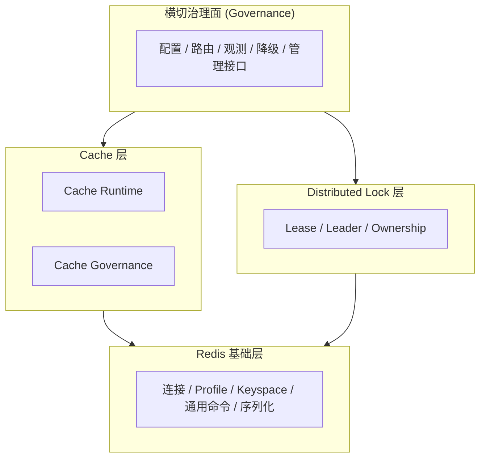

# Redis 分层重构设计

**本文回答**：基于 `qs-server` 当前 Redis 代码现状，如何把 Redis 体系重新设计成更清晰的四个部分：**Redis 基础层**、**Cache 层**、**Distributed Lock 层**、**横切治理面**；每一层各自负责什么、不负责什么、应该落在什么目录、后续如何渐进迁移。

## 30 秒结论

如果只看一屏，先记住下面这张表：

| 层次 | 目标职责 | 当前主要锚点 | 设计结论 |
| ---- | -------- | ------------ | -------- |
| **Redis 基础层** | 连接、profile、keyspace、基础命令、序列化/压缩等通用能力 | `component-base/pkg/redis`、`component-base/pkg/database`、[`internal/pkg/options/redis_options.go`](../../internal/pkg/options/redis_options.go)、[`internal/pkg/rediskey/`](../../internal/pkg/rediskey/) | 与业务语义彻底解耦，作为所有 Redis 使用形态的底座 |
| **Cache 层** | 把 Redis 当缓存：read-through、对象缓存、query cache、version token、本地热缓存 | [`internal/apiserver/infra/cache/`](../../internal/apiserver/infra/cache/)、[`internal/apiserver/infra/statistics/cache.go`](../../internal/apiserver/infra/statistics/cache.go) | 与分布式锁平行，不再把 lock 混入“缓存治理”语境 |
| **Distributed Lock 层** | 把 Redis 当租约锁：排他、选主、幂等闸门、token ownership | [`internal/pkg/redislock/`](../../internal/pkg/redislock/)、worker 中各类 lease 使用点 | 单独建模，避免与 TTL/预热/失效等缓存概念混淆 |
| **横切治理面** | 配置、路由、观测、降级、管理接口 | `catalog`、`cachegovernance`、family status、进程启动时的 Redis 解析逻辑 | 是“平台治理面”，横跨 cache 与 lock，但不承载业务缓存本身 |

**设计总原则**：  
Redis 在 `qs-server` 中不是一个单一子系统，而是**多种资源语义共用同一基础设施**。今后的设计应始终先区分“这是缓存，还是锁，还是治理”，再讨论 Redis。

---

## 1. 设计目标与非目标

## 1.1 目标

本次重构设计希望解决四类混乱：

1. **基础能力与业务语义混杂**：连接/profile/keyspace 与问卷/量表缓存对象逻辑混在同一认知层。
2. **缓存与锁概念混杂**：都使用 Redis，但缓存关注命中/失效，锁关注排他/租约/ownership，两者不应放在同一设计面内讨论。
3. **治理能力与运行能力混杂**：warmup/hotset/status/family route 等平台治理逻辑，与实际 `Get/Set/ReadThrough` 执行逻辑边界不够清晰。
4. **文档与代码理解路径不清**：排查 Redis 问题时，不容易快速判断应先去看 Foundation、Cache、Lock 还是 Governance。

## 1.2 非目标

本设计文档**不是**以下内容：

- 不是立即改写所有 Redis 代码的实施 PR。
- 不是重新定义 Redis key 业务语义。
- 不是要求把所有能力都上移到 `component-base`。
- 不是引入新中间件或替换 Redis 客户端。

本次先确立**分层模型、目录边界、演进顺序**。

---

## 2. 当前问题总结（基于源码审计）

当前源码里的 Redis 使用已经有比较好的基础，但还存在几处认知和结构层面的耦合：

### 2.1 已有优点

- 已经有统一的 key builder：[`internal/pkg/rediskey/builder.go`](../../internal/pkg/rediskey/builder.go)
- 已经有默认 Redis + named profile 模式：[`internal/pkg/options/redis_options.go`](../../internal/pkg/options/redis_options.go)
- apiserver 已经形成了 `static/object/query/meta/sdk/lock` family
- `component-base` 已经承担了部分 Redis foundation 能力
- worker 锁能力已经有独立包：[`internal/pkg/redislock/`](../../internal/pkg/redislock/)

### 2.2 主要问题

#### 问题 1：`infra/cache` 既像 runtime，又像 governance

例如下面这些关注点目前都散在 `infra/cache` 附近：

- cache runtime：`ReadThrough`、typed cache、对象缓存
- cache policy：TTL、jitter、negative cache、singleflight
- cache governance：catalog、warmup、hotset、metrics、status

这导致“缓存怎么命中”和“缓存如何被治理”在阅读上容易混层。

#### 问题 2：锁是独立语义，但缺少明确的平台层定位

当前 `redislock` 已经独立存在，但整体文档和目录认知上仍容易被当作“Redis 的一个零散功能点”，而不是一个与缓存平行的资源层。

#### 问题 3：profile/family 路由主要服务 cache，但没有抽象成更通用的 Redis 资源治理模型

例如：

- `static_cache`
- `object_cache`
- `query_cache`
- `meta_cache`
- `sdk_cache`
- `lock_cache`

这些本质上已经是“Redis 资源族”的路由，而不只是“缓存目录”的细节。当前设计还可以进一步平台化。

#### 问题 4：运维治理更多偏 cache，lock 缺少对称的治理模型

当前 warmup/status/metrics 等机制主要围绕 cache 展开，而 lock 的状态、失败、退化、选主行为缺少统一治理视角。

---

## 3. 目标分层模型

建议把 `qs-server` 的 Redis 体系固定成下面四层：



### 3.1 基本约束

- **Cache 与 Lock 平行**，都依赖 Redis Foundation。
- **Governance 横跨 Cache 与 Lock**，但不直接承载业务对象缓存或锁语义。
- **Foundation 不知道问卷、量表、计划、选主**这类业务概念。

## 3.2 建模约定：这里的“领域模型”是什么

本文中的“领域模型”“领域服务”不是指 `qs-server` 的业务领域模型，而是指 **Redis 技术子域** 内部应当稳定下来的概念模型。

为避免与业务领域混淆，本文统一采用下面的约定：

| 概念 | 在本文中的含义 |
| ---- | -------------- |
| **实体（Entity）** | 具有身份、状态或生命周期的技术对象，例如 `CacheEntry`、`Lease`、`WarmupRun` |
| **值对象（Value Object）** | 只表达不可变语义的技术对象，例如 `RedisProfile`、`CachePolicy`、`LeaseToken` |
| **聚合（Aggregate）** | 需要以一致性边界整体管理的一组技术对象，例如 `CacheFamily`、`LockResource` |
| **领域服务（Domain Service）** | 体现稳定技术决策流程的服务，例如 `ProfileResolver`、`ReadThroughService`、`LeaderElectionService` |

本文的目标不是把 Redis 写成一套抽象教科书，而是让后续代码重构时，**每层应该有哪些稳定概念、哪些决策逻辑、哪些模式可以出现**都先被文档固化。

---

## 4. Redis 基础层（Foundation）

## 4.1 职责

Redis 基础层只负责以下事情：

- Redis 连接初始化与连接池
- 默认 Redis / named profile 解析
- keyspace / namespace 组合
- 通用 key builder 原语
- 基础命令包装：`GET/SET/DEL/INCR/SCAN/EXPIRE/...`
- 可复用序列化/反序列化、压缩/解压缩
- Redis client 健康检查与底层错误包装

## 4.2 不负责

这一层**不负责**：

- 对象缓存 TTL 策略
- query cache 版本号失效
- warmup / hotset / status 页
- 分布式锁 token ownership
- 任何业务对象（问卷、量表、计划、测评）

## 4.3 当前代码映射

当前已在 Foundation 的能力：

- `component-base/pkg/redis`
- `component-base/pkg/database`
- [`internal/pkg/options/redis_options.go`](../../internal/pkg/options/redis_options.go)
- [`internal/pkg/rediskey/builder.go`](../../internal/pkg/rediskey/builder.go)

## 4.4 目标目录建议

建议将本仓 Redis Foundation 的边界收敛到以下位置：

```text
internal/pkg/
├── rediskey/          # key 规则与 namespace 组合
├── redisruntime/      # 连接/profile/client 解析（建议新增）
└── options/
    └── redis_options.go
```

其中：

- `component-base` 继续承担更通用的外部基础库能力
- `internal/pkg/redisruntime` 仅负责本仓对 `component-base` 的装配与适配

## 4.5 目标接口建议

Foundation 层建议形成类似下面的语义接口：

```go
type RedisProfileResolver interface {
    Resolve(profile string) (redis.UniversalClient, error)
}

type RedisKeyspace interface {
    Prefix(key string) string
}

type RedisCodec interface {
    Marshal(v any) ([]byte, error)
    Unmarshal(data []byte, out any) error
}
```

这些接口服务于上层，但自身不带业务语义。

## 4.6 Foundation 层领域模型

Foundation 层的领域模型只表达“Redis 作为基础设施”的稳定技术概念。

### 聚合与实体

| 类型 | 名称 | 说明 |
| ---- | ---- | ---- |
| 聚合根 | `RedisRuntime` | 进程内可用的 Redis 运行时入口，统一持有 profile resolver、codec、keyspace factory 等能力 |
| 实体 | `RedisClientBinding` | 某个 profile 解析后的实际 client 绑定，包含 profile、address、db、capabilities 等运行信息 |
| 实体 | `RedisCommandResult` | 某次基础命令调用的结果载体，用于统一错误包装、观测埋点与降级判断 |

### 值对象

| 类型 | 名称 | 说明 |
| ---- | ---- | ---- |
| 值对象 | `RedisProfile` | 命名 profile 的稳定标识，如 `static_cache`、`lock_cache` |
| 值对象 | `RedisNamespace` | 根 namespace 或组合后的 keyspace 前缀 |
| 值对象 | `RedisKey` | 经过 builder/keyspace 处理后的最终 key |
| 值对象 | `RedisCodecSpec` | 序列化/压缩能力描述，不带业务对象含义 |
| 值对象 | `RedisConnectionPolicy` | 连接、超时、认证、SSL、cluster 等连接策略 |

### Foundation 层禁止出现的模型

Foundation 层不应出现：

- `QuestionnaireCacheEntry`
- `AssessmentListVersionToken`
- `PlanSchedulerLeader`

这类模型已经带有上层 cache 或 lock 语义。

## 4.7 Foundation 层领域服务

Foundation 层应固化下面这些领域服务：

| 服务 | 职责 |
| ---- | ---- |
| `ProfileResolver` | 根据 profile 名解析出实际 Redis client，并处理 fallback / missing profile 语义 |
| `KeyspaceComposer` | 组合 root namespace、family suffix、业务 key 片段，形成最终 `RedisKey` |
| `CodecService` | 提供 payload 编解码、压缩/解压的统一入口 |
| `CommandExecutor` | 统一执行底层 Redis 命令，并挂上 metrics / tracing / error mapping |
| `HealthProbe` | 执行 ping / capability check / degraded 探测 |

这些服务都属于技术子域服务，目标是避免每个上层模块都自己处理：

- profile 解析
- namespace 拼接
- payload 编码
- client 健康探测

## 4.8 Foundation 层设计模式

Foundation 层应明确采用以下模式：

| 模式 | 用途 |
| ---- | ---- |
| **Adapter** | 适配 `component-base` 与本仓内部调用约定 |
| **Factory / Abstract Factory** | 生成 Redis client、keyspace、codec、runtime handle |
| **Facade** | 给上层暴露简洁稳定的 Redis runtime 能力，而不是让上层直接依赖底层 client 细节 |
| **Strategy** | 在 codec、compression、profile resolution policy 中切换策略 |
| **Value Object** | 统一 profile / namespace / key / codec spec 等不可变技术概念 |

不建议在 Foundation 层使用：

- Decorator 包业务缓存语义
- Template Method 承担 read-through 决策
- Lease/lock token ownership 逻辑

这些都属于上层。

---

## 5. Cache 层

Cache 层负责“把 Redis 当缓存来用”。它应该包含 **Runtime** 与 **Governance** 两个子面。

## 5.1 Cache Runtime

### 职责

- read-through / cache-aside
- typed cache
- object cache
- query result cache
- version token
- local hot cache
- negative cache
- singleflight
- TTL / jitter / compression 应用

### 当前代码映射

- [`internal/apiserver/infra/cache/`](../../internal/apiserver/infra/cache/)
- [`internal/apiserver/infra/statistics/cache.go`](../../internal/apiserver/infra/statistics/cache.go)
- [`internal/apiserver/application/scale/global_list_cache.go`](../../internal/apiserver/application/scale/global_list_cache.go)

### 不负责

- Redis 连接建立
- lock 语义
- 统一管理接口
- 平台健康状态聚合

## 5.2 Cache Governance

### 职责

- family 分类
- family -> profile -> namespace 路由
- warmup / repair
- hotset 采样与回灌
- status / purge / operator API
- cache policy 总表
- degraded family 观测与状态对外暴露

### 当前代码映射

- [`internal/apiserver/infra/cache/catalog.go`](../../internal/apiserver/infra/cache/catalog.go)
- [`internal/apiserver/application/cachegovernance/`](../../internal/apiserver/application/cachegovernance/)
- `warmup.go`
- `hotset.go`

## 5.3 Cache 层目标目录建议

建议未来把 cache 目录显式分成两块：

```text
internal/apiserver/
├── infra/
│   └── cache/
│       ├── runtime/      # ReadThrough、TypedCache、RedisCache、VersionedQueryCache...
│       ├── object/       # scale/questionnaire/assessment_detail/testee/plan 等对象缓存
│       └── query/        # stats query、my assessment list、global list 等 query/list cache
└── application/
    └── cachegovernance/  # catalog、warmup、status、hotset、operator orchestration
```

当前不要求一次性移动全部文件，但未来命名和目录边界应朝这个方向收敛。

## 5.4 Cache 层内部分类建议

### A. Object Cache

用于按主键/业务唯一键读取单个对象：

- scale
- questionnaire
- assessment detail
- testee
- plan

特点：

- 单 key 命中
- 失效清晰
- 更适合 read-through

### B. Query / List Cache

用于复杂查询或列表：

- scale list
- my assessment list
- statistics query

特点：

- key 往往含分页、过滤条件、版本号
- 失效更复杂
- 更适合 version token / rebuilt snapshot

### C. Meta Cache

用于 cache 本身的元信息：

- hotset
- version token
- family status

这里的“meta”仍属于 Cache 层，不属于 Distributed Lock。

## 5.5 Cache 层领域模型

Cache 层的领域模型是“Redis 作为缓存系统”时的稳定对象。

### Cache Runtime 领域模型

| 类型 | 名称 | 说明 |
| ---- | ---- | ---- |
| 聚合根 | `CacheResource` | 一个可治理的缓存资源单元，例如 `scale`、`questionnaire`、`assessment_list` |
| 实体 | `CacheEntry` | 一条缓存记录，包含 key、payload、ttl、writtenAt、version 等运行时信息 |
| 实体 | `QueryCacheEntry` | 面向 query/list 的缓存记录，可附带 filter hash、version token、分页范围 |
| 实体 | `NegativeCacheEntry` | 表示“空结果已缓存”的哨兵实体 |

### Cache Governance 领域模型

| 类型 | 名称 | 说明 |
| ---- | ---- | ---- |
| 聚合根 | `CacheFamily` | 一组共享 profile、namespace、warmup 行为的缓存资源集合 |
| 实体 | `WarmupTarget` | 一次可执行的预热目标，例如某个量表、某个问卷、某条统计 query |
| 实体 | `WarmupRun` | 一次预热执行的运行快照 |
| 实体 | `HotsetItem` | 一个被记录为热点的缓存目标 |
| 实体 | `CacheFamilyStatus` | family 当前健康状态、degraded 状态、最近错误等 |

### 值对象

| 类型 | 名称 | 说明 |
| ---- | ---- | ---- |
| 值对象 | `CacheKey` | 对 cache 语义可读的逻辑 key，不直接等价于基础层的最终 RedisKey |
| 值对象 | `CachePolicy` | TTL、negative、compress、singleflight、jitter 等策略集合 |
| 值对象 | `CacheVersionToken` | query/list 结果使用的版本号值对象 |
| 值对象 | `WarmupKind` | 预热种类标识 |
| 值对象 | `CacheScope` | family 内部用于区分目标范围的逻辑 scope |

### Cache 层建模规则

1. **单对象缓存与 query/list 缓存建模分开**  
   `CacheEntry` 和 `QueryCacheEntry` 不能被当成完全同一种对象。
2. **资源与治理对象分开**  
   `CacheEntry` 代表运行时对象；`WarmupRun` / `HotsetItem` / `CacheFamilyStatus` 代表治理对象。

## 5.6 Cache 层领域服务

### Cache Runtime 服务

| 服务 | 职责 |
| ---- | ---- |
| `CacheReadService` | 统一处理命中、miss、fallback、反序列化 |
| `CacheWriteService` | 统一处理 set、delete、negative set、TTL 应用 |
| `ReadThroughService` | 执行 read-through / cache-aside 主流程 |
| `VersionedQueryService` | 管理 version token + versioned key 的 query 缓存 |
| `LocalHotCacheService` | 维护进程内热点缓存 |
| `CacheInvalidationService` | 统一处理对象级删除、版本 bump、家族级失效 |

### Cache Governance 服务

| 服务 | 职责 |
| ---- | ---- |
| `CacheCatalogService` | 维护 family -> profile -> namespace -> policy 的映射 |
| `WarmupPlanner` | 根据启动、发布、修复、热点事件生成 warmup target 集合 |
| `WarmupExecutor` | 执行 warmup target，并记录结果 |
| `HotsetRecorderService` | 记录热点与读取 top-N 热点 |
| `CacheStatusService` | 输出治理状态快照、degraded family 状态、最近 warmup run |
| `CacheOperatorService` | 暴露 purge / manual warmup / repair 等运维行为 |

### Cache 层服务边界约束

- `ReadThroughService` 不应直接处理 leader lock。
- `HotsetRecorderService` 不应依赖具体业务仓储。
- `WarmupPlanner` 可以知道“量表/问卷/统计 query”这些 cache 资源种类，但不应直接 new Redis client。

## 5.7 Cache 层设计模式

Cache 层建议显式采用以下模式：

| 模式 | 用途 |
| ---- | ---- |
| **Cache-Aside / Read-Through** | 主读路径缓存模式 |
| **Decorator** | 为 repository/query service 增加缓存能力而不改底层仓储契约 |
| **Policy Object** | `CachePolicy` 作为独立策略对象，而不是散落布尔值与 TTL 字段 |
| **Request Coalescing / Singleflight** | 防止回源击穿 |
| **Two-Level Cache** | Redis + `LocalHotCache` |
| **Version Token** | 对 query/list 结果进行低成本失效 |
| **Snapshot Rebuild** | 对整表/整列表缓存进行整体重建 |
| **Observer / Recorder** | hotset 采样与观测埋点 |

### Cache 层不建议混入的模式

- 不把 lease token 当成 cache entry 的子类型
- 不把 leader election 做成 cache warmup 的特殊情况
- 不把 profile fallback 写进具体对象缓存实现里

这些要么属于 Foundation，要么属于 Lock，要么属于 Governance。

---

## 6. Distributed Lock 层

## 6.1 职责

这一层把 Redis 当成**租约锁系统**，而不是缓存。

职责包括：

- 排他 lease lock
- leader election
- processing gate / idempotency gate
- ownership token 校验
- release safety
- 可选续约

## 6.2 当前代码映射

- [`internal/pkg/redislock/`](../../internal/pkg/redislock/)
- [`internal/worker/handlers/answersheet_handler.go`](../../internal/worker/handlers/answersheet_handler.go)
- [`internal/worker/plan_scheduler.go`](../../internal/worker/plan_scheduler.go)

## 6.3 设计边界

Distributed Lock 层：

- **依赖** Redis Foundation
- **不依赖** Cache Runtime
- 与 Cache Governance 共享 observability/configuration，但**不共享**缓存特有的 warmup/negative cache/TTL jitter 语义

## 6.4 目标目录建议

建议未来把 `redislock` 明确提升成“锁平台层”命名：

```text
internal/pkg/
└── lock/
    └── redis/
        ├── lease.go
        ├── token.go
        ├── leader.go
        └── errors.go
```

当前可以先保留 `internal/pkg/redislock/` 兼容，但文档与新代码命名建议逐步转向 `lock/redis`。

## 6.5 目标接口建议

```go
type LeaseLock interface {
    Acquire(ctx context.Context, key string, ttl time.Duration) (token string, acquired bool, err error)
    Release(ctx context.Context, key string, token string) error
}

type LeaderLock interface {
    TryBecomeLeader(ctx context.Context, key string, ttl time.Duration) (token string, ok bool, err error)
    Renew(ctx context.Context, key string, token string, ttl time.Duration) error
    Resign(ctx context.Context, key string, token string) error
}
```

注意：锁层的接口不应出现 cache family、warmup、negative cache 这类词汇。

## 6.6 Distributed Lock 层领域模型

Distributed Lock 层的领域模型要把“锁资源”和“缓存资源”彻底分开。

### 聚合与实体

| 类型 | 名称 | 说明 |
| ---- | ---- | ---- |
| 聚合根 | `LockResource` | 一个可加锁的资源，例如 `answersheet_processing:{id}`、`plan_scheduler:leader` |
| 实体 | `Lease` | 一次已成功获取的租约，包含 key、owner token、ttl、acquiredAt |
| 实体 | `LeaderTerm` | 一次选主成功后的任期信息，可扩展为包含 heartbeat/renew 元数据 |
| 实体 | `LockAttempt` | 一次尝试加锁的结果对象，用于统一表达成功、冲突、错误 |

### 值对象

| 类型 | 名称 | 说明 |
| ---- | ---- | ---- |
| 值对象 | `LeaseToken` | 持锁 token，作为 release/renew 的 ownership 证明 |
| 值对象 | `LockKey` | 面向锁语义的逻辑 key |
| 值对象 | `LockTTL` | 锁租约时长 |
| 值对象 | `LockOwner` | 当前持锁者的逻辑身份，例如 worker 实例名、scheduler 实例名 |
| 值对象 | `LockConflict` | 表达“未获取成功但非错误”的冲突结果 |

### Lock 层建模规则

1. `Lease` 必须绑定 `LeaseToken`，不能只依赖 key。
2. `LeaderTerm` 与普通 `Lease` 可共享底层机制，但语义上必须独立建模。
3. `LockConflict` 不是错误；它是一个正常的结果类型。

## 6.7 Distributed Lock 层领域服务

| 服务 | 职责 |
| ---- | ---- |
| `LeaseLockService` | 获取与释放普通租约锁 |
| `LeaderElectionService` | 负责选主、续约、放弃任期 |
| `LockOwnershipService` | 校验 release/renew 时 token ownership 的正确性 |
| `LockGuardService` | 以 with-lock 语义保护某段执行流程 |
| `LockStatusService` | 输出锁可用性、冲突率、续约失败率等状态 |

### 当前与未来的关系

- 当前 `redislock.Acquire/Release` 是 `LeaseLockService` 的最小雏形。
- 当前 `plan scheduler leader lock` 是 `LeaderElectionService` 的最小使用点。
- 后续如果需要续约、fencing token、租约观测，应在这一层扩展，而不是回写进 worker handler。

## 6.8 Distributed Lock 层设计模式

| 模式 | 用途 |
| ---- | ---- |
| **Lease Pattern** | 用带 TTL 的租约代替永久锁 |
| **Token Ownership** | 释放锁时只允许匹配 token 的 owner 删除 key |
| **Guard / Scoped Lock** | 把“获取锁-执行-释放锁”包成稳定的执行模式 |
| **Leader Election** | 用 Redis lease 实现轻量选主 |
| **Result Object** | 用 `LockAttempt` 区分成功、冲突、错误，而不是把一切都当 error |

### Lock 层后续可选模式

如果以后锁语义进一步增强，可考虑：

- **Heartbeat / Renewal**
- **Fencing Token**
- **Circuit Breaker for Lock Backend**

但这些都应作为 Lock 层的扩展模式，不回流到 Cache 或 Foundation。

---

## 7. 横切治理面（Governance Plane）

横切治理面不是第四种“Redis 用法”，而是横跨 Cache 与 Lock 的平台治理能力。

## 7.1 职责

治理面负责：

- 配置映射
- profile / family / resource 路由
- 健康状态与 degraded 模式
- metrics / structured logs / tracing tags
- 管理端状态查询
- 安全的清理/失效入口
- 运行时决策：某资源是否可降级、是否可启动、是否可 warmup

## 7.2 设计约束

治理面：

- 不直接持有业务对象缓存
- 不直接实现 lease acquire/release
- 不应侵入 Foundation 层的基础命令封装
- 负责“平台怎么看 Redis 资源”，不是“业务如何读写某个对象”

## 7.3 当前代码映射

更偏治理面的代码包括：

- `cache family` 路由
- apiserver 的 `resolveRedisFamilyClient(...)`
- cache governance 协调器与状态页
- Redis 可用性/降级日志

## 7.4 目标模型

建议把治理面抽象为“Redis 资源目录”：

| 资源类型 | 示例 | 治理关注点 |
| -------- | ---- | ---------- |
| `cache` | `static_meta/object_view/query_result` | TTL、warmup、命中率、失效、degraded |
| `lock` | `answersheet_processing/plan_scheduler_leader` | 获取成功率、冲突率、持锁时长、降级策略 |
| `sdk` | `wechat_token_cache` | profile、TTL、fallback 行为 |

也就是说，future governance 不必只围绕 cache，可以发展成更通用的 **Redis Resource Governance**。

## 7.5 横切治理面领域模型

治理面要建模的是“平台怎样看待 Redis 资源”。

### 聚合与实体

| 类型 | 名称 | 说明 |
| ---- | ---- | ---- |
| 聚合根 | `RedisResourceRegistry` | 全局 Redis 资源目录，登记 cache family、lock resource、sdk resource 等 |
| 聚合根 | `RedisGovernancePolicy` | 平台级治理规则集合，决定 fallback、degrade、warmup、operator 行为 |
| 实体 | `ResourceRoute` | 某资源到 profile/namespace/capability 的路由绑定 |
| 实体 | `ResourceHealthSnapshot` | 某资源或某 family 的健康快照 |
| 实体 | `DegradationRecord` | 一次降级决策或降级事件记录 |
| 实体 | `OperatorActionRecord` | 一次手工 purge、manual warmup、repair 的治理动作记录 |

### 值对象

| 类型 | 名称 | 说明 |
| ---- | ---- | ---- |
| 值对象 | `ResourceType` | `cache`、`lock`、`sdk` 等资源类别 |
| 值对象 | `GovernanceDecision` | 例如 `serve`、`fallback`、`degraded`、`disabled` |
| 值对象 | `CapabilitySet` | 某资源支持的能力集合，如 `warmup`、`status`、`lease`、`query_cache` |

### 治理面建模规则

1. `CacheFamily` 是资源目录中的一种资源，不是资源目录本身。
2. `LockResource` 也必须进入资源目录，否则治理面永远只看到 cache。
3. `ResourceHealthSnapshot` 只负责表达状态，不直接触发业务行为。

## 7.6 横切治理面领域服务

| 服务 | 职责 |
| ---- | ---- |
| `ResourceRegistryService` | 注册、发现与枚举 Redis 资源 |
| `RouteResolutionService` | 解析 resource -> profile -> namespace -> capability |
| `ResourceHealthService` | 汇总各资源健康状态、family 状态、degraded 状态 |
| `DegradationService` | 在资源异常时决定 fallback / disable / degraded |
| `OperatorConsoleService` | 为管理端暴露状态查询、治理操作、审计记录 |
| `ObservabilityService` | 统一 metrics、logs、trace tags 的命名与聚合 |

### 治理面边界

治理面应当：

- 可以调用 Cache / Lock 层服务
- 可以读取 Foundation 的 runtime 状态
- 不能反过来要求 Cache/Lock 在内部耦合治理策略细节

换句话说，治理面负责**编排与裁决**，不负责实现具体 get/set/acquire/release。

## 7.7 横切治理面设计模式

| 模式 | 用途 |
| ---- | ---- |
| **Registry** | 维护 Redis 资源目录 |
| **Strategy** | 根据资源类型与健康状态决定 degrade / fallback 策略 |
| **Policy Object** | 平台治理规则配置化 |
| **Coordinator / Orchestrator** | 协调 warmup、repair、status collection、operator action |
| **Snapshot** | 对外输出健康状态与运行快照 |
| **Audit Log** | 记录 purge / manual warmup / repair 等治理动作 |

### 治理面不应采用的模式

- 不应把治理面写成对每个资源类型都硬编码分支的 God Object
- 不应直接侵入具体 `*_cache.go` 内部，去做对象级特判

治理面应靠 `registry + capability + strategy` 组合，而不是靠 if/else 堆出来。

---

## 8. 目标代码组织图

下面给出建议的目标目录，不要求一步到位，但今后重构方向应稳定：

```text
internal/
├── pkg/
│   ├── options/
│   │   └── redis_options.go
│   ├── rediskey/
│   ├── redisruntime/           # 连接/profile/keyspace 适配（建议新增）
│   └── lock/
│       └── redis/              # 现有 redislock 的目标落位
│
├── apiserver/
│   ├── infra/
│   │   └── cache/
│   │       ├── runtime/
│   │       ├── object/
│   │       ├── query/
│   │       └── meta/
│   └── application/
│       └── cachegovernance/
│
└── worker/
    └── ...                     # 仅消费 lock 平台层，不再自己定义 Redis 语义
```

---

## 9. 分层依赖规则

建议固化下面这些依赖方向：

### 9.1 允许依赖

- Cache Runtime -> Redis Foundation
- Lock -> Redis Foundation
- Governance -> Cache Runtime
- Governance -> Lock

### 9.2 禁止依赖

- Foundation -> Cache Runtime
- Foundation -> Lock
- Lock -> Cache Runtime
- Lock 直接依赖 cache governance
- Cache Runtime 直接依赖 lock 平台

### 9.3 典型错误示例

以下都应避免：

- 在 `redislock` 里引用 `cache family`
- 在 `ReadThrough` 里嵌入 leader election
- 在 `cache policy` 里混入 lock TTL/lease 语义
- 在治理页把 lock 统计直接当成 cache hit/miss 展示

## 9.4 各层建模固化清单

为避免后续重构时概念继续漂移，建议把下面这些对象视为必须稳定的一组核心模型：

### Foundation 必须稳定

- `RedisProfile`
- `RedisNamespace`
- `RedisKey`
- `RedisRuntime`
- `ProfileResolver`
- `KeyspaceComposer`

### Cache 必须稳定

- `CacheResource`
- `CacheEntry`
- `CachePolicy`
- `CacheVersionToken`
- `CacheFamily`
- `ReadThroughService`
- `VersionedQueryService`
- `WarmupTarget`
- `WarmupRun`

### Lock 必须稳定

- `LockResource`
- `Lease`
- `LeaseToken`
- `LeaderTerm`
- `LockAttempt`
- `LeaseLockService`
- `LeaderElectionService`

### Governance 必须稳定

- `RedisResourceRegistry`
- `ResourceRoute`
- `ResourceHealthSnapshot`
- `GovernanceDecision`
- `DegradationService`
- `OperatorConsoleService`

---

## 10. 配置模型建议

当前 `cache.*` 和 `redis_profiles.*` 已经形成雏形，后续建议继续保持下面的配置分层：

### 10.1 Foundation 配置

- `redis.*`
- `redis_profiles.*`
- SSL / cluster / auth / pool

### 10.2 Cache 配置

- `cache.ttl.*`
- `cache.query.*`
- `cache.object.*`
- `cache.static.*`
- `cache.statistics_warmup.*`
- `cache.warmup.*`

### 10.3 Lock 配置

建议后续把锁配置从散落字段逐步收口，例如：

- `lock.answersheet_processing.ttl`
- `lock.plan_scheduler.ttl`
- `lock.plan_scheduler.renew_interval`
- `lock.degrade_policy`

而不是继续完全散在 worker 独立配置项里。

### 10.4 Governance 配置

建议统一表达：

- family route
- profile fallback
- degraded policy
- operator switch

---

## 11. 渐进迁移顺序

为了不影响现网行为，建议按下面顺序迁移：

### 阶段 1：先统一认知与文档

- 固定四层模型
- 文档与排障口径统一使用 `Foundation / Cache / Lock / Governance`

### 阶段 2：收敛 Foundation

- 把连接/profile/client 解析从各进程 server 逻辑中进一步抽到统一 helper
- 稳定 `rediskey` 与 `redisruntime` 边界

### 阶段 3：拆 Cache Runtime 与 Cache Governance

- `ReadThrough/TypedCache/VersionedQueryCache` 等进入 runtime
- `catalog/warmup/hotset/status` 保持在 governance

### 阶段 4：提升 Distributed Lock 平台层

- `redislock` 逐步迁移到 `lock/redis`
- 为 leader/lease 定义统一接口和指标口径

### 阶段 5：建立统一治理面

- family / resource registry
- Redis 状态页同时覆盖 cache 与 lock
- 日志与指标统一命名

---

## 12. 本设计对当前阅读路径的影响

今后讨论 Redis 问题时，优先先问一句：

### 12.1 这是哪个层次的问题？

- 连接失败 / DB/profile 选错 -> **Foundation**
- 问卷缓存命不中 / TTL 不合理 -> **Cache**
- plan scheduler 选主不稳定 -> **Distributed Lock**
- 预热策略、状态页、degraded 模式 -> **Governance**

### 12.2 当前建议阅读顺序

1. 先读现状审计：[07-Redis代码总览（源码审计版）](./07-Redis代码总览（源码审计版）.md)
2. 再读本文：理解目标分层
3. 之后按层下钻代码：
   - Foundation：`internal/pkg/options`、`internal/pkg/rediskey`
   - Cache：`internal/apiserver/infra/cache`
   - Lock：`internal/pkg/redislock`、worker 使用点
   - Governance：`cachegovernance`、catalog、warmup、status

---

## 13. 最终结论

`qs-server` 的 Redis 设计不应再被看成“一个大 Redis 模块”，而应固定为：

1. **Redis Foundation**：连接、profile、keyspace、基础命令
2. **Cache**：对象缓存、查询缓存、本地热缓存、版本化失效
3. **Distributed Lock**：lease、leader、ownership
4. **Governance Plane**：配置、观测、路由、降级、管理接口

这四层一旦稳定，后续无论是继续做缓存治理页、Lock 观测、profile 拆库，还是把更多 Redis 能力上移到 `component-base`，都不会再混乱。

---

*本设计文档与 [07-Redis代码总览（源码审计版）](./07-Redis代码总览（源码审计版）.md) 配套：前者讲“当前代码是什么”，本文讲“后续应该长成什么样”。*
