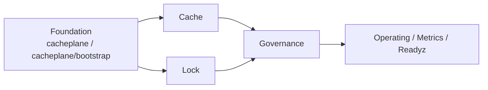

# Redis 三层设计与落地手册

**本文回答**：这篇文档保留为兼容入口，快速说明 Redis Cache、Lock、Governance 三层如何分工；完整深讲与 SOP 已迁入 [redis/](./redis/README.md) 子目录。

## 30 秒结论

| 层 | 解决什么问题 | 深讲入口 |
| -- | ------------ | -------- |
| Cache | Redis 作为读侧缓存：object、query、static-list、hotset、SDK adapter | [redis/02-Cache层总览.md](./redis/02-Cache层总览.md) |
| Lock | Redis 作为 lease lock：选主、互斥、重复抑制 | [redis/06-Redis分布式锁层.md](./redis/06-Redis分布式锁层.md) |
| Governance | family 状态、manual warmup、hotset、repair complete | [redis/07-缓存治理层.md](./redis/07-缓存治理层.md) |
| 新增能力 | 新增缓存、锁、warmup target、operating BFF 接入 | [redis/09-新增Redis能力SOP.md](./redis/09-新增Redis能力SOP.md) |

## 三层关系

## 快速原则

- 新增 object cache：先定义 `cachepolicy`，再写 repository decorator，详见 [ObjectCache 主路径](./redis/03-ObjectCache主路径.md)。
- 新增 query/list cache：优先 version token，不优先扫描删 key，详见 [QueryCache 与 StaticList](./redis/04-QueryCache与StaticList.md)。
- 新增 warmup target：先定义 `cachetarget.WarmupKind` 和 canonical scope，详见 [Hotset 与 WarmupTarget 模型](./redis/05-Hotset与WarmupTarget模型.md)。
- 新增分布式锁：先确认不是数据库一致性问题，再新增 `locklease.Spec`，详见 [Redis 分布式锁层](./redis/06-Redis分布式锁层.md)。
- 排障先看 family 状态、endpoint 和 metrics，详见 [观测、降级与排障](./redis/08-观测降级与排障.md)。

## 当前不支持

| 能力 | 当前状态 |
| ---- | -------- |
| Lock lease 自动续租 | 不支持 |
| Fencing token | 不支持 |
| collection-server 领域读缓存 | 不支持 |
| worker object/query cache | 不支持 |
| operating 破坏性 cache delete/invalidate | 不暴露 |

## Verify

本文只作为兼容入口。修改 Redis 设计事实时，应优先更新 `docs/03-基础设施/redis/` 下对应深讲文档，再同步本文链接。

---

*写作约定见 [CONTRIBUTING-DOCS.md](../CONTRIBUTING-DOCS.md)。*
