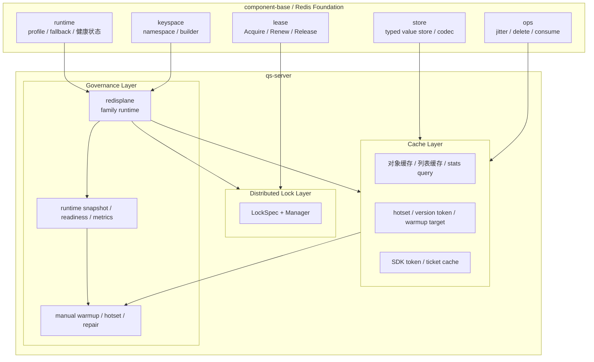

# Redis 文档中心

**本文回答**：在 `qs-server` 这套文档里，Redis 相关内容应该从哪里进入、按什么层次理解、哪些事实来自 `component-base` Foundation、哪些事实属于 `qs-server` 自己维护的 Cache / Lock / Governance 三层，以及读源码时应该先看哪些包。

## 30 秒结论

| 维度 | 当前结论 |
| ---- | -------- |
| 四层结构 | Redis 现在应该按 **Foundation -> Cache -> Lock -> Governance** 四层来理解 |
| Foundation 在哪 | Foundation 不在 `qs-server` 仓内实现；它由 `component-base/pkg/redis` 与 `component-base/pkg/database` 提供 |
| `qs-server` 自己负责什么 | `apiserver` 的 Cache 层、三进程共享的 Lock 层、三进程共享的 Governance/runtime 路由 |
| Cache 真正落在哪 | 只有 `apiserver` 形成了完整 Redis Cache 层；`worker` 不做读缓存，`collection-server` 只做操作性 Redis |
| 当前主入口 | 先看本文拿到整体阅读地图；再看 [06-Redis使用情况.md](./06-Redis使用情况.md)、[11-Redis三层设计与落地手册.md](./11-Redis三层设计与落地手册.md)、[13-Redis缓存业务清单.md](./13-Redis缓存业务清单.md) |
| 历史稿怎么处理 | `07-10` 与历史专题稿只作为演进参考，不再充当现行真值层 |

## 为什么单独做一个 Redis 文档中心

当前 Redis 相关内容已经不再是“一篇说明缓存怎么用”的规模，而是至少同时覆盖：

- `component-base` 提供的 Foundation 原语
- `qs-server` 的 runtime family 路由
- `apiserver` 的对象缓存 / 查询缓存 / hotset / warmup
- `worker` 与 `collection-server` 的共享锁和治理状态
- `collection-server` 的操作性 Redis 使用

如果继续只靠 [06-Redis使用情况.md](./06-Redis使用情况.md) 和 [11-Redis三层设计与落地手册.md](./11-Redis三层设计与落地手册.md) 两篇长文承载全部信息，读者会反复遇到两个问题：

1. 不知道“当前实现、设计手册、业务缓存清单”分别该去哪看。
2. 不知道哪些事实属于 `qs-server` 仓内真值，哪些只是跨仓参考。

所以本文的职责不是重复讲一遍实现，而是把 Redis 相关文档真正收成一个**文档中心**。

## 事实来源与优先级

围绕 `qs-server` 的 Redis 主题，事实来源优先级固定如下：

1. **`qs-server` 源码与运行时行为**
   - `internal/pkg/redisplane`
   - `internal/pkg/redislock`
   - `internal/pkg/cacheobservability`
   - `internal/apiserver/infra/cache*`
   - `internal/apiserver/application/cachegovernance`
   - `internal/collection-server/infra/redisops`
2. **机器可读配置与契约**
   - `configs/apiserver*.yaml`
   - `configs/worker*.yaml`
   - `configs/collection-server*.yaml`
3. **`component-base` 中的 Redis Foundation**
   - `component-base/pkg/redis/FOUNDATION.md`
   - `component-base/pkg/redis/runtime`
   - `component-base/pkg/redis/keyspace`
   - `component-base/pkg/redis/store`
   - `component-base/pkg/redis/lease`
   - `component-base/pkg/database`
4. **`qs-server/docs/` 下的现行文档**
5. **`iam-contracts` 的 Redis 文档**
   - 只作为写法、分层和 family 目录风格的参考，不作为 `qs-server` 现状的事实来源
6. **`docs/_archive/`**
   - 只保留演进背景，不进入现行真值层

## 四层总图

## 四层职责与代码锚点

### 1. Redis Foundation：`component-base` 负责“怎么可靠地使用 Redis”

Foundation 在 `qs-server` 中是**前提**，不是业务仓内自己实现的一层。它负责：

- 连接与 profile registry
- runtime fallback
- namespace / keyspace
- typed store
- lease 原语
- TTL 抖动等低层通用操作

在 `qs-server` 文档中，Foundation 的外部锚点应固定理解为：

- `component-base/pkg/redis/FOUNDATION.md`
- `component-base/pkg/redis/runtime`
- `component-base/pkg/redis/keyspace`
- `component-base/pkg/redis/store`
- `component-base/pkg/redis/lease`
- `component-base/pkg/database`

`qs-server` 不再重复造这些能力。

### 2. Cache 层：`apiserver` 负责“为什么缓存这些读模型”

Cache 层是 `qs-server` 自己最完整的一层，当前主体落在：

- [internal/apiserver/infra/cache](../../internal/apiserver/infra/cache)
- [internal/apiserver/infra/cachepolicy](../../internal/apiserver/infra/cachepolicy)
- [internal/apiserver/application/cachegovernance](../../internal/apiserver/application/cachegovernance)

这层负责：

- family 之内的对象级策略
- read-through
- negative cache
- version token + versioned key
- hotset / warmup
- SDK token cache 适配

它不负责：

- 自己管理 Redis 连接
- 自己决定 profile / namespace route
- 直接暴露底层 Redis client 给业务随手拼 key

### 3. 分布式锁层：三进程共享“如何安全地持有 lease”

锁层入口统一收口在：

- [internal/pkg/redislock](../../internal/pkg/redislock)

它负责：

- `LockSpec`
- `Manager`
- `AcquireSpec / ReleaseSpec`
- token ownership release
- contention 语义

当前调用点覆盖：

- `worker` 答卷处理闸门
- `apiserver` 计划调度器选主
- `apiserver` statistics sync 调度与执行互斥
- `apiserver` behavior pending reconcile
- `collection-server` 提交幂等与 in-flight 抑制

### 4. 横切治理层：三进程共享“家族路由、状态和治理动作”

治理层当前分成三块：

- runtime 路由：
  [internal/pkg/redisplane](../../internal/pkg/redisplane)
- family 状态与指标：
  [internal/pkg/cacheobservability](../../internal/pkg/cacheobservability)
- apiserver 的 cache governance：
  [internal/apiserver/application/cachegovernance](../../internal/apiserver/application/cachegovernance)

这层当前已经覆盖：

- family -> profile / namespace / fallback
- `/readyz`
- `/governance/redis`
- family status snapshot
- manual warmup
- repair complete
- hotset inspector / governance status

## 当前 family 与三进程关系

逻辑 family 定义在 [internal/pkg/redisplane/catalog.go](../../internal/pkg/redisplane/catalog.go)。

| Family | `apiserver` | `worker` | `collection-server` | 当前角色 |
| ------ | ----------- | -------- | ------------------- | -------- |
| `static_meta` | 使用 | 不使用 | 不使用 | 量表、问卷、已发布列表等静态/半静态缓存 |
| `object_view` | 使用 | 不使用 | 不使用 | 单对象视图缓存 |
| `query_result` | 使用 | 不使用 | 不使用 | query/list/统计查询结果缓存 |
| `meta_hotset` | 使用 | 不使用 | 不使用 | version token、hotset、warmup 元数据 |
| `sdk_token` | 使用 | 不使用 | 不使用 | 微信 SDK token / ticket 缓存 |
| `lock_lease` | 使用 | 使用 | 使用 | 共享分布式锁 |
| `ops_runtime` | 不使用 | 不使用 | 使用 | 限流、提交幂等、in-flight guard |

## 文档怎么读

### 想知道“Redis 现在到底怎么用”

先读：
- [06-Redis使用情况.md](./06-Redis使用情况.md)

它回答：
- 三进程分别依赖哪些 family
- 当前治理接口都有哪些
- 当前 lock 层和 collection-server Redis 角色是什么

### 想知道“这四层应该怎样设计、以后怎么继续加能力”

再读：
- [11-Redis三层设计与落地手册.md](./11-Redis三层设计与落地手册.md)

它回答：
- Cache / Lock / Governance 层的设计目标
- 新增缓存、新增锁的从 0 到 1 流程
- 预热、TTL 抖动、雪崩与治理动作应该怎么建模

### 想知道“现在到底缓存了哪些业务对象和查询”

直接看：
- [13-Redis缓存业务清单.md](./13-Redis缓存业务清单.md)

它回答：
- 每个业务缓存归哪个 family
- 使用了哪种模式
- 如何失效
- 是否接入 warmup / hotset / version token

### 想接 operating 后台或排查治理接口

再看：
- [../04-接口与运维/06-operating 缓存治理页接入.md](../04-接口与运维/06-operating%20缓存治理页接入.md)

### 想看历史演进

按需阅读：

- [../_archive/03-基础设施/07-Redis代码总览（源码审计版）.md](../_archive/03-基础设施/07-Redis代码总览（源码审计版）.md)
- [../_archive/03-基础设施/08-Redis分层重构设计.md](../_archive/03-基础设施/08-Redis分层重构设计.md)
- [../_archive/03-基础设施/09-Redis跨仓重构路线.md](../_archive/03-基础设施/09-Redis跨仓重构路线.md)
- [../_archive/03-基础设施/10-apiserver缓存实现层重构.md](../_archive/03-基础设施/10-apiserver缓存实现层重构.md)

## `qs-server` 与 `iam-contracts` 的关系

`iam-contracts` 的 Redis 文档是一个很好的**参考系**，但边界和 `qs-server` 不同。

可以借鉴它的地方：

- 先讲 Foundation 在外部，再讲业务仓自己负责的层
- 用 family 地图讲缓存对象，而不是只讲“这里用了 Redis”
- 把治理面单独抽出来，不和缓存实现揉在一起

不能直接照抄它的地方：

- `iam-contracts` 的核心是认证状态 family 与只读治理面
- `qs-server` 当前则同时承担完整 Cache 层、Lock 层和更重的 warmup/hotset 治理

所以本文把 `iam-contracts` 视为**写法和分层风格参考**，不把它作为 `qs-server` 的事实来源。

## 当前边界与非目标

Redis 在 `qs-server` 当前仍有几个明确边界：

- `collection-server` 不做领域读缓存
- `worker` 不做对象/query 读缓存
- 锁层仍是单 Redis lease lock，没有续租和 fencing token
- warmup 已经平台化，但治理层还不是完整“Redis 控制台”

这也是为什么 Redis 文档中心必须拆成：

- 当前使用情况
- 设计与落地手册
- 业务缓存清单

而不是试图用一篇长文同时覆盖所有视角。

---

*写作约定见 [CONTRIBUTING-DOCS.md](../CONTRIBUTING-DOCS.md)。*
