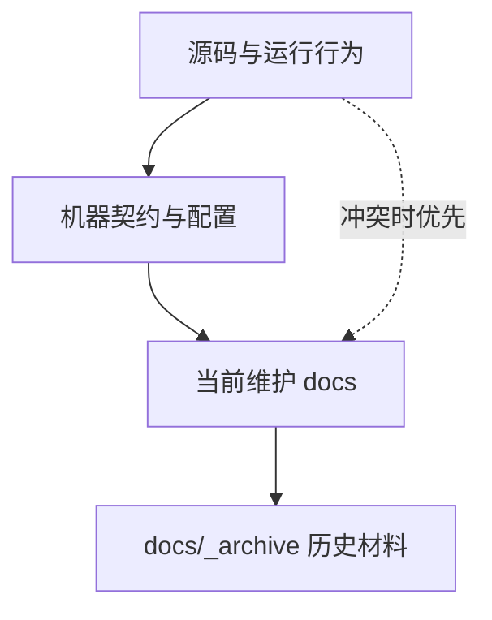
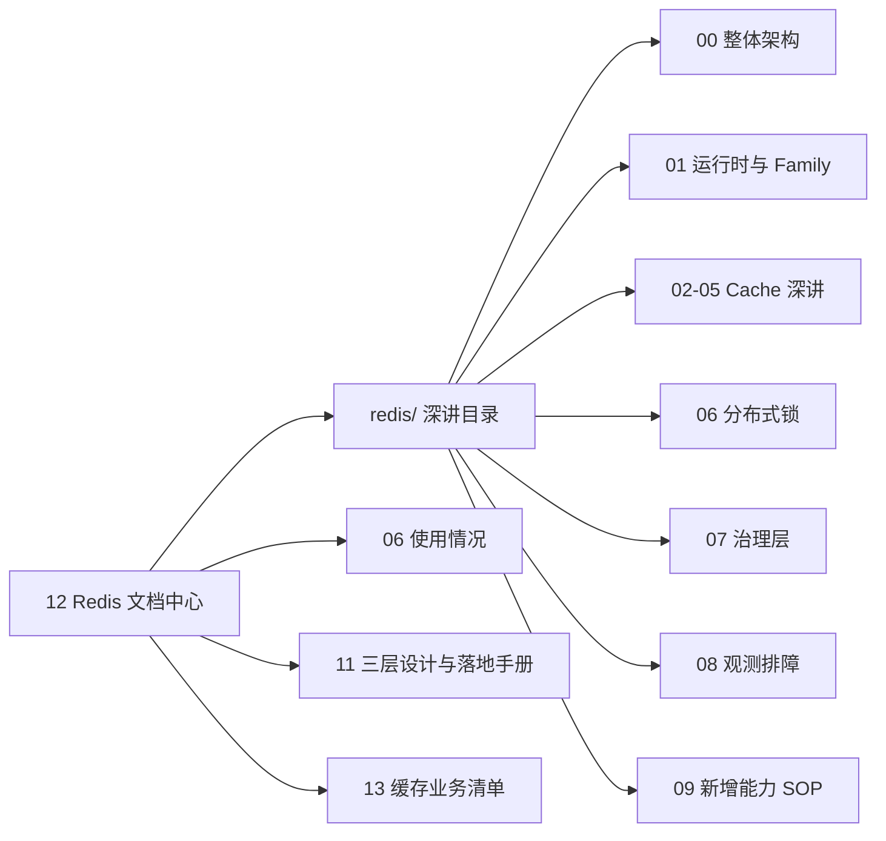
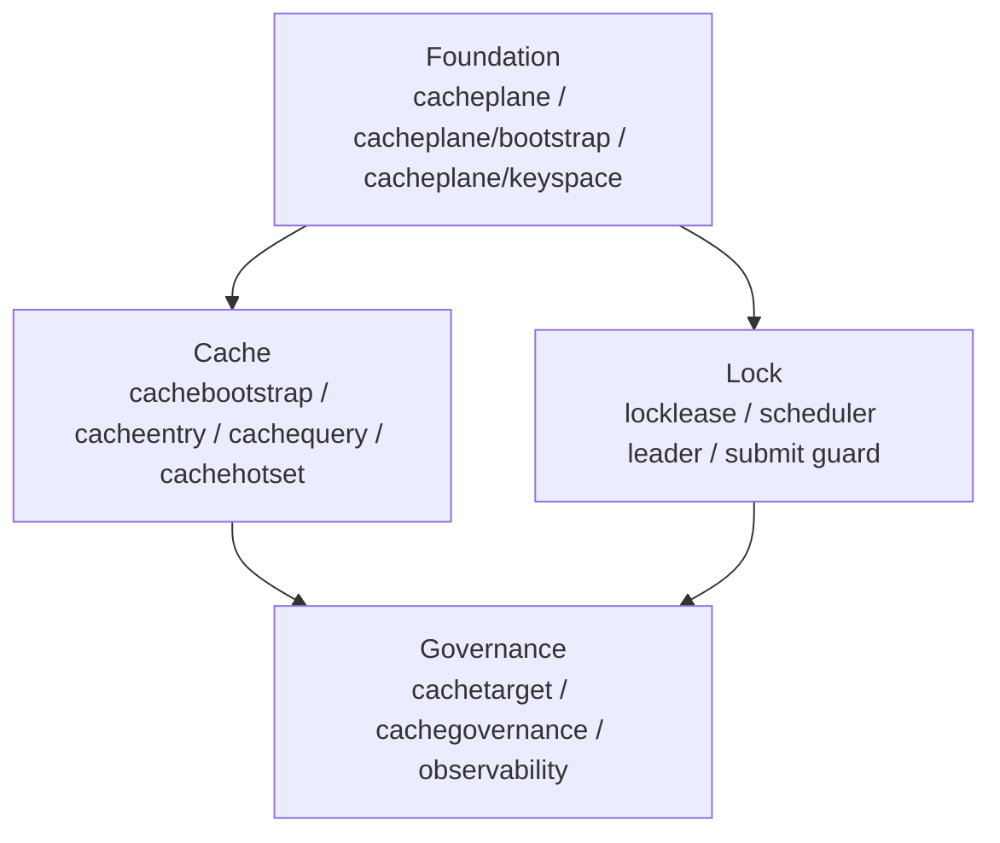

# Redis 文档中心

**本文回答**：Redis 当前真值从哪里进入，深讲文档如何组织，现有 `06/11/13` 与新 `redis/` 子目录如何分工，以及历史文档如何处理。

## 30 秒结论

| 维度 | 当前结论 |
| ---- | -------- |
| 稳定入口 | 本文是 Redis 文档稳定入口 |
| 深讲目录 | [redis/README.md](./redis/README.md) 承接架构、模型、设计模式、时序、SOP |
| 事实优先级 | 源码与运行行为 > 机器契约与配置 > 当前 docs > archive |
| 当前四层 | Foundation、Cache、Lock、Governance |
| 兼容文档 | [06](./06-Redis使用情况.md) 看现状，[11](./11-Redis三层设计与落地手册.md) 看分层手册入口，[13](./13-Redis缓存业务清单.md) 看缓存清单 |
| archive | [docs/_archive](../_archive/README.md) 只保留历史背景，不作为当前事实来源 |

## 事实来源优先级



优先锚点：

- Runtime： [internal/pkg/cacheplane](../../internal/pkg/cacheplane)、[internal/pkg/cacheplane/bootstrap](../../internal/pkg/cacheplane/bootstrap)、[internal/pkg/cacheplane/keyspace](../../internal/pkg/cacheplane/keyspace)
- Cache： [internal/apiserver/cachebootstrap](../../internal/apiserver/cachebootstrap)、[infra/cache](../../internal/apiserver/infra/cache)、[cacheentry](../../internal/apiserver/infra/cacheentry)、[cachequery](../../internal/apiserver/infra/cachequery)、[cachehotset](../../internal/apiserver/infra/cachehotset)、[cachetarget](../../internal/apiserver/cachetarget)
- Lock： [internal/pkg/locklease](../../internal/pkg/locklease)、[runtime/scheduler](../../internal/apiserver/runtime/scheduler)、[collection redisops](../../internal/collection-server/infra/redisops)、[worker handlers](../../internal/worker/handlers)
- Governance： [application/cachegovernance](../../internal/apiserver/application/cachegovernance)、[transport/rest/routes_statistics.go](../../internal/apiserver/transport/rest/routes_statistics.go)、[cachegovernance/observability](../../internal/pkg/cachegovernance/observability)
- Config： [configs/apiserver.prod.yaml](../../configs/apiserver.prod.yaml)、[configs/collection-server.prod.yaml](../../configs/collection-server.prod.yaml)、[configs/worker.prod.yaml](../../configs/worker.prod.yaml)

## Redis 文档结构



| 读者问题 | 入口 |
| -------- | ---- |
| 想先建立全局结构 | [redis/00-整体架构.md](./redis/00-整体架构.md) |
| 想排查 profile、family、namespace | [redis/01-运行时与Family模型.md](./redis/01-运行时与Family模型.md) |
| 想理解 object cache | [redis/03-ObjectCache主路径.md](./redis/03-ObjectCache主路径.md) |
| 想理解 query/list cache | [redis/04-QueryCache与StaticList.md](./redis/04-QueryCache与StaticList.md) |
| 想理解 hotset 和 warmup target | [redis/05-Hotset与WarmupTarget模型.md](./redis/05-Hotset与WarmupTarget模型.md) |
| 想理解分布式锁 | [redis/06-Redis分布式锁层.md](./redis/06-Redis分布式锁层.md) |
| 想理解缓存治理接口 | [redis/07-缓存治理层.md](./redis/07-缓存治理层.md) |
| 想排障 | [redis/08-观测降级与排障.md](./redis/08-观测降级与排障.md) |
| 想新增 Redis 能力 | [redis/09-新增Redis能力SOP.md](./redis/09-新增Redis能力SOP.md) |

## 四层总图



## 当前边界

- `apiserver` 是完整 Redis Cache 和 Cache Governance 消费方。
- `collection-server` 只使用 `ops_runtime + lock_lease`，不做领域读缓存。
- `worker` 当前使用 `lock_lease`，不做 object/query cache，也不做 Redis 统计增量写入。
- `locklease` 不提供自动续租、fencing token 或业务通用幂等框架。
- `hotset` 是治理候选和观测数据，不是业务正确性的来源。

## 文档维护规则

- 新增 Redis family、cache policy、LockSpec、WarmupKind 后，必须更新对应深讲文档和 [13-Redis缓存业务清单.md](./13-Redis缓存业务清单.md)。
- 旧源码路径不得重新写入现行文档；如果只存在于 archive，不作为当前事实。
- 文档内容与代码冲突时，先修文档；如果代码也需要调整，应另起代码重构任务。

## Verify

```bash
python scripts/check_docs_hygiene.py
git diff --check
```

---

*写作约定见 [CONTRIBUTING-DOCS.md](../CONTRIBUTING-DOCS.md)。*
