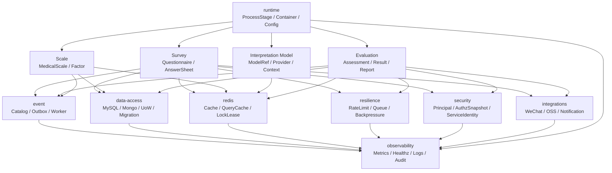

# 03-基础设施

> 本文是 `docs/03-基础设施/` 的总入口。
>
> `03-基础设施` 不是业务模块文档，也不是部署运维手册，而是 qs-server 的 **横切能力层文档中心**。
>
> 它负责解释事件、数据访问、Redis、韧性治理、安全、外部集成、运行时组合和可观测性如何支撑 Survey、Scale、Interpretation Model、Evaluation 等业务模块稳定运行。

---

## 1. 结论先行

`03-基础设施` 的核心定位是：

> **解释 qs-server 的横切机制如何可靠、可观测、可治理地支撑业务模块，而不是重新定义业务模型。**

当前业务主线已经演进为：

```text
Survey
    作答事实层，负责 Questionnaire / AnswerSheet / AnswerSheetSubmittedEvent

Scale
    医学量表解释模型，负责 MedicalScale / Factor / ScoringSpec / InterpretationRules

Interpretation Model
    解释模型抽象层，负责 ModelRef / Provider / Context / Registry

Evaluation
    通用测评执行引擎，负责 Assessment / EvaluationResult / InterpretReport / Retry / Events
```

因此，基础设施文档必须服务于这条新主线。

尤其要明确：

```text
事件系统不定义业务语义，只承载业务事件的可靠传递；
Data Access 不定义领域模型，只实现聚合、结果、报告、Outbox 的持久化；
Redis 不是业务事实源，只承载缓存、锁、限流、治理状态等运行时能力；
Resilience 不改变业务状态语义，只提供限流、队列、背压、重复抑制和降级保护；
Security 不用 JWT roles 直接当业务权限真值，而要对齐 IAM / AuthzSnapshot / CapabilityDecision；
Integrations 不污染领域模型，只通过 port / adapter 接入 WeChat、OSS、通知等外部能力；
Runtime 负责装配，不承载业务规则；
Observability 负责看见系统，不替代业务状态。
```

---

## 2. 事实源优先级

维护基础设施文档时，按以下优先级判断真值：

```text
1. 源码
   internal/、cmd/、pkg/

2. 机器契约与配置
   configs/events.yaml
   configs/*.yaml
   api/rest/*.yaml
   proto files
   migration files
   Makefile / CI

3. Contract tests / integration tests

4. docs/00-05 现行正文

5. docs/06-宣讲

6. docs/_archive
```

如果 prose 文档与源码、配置、契约冲突，以源码、配置、契约为准。

基础设施文档可以解释设计意图，但不能反向覆盖代码事实。

---

## 3. 本目录负责什么

`03-基础设施` 负责这些横切机制：

```text
事件系统
    EventCatalog / Publisher / Outbox / Worker / AckNack / Poison Message

数据访问
    MySQL / Mongo / Repository / Mapper / UnitOfWork / Migration / ReadModel / Outbox Store

Redis
    ObjectCache / QueryCache / Hotset / Warmup / LockLease / CacheGovernance

韧性治理
    RateLimit / SubmitQueue / Backpressure / Duplicate Suppression / Lock / Degraded Mode

安全控制面
    Principal / TenantScope / AuthzSnapshot / CapabilityDecision / ServiceIdentity / mTLS / ACL

外部集成
    WeChat / ObjectStorage / Notification / External Adapter

运行时组合
    ProcessStage / ResourceBootstrap / Container / ConfigOptions / ClientBundle / Lifecycle

可观测性
    Metrics / Healthz / Pprof / Logging / Audit / Governance Endpoint
```

一句话：

> **业务模块回答“这个系统做什么”，基础设施回答“跨模块机制如何可靠地工作”。**

---

## 4. 本目录不负责什么

| 不负责 | 应进入 |
| --- | --- |
| Questionnaire / AnswerSheet 模型 | `../02-业务模块/survey/` |
| MedicalScale / Factor / ScoringSpec | `../02-业务模块/scale/` |
| ModelRef / Provider / Context 抽象 | `../02-业务模块/interpretation-model/` |
| Assessment / Result / Report / Retry | `../02-业务模块/evaluation/` |
| 三进程业务启动链路 | `../01-运行时/` |
| REST / gRPC 机器契约 | `../04-接口与运维/`、`api/rest/`、`proto/` |
| 设计权衡长文 | `../05-专题分析/` |
| 对外宣讲材料 | `../06-宣讲/` |
| 历史设计稿 | `../_archive/` |

基础设施文档不要重复维护业务聚合细节。

如果某篇基础设施文档开始定义 `AssessmentStatus`、`Factor`、`AnswerSheet` 的业务规则，说明边界已经漂移，应回到业务模块文档。

---

## 5. 目录结构

当前建议按 plane 管理：

```text
03-基础设施/
├── README.md
├── 横切能力矩阵.md
├── event/
├── data-access/
├── redis/
├── resilience/
├── security/
├── integrations/
├── runtime/
└── observability/
```

各 plane 的定位：

| Plane | 主题 |
| --- | --- |
| event | 事件契约、发布、Outbox、Worker 消费、Ack/Nack、事件补偿 |
| data-access | MySQL、Mongo、Repository、UnitOfWork、Migration、ReadModel、Outbox Store |
| redis | 缓存、查询缓存、Hotset、Warmup、LockLease、缓存治理 |
| resilience | 限流、提交队列、背压、幂等重复抑制、降级保护 |
| security | Principal、TenantScope、AuthzSnapshot、CapabilityDecision、ServiceIdentity |
| integrations | WeChat、OSS、Notification、外部适配器 |
| runtime | 启动流水线、资源装配、Container、配置链路、ClientBundle、Lifecycle |
| observability | Metrics、Healthz、Pprof、Logging、Audit、治理端点 |

---

## 6. 横切能力总图



这张图要表达的是：

```text
基础设施被业务模块使用；
基础设施不反向定义业务模型；
所有横切能力都需要进入 observability；
runtime 是装配入口；
event / data-access 是可靠性底座；
redis / resilience 是运行时保护能力；
security / integrations 是边界能力。
```

---

## 7. 推荐阅读顺序

### 7.1 第一次理解基础设施

推荐顺序：

```text
README.md
横切能力矩阵.md
event/README.md
data-access/README.md
redis/README.md
resilience/README.md
security/README.md
integrations/README.md
runtime/README.md
observability/README.md
```

读完后应该能回答：

```text
哪些能力属于基础设施层；
哪些能力属于业务模块；
事件配置事实源在哪里；
哪些事件需要 durable outbox；
哪些缓存只是读优化；
哪些权限来自 IAM AuthzSnapshot；
哪些治理入口只读；
哪些失败应进入业务状态；
哪些观测指标用于排障。
```

---

### 7.2 排查答卷提交后没有测评结果

推荐阅读：

```text
event/README.md
event/02-Publish与Outbox.md
event/03-Worker消费与AckNack.md
event/04-事件幂等与补偿.md
../02-业务模块/evaluation/02-Evaluation执行链路--从AnswerSheet提交到Assessment完成.md
../02-业务模块/evaluation/04-Evaluation失败重试链路--幂等-错误状态-补偿处理.md
```

关注点：

```text
AnswerSheetSubmittedEvent 是否 stage；
Outbox relay 是否发布；
Worker 是否消费；
EvaluationService 是否创建 Assessment；
Assessment 是否 failed；
EvaluationRun 失败在哪个 stage；
完成事件是否 stage。
```

---

### 7.3 排查事件可靠性

推荐阅读：

```text
event/README.md
event/01-事件目录与契约.md
event/02-Publish与Outbox.md
event/03-Worker消费与AckNack.md
event/05-观测与排障.md
configs/events.yaml
```

关注点：

```text
EventType；
Topic；
Delivery；
Producer；
Consumer；
Outbox status；
Ack / Nack；
Poison message；
BusinessKey；
事件版本。
```

---

### 7.4 修改数据库、仓储或 migration

推荐阅读：

```text
data-access/README.md
data-access/00-整体架构.md
data-access/01-MySQL仓储与UnitOfWork.md
data-access/02-Mongo文档仓储.md
data-access/03-Migration与Schema演进.md
```

关注点：

```text
聚合事实源在哪里；
Repository 归属哪个模块；
mapper 是否泄露领域对象；
UnitOfWork 是否覆盖状态与 Outbox；
Migration 是否和 model / repository / tests 对齐；
ReadModel 是否可重建。
```

---

### 7.5 修改 Redis 缓存、锁或治理

推荐阅读：

```text
redis/README.md
redis/00-整体架构.md
redis/02-Cache层总览.md
redis/06-Redis分布式锁层.md
redis/07-缓存治理层.md
```

关注点：

```text
缓存是否只是读优化；
key 是否有 namespace / scope / version；
TTL 是否明确；
是否需要 negative cache；
LockLease 是否有过期和 owner；
cache governance 是否只读或受控；
Redis degraded 时业务如何降级。
```

---

### 7.6 修改限流、队列、背压和重复抑制

推荐阅读：

```text
resilience/README.md
resilience/00-整体架构.md
resilience/01-RateLimit入口限流.md
resilience/02-SubmitQueue提交削峰.md
resilience/03-Backpressure下游背压.md
resilience/04-LockLease幂等与重复抑制.md
```

关注点：

```text
保护点在哪里；
保护的是入口还是下游；
429 / queued / rejected / degraded 如何表达；
重复抑制是否只是第一道保护；
最终业务幂等是否仍由 DB unique key / Assessment 状态机保护；
metrics label 是否低基数。
```

---

### 7.7 修改安全能力

推荐阅读：

```text
security/README.md
security/00-整体架构.md
security/01-Principal与TenantScope.md
security/02-AuthzSnapshot与CapabilityDecision.md
security/03-ServiceIdentity与mTLS-ACL.md
```

关注点：

```text
Principal 如何构造；
TenantScope 如何传递；
AuthzSnapshot 是否来自 IAM；
CapabilityDecision 如何落到 handler / service；
ServiceIdentity 如何保护内部调用；
JWT roles 是否只是 token claim，不是业务 capability 真值。
```

---

### 7.8 修改外部集成

推荐阅读：

```text
integrations/README.md
integrations/00-整体架构.md
integrations/01-WeChat适配器.md
integrations/02-ObjectStorage适配器.md
integrations/03-Notification应用服务.md
integrations/04-新增外部集成SOP.md
```

关注点：

```text
是否通过 port / adapter 接入；
是否泄露第三方 SDK 到 domain；
token/cache/retry 是否可观测；
失败是否进入业务状态或通知状态；
敏感信息是否脱敏。
```

---

### 7.9 修改运行时装配或配置

推荐阅读：

```text
runtime/README.md
runtime/00-整体架构.md
runtime/01-ProcessStage与启动流水线.md
runtime/02-ResourceBootstrap资源装配.md
runtime/03-ContainerCompositionRoot.md
runtime/04-ConfigOptions配置链路.md
runtime/05-ClientBundle与外部客户端注入.md
runtime/07-Lifecycle与关闭语义.md
```

关注点：

```text
Options 是否加载；
ResourceBootstrap 是否创建依赖；
Container 是否注入；
ModuleGraph 是否连接；
PostWire 是否必要；
关闭时是否释放资源；
降级启动是否明确。
```

---

### 7.10 修改观测入口

推荐阅读：

```text
observability/README.md
observability/00-整体架构.md
observability/01-Metrics指标体系.md
observability/02-Healthz与Pprof.md
observability/03-Logging与Audit.md
observability/04-GovernanceEndpoint与排障SOP.md
```

关注点：

```text
metrics 是否低基数；
healthz / readyz 是否区分；
pprof 是否受控；
日志是否包含 trace / assessment / event / modelRef 等定位字段；
audit 是否记录安全敏感操作；
governance endpoint 是否默认只读。
```

---

## 8. 各 plane 职责

### 8.1 event

`event/` 负责事件系统。

它解释：

```text
事件如何声明；
事件如何发布；
哪些事件走 best_effort；
哪些事件必须 durable_outbox；
Outbox 如何 stage / relay；
Worker 如何消费；
Ack / Nack 如何处理；
Poison message 如何处理；
事件如何观测和补偿。
```

事实源：

```text
configs/events.yaml
internal/pkg/eventcatalog
internal/apiserver/application/eventing
internal/apiserver/outboxcore
internal/worker/handlers
```

业务边界：

```text
AnswerSheetSubmittedEvent 属于 Survey；
AssessmentInterpretedEvent 属于 Evaluation；
InterpretReportGeneratedEvent 属于 Evaluation；
ScaleChangedEvent 属于 Scale；
MBTIModelChangedEvent 未来属于 MBTI。
```

事件系统不决定这些事件的业务语义，只保证它们可靠流转。

---

### 8.2 data-access

`data-access/` 负责持久化机制。

它解释：

```text
MySQL repository；
Mongo document repository；
UnitOfWork；
mapper；
migration；
outbox store；
read model；
transaction boundary。
```

事实源：

```text
internal/apiserver/infra/mysql
internal/apiserver/infra/mongo
internal/pkg/database
internal/pkg/migration
migration files
repository tests
```

业务边界：

```text
Repository 保存领域事实；
Mapper 转换领域对象与持久化对象；
Migration 维护 schema；
ReadModel 服务查询；
Outbox 与业务状态保持可靠一致。
```

Data Access 不定义领域模型。

---

### 8.3 redis

`redis/` 负责 Redis 相关运行时能力。

它解释：

```text
ObjectCache；
QueryCache；
StaticListCache；
Hotset；
WarmupTarget；
LockLease；
CacheGovernance；
Redis degraded 行为。
```

事实源：

```text
internal/pkg/cacheplane
internal/pkg/locklease
internal/apiserver/infra/cache
internal/apiserver/infra/cachequery
internal/apiserver/application/cachegovernance
```

核心护栏：

```text
Redis 不是业务事实源。
```

Redis 可以辅助：

```text
缓存；
查询加速；
热点预热；
短期锁；
重复抑制；
治理状态展示。
```

但最终事实仍应回到：

```text
MySQL；
Mongo；
Outbox；
领域聚合状态。
```

---

### 8.4 resilience

`resilience/` 负责高并发保护与降级。

它解释：

```text
入口限流；
提交队列；
下游背压；
重复抑制；
LockLease；
worker 并发保护；
degraded mode；
resilience metrics。
```

事实源：

```text
internal/pkg/resilienceplane
internal/pkg/middleware
internal/pkg/backpressure
internal/collection-server/application/answersheet
internal/worker/handlers
```

核心护栏：

```text
Resilience 是保护机制，不是业务事实源；
SubmitGuard 不是 Assessment 幂等的最终事实源；
业务幂等仍要依赖 DB 唯一约束和状态机。
```

---

### 8.5 security

`security/` 负责安全控制面。

它解释：

```text
Principal；
TenantScope；
AuthzSnapshot；
CapabilityDecision；
ServiceIdentity；
mTLS / ACL；
OperatorRoleProjection。
```

事实源：

```text
internal/pkg/securityplane
internal/pkg/securityprojection
internal/pkg/serviceauth
internal/pkg/middleware
internal/pkg/grpc
internal/apiserver/transport/rest/middleware
```

核心护栏：

```text
JWT roles 不应直接作为业务 capability 真值；
业务权限判断应以 IAM AuthzSnapshot / CapabilityDecision 为准；
服务间调用需要 ServiceIdentity 或明确的 internal auth 边界。
```

---

### 8.6 integrations

`integrations/` 负责外部系统适配。

它解释：

```text
WeChat adapter；
ObjectStorage adapter；
Notification application service；
外部 SDK 包装；
token cache；
retry；
错误映射；
新增外部集成 SOP。
```

事实源：

```text
internal/apiserver/infra/wechatapi
internal/apiserver/infra/objectstorage
internal/apiserver/application/notification
```

核心护栏：

```text
第三方 SDK 不应泄露到 domain；
外部失败要映射为应用层错误；
外部集成状态需要可观测；
敏感信息必须脱敏。
```

---

### 8.7 runtime

`runtime/` 负责基础设施视角的启动组合。

它解释：

```text
ProcessStage；
ResourceBootstrap；
ContainerCompositionRoot；
ConfigOptions；
ClientBundle；
ModuleGraph；
PostWire；
Lifecycle；
Shutdown。
```

事实源：

```text
cmd/qs-apiserver/apiserver.go
cmd/collection-server/main.go
cmd/qs-worker/main.go
internal/apiserver/container
internal/apiserver/runtime
internal/pkg/process
configs/*.yaml
```

核心护栏：

```text
runtime 负责装配，不承载业务规则；
新增依赖必须贯穿 options、bootstrap、container、module constructor 和 tests；
降级启动必须明确行为和观测。
```

---

### 8.8 observability

`observability/` 负责可观测性。

它解释：

```text
Metrics；
Healthz；
Readyz；
Pprof；
Logging；
Audit；
GovernanceEndpoint；
排障 SOP。
```

事实源：

```text
internal/pkg/metrics
internal/pkg/health
internal/pkg/log
internal/pkg/audit
internal/apiserver/transport/rest
runtime status endpoints
```

核心护栏：

```text
metrics label 必须低基数；
healthz / readyz 语义要区分；
pprof 必须受控；
audit 不等于普通业务日志；
governance endpoint 默认只读。
```

---

## 9. 横切能力矩阵怎么用

`横切能力矩阵.md` 是基础设施排障索引。

它应该回答：

```text
这个问题属于哪个 plane？
事实源在哪里？
状态入口在哪里？
治理动作是否存在？
应该执行哪些 verify？
```

示例：

| 问题 | Plane |
| --- | --- |
| AnswerSheet 提交后没有 Assessment | event / evaluation |
| Assessment failed 但不知道原因 | evaluation / observability |
| Outbox pending 堆积 | event / data-access |
| Worker 一直 Nack | event / worker |
| Submit 429 | resilience |
| Redis degraded | redis |
| Capability denied | security |
| Migration 失败 | data-access |
| WeChat 通知失败 | integrations |
| Container nil dependency | runtime |
| Metrics label 爆炸 | observability |

---

## 10. 当前需要重点对齐的新业务语义

### 10.1 Scale 不再是所有解释能力的总称

旧表达容易写成：

```text
Scale 负责怎么算和怎么解释。
```

现在应改成：

```text
Scale 是医学量表解释模型；
Interpretation Model 定义解释模型接入协议；
MBTI 未来作为与 Scale 同级的解释模型接入；
Evaluation 是通用测评执行引擎。
```

基础设施文档中出现 `Scale -> Evaluation` 的地方，需要判断它是不是实际上应该写成：

```text
ModelRef -> Provider -> EvaluationResult
```

---

### 10.2 Evaluation 是执行引擎，不只是结果模块

旧表达容易写成：

```text
Evaluation 保存评估结果。
```

现在应改成：

```text
Evaluation 管理一次 Assessment 的完整执行生命周期：状态、执行尝试、结果、报告、失败、重试和事件。
```

基础设施文档中涉及：

```text
Outbox；
Worker；
Retry；
Data Access；
ReadModel；
Metrics；
事件 payload。
```

都要使用新的 Evaluation 语义。

---

### 10.3 事件要区分触发事件、完成事件和规则变化事件

必须区分：

```text
AnswerSheetSubmittedEvent      Survey 触发事件
AssessmentInterpretedEvent     Evaluation 完成事件
InterpretReportGeneratedEvent  Evaluation 报告事件
ScaleChangedEvent              Scale 规则变化事件
MBTIModelChangedEvent          未来 MBTI 规则变化事件
```

不要把 `AnswerSheetSubmittedEvent` 当作报告可用。

不要把 `ScaleChangedEvent` 当作历史测评重算。

不要让 Worker 绕过 EvaluationService 直接发布完成事件。

---

### 10.4 Redis / Resilience 不能替代业务幂等

Redis 可以做：

```text
SubmitGuard；
LockLease；
Duplicate suppression；
短期状态；
缓存。
```

但业务最终幂等必须落到：

```text
数据库唯一约束；
Assessment.IdempotencyKey；
Assessment.Status；
EvaluationRun。
```

---

## 11. 基础设施维护原则

### 11.1 不混写业务事实

基础设施文档不直接定义：

```text
Questionnaire 状态；
AnswerSheet 提交规则；
MedicalScale 因子规则；
MBTI 类型规则；
Assessment 状态机；
InterpretReport 内容结构。
```

这些回到业务模块。

### 11.2 不跳过配置事实源

受配置驱动的机制必须回链配置：

```text
configs/events.yaml；
configs/*.yaml；
options.Options；
migration files；
proto / OpenAPI contract；
Redis keyspace builder；
LockLease specs。
```

### 11.3 不从 handler 直达 infra

新增能力时通常遵守：

```text
interface / handler
    -> application service
    -> port
    -> infrastructure adapter
```

不要让 handler 直接操作 DB、Redis、MQ 或第三方 SDK。

### 11.4 观测标签必须低基数

Metrics / event / redis / resilience / security 的 observer labels 不应包含：

```text
user_id；
request_id；
assessment_id；
answer_sheet_id；
raw cache key；
raw lock key；
原始错误文本。
```

这些可进入日志或 trace，但不应进入高频 metrics label。

### 11.5 Governance 默认只读

治理入口默认只读：

```text
status；
metrics；
hotset summary；
cache snapshot；
outbox backlog；
resilience status。
```

真正的 repair / warmup / manual action 必须有独立 SOP、权限边界和审计。

### 11.6 Cache / ReadModel 不是事实源

缓存和读模型必须可重建。

事实源仍然是：

```text
业务聚合；
执行结果；
报告事实；
Outbox；
持久化配置。
```

---

## 12. 常见误区

### 12.1 事件配置写了就代表事件可靠

不够。

还要看：

```text
delivery；
publisher；
outbox stage；
relay；
worker handler；
Ack / Nack；
poison message；
metrics；
补偿。
```

### 12.2 Redis 命中就代表事实正确

错误。

Redis 是缓存或短期运行时状态。

事实源通常在 MySQL / Mongo / Outbox / domain 状态。

### 12.3 JWT roles 就是权限真值

不应这样理解。

业务 capability 应以 IAM AuthzSnapshot / CapabilityDecision 为准。

JWT roles 只能作为 token claim 或中间信息。

### 12.4 Resilience plane 会自动治理所有风险

不会。

它定义 vocabulary、observer 和部分基础组件。

具体保护点仍要落到 collection-server、apiserver、worker、repository、client adapter。

### 12.5 Governance endpoint 可以随便做 repair

不应默认如此。

多数 governance endpoint 应只读。

repair / warmup / manual action 必须显式受控。

### 12.6 规则变化事件应该自动重算历史测评

不应默认如此。

规则变化事件只表示规则变化。

历史重算应显式建模为 ReEvaluationJob。

---

## 13. Verify 命令

基础文档检查：

```bash
make docs-hygiene
git diff --check
```

修改事件系统：

```bash
go test ./internal/pkg/eventcatalog ./internal/apiserver/application/eventing ./internal/apiserver/outboxcore ./internal/worker/handlers
```

修改 data-access：

```bash
go test ./internal/pkg/database/mysql ./internal/apiserver/infra/mongo ./internal/apiserver/infra/mysql/... ./internal/pkg/migration/...
```

修改 Redis：

```bash
go test ./internal/pkg/cacheplane ./internal/pkg/locklease ./internal/apiserver/infra/cache ./internal/apiserver/infra/cachequery ./internal/apiserver/application/cachegovernance
```

修改 resilience：

```bash
go test ./internal/pkg/resilienceplane ./internal/pkg/middleware ./internal/pkg/backpressure ./internal/collection-server/application/answersheet ./internal/worker/handlers
```

修改 security：

```bash
go test ./internal/pkg/securityplane ./internal/pkg/securityprojection ./internal/pkg/serviceauth ./internal/pkg/middleware ./internal/pkg/grpc ./internal/apiserver/transport/rest/middleware
```

修改 integrations：

```bash
go test ./internal/apiserver/infra/wechatapi ./internal/apiserver/infra/objectstorage/... ./internal/apiserver/application/notification
```

修改 runtime：

```bash
go test ./internal/apiserver/container ./internal/apiserver/runtime/... ./internal/pkg/process
```

修改 observability：

```bash
go test ./internal/pkg/... ./internal/apiserver/transport/rest ./internal/apiserver/runtime/scheduler
```

如果目录和命令与当前代码不一致，以 Makefile、CI 和实际 package 为准。

---

## 14. 重建顺序

建议重建顺序：

```text
README.md
横切能力矩阵.md
event/
data-access/
redis/
resilience/
security/
integrations/
runtime/
observability/
```

理由：

```text
README 先确定全局边界；
横切矩阵建立排障导航；
event 和 data-access 是主链路可靠性底座；
redis 和 resilience 承接性能与高并发保护；
security 承接认证授权边界；
integrations 承接第三方适配；
runtime 统一装配和配置；
observability 最后把 metrics/status/logging/audit/governance 收口。
```

当前最高优先级是：

```text
event/
```

因为它直接连接：

```text
Survey -> Evaluation -> Result / Report -> Downstream
```

也最容易受新的业务模型边界影响。

---

## 15. 下一跳

| 目标 | 文档 |
| --- | --- |
| 快速定位横切能力 | [resilience/07-能力矩阵.md](./resilience/07-能力矩阵.md) |
| 理解事件系统 | [event/README.md](./event/README.md) |
| 理解数据访问 | [data-access/README.md](./data-access/README.md) |
| 理解 Redis | [redis/README.md](./redis/README.md) |
| 理解高并发治理 | [resilience/README.md](./resilience/README.md) |
| 理解安全控制面 | [security/README.md](./security/README.md) |
| 理解外部集成 | [integrations/README.md](./integrations/README.md) |
| 理解运行时组合 | [runtime/README.md](./runtime/README.md) |
| 理解可观测性 | [observability/README.md](./observability/README.md) |

---

## 16. 最终原则

维护 `03-基础设施` 时，始终坚持三条原则：

```text
第一，基础设施解释横切机制，不定义业务模型；
第二，源码、配置、契约和测试优先于 prose 文档；
第三，所有基础设施能力都必须说明事实源、挂接点、观测入口和防漂移检查项。
```

一句话收束：

> **03-基础设施 是 qs-server 的横切机制真值层，它要帮助读者知道每个机制在哪里定义、在哪里装配、在哪里观测、在哪里排障，以及不能越界到哪个业务模块。**
