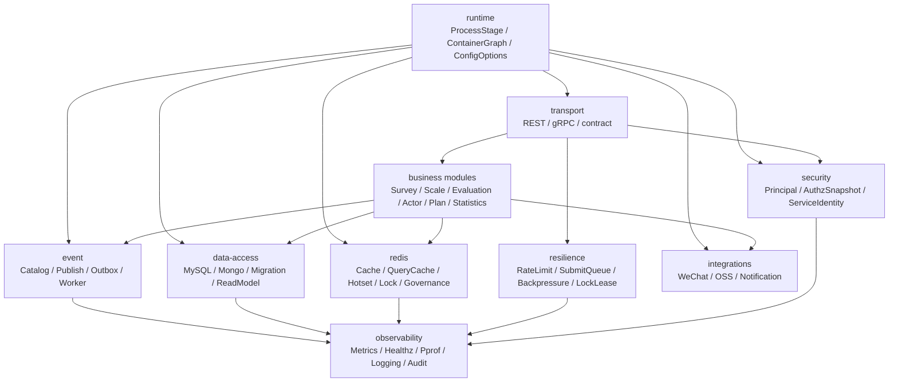

# 03-基础设施

**本文回答**：`03-基础设施` 这一组文档负责解释 qs-server 的哪些横切机制；它与 `01-运行时`、`02-业务模块`、`04-接口与运维`、`05-专题分析` 如何分工；事件、数据访问、Redis、韧性治理、安全、外部集成、运行时组合和可观测性应该按什么顺序阅读。

---

## 30 秒结论

| 维度 | 结论 |
| ---- | ---- |
| 文档定位 | `03-基础设施` 是 qs-server 的**横切机制真值层**，负责解释事件、存储、缓存、锁、限流、认证授权、外部集成、运行时组合和可观测性如何落在代码里 |
| 不负责 | 不重复业务聚合模型，不重写 REST/gRPC 接口清单，不替代部署运维手册，不讲历史设计稿 |
| 真值顺序 | 源码与配置 > contract tests / migration > 本目录文档 > 设计讨论 > `_archive` |
| 第一入口 | 先读本文，再读 [横切能力矩阵.md](./横切能力矩阵.md)，再按问题进入 event / data-access / redis / resilience / security / integrations / runtime / observability |
| 事件真值 | 事件类型、topic、delivery、handler 以 `configs/events.yaml` 为准 |
| 存储真值 | repository / mapper / migration / outbox store 是存储边界事实源 |
| Redis 真值 | `cacheplane`、`cacheentry`、`cachequery`、`locklease`、`cachegovernance` 分别表达 cache、query cache、lock 和治理 |
| Resilience 真值 | `resilienceplane` 只定义 bounded vocabulary 和 observer；具体保护点在 collection / apiserver / worker |
| Security 真值 | 权限以 IAM AuthzSnapshot 为真值，JWT roles 不作为业务 capability 真值 |
| Observability | 本次重建会补齐 metrics、healthz、pprof、logging、audit、governance endpoint 的总入口 |

一句话概括：

> **业务模块回答“这个系统做什么”，基础设施回答“跨模块机制如何可靠、可观测、可治理地工作”。**

---

## 1. 为什么需要 `03-基础设施`

qs-server 的业务模块已经拆成 Survey、Scale、Evaluation、Actor、Plan、Statistics 等边界。但这些模块不是孤立运行的，它们共同依赖一组横切机制：

```text
事件系统
数据访问
Redis 缓存/锁/治理
限流/队列/背压
IAM / Authz / Service Identity
WeChat / OSS / Notification
ProcessStage / ContainerGraph / ConfigOptions
Metrics / Healthz / Pprof / Logging / Audit
```

如果这些横切机制散落在业务文档里，会导致：

| 问题 | 后果 |
| ---- | ---- |
| 事件 delivery 不清楚 | best_effort 和 durable_outbox 被混用 |
| 存储边界不清楚 | Mongo / MySQL / read model / outbox 被误读成同一层 |
| Redis 能力不清楚 | cache、lock、hotset、warmup、limiter 混成一个“Redis 用法” |
| Resilience 语义不清楚 | 限流、队列、背压、重复抑制无法统一排障 |
| Security 边界不清楚 | JWT roles、Operator projection、IAM AuthzSnapshot 混为权限真值 |
| Runtime 组合不清楚 | container、client bundle、options 改动容易漏装配 |
| Observability 不清楚 | metrics/status/healthz/logging/audit 没有统一入口 |

所以 `03-基础设施` 要单独存在。

---

## 2. 本组文档不负责什么

| 不负责 | 应去哪里 |
| ------ | -------- |
| 业务聚合、实体、值对象和用例细节 | [../02-业务模块/README.md](../02-业务模块/README.md) |
| 三进程运行时链路和业务启动顺序 | [../01-运行时/README.md](../01-运行时/README.md) |
| REST / gRPC 具体接口契约和运维入口 | [../04-接口与运维/README.md](../04-接口与运维/README.md) |
| 为什么这样设计的长篇分析 | [../05-专题分析/README.md](../05-专题分析/README.md) |
| 历史方案、废弃设计、迁移记录 | [../_archive/README.md](../_archive/README.md) |
| 线上临时运维 Runbook | 运维文档或部署手册 |

本组文档重点写：

```text
机制
边界
配置锚点
源码锚点
测试门禁
排障入口
新增能力 SOP
```

---

## 3. 总体目录

```text
03-基础设施/
├── README.md
├── 横切能力矩阵.md
├── event/
├── data-access/
├── redis/
├── resilience/
├── security/
├── integrations/
├── runtime/
└── observability/
```

---

## 4. 横切能力总图



---

## 5. 阅读顺序

### 5.1 第一次理解基础设施

按顺序读：

```text
README
  -> 横切能力矩阵
  -> event/README
  -> data-access/README
  -> redis/README
  -> resilience/README
  -> security/README
```

读完后应能回答：

1. 哪些能力属于基础设施层，哪些属于业务模块？
2. 哪些事实以配置为准，哪些以源码为准？
3. 哪些事件必须 durable outbox？
4. 哪些缓存只是读优化？
5. 哪些权限来自 IAM AuthzSnapshot？
6. 哪些能力只是观测，不承担治理动作？

### 5.2 要排查异步链路

读：

```text
event/README
  -> event/00-整体架构.md
  -> event/02-Publish与Outbox.md
  -> event/03-Worker消费与AckNack.md
  -> event/05-观测与排障.md
```

适用场景：

- 答卷提交后没有评估。
- report.generated 没被消费。
- outbox pending/failed 堆积。
- worker Nack 或 poison message。
- 新增 event handler 不生效。

### 5.3 要改数据库、仓储、migration

读：

```text
data-access/README
  -> data-access/00-整体架构.md
  -> data-access/01-MySQL仓储与UnitOfWork.md
  -> data-access/02-Mongo文档仓储.md
  -> data-access/03-Migration与Schema演进.md
```

适用场景：

- 新增 MySQL 表。
- 新增 Mongo collection。
- 修改 repository。
- 增加 outbox store。
- 修改 statistics read model。
- 写 migration。

### 5.4 要改 Redis 缓存、锁、治理

读：

```text
redis/README
  -> redis/00-整体架构.md
  -> redis/01-运行时与Family模型.md
  -> redis/02-Cache层总览.md
  -> redis/06-Redis分布式锁层.md
  -> redis/07-缓存治理层.md
```

适用场景：

- 新增 ObjectCache。
- 新增 QueryCache。
- 新增 Hotset/WarmupTarget。
- 新增 LockSpec。
- 排查 Redis degraded。
- 修改 cache governance。

### 5.5 要改限流、队列、背压、重复抑制

读：

```text
resilience/README
  -> resilience/00-整体架构.md
  -> resilience/01-RateLimit入口限流.md
  -> resilience/02-SubmitQueue提交削峰.md
  -> resilience/03-Backpressure下游背压.md
  -> resilience/04-LockLease幂等与重复抑制.md
```

适用场景：

- 前台 submit 429。
- SubmitQueue 满。
- MySQL/Mongo/IAM 下游背压。
- scheduler leader lock 抢不到。
- worker duplicate suppression。
- Redis lock degraded。

### 5.6 要改安全能力

读：

```text
security/README
  -> security/00-整体架构.md
  -> security/01-Principal与TenantScope.md
  -> security/02-AuthzSnapshot与CapabilityDecision.md
  -> security/03-ServiceIdentity与mTLS-ACL.md
  -> security/04-OperatorRoleProjection.md
```

适用场景：

- 新增 capability。
- 修改 REST 权限中间件。
- 修改 internal gRPC 鉴权。
- 接入 service auth。
- 处理 IAM AuthzSnapshot。
- 同步 Operator role projection。

### 5.7 要改外部集成

读：

```text
integrations/README
  -> integrations/00-整体架构.md
  -> integrations/01-WeChat适配器.md
  -> integrations/02-ObjectStorage适配器.md
  -> integrations/03-Notification应用服务.md
```

适用场景：

- 新增小程序通知。
- 修改 WeChat token/cache。
- 接入 OSS。
- 修改 object storage。
- 新增外部第三方 adapter。

### 5.8 要改启动装配或配置

读：

```text
runtime/README
  -> runtime/00-整体架构.md
  -> runtime/01-ProcessStage.md
  -> runtime/02-ContainerGraph.md
  -> runtime/03-ConfigOptions.md
  -> runtime/04-ClientBundle.md
```

适用场景：

- 新增进程启动 stage。
- 修改 options。
- 新增 container dependency。
- 修改 apiserver / collection / worker client bundle。
- 改配置文件结构。

### 5.9 要改观测入口

读：

```text
observability/README
  -> observability/00-整体架构.md
  -> observability/metrics.md
  -> observability/Healthz.md
  -> observability/Pprof.md
  -> observability/Logging.md
  -> observability/Audit.md
  -> observability/GovernanceEndpoint.md
```

适用场景：

- 新增 metrics。
- 新增 healthz/readyz 检查。
- 开启 pprof。
- 规范日志字段。
- 接入审计。
- 新增 governance status endpoint。

---

## 6. 各子目录职责

### 6.1 event

`event/` 负责事件系统：

| 文档 | 负责 |
| ---- | ---- |
| README | 阅读地图 |
| 00-整体架构 | eventcatalog、publisher、outbox、worker、observability 总图 |
| 01-事件目录与契约 | `configs/events.yaml`、topic、delivery、handler |
| 02-Publish与Outbox | best_effort、durable_outbox、relay |
| 03-Worker消费与AckNack | worker handler registry、Ack/Nack、poison message |
| 04-新增事件SOP | 新增事件时的 contract / publish / consume / tests |
| 05-观测与排障 | event metrics、outbox backlog、worker outcome |
| 06-MQ 选型与分析 | NSQ 选择理由与 MQ 对比 |

事件配置真值是：

```text
configs/events.yaml
```

---

### 6.2 data-access

`data-access/` 负责持久化机制：

| 文档 | 负责 |
| ---- | ---- |
| README | 阅读地图 |
| 00-整体架构 | repository、mapper、PO/document、UnitOfWork、read model 总图 |
| 01-MySQL仓储与UnitOfWork | MySQL repository、GORM、transaction runner |
| 02-Mongo文档仓储 | Mongo repository、document mapper、durable submit |
| 03-Migration与Schema演进 | migration 文件、执行边界、schema 演进 |
| 04-ReadModel与Statistics | statistics read model、projection、查询边界 |
| 05-新增持久化能力SOP | 新表/集合/repository/migration/read model 增加流程 |

---

### 6.3 redis

`redis/` 负责 Redis 及非结构化运行时能力：

| 文档 | 负责 |
| ---- | ---- |
| README | 阅读地图 |
| 00-整体架构 | Redis 四层架构、三进程角色 |
| 01-运行时与Family模型 | family/profile/namespace/fallback |
| 02-Cache层总览 | object/query/static/hotset 分流 |
| 03-ObjectCache主路径 | read-through、negative cache、compression |
| 04-QueryCache与StaticList | versioned query cache、ScaleListCache |
| 05-Hotset与WarmupTarget模型 | hotset、warmup target、scope |
| 06-Redis分布式锁层 | locklease、leader/idempotency/duplicate |
| 07-缓存治理层 | coordinator、manual warmup、repair complete |
| 08-观测降级与排障 | family status、metrics、degraded |
| 09-新增Redis能力SOP | 新缓存/锁/target 增加流程 |

---

### 6.4 resilience

`resilience/` 负责高并发保护与降级：

| 文档 | 负责 |
| ---- | ---- |
| README | 阅读地图 |
| 00-整体架构 | Resilience plane 总图 |
| 01-RateLimit入口限流 | HTTP/local/Redis limiter |
| 02-SubmitQueue提交削峰 | collection SubmitQueue |
| 03-Backpressure下游背压 | MySQL/Mongo/IAM in-flight protection |
| 04-LockLease幂等与重复抑制 | lock、idempotency、duplicate suppression |
| 05-观测降级与排障 | outcome、metrics、degraded |
| 06-新增高并发治理能力SOP | 新保护点增加流程 |
| 07-能力矩阵 | 所有保护点横向对比 |

---

### 6.5 security

`security/` 负责安全控制面：

| 文档 | 负责 |
| ---- | ---- |
| README | 阅读地图 |
| 00-整体架构 | principal、scope、authz、service identity 总图 |
| 01-Principal与TenantScope | 身份和租户范围 |
| 02-AuthzSnapshot与CapabilityDecision | IAM 授权快照和能力判断 |
| 03-ServiceIdentity与mTLS-ACL | service auth、mTLS、ACL |
| 04-OperatorRoleProjection | Operator 本地角色投影 |
| 05-新增安全能力SOP | 新 capability / scope / service auth 增加流程 |

---

### 6.6 integrations

`integrations/` 负责外部适配：

| 文档 | 负责 |
| ---- | ---- |
| README | 阅读地图 |
| 00-整体架构 | port/adapter/SDK/cache 总图 |
| 01-WeChat适配器 | WeChat token、QR、subscribe message |
| 02-ObjectStorage适配器 | OSS public object store |
| 03-Notification应用服务 | task opened 等通知应用服务 |
| 04-新增外部集成SOP | 新 SDK/HTTP/OSS/notification 增加流程 |

---

### 6.7 runtime

`runtime/` 负责基础设施视角的启动组合：

| 文档 | 负责 |
| ---- | ---- |
| README | 阅读地图 |
| 00-整体架构 | process、stage、container、options 总图 |
| 01-ProcessStage | 进程启动阶段模型 |
| 02-ContainerGraph | apiserver/collection/worker container graph |
| 03-ConfigOptions | configs -> options -> runtime deps |
| 04-ClientBundle | gRPC/SDK/infra clients 组合 |

---

### 6.8 observability

`observability/` 负责可观测性：

| 文档 | 负责 |
| ---- | ---- |
| README | 阅读地图 |
| 00-整体架构 | metrics、healthz、pprof、log、audit、governance 总图 |
| metrics.md | Prometheus metrics 命名、标签、低基数原则 |
| Healthz.md | liveness/readyz/health dependency |
| Pprof.md | pprof 启用和排障边界 |
| Logging.md | 结构化日志、字段约定、错误上下文 |
| Audit.md | 审计事件和安全/业务操作追踪 |
| GovernanceEndpoint.md | cache/resilience/event/status 等只读治理入口 |

---

## 7. 横切能力矩阵怎么用

`横切能力矩阵.md` 是本目录的快速索引。它应该回答：

```text
这个问题属于哪个 plane？
状态入口在哪里？
治理动作是否存在？
truth layer 是谁？
应该执行哪些 Verify？
```

例如：

| 问题 | Plane |
| ---- | ----- |
| report.generated 没消费 | event |
| submit 429 | resilience |
| Redis degraded | redis |
| capability denied | security |
| migration 失败 | data-access |
| WeChat 通知失败 | integrations |
| container nil dependency | runtime |
| metrics label 爆炸 | observability |

---

## 8. 基础设施维护原则

### 8.1 不混写业务事实

基础设施文档不应直接定义：

- Questionnaire 状态。
- AnswerSheet 提交规则。
- Scale 因子。
- Assessment 状态。
- Testee 标签。
- Plan task 状态。
- Statistics 统计口径。

这些应回到业务模块。

### 8.2 不跳过配置真值

如果机制受配置驱动，必须回链配置：

- `configs/events.yaml`
- `configs/*.yaml`
- `options.Options`
- migration files
- proto/openapi contract
- Redis keyspace builder
- locklease specs

### 8.3 不从 handler 直达 infra

新增能力时通常应遵守：

```text
interface / handler
  -> application service
  -> port
  -> infrastructure adapter
```

不要让 handler 直接操作 DB、Redis、MQ 或外部 SDK，除非这是明确的薄适配层。

### 8.4 观测标签必须低基数

Metrics / resilience / cache / event / security 的 observer labels 不能包含：

- user id。
- request id。
- task id。
- assessment id。
- raw lock key。
- raw cache key。
- 任意高基数字段。

### 8.5 governance 默认只读

治理入口默认只读：

- status。
- metrics。
- hotset。
- snapshot。
- backlog summary。

真正的 repair / warmup / manual action 必须有独立 SOP 和权限边界。

---

## 9. 常见误区

### 9.1 “基础设施文档应该重复业务主链路”

不应该。基础设施文档讲机制，业务链路回到 `02-业务模块` 和 `00-总览`。

### 9.2 “事件配置写了就代表事件可靠”

不够。还要看 delivery、publisher、outbox stage、relay、worker handler、Ack/Nack 和观测。

### 9.3 “Redis 命中就是事实正确”

错误。Redis cache 是读优化；事实源通常在 MySQL/Mongo/read model。

### 9.4 “JWT roles 就是权限真值”

不应这样理解。业务 capability 应以 IAM AuthzSnapshot 为准，Operator roles 只是本地 projection。

### 9.5 “resilienceplane 会自动限流”

不会。它定义 outcome vocabulary 和 observer；具体限流、队列、背压在各 adapter/应用处实现。

### 9.6 “governance endpoint 可以随便做 repair”

不应默认如此。多数 governance endpoint 应只读；repair/warmup 必须显式受控。

---

## 10. 修改本组文档的 Verify

基础文档检查：

```bash
make docs-hygiene
git diff --check
```

若修改事件系统：

```bash
go test ./internal/pkg/eventcatalog ./internal/apiserver/application/eventing ./internal/apiserver/outboxcore ./internal/worker/handlers
```

若修改 data-access：

```bash
go test ./internal/pkg/database/mysql ./internal/apiserver/infra/mongo ./internal/apiserver/infra/mysql/... ./internal/pkg/migration/...
```

若修改 Redis：

```bash
go test ./internal/pkg/cacheplane ./internal/pkg/locklease ./internal/apiserver/infra/cache ./internal/apiserver/infra/cachequery ./internal/apiserver/application/cachegovernance
```

若修改 resilience：

```bash
go test ./internal/pkg/resilienceplane ./internal/pkg/middleware ./internal/pkg/backpressure ./internal/collection-server/application/answersheet ./internal/worker/handlers
```

若修改 security：

```bash
go test ./internal/pkg/securityplane ./internal/pkg/securityprojection ./internal/pkg/serviceauth ./internal/pkg/middleware ./internal/pkg/grpc ./internal/apiserver/transport/rest/middleware
```

若修改 integrations：

```bash
go test ./internal/apiserver/infra/wechatapi ./internal/apiserver/infra/objectstorage/... ./internal/apiserver/application/notification
```

若修改 runtime：

```bash
go test ./internal/apiserver/container ./internal/apiserver/runtime/... ./internal/pkg/process
```

若修改 observability：

```bash
go test ./internal/pkg/... ./internal/apiserver/transport/rest ./internal/apiserver/runtime/scheduler
```

---

## 11. 重建顺序

本次文档重建建议按以下顺序：

```text
README.md
横切能力矩阵.md
event/
data-access/
redis/
resilience/
security/
integrations/
runtime/
observability/
```

原因：

1. README 先确定全局边界。
2. 横切矩阵建立排障导航。
3. event 和 data-access 是主链路可靠性底座。
4. redis 和 resilience 承接性能与高并发保护。
5. security 承接认证授权边界。
6. integrations 承接第三方适配。
7. runtime 统一装配和配置。
8. observability 最后把 metrics/status/logging/audit/governance 收口。

---

## 12. 下一跳

| 目标 | 文档 |
| ---- | ---- |
| 快速定位横切能力 | [横切能力矩阵.md](./横切能力矩阵.md) |
| 理解事件系统 | [event/README.md](./event/README.md) |
| 理解数据访问 | [data-access/README.md](./data-access/README.md) |
| 理解 Redis | [redis/README.md](./redis/README.md) |
| 理解高并发治理 | [resilience/README.md](./resilience/README.md) |
| 理解安全控制面 | [security/README.md](./security/README.md) |
| 理解外部集成 | [integrations/README.md](./integrations/README.md) |
| 理解运行时组合 | [runtime/README.md](./runtime/README.md) |
| 理解可观测性 | [observability/README.md](./observability/README.md) |
