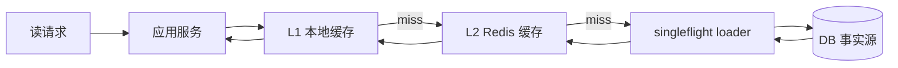

# 缓存模块整体架构

## 1. 解决什么问题

缓存模块解决读侧高频访问对 MongoDB / MySQL 的压力问题。问卷目录、测评模型、问卷结构、报告状态和部分列表读都具有明显的读多写少特征，直接查库会把高频读放大成事实源压力。

## 2. 所在位置

缓存位于 collection-server / qs-apiserver 的应用服务和数据访问层之间。collection-server 主要使用 L1 目录缓存和本地模型缓存，qs-apiserver 主要使用 Redis read-through、query cache、cache governance 和缓存信令。

## 3. 设计目标

| 目标 | 说明 |
| --- | --- |
| 降低 DB 压力 | 热点读优先命中 L1/L2 |
| 降低延迟抖动 | 服务启动、模型发布、目录访问使用预热或懒加载 |
| 避免缓存击穿 | singleflight、空值缓存、TTL jitter 和回源保护 |
| 支持多实例 | Redis 承接跨进程共享缓存 |
| 可降级 | Redis 异常时允许受控回源，避免缓存故障变成 DB 雪崩 |

## 4. 整体流程

## 5. 核心数据结构

| 数据类型 | 缓存位置 | 说明 |
| --- | --- | --- |
| 静态目录类 | L1 + L2 | 测评目录、量表目录、问卷摘要 |
| 模型资产类 | L1 + L2 | published model snapshot、ruleset catalog |
| 问卷结构类 | L1 + L2 | questionnaire detail、submission spec |
| 报告状态类 | L2 + 状态缓存 | completed / processing / failed / next_poll_after_ms |
| 临时防重类 | Redis 临时 key | SubmitGuard / LockLease |

## 6. 正常流程

读请求先查 L1，本地命中则直接返回；L1 未命中查 L2 Redis；L2 未命中通过 singleflight 回源 DB，加载后写回 L2 和 L1。目录和模型变更通过信令或主动失效刷新热点缓存。

## 7. 异常流程

Redis 异常时服务允许受控回源 DB，但必须经过 singleflight、超时、限流或并发保护。DB 回源失败时返回明确错误或降级为空结果，不能把错误数据写回缓存。

## 8. 幂等 / 降级 / 背压

缓存读取本身必须幂等。降级时优先使用短 TTL 旧值或受控回源；热点 key 回源通过 singleflight 合并；批量预热失败不能阻塞服务启动，必须在观测中暴露失败目标。

## 9. 可选方案

| 方案 | 问题 |
| --- | --- |
| 只查 DB | 简单但无法承接高频读 |
| 只用 Redis | 多实例一致性较好，但每次读都有网络开销，也会压 Redis |
| 只用本地缓存 | 低延迟，但多实例不共享，发布失效复杂 |
| 强一致缓存 | 复杂度高，不符合多数读模型最终一致边界 |

## 10. 当前方案取舍

当前采用 L1 + L2 + DB 事实源。L1 解决进程内热点重复解析，L2 解决多实例共享和状态缓存，DB 保持最终事实源。缓存一致性采用 TTL + 主动失效 + 事件/信令刷新，而不是把缓存做成强一致事实层。

## 11. 观测指标

| 指标 | 用途 |
| --- | --- |
| cache hit / miss | 判断读压力是否被缓存吸收 |
| Redis latency / error | 判断 L2 是否成为瓶颈 |
| loader duration | 判断回源是否变慢 |
| singleflight shared count | 判断热点击穿是否被合并 |
| warmup success / failed | 判断预热是否覆盖关键目标 |
| DB read QPS / slow query | 判断降级或穿透是否打到事实源 |

## 12. 代码事实源

| 事实 | 来源 |
| --- | --- |
| L1 TTL 与目录 read-through | [../../../internal/pkg/localttlcache](../../../internal/pkg/localttlcache)、[../../../internal/collection-server/application/catalogl1](../../../internal/collection-server/application/catalogl1) |
| L2 object / query cache | [../../../internal/apiserver/infra/cache](../../../internal/apiserver/infra/cache)、[../../../internal/apiserver/infra/cachequery](../../../internal/apiserver/infra/cachequery) |
| 缓存治理与预热 | [../../../internal/apiserver/application/cachegovernance](../../../internal/apiserver/application/cachegovernance) |
| keyspace / family / runtime | [../../../internal/pkg/cacheplane](../../../internal/pkg/cacheplane)、[../../../internal/apiserver/cachemodel](../../../internal/apiserver/cachemodel) |
| 信令契约 | [../../../configs/signals.yaml](../../../configs/signals.yaml) |
