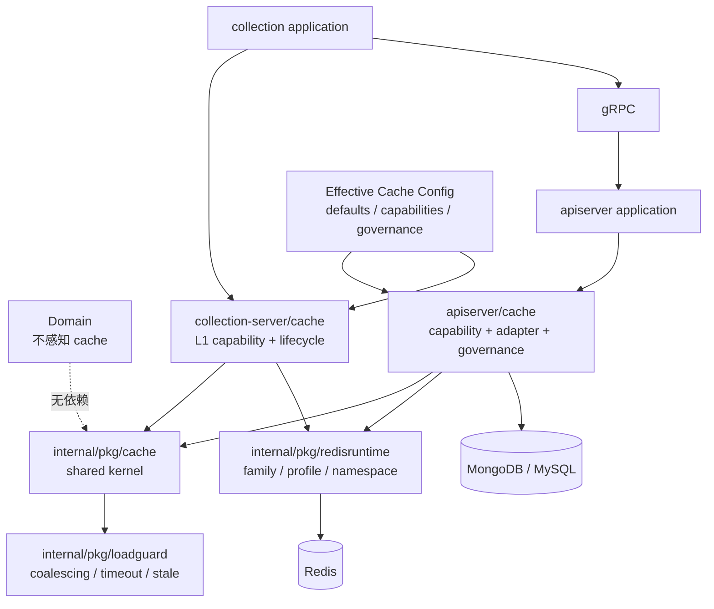

# Cache 终局设计

## 本文回答

本文锁定 qs-server cache 的最终 package、运行时、配置、治理和业务落位边界，并给出可以保持现有 key/payload/TTL 合同的分批迁移路线。

## 30 秒结论

qs-server 的 cache 终局由一个共享 kernel、两个进程级 capability module、一个独立 Redis runtime 和一套 capability-driven 配置治理组成。

- `internal/pkg/cache` 只回答“怎样缓存”；
- apiserver 与 collection-server 分别回答“缓存什么、在哪一层、何时读取、何时失效、何时预热”；
- `redis_runtime` 只回答“Redis workload 路由到哪里”；
- `cache.capabilities` 是 TTL、negative、coalescing 和 layer enablement 的唯一配置入口；
- `cache.governance` 只管理 warmup、hotset、policy snapshot/reload；
- domain 不依赖 cache；
- Redis lock、rank、signal、report operational state 不进入 cache kernel。

本文锁定最终目标边界。后续实现必须按批次迁移，结构移动和行为修复分开进行。

## 重点速查

| 问题 | 终局答案 | 状态 |
| --- | --- | --- |
| 共享能力放哪里 | `internal/pkg/cache` | 已实现 |
| 业务 capability 放哪里 | 各进程 `cache/catalog + adapter + bootstrap` | 已实现 |
| Cache-Aside 放哪里 | application query service 或 infrastructure decorator | 已锁定 |
| Redis family/profile 放哪里 | `internal/pkg/redisruntime` + `redis_runtime` 配置 | 已实现 |
| TTL/policy 配置放哪里 | `cache.defaults` + `cache.capabilities.<id>` | 已实现 |
| warmup/hotset/reload 放哪里 | `cache.governance` | 已实现 |
| IAM/JWKS 私有缓存放哪里 | 保留在 IAM integration 配置，登记统一观测 | 已锁定 |
| 如何知道最终生效值 | Effective Cache Config Registry + status view | 已实现 |

## 1. 设计目标

终局设计解决以下问题：

1. cache 代码有唯一、稳定的阅读入口；
2. L1、L2、query cache 共享基础机制，不重复实现 TTL、payload、singleflight 和指标；
3. 业务 loader、codec、key 和失效规则仍归业务 owner；
4. apiserver 与 collection-server 可以独立装配、降级和治理；
5. Redis runtime 不再用 cache 名义承载 lock、rank、ops 等非缓存 workload；
6. 新增 capability 时必须同时登记 policy、owner、失效、预热和观测；
7. Redis key、payload、TTL 和外部行为可以在分批迁移中保持兼容。
8. 每个配置项都能追到 capability、运行时消费者和最终 effective policy；
9. 同一缓存行为只有一个配置 Source of Truth，跨进程合同由测试保护。

## 2. 明确不做什么

终局不是一个万能 CacheManager，也不是把所有带 TTL 的 Redis 数据都改名为 cache。

以下内容明确不做：

- domain entity、aggregate 或 domain service 依赖 cache；
- `internal/pkg/cache` 导入 apiserver、collection-server 或任何业务 domain；
- 用一个高度参数化的泛型流程强行统一 L1、object cache、query cache 和 report status；
- 通过运行时反射、字符串 factory 或 service locator 注册 loader/codec；
- 把 `lock_lease`、`business_rank`、`ops_runtime` 当作普通 cache capability；
- 把所有 Redis、IAM/JWKS 或 HTTP Cache-Control 配置强行搬进顶层 `cache`；
- 在 package 迁移批次同时改变 Redis key、payload、TTL 或失效行为；
- 长期双读新旧 cache 配置，或静默接受互相冲突的两个配置源；
- 长期保留新旧 package forwarding wrapper。

## 3. 终局系统边界



依赖只能从进程和业务侧指向共享 kernel。共享 kernel 不知道 Redis family，也不知道 questionnaire、assessment、typology 等业务名称。

## 4. 目标目录结构

```text
internal/
├── pkg/
│   ├── cache/
│   │   ├── doc.go
│   │   ├── errors.go
│   │   ├── policy.go
│   │   ├── store.go
│   │   ├── codec.go
│   │   ├── observer.go
│   │   ├── local/
│   │   │   ├── cache.go
│   │   │   ├── detail.go
│   │   │   ├── multi.go
│   │   │   └── readthrough.go
│   │   ├── object/
│   │   │   ├── store.go
│   │   │   └── readthrough.go
│   │   ├── query/
│   │   │   ├── local_hot.go
│   │   │   ├── version_token.go
│   │   │   └── versioned.go
│   │   ├── redis/
│   │   │   ├── store.go
│   │   │   └── payload.go
│   │   └── observe/
│   │       ├── observer.go
│   │       └── metrics.go
│   ├── loadguard/
│   └── redisruntime/
│       ├── family.go
│       ├── catalog.go
│       ├── runtime.go
│       ├── options.go
│       ├── keyspace/
│       ├── bootstrap/
│       └── observability/
│
├── apiserver/
│   └── cache/
│       ├── doc.go
│       ├── catalog/
│       │   ├── capability.go
│       │   ├── specs.go
│       │   ├── config.go
│       │   ├── effective.go
│       │   └── policy_provider.go
│       ├── keyspace/
│       ├── adapter/
│       │   ├── questionnaire.go
│       │   ├── published_model.go
│       │   ├── assessment.go
│       │   ├── testee.go
│       │   └── plan.go
│       ├── governance/
│       │   ├── target/
│       │   ├── hotset/
│       │   └── model/
│       └── subsystem/
│
└── collection-server/
    └── cache/
        ├── doc.go
        └── subsystem.go
```

`internal/pkg/cache`、`internal/apiserver/cache` 和 `internal/collection-server/cache` 是三个不同 package namespace，不形成一个跨进程全局 manager。

## 5. Shared Cache Kernel

### 5.1 核心类型

共享 kernel 只定义技术语义：

```go
package cache

type Capability string

type Policy struct {
    TTL          time.Duration
    NegativeTTL  time.Duration
    Negative     PolicySwitch
    Compress     PolicySwitch
    Singleflight PolicySwitch
    JitterRatio  float64
}

type Store interface {
    Get(context.Context, string) ([]byte, error)
    Set(context.Context, string, []byte, time.Duration) error
    Delete(context.Context, string) error
    Exists(context.Context, string) (bool, error)
}

```

`Capability` 是低基数、稳定的观测与 policy lookup 标识；具体 capability 名由进程级 catalog 定义。

### 5.2 错误语义

共享 kernel 统一以下错误分类：

```go
var ErrMiss = errors.New("cache not found")
```

规则：

- `ErrMiss` 是正常控制流；
- Redis unavailable 与 corrupt payload 由 object/query kernel 按现有 fail-open 合同回源并记录 degraded；
- source loader error 原样返回，不能翻译成 cache miss；
- cache 写失败默认不覆盖已经成功的业务读取或写入结果。

### 5.3 不设计万能 ReadThrough

共享 kernel 提供两个明确流程：

- `local.ReadThrough`：clone、nil miss、进程内 L1；
- `object.ReadThrough`：Redis payload、negative cache、async writeback。

`query.Versioned` 独立维护 version-token + versioned-key，不通过 object read-through 模拟。

三个流程可以共享 `Policy`、`Store`、`Observer` 和 `loadguard.Coalescer`，但不共享一个包含大量可选 callback 的 Options 类型。

### 5.4 回源保护

所有 cache miss 合并复用 [`internal/pkg/loadguard`](../../../internal/pkg/loadguard)：

- capability bootstrap 根据 `Policy.Singleflight` 创建 `Coalescer`；
- coalescing key 必须包含 `capability + cache key`；
- nil miss 和 loader error 不驻留在 singleflight 中；
- shared loader 的 context 语义沿用 `loadguard.Coalescer` 合同；
- 删除当前 cache package 的全局 `SetDefaultSingleflightCoordinator`；
- 不引入新的 package global mutable coordinator。

### 5.5 动态 Policy Snapshot

终局支持运行期替换 TTL/policy，但采用不可变 snapshot，而不是直接修改正在使用的 map：

```go
type PolicyProvider interface {
    Resolve(cache.Capability) (cache.Policy, bool)
    Version() uint64
}

type Snapshot struct {
    Version  uint64
    Policies map[cache.Capability]cache.Policy
}
```

行为约束：

- bootstrap 校验配置后原子替换完整 snapshot；
- 每次新 entry 写入前解析当前 policy；
- 已存在 entry 保留写入时 expiry，不批量改写；
- policy reload 失败时继续使用上一个有效 snapshot；
- reload 产生 version、成功/失败指标和审计日志；
- `TTL <= 0` 的含义必须由 capability spec 明确为 disable、inherit 或 no-expiry，不能隐式猜测。

动态 policy 是后续行为批次；纯 package 迁移阶段继续保持当前启动时固定策略。

## 6. Capability Catalog

### 6.1 进程级 Spec

共享 kernel 不保存业务 registry。每个进程维护自己的 typed spec：

```go
type Spec struct {
    Name           cache.Capability
    Tier           Tier
    RedisFamily    redisruntime.Family
    DefaultPolicy  cache.Policy
    AllowWarmup    bool
    AllowNegative  bool
    AllowStale     bool
}
```

apiserver catalog 登记 questionnaire、published model、assessment detail、assessment list、testee、plan 和 statistics query。

collection catalog 登记 questionnaire detail 与 typology detail/list/categories。没有 L2 的 capability 不设置 Redis family。

### 6.2 Catalog 不保存什么

Spec 不保存：

- Redis client；
- loader function；
- domain repository；
- codec instance；
- signal watcher；
- warmup executor；
- transport DTO。

这些依赖由明确 constructor 和 bootstrap wiring 连接，避免动态 service locator。

### 6.3 Source of Truth

代码级 catalog 是 policy/family/default 的事实源；[`09-Cache能力注册表.md`](09-Cache能力注册表.md) 是跨进程 owner、loader、失效、预热和观测的人工审计视图。

新增 capability 时两者必须在同一变更更新，并由测试校验已知 capability 集合。

## 7. 配置治理

### 7.1 配置边界

终局配置按职责分成三层，不能因为都使用 Redis 而放入同一个 `cache` 配置对象：

| 配置域 | 负责什么 | 不负责什么 |
| --- | --- | --- |
| `redis` / `redis_profiles` | 连接、连接池、物理 profile | TTL、negative、warmup |
| `redis_runtime` | family 到 profile/namespace 的路由、fallback、availability | 业务 capability 和 cache-aside policy |
| `cache` | defaults、capabilities、governance | lock、rank、ops 等非缓存 workload |
| integration 私有配置 | IAM/JWKS、WeChat SDK 等适配器私有缓存 | 主 cache capability 的通用 policy |

`lock_lease`、`business_rank`、`ops_runtime` 只存在于 Redis runtime 或所属 workload 配置中。它们不允许出现 compress、negative、singleflight 等普通 cache policy。

### 7.2 当前配置债务

以下是 2026-07-13 对生产配置和运行时消费者逐项追踪后的确认事实，迁移时不能将其误当作有效合同：

| 当前配置 | 当前运行时事实 | 终局处理 |
| --- | --- | --- |
| apiserver `cache.meta` | process 装配明确丢弃，meta hotset 没有对象级 policy consumer | 删除；hotset 参数归 `cache.governance.hotset` |
| apiserver `cache.sdk` | family policy 被构造，但没有对象 Policy Key 消费 | 删除通用 family policy；WeChat SDK capability 保持 adapter-owned TTL |
| apiserver `cache.lock` | family policy 不可达，且 lock 不是 cache | 删除；只保留 `redis_runtime.families.lock_lease` |
| collection `scale_cache` | options/validation/YAML 存在，catalog registry 无 scale spec | 删除或标记 planned；恢复真实 L1 owner 前不得标记 enabled |
| collection `wait_report.pubsub_channel` | 被解析和校验，运行时未读取 | 删除；统一使用 `signaling.redis` |
| `wait_report.status_ttl_seconds` 与 `report_status.ttl_seconds` | 分别控制 DB fallback write 与 reporter write，可独立漂移 | 合并为 `report.status` capability 的唯一 TTL |
| family `negative/singleflight` | 对象 policy 存在硬编码覆盖，YAML 不等于最终行为 | 下沉到 capability effective policy，禁止隐式覆盖 |

### 7.3 目标配置形态

apiserver 的目标配置以稳定 capability ID 为入口：

```yaml
redis:
  # 连接和连接池

redis_profiles:
  # 物理 DB/profile

redis_runtime:
  families:
    static_meta:
      redis_profile: static_cache
      namespace_suffix: cache:static
    lock_lease:
      redis_profile: lock_cache
      namespace_suffix: cache:lock

cache:
  defaults:
    compress: false
    jitter_ratio: 0.2
    coalesce: true

  capabilities:
    catalog.questionnaire:
      enabled: true
      layer: l2
      family: static_meta
      ttl: 2h
      negative_ttl: 5m
      negative: true
      coalesce: true

    evaluation.assessment_detail:
      enabled: true
      layer: l2
      family: object_view
      ttl: 1h

    report.status:
      enabled: true
      layer: operational
      family: ops_runtime
      ttl: 48h

  governance:
    warmup: {}
    hotset: {}
    policy_reload: {}
```

collection-server 使用同一个概念 capability ID，但只描述本进程持有的 L1：

```yaml
cache:
  capabilities:
    catalog.questionnaire:
      l1:
        enabled: true
        ttl: 3m
        jitter_ratio: 0.2
        max_entries: 256
        coalesce: true
        signal_evict: true

    catalog.typology_model:
      l1:
        enabled: true
        ttl: 3m
        jitter_ratio: 0.2
        max_entries: 256
        coalesce: true
        signal_evict: true
```

同名 capability 可以在不同进程拥有不同 layer policy，但 key/payload/invalidation 等跨进程合同仍由 capability spec 和 Registry 共同约束。

### 7.4 Effective Cache Config Registry

配置解析后必须生成不可变 effective registry；业务 adapter 只读取该 registry，不再直接读取散落的 Options：

```go
type EffectiveCapability struct {
    Name       cache.Capability
    Owner      string
    Layer      Tier
    Enabled    bool
    Family     redisruntime.Family
    Policy     cache.Policy
    Warmup     WarmupPolicy
    Source     ConfigSource
}

type EffectiveRegistry interface {
    Resolve(cache.Capability) (EffectiveCapability, bool)
    Version() uint64
    All() []EffectiveCapability
}
```

约束：

- code catalog 提供 capability 集合、默认值和允许的 policy 维度；
- YAML/flag/env 只能覆盖 spec 明确允许覆盖的字段；
- unknown capability、unknown field、非法 layer/family 组合必须启动失败；
- 同一行为同时出现 legacy 与新配置时必须报冲突，不能静默选择其一；
- status view 输出 default、override、source、effective value 和 snapshot version；
- policy reload 只能原子替换通过完整校验的 effective registry；
- entry 写入时读取当前 snapshot，已存在 entry 不追溯改写 TTL。

### 7.5 跨进程与私有配置

`report.status` 的 key、payload、状态优先级和 TTL 是 apiserver、collection-server、worker 的跨进程合同。三端可以各自装配，但 TTL 必须来自同一个 capability contract，并由生产配置合同测试验证一致。

以下配置继续由所属集成拥有：

- `iam.jwks.cache-ttl`：身份验证可用性与安全策略；
- `iam.user-cache`、`iam.profile-link-cache`：IAM client 内部 L1；
- WeChat SDK token timeout：第三方 SDK adapter per-write TTL；
- HTTP `Cache-Control`：客户端/CDN 缓存合同。

这些私有缓存需要登记 capability 名称和统一 observe adapter，但不强制使用主 cache policy provider。

### 7.6 兼容迁移规则

配置迁移允许一个明确版本窗口的兼容读取，但必须满足：

1. legacy 与新字段映射有 characterization test；
2. 两者同时出现时值不一致即启动失败；
3. effective status 标记实际来源为 `legacy` 或 `capability`；
4. deprecated 字段产生启动告警和计数指标；
5. 迁移窗口结束后删除 legacy struct、flag、validation 和 YAML；
6. 无消费者字段不得为了“兼容”永久保留。

## 8. Cache-Aside 的业务落位

### 8.1 Domain

domain 不导入 cache package，不包含 cache key、TTL、hit/miss 或 invalidation 逻辑。

### 8.2 Transparent Entity Cache

assessment、testee、plan、questionnaire 等对 application 透明的实体缓存使用 infrastructure decorator：

```text
application -> Repository port -> CachedRepository -> DB Repository
```

decorator 负责 key、codec、cache-aside 和写后失效，application 不感知命中状态。

### 8.3 Query/Result Cache

assessment list、statistics 等 usecase-sensitive 查询由 application 显式编排，并依赖 consumer-owned cache port：

```text
application QueryService -> typed Cache port -> cache/query adapter
                         -> ReadModel
```

application 决定 query identity、何时 invalidate、是否允许 stale；adapter 决定 Redis、序列化和 version token 细节。

### 8.4 Collection BFF L1

questionnaire/typology 的 application service 继续持有业务命名的 L1 cache port，因为它缓存的是 BFF DTO，并合并 gRPC loader。

实现由 `collection-server/cache/catalog` 提供，底层复用 `internal/pkg/cache/local`。

### 8.5 Consumer-Owned Ports

cache port 定义在消费方，例如当前 `questionnaire.PublishedDetailCache`、`typologymodel.CatalogCache` 和 `statisticscache.Cache`。共享 kernel 不导出包含所有业务方法的 provider-owned interface。

## 9. L1 + L2 链路

终局承认两种 L1+L2：

### 9.1 跨进程 Catalog 链路

```text
collection L1
  -> gRPC
  -> apiserver L2
  -> Mongo/MySQL
```

它不是同一个 cache client 内的两级缓存。collection L1 和 apiserver L2 分别有独立 policy、状态和降级行为。

### 9.2 进程内 Query 链路

```text
apiserver local hot L1
  -> Redis query-result L2
  -> read model
```

该链路由 `cache/query.Versioned` 实现，并通过 version token 失效。

禁止为了形式统一，把跨进程 catalog 链路包装成一个同时知道 gRPC 与 Redis 的共享 `MultiLevelCache`。

## 10. Key 与数据契约

### 10.1 Key Ownership

- `redisruntime/keyspace` 只负责 namespace composition；
- apiserver cache key 放在 `apiserver/cache/keyspace`；
- collection L1 key 由对应 catalog adapter 持有；
- lock、rank、ops key 放在各自 capability package，不进入 cache keyspace。

### 10.2 Key Strategy

- object/detail 使用可直接删除的稳定 key；
- query/list 优先使用 version token，避免 `SCAN`/pattern delete；
- key 必须包含 schema/version 维度，变更 payload contract 时升 key version；
- 不允许 application service 手写裸 Redis key；
- package 迁移阶段 Redis key 字节必须完全不变。

### 10.3 Payload Contract

- codec 由业务 adapter 提供；
- compression 由共享 Redis payload store 执行；
- decoder 必须兼容迁移前 payload，或通过新 key version 隔离；
- nil、empty payload 和 negative sentinel 必须是不同语义；
- payload 格式变化需要兼容性测试，不能作为目录重组附带修改。

## 11. 一致性与失效顺序

普通 cache-aside 写链路固定为：

```text
1. 提交 DB / 业务事实
2. 删除 L2 key 或 bump query version
3. 发布 best-effort L1 invalidation signal
4. 可选执行异步 warmup
5. TTL 作为最终兜底
```

约束：

- DB 提交失败不得修改 cache；
- DB 已提交后 cache invalidation 失败不回滚业务事实；
- invalidation 失败必须记录 capability、key kind 和错误；
- signal 不是可靠事件，不承担业务一致性；
- 需要可靠修复时使用 outbox/domain event 驱动 invalidation，而不是增强 Redis signaling 的业务地位；
- negative cache 在对象创建/发布后必须与正向 key 一起失效。

## 12. Warmup 终局语义

warmup 属于进程级 governance，不属于共享 kernel。

```go
type Warmer interface {
    Warm(context.Context, Target) (WarmResult, error)
}

type WarmResult struct {
    Capability cache.Capability
    Target     string
    Filled     int
    AlreadyHot int
}
```

成功标准：

- 调用与在线读路径相同的 cache-aside/Prime adapter；
- 确认目标 entry 已命中或成功写入；
- 仅调用未缓存 repository 方法不能报告 warmup success；
- 单个 target 失败不阻断其它 target；
- startup warmup 不阻断进程 ready，除非该 capability 明确配置为 required；
- manual、startup、publish、repair 使用同一 executor registry；
- collection startup L1 warmup 独立运行，但采用相同 result/metrics 语义。

当前 scale/typology warmup 的未闭环问题必须在行为批次修复，不能在 package 移动中静默改变。

## 13. 降级与失败语义

| 能力 | Redis/L1 不可用时 | Source 不可用时 |
| --- | --- | --- |
| Entity/Object cache | fail-open，受保护回源 | 返回 source error；可按明确策略使用 stale |
| Query cache | miss 后经 loadguard 回源 | 按 usecase 配置 stale/timeout/error |
| Collection L1 | 直接调用 gRPC | 返回 gRPC error |
| SDK token | 使用 SDK memory fallback 或重新获取 | 返回 SDK/provider error |
| Warmup | 记录 skipped/error，不污染在线读 | 记录 target error |

report status、lock、idempotency 和 rank projection 不套用上表，因为它们不是普通 cache-aside capability。

## 14. 可观测性

### 14.1 Cache 指标

共享 cache observe 使用稳定低基数标签：

```text
component
capability
tier        = l1 | l2
operation   = get | set | delete | load | invalidate
result      = hit | miss | ok | error | unavailable | corrupt | stale
```

不得把业务 ID、原始 key、组织 ID 或问卷编码作为 metric label。

### 14.2 Redis Runtime 指标

family/profile/namespace/fallback/degraded 属于 `redisruntime/observability`，不再与 cache hit/miss 混为同一模型。

### 14.3 Status View

治理状态组合展示：

- capability 与 default/override/effective policy、配置来源、snapshot version；
- L1/L2 enable 状态；
- Redis family availability；
- latest warmup result；
- hotset size；
- consecutive cache failures；
- reload 成功/失败时间。

status view 可以组合两个数据源，但 cache kernel 不依赖 Redis runtime status。

## 15. Bootstrap 与生命周期

### 15.1 apiserver

`apiserver/cache/bootstrap.Subsystem` 负责：

- 校验并构造 capability catalog；
- 解析 Redis family handle；
- 构造 policy snapshot/provider；
- 构造 cache observer；
- 构造 hotset 与 governance；
- 绑定业务 warmer；
- 暴露 status service；
- 启动和停止 signal watcher/warmup loop。

业务 module wiring 通过明确 dependency bundle 获取 Store、PolicyProvider、Observer 或 typed adapter，不通过全局变量获取 cache。

### 15.2 collection-server

`collection-server/cache/bootstrap.Subsystem` 负责：

- 构造 questionnaire/typology L1 adapter；
- 注入 application QueryService；
- 启动和停止 signal watcher；
- 执行 startup warmup；
- 暴露 L1 status/metrics。

container 只持有 subsystem，不再直接维护 watcher cancel slice 和各类 cache registry 分支。

### 15.3 生命周期约束

- 所有 watcher/goroutine 必须绑定 process context；
- subsystem 暴露显式 `Start(ctx)` / `Close()`；
- constructor 不隐式启动 goroutine；
- package global 只允许 immutable spec，不允许 runtime client/coalescer/policy；
- Start/Close 幂等，并有 lifecycle test。

## 16. Redis Runtime 边界

当前 `cacheplane` 终局重命名为 `internal/pkg/redisruntime`。

它负责：

- workload family；
- profile resolution；
- namespace；
- fallback/default；
- availability/degraded；
- runtime handle；
- shared process bootstrap。

它不负责：

- cache policy；
- negative cache；
- codec；
- read-through；
- query version；
- warmup target；
- business invalidation。

`static_meta/object_view/query_result/meta_hotset/sdk_token` 可以被 cache capability 使用；`business_rank/lock_lease/ops_runtime` 由其它 runtime capability 使用。

## 17. Architecture Guardrails

终局必须由架构测试保护：

1. `internal/pkg/cache` 不导入 apiserver、collection-server、domain、transport；
2. domain 不导入任何 cache package；
3. application 不导入 go-redis 或 Redis store implementation；
4. application 只依赖 consumer-owned cache port、`cache.Capability` 或 target model；
5. `cache/object` 不导入 `cache/query`、governance 或业务 adapter；
6. `cache/query` 不导入业务 domain；
7. governance 不导入 Redis client 或业务 repository 实现；
8. `redisruntime` 不导入 cache；
9. `cache/bootstrap` 是唯一允许同时依赖 runtime 与多个 cache capability package 的层；
10. 旧 package 路径在迁移完成后不得重新出现；
11. cache capability adapter 不直接读取 Viper、process Options 或环境变量，只读取 typed effective registry；
12. `redisruntime` 配置不得出现 negative、compression、coalescing 等 cache policy；
13. 未登记 capability 的 `cache.capabilities.*` 配置必须启动失败；
14. 每个 production cache 配置字段必须有消费者测试或显式 deprecation 记录。

## 18. 测试保护矩阵

| 层 | 必须保护的合同 |
| --- | --- |
| `cache/local` | TTL、jitter、capacity、clone、hit/miss、nil、并发 |
| `cache/object` | miss、negative、codec error、async write、singleflight、source error |
| `cache/query` | local hot、L2、version current/bump、invalidate、marshal error |
| `cache/redis` | Redis Nil、unavailable、TTL、payload、compression |
| apiserver catalog | capability 集合、family、default、override、policy version |
| effective config | legacy mapping、unknown/reject、conflict、source、snapshot、跨进程合同 |
| entity adapter | key 不变、loader、写后失效、Redis fail-open |
| collection adapter | DTO clone、gRPC load、signal evict、prefix delete |
| governance | target parse、executor dispatch、filled result、skip/error/status |
| bootstrap | wiring、nil/degraded、Start/Close、goroutine cancel |
| architecture | package import allowlist/denylist |

## 19. 分批实施路线

### Batch 0：冻结合同

- 保留并补齐 Registry；
- 增加 Redis key、TTL、policy matrix、metrics label characterization tests；
- 输出 apiserver/collection/worker 当前 Effective Cache Config baseline；
- 建立 production YAML 字段到运行时消费者的审计清单；
- 锁定 `report.status` 三进程 TTL/key/payload 合同；
- 增加目标依赖方向 architecture test；
- 建立当前全量 cache baseline；
- 不移动生产代码。

### Batch 1：建立共享基础类型

- 新建 `internal/pkg/cache`；
- 迁移 Policy、Switch、TTL jitter、Store、Codec、错误分类；
- 保持旧调用路径行为；
- 同批切换调用者并删除已替代旧定义，避免长期 alias。

### Batch 2：迁移 L1 kernel

- `localttlcache` 和 `catalogl1` 通用部分迁入 `cache/local`；
- 复用 `loadguard.Coalescer`；
- questionnaire/typology port 与 clone 留在 application；
- 跑 collection package 与 race gate。

### Batch 3：迁移 Redis/Object kernel

- `cacheentry`、payload、object store、codec、read-through 迁入共享 kernel；
- 移除 package global singleflight coordinator；
- coalescer 改为 constructor 注入；
- 业务 repository decorator 暂留旧位置但改用新 kernel。

### Batch 4：建立 apiserver cache module

- 建立 catalog、keyspace、adapter；
- 迁移 questionnaire/published-model/assessment/testee/plan decorator；
- 每类 adapter 单独迁移并验证；
- 删除 `internal/apiserver/infra/cache*` 已替代路径。

### Batch 5：迁移 Query Cache

- version token、versioned query、local hot 迁入 `internal/pkg/cache/query`；
- typed query adapter 和 consumer-owned port 留在 apiserver；
- 验证 assessment list/statistics 的 TTL、version 和 invalidate。

### Batch 6：迁移 Governance 与 apiserver Bootstrap

- target、hotset、coordinator、planner、manual/status 迁入 apiserver cache module；
- 最后迁移 `cache subsystem.Subsystem`；
- 增加显式 Start/Close；
- 保持现有 warmup 行为，不在本批修复 partial target。

### Batch 7：建立 collection Cache Subsystem

- 收拢 registry、watcher、startup warmup；
- container 只持有 subsystem；
- 保留 application-level cache-aside；
- 验证 watcher cancel、startup warmup 和 L1 peek。

### Batch 8：Redis Runtime 独立重命名

- `cacheplane -> redisruntime`；
- 拆分 family runtime status 与 cache operation metrics；
- 机械迁移 cache、lock、worker、ratelimit、reportstatus 等调用者；
- 不修改 profile、namespace 或 fallback 行为。

### Batch 9：迁移配置治理

- 建立 typed capability config 与 Effective Cache Config Registry；
- 将 apiserver 配置迁入 `cache.defaults/capabilities/governance`；
- 将 collection questionnaire/typology L1 配置迁入 `cache.capabilities`；
- 合并 `report_status.ttl_seconds` 与 `wait_report.status_ttl_seconds`，并同步 worker；
- 删除 `cache.meta/sdk/lock`、`wait_report.pubsub_channel` 等无消费者字段；
- 对 `scale_cache` 做显式删除或 planned 决策，不允许继续伪 active；
- legacy/new 双读只保留一个版本窗口，冲突时启动失败；
- status/metrics 暴露配置来源和 effective snapshot。

### Batch 10：行为与治理补全

独立处理：

- `PolicyScale` 删除、合并或建立真实消费者；
- scale/typology warmup 真正填充 cache；
- 动态 policy snapshot/reload；
- invalidation 可靠事件；
- IAM isolated cache 是否接入统一 observe/policy；
- 跨进程 L1/L2 trace 与 status view。

## 20. 每批验证门禁

顺序固定为：

```text
1. touched package tests
2. affected process package cluster
3. targeted race tests（涉及 L1、coalescer、watcher 时）
4. architecture tests
5. gofmt / git diff --check
6. broader go test gate（批次结束时）
```

出现以下情况立即停止当前批次：

- Redis key、payload、TTL 或 error 语义意外变化；
- 需要同时修改业务 API 或持久化合同；
- 新 package 出现循环依赖；
- 新 interface 只有转发价值、没有真实消费方 seam；
- 为迁移保留的新旧 wrapper 开始被新调用者继续引用；
- 目标测试无法区分结构迁移和行为修复；
- 同一 policy/TTL 出现两个无法判定优先级的配置源；
- production YAML 字段无法追到 runtime consumer；
- effective config 与 Registry/default catalog 无法互相校验。

## 21. 终局验收标准

全部满足才算 cache 结构重构完成：

1. `internal/pkg/cache` 成为唯一共享 cache kernel；
2. apiserver/collection 的业务 application 只依赖窄 cache port；
3. domain 不存在 cache 依赖；
4. apiserver cache capability 集中在 `internal/apiserver/cache`；
5. collection cache lifecycle 集中在 `internal/collection-server/cache`；
6. `cacheplane` 已被独立 `redisruntime` 取代；
7. 旧 `cachebootstrap/cachemodel/cachetarget/infra/cache*` 路径已删除；
8. 无 package global cache client、policy provider 或 singleflight coordinator；
9. capability catalog 与 Registry 一致；
10. Redis key/payload 兼容测试通过；
11. L1/L2、query、warmup、degraded 和 lifecycle 测试通过；
12. architecture tests 阻止旧依赖方向回流；
13. 文档、配置、status 与 metrics 使用同一 capability 名称；
14. 每个 warmup success 都能证明 entry 已命中或填充；
15. `cache.capabilities` 是主 cache policy 的唯一配置入口；
16. Redis routing 与 cache policy 配置边界明确，lock/rank/ops 不进入 cache policy；
17. production YAML 不存在无消费者、伪 active 或静默冲突的 cache 字段；
18. Effective Cache Config Registry 能展示每个 capability 的 default、override、source 和 version；
19. `report.status` 的 key/payload/TTL 跨 apiserver、collection-server、worker 合同测试通过；
20. IAM/JWKS/SDK 等私有缓存有明确 owner，并且不会被主 policy provider 意外接管。

## 22. 已锁定决策与后续决策

### 已锁定

- 使用 `internal/pkg/cache` 维护共享机制；
- capability、adapter 和 governance 归进程；
- cache-aside 可以位于 application 或 infrastructure decorator，但不进入 domain；
- consumer-owned cache port；
- L1/object/query 三类流程不强行统一；
- `loadguard` 是统一回源保护原语；
- 无 package global runtime state；
- Redis runtime 与 cache kernel 分离；
- Redis routing、cache capability policy 与 governance 配置分层；
- `cache.capabilities.<id>` 是主缓存行为的配置 Source of Truth；
- adapter 只消费 typed effective registry，不直接读取 process Options；
- 同一行为只允许一个 effective 配置值，legacy/new 冲突必须失败；
- IAM/JWKS 等 integration-private cache 保留在所属子系统，但登记统一 capability/observe；
- 结构迁移和行为修复分批。

### 后续独立决策

- scale capability 的保留或删除；
- dynamic policy reload 的外部触发源和权限模型；
- warmup 是否存在 required capability；
- IAM cache 接入深度；
- capability policy reload 的配置分发后端；
- 是否用 outbox 提升部分 invalidation 的可靠性。

这些决策不阻塞 Batch 0-9 的结构与配置治理目标。
