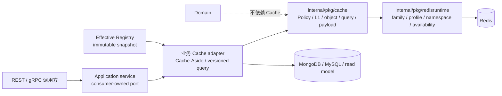

# Cache 终局架构与责任边界

## 1. 结论

Cache 的终局不是一个全局 `CacheManager`，而是“共享技术内核 + 进程级 capability module + 业务侧 Cache-Aside + 独立 Redis runtime”。这种结构把两类问题分开：

- `internal/pkg/cache` 回答“怎样缓存”；
- apiserver/collection-server 的 cache module 回答“缓存什么、谁负责、何时失效、何时预热”。

因此，按 `survey / modelcatalog / evaluation / actor / plan / statistics` 划分 apiserver adapter 是必要的，但共享 TTL、payload、singleflight、query version 等机制不应复制到业务包。

## 2. 为什么需要这层保护

qs-server 的读热点并不相同：已发布问卷和模型属于低频变更的静态目录；assessment、testee、plan 是按 ID 读取的对象；assessment list 与 statistics 是计算或组合成本较高的查询结果；collection-server 还要为小程序请求提供进程内目录 L1。

如果所有 miss 都直接落到 MongoDB、MySQL、统计读模型或跨进程 gRPC，会出现三类风险：

1. 热 key 或同一查询并发 miss 形成回源尖峰；
2. 目录发布、列表变化后，跨进程副本无法快速收敛；
3. 只看 Redis availability，无法解释某个业务能力是否真的命中、报错或变慢。

Cache 模块的目标是把这些风险变成可配置、可失效、可预热和可观测的 capability，而不是把所有 Redis 数据都叫作缓存。

## 3. 系统位置



在线读路径的事实源仍是 `source`。Cache hit 可以缩短路径；miss、corrupt payload 或 Redis 不可用时，adapter 按该 capability 的语义回源。

## 4. Package 责任

| 边界 | 负责 | 明确不负责 |
| --- | --- | --- |
| [`internal/pkg/cache`](../../../internal/pkg/cache) | Policy、Registry、Store/ErrMiss、L1、object/query kernel、payload、cache metrics、signal DTO | 业务 ID、Repository、Redis family 路由、Viper、goroutine 生命周期 |
| [`internal/apiserver/cache`](../../../internal/apiserver/cache) | canonical Spec、业务 adapter、key 使用、失效、warmup/hotset/reload、subsystem | 业务事实、通用 Redis 连接管理、domain 规则 |
| [`internal/collection-server/cache`](../../../internal/collection-server/cache) | questionnaire/typology L1、signal watcher、startup warmup、静态 Registry、Start/Close | apiserver L2、动态 reload、业务数据持久化 |
| [`internal/pkg/redisruntime`](../../../internal/pkg/redisruntime) | family 到 profile/namespace 的路由、handle、fallback、availability/degraded | TTL、negative、codec、Cache-Aside、业务 loader |
| application | query identity、使用时机、stale/timeout 等用例语义、consumer-owned port | go-redis、payload 编码、全局 Registry 实现 |
| domain | 业务模型与不变式 | cache key、TTL、hit/miss、Redis、失效信号 |

## 5. 业务 owner 与统一入口

apiserver 的统一入口是 [`internal/apiserver/cache`](../../../internal/apiserver/cache)，但 adapter 由业务 owner 分包：

```text
internal/apiserver/cache/
├── catalog/              # canonical Spec、Policy 合并、Registry 构造
├── internal/adapterkit/  # 无业务依赖的 object/observer bridge
├── survey/
├── modelcatalog/
├── evaluation/
├── actor/
├── plan/
├── statistics/
├── governance/           # target、warmup、hotset、status、reload
└── subsystem/            # Redis handle、Registry、治理和生命周期组合根
```

这不是按业务复制一套缓存框架。业务包只维护自己的 codec、key 调用、loader 和失效语义，通用行为继续调用 shared kernel。

`modelcatalog` 是 published-model cache 的唯一构造 owner；`evaluation` 只消费 modelcatalog 导出的 published model port，不再私自构造第二套静态模型缓存。

## 6. Cache-Aside 放在哪里

透明对象缓存使用 Repository decorator：

```text
application -> Repository port -> CachedRepository -> DB Repository
```

当前 assessment detail、testee、plan、questionnaire 和 published model 采用这一形态。decorator 与原 Repository 实现同一 port，读时 cache-aside，写成功后执行失效。

查询结果缓存由 application 显式编排：

```text
application QueryService -> typed cache port
                         -> read model / source loader
```

assessment list 和 statistics 属于这一类。application 决定查询 identity、何时 invalidate、超时和 stale 语义；adapter 决定 key、version token、payload 与 Redis 操作。

collection-server 的 questionnaire/typology L1 缓存 BFF DTO，并通过 gRPC 回源 apiserver。它与 apiserver 的 L2 是两个独立 capability，不应包装成一个跨进程 `MultiLevelCache`。

## 7. 生命周期

apiserver 和 collection-server subsystem 都遵守：

- constructor 只装配，不启动 goroutine；
- `Start(ctx)` 启动 signal watcher 和 startup warmup；
- `Close()` 通过 process context 取消后台任务；
- `Start/Close` 幂等；
- Redis handle、watcher、hotset、Registry 只由 process/subsystem 持有，不进入 domain 或业务实体。

apiserver subsystem 还持有 read-only `PolicyProvider` 与受控 snapshot publisher；collection-server 只发布启动时版本为 1 的静态 Registry。

## 8. Redis workload 边界

[`internal/pkg/redisruntime/catalog.go`](../../../internal/pkg/redisruntime/catalog.go) 当前登记：

| Family | 用途 | 普通 Cache payload |
| --- | --- | --- |
| `static_meta` | 问卷、已发布模型等静态对象 | 是 |
| `object_view` | assessment/testee/plan 等 ID 对象 | 是 |
| `query_result` | assessment list、statistics 查询结果 | 是 |
| `meta_hotset` | query version token、warmup hotset 元数据 | 否，支撑 Cache |
| `business_rank` | 业务排行 read model | 否 |
| `sdk_token` | 第三方集成凭据 | integration 私有 |
| `lock_lease` | 分布式 lease | 否 |
| `ops_runtime` | report status、signal 等短期运行态 | 否 |

使用 Redis 不等于属于 Cache。lock、rank、幂等状态、report status 和 signaling 不得复用普通 cache 的 negative、compression 或 read-through 语义。

## 9. 失败与降级边界

| 路径 | Cache/Redis 不可用 | Source 不可用 |
| --- | --- | --- |
| 对象 Cache-Aside | 视为 miss 并回源 | 返回 source error；只有显式 read guard 才可用 stale |
| Query cache | miss 后按用例回源，可使用 loadguard | 按 statistics/evaluation 用例的 timeout、stale 或 error 处理 |
| collection L1 | 直接调用 gRPC | 返回 gRPC error |
| warmup | 返回 `skipped` 或 `error`，不冒充成功 | 记录 target error，不污染在线读 |

失效失败不会回滚已经提交的业务事实。当前系统依赖写后删除或 version bump、best-effort signal 和 TTL 兜底收敛；可靠失效/outbox 不属于已经完成的 Cache 终局。

## 10. 明确不纳入

- 不建立万能 CacheManager、service locator 或运行时 loader registry；
- 不让 domain/application 直接依赖 go-redis 或具体 cache adapter；
- 不把 `report_status` 伪装成普通 Cache-Aside；
- 不把 IAM/JWKS/ProfileLink、WeChat SDK 等私有缓存强行并入主 Registry；
- 不支持 collection-server 动态 Policy reload；
- 不支持动态切换 capability `enabled`；
- 不承诺 Redis Pub/Sub 可靠送达；
- 不在 reload 时扫描、删除或重写已有 Redis entry。

这些边界用于防止 Cache 模块再次演变为“凡是 Redis 都放进来”的基础设施杂物间。
