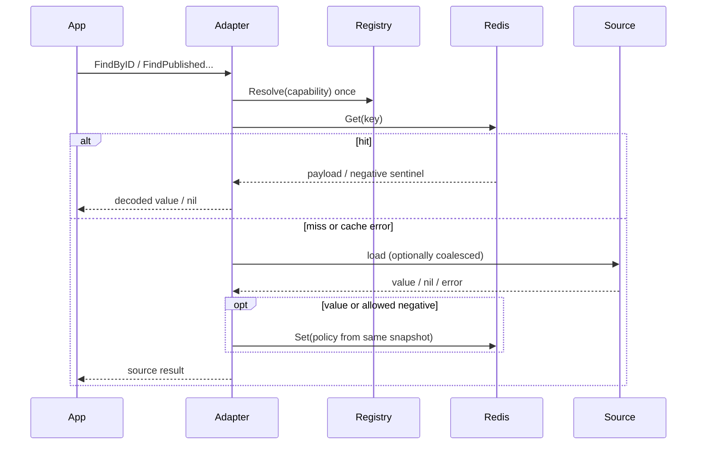

# 缓存内核与读写链路

## 1. 结论

[`internal/pkg/cache`](../../../internal/pkg/cache) 提供业务无关的最小内核，而不是一个统一所有场景的 ReadThrough。L1、对象缓存和查询缓存共享 Policy、Store、payload、observer 与 loadguard，但分别保留适合自己的读写语义。

核心约束是：一次操作开始时解析一次 Policy；这次 get/load/negative/set 全部使用同一份解析结果。并发 reload 只能影响下一次操作。

## 2. Shared kernel 目录

| Package | 职责 |
| --- | --- |
| [`cache`](../../../internal/pkg/cache) | `Capability`、`Policy`、`Store`、`ErrMiss`、Registry、observer event |
| [`cache/local`](../../../internal/pkg/cache/local) | 泛型 TTL Cache、detail/multi adapter、L1 read-through |
| [`cache/redis`](../../../internal/pkg/cache/redis) | 最小 Redis Store、payload compression/decompression |
| [`cache/object`](../../../internal/pkg/cache/object) | codec/object Store、negative sentinel、read-through |
| [`cache/query`](../../../internal/pkg/cache/query) | local-hot、version token、versioned query |
| [`cache/observe`](../../../internal/pkg/cache/observe) | cache workload、payload、warmup、version、signal 指标 |
| [`internal/pkg/loadguard`](../../../internal/pkg/loadguard) | capability-scoped coalescer、timeout/stale 等回源保护 |

业务 adapter 通过 [`internal/apiserver/cache/internal/adapterkit`](../../../internal/apiserver/cache/internal/adapterkit) 把 shared event 映射到 Redis family observer，但 adapterkit 不导入任何业务 domain。

## 3. L1 本地缓存

[`cache/local.Cache`](../../../internal/pkg/cache/local/cache.go) 当前合同：

- 泛型 value；
- 固定 TTL + jitter；
- `MaxEntries` 有界容量；
- FIFO 淘汰，不是 LRU；
- `Get/Set` 调用 clone，隔离 DTO 指针或 slice 被调用方修改；
- 支持精确删除和 prefix 删除；
- 过期 entry 在读取时惰性删除；
- 记录本地 hit/miss，并调用可注入回调；
- 并发访问由 mutex 保护。

L1 read-through 的顺序为：

```text
Get L1
  ├─ hit  -> clone -> return
  └─ miss -> optional loadguard coalescer
              -> source/gRPC load
              -> Set L1
              -> clone -> return
```

启用 singleflight 时必须注入 `loadguard.Coalescer`。nil miss 不写入普通 L1，也不会作为共享结果长期驻留。collection questionnaire/typology L1 使用该机制；assessment-list 另有 30 秒 local-hot L1。

## 4. Redis Store 与 payload

[`cache.Store`](../../../internal/pkg/cache/store.go) 只保留实际需要的四个动作：

```go
Get(ctx, key) ([]byte, error)
Set(ctx, key, value, ttl) error
Delete(ctx, key) error
Exists(ctx, key) (bool, error)
```

Redis `Nil` 映射为 `cache.ErrMiss`；连接、超时和协议错误保留为真实 error。`PayloadStore.Get` 自动识别 gzip，因此 compression 开关切换不会让旧 payload 失读。

写入策略来自本次操作解析的 Policy：

- TTL 在写入时应用 jitter；
- `compress=enabled` 时压缩新 payload；
- negative entry 使用独立 sentinel 与 `NegativeTTL`；
- nil、miss、negative sentinel、空 payload 和 decode error 是不同语义。

## 5. Object read-through

对象路径由 [`cache/object.ReadThrough`](../../../internal/pkg/cache/object/readthrough.go) 提供通用骨架，业务 adapter 提供 codec、key 和 loader：



对象 miss 合并 key 固定为 `capability + ":" + cache key`。Policy 启用 singleflight 但 production constructor 未注入 coalescer 时，返回明确的 `ErrCoalescerRequired`，不会临时创建一个无法共享的 group。

部分 adapter 异步写 Cache。异步写失败只进入 observer/log，不改写已经返回的 source result；它也意味着进程退出前不保证该次填充完成，因此 warmup 不能复用“只发起异步写”的在线路径作为成功证明。

## 6. Query cache 与 version token

查询结果不能只靠 pattern delete。[`cache/query.Versioned`](../../../internal/pkg/cache/query/versioned.go) 使用：

```text
version key: query:version:<kind>:<scope>
data key:    query:<kind>:<scope>:v<version>:<query-hash>
```

读路径先取得当前 version，再查 local-hot 和 Redis data key；失效只需原子 bump version。旧 data entry 不再可达，由 TTL 自然回收，避免大范围 `SCAN`。

当前典型实现：

- `evaluation.assessment_list`：按 userID 的 version token + 查询参数 hash，另有 30 秒、最多 512 entry 的 local-hot；
- `statistics.query`：typed cache port + Redis query payload，并在 system statistics miss 时按当前 Policy 使用 capability-scoped coalescer；
- version token/hotset 元数据走 `meta_hotset` family，query payload 走 `query_result` family。

query cache miss 对 application 表现为 `cache.ErrMiss` 或 typed `ok=false`，application 再决定回源、timeout、stale 和写回。

## 7. 当前 key 合同

key 由 [`internal/pkg/redisruntime/keyspace`](../../../internal/pkg/redisruntime/keyspace) 的 family-scoped builder 统一加 namespace。业务 adapter 不手写 root namespace。

| 能力 | 关键 suffix 示例 | 失效方式 |
| --- | --- | --- |
| questionnaire | `questionnaire:<code>[:<version>]`、`questionnaire:published:<code>` | 精确删除；版本集合当前使用 `SCAN` |
| published model | `assessment_model:published:ref:...` | 精确删除已登记 ref/list/algorithm key |
| published latest | `assessment_model:published:latest:<kind>:<lowercase-code>` | upsert/delete 后精确删除 |
| assessment detail | `assessment:detail:<id>` | 按 ID 删除 |
| assessment list | `query:version:assessment:list:<user>` + versioned data key | bump version |
| testee | `testee:info:<id>` | 按 ID 删除 |
| plan | `plan:info:<id>` | 按 ID 删除 |
| statistics | `query:version:stats:query:<typed-key>` + `query:stats:query:<typed-key>:v<version>` | typed 重写与治理 warmup；当前无通用 bump 入口 |

payload schema 变化必须升级 key/version 或提供兼容 decoder。目录或 package 重构不能顺带改变 key 字节。

## 8. Negative cache

Negative cache 只适合“明确不存在且短期内重复查询”的对象读取。当前 questionnaire、published model、testee 等 capability 可按 effective Policy 启用；assessment/plan/query 不应因为共享 family 默认值就自动获得同样语义。

规则：

- 只有 adapter 显式声明 `CacheNegative` 且 effective `negative=enabled` 才写 sentinel；
- 使用独立 `negative_ttl`，不能与正常对象 TTL 等长；
- 对象创建、发布或更新后，正向 key 与可能存在的 negative key 由同一 key 删除动作失效；
- loader error 不是 negative miss，不能写 sentinel。

## 9. Coalescing 与上下文

所有 production adapter 都创建 capability-scoped `loadguard.Coalescer`，Policy 只决定本次是否调用它。禁止在 `internal/pkg/cache` 和 `internal/apiserver/cache` 直接使用 `x/sync/singleflight`，避免再出现全局 coordinator 或每次 miss 临时建 group。

coalescing 保护“同一 capability 的同一 key”，不保护整个 family。不同 key、不同 capability 可以并发回源。loader error、nil miss 和 context 行为以 [`internal/pkg/loadguard`](../../../internal/pkg/loadguard) 的合同为准。

## 10. 操作级 Policy 一致性

动态 reload 时，以下行为只对新操作生效：

- 新写 entry 的 TTL、jitter 与 compression；
- 是否写 negative sentinel；
- miss 是否经 coalescer；
- query set 使用的 TTL。

一次 object read-through 在开头解析 Policy 后，get、load、negative 判断和写回继续使用同一份值。已有 Redis entry 不扫描、不重写，旧 expiry 保持不变；L1 local-hot 的固定短 TTL也不属于 capability reload 范围。
