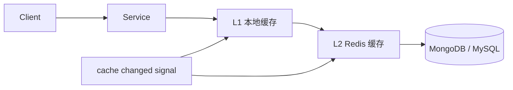

# cache

cache 模块是 qs-server 的读侧治理层，用于承接问卷目录、测评模型、报告状态等高频查询流量，降低 MongoDB / MySQL 压力，并提升接口响应稳定性。

## 1. 这个模块解决什么问题

测评系统读多写少，前台查询问卷、测评目录、模型元数据、报告状态的频率远高于写入。如果所有请求都直接访问数据库，简单读流量会被放大成 DB 压力。

cache 模块解决三个问题：

| 问题 | 处理方式 |
| --- | --- |
| 高频读打穿 DB | L1 本地缓存 + L2 Redis 缓存 |
| 冷启动和模型发布后抖动 | 预热、懒加载、singleflight |
| 缓存失效和降级不清晰 | TTL 分层、主动失效、事件驱动刷新、回源保护 |

## 2. 它在 qs-server 中处于什么位置

cache 位于 Service 和 DB 之间，同时被 collection-server、qs-apiserver 和 report 查询链路使用。L1 处理单进程热点，L2 处理多实例共享，DB 仍然是事实源。

## 3. 整体架构是什么

## 4. 关键链路有哪些

| 链路 | 文档 |
| --- | --- |
| 缓存模块整体架构 | [01-缓存模块整体架构.md](01-缓存模块整体架构.md) |
| L1 本地缓存 | [02-L1本地缓存设计.md](02-L1本地缓存设计.md) |
| L2 Redis 缓存 | [03-L2-Redis缓存设计.md](03-L2-Redis缓存设计.md) |
| 缓存预热 | [04-缓存预热链路.md](04-缓存预热链路.md) |
| 缓存失效与刷新 | [05-缓存失效与刷新链路.md](05-缓存失效与刷新链路.md) |
| TTL 分层与防击穿 | [06-TTL分层与防击穿设计.md](06-TTL分层与防击穿设计.md) |
| 一致性与降级 | [07-缓存一致性与降级策略.md](07-缓存一致性与降级策略.md) |
| 方案取舍 | [08-方案取舍.md](08-方案取舍.md) |
| Cache Capability Registry | [09-Cache能力注册表.md](09-Cache能力注册表.md) |
| Cache 终局设计 | [10-Cache终局设计.md](10-Cache终局设计.md) |

## 5. 为什么选择当前方案

只用 DB 会把读压力压给事实源；只用 L1 无法跨实例共享；只用 Redis 会增加每次网络访问和 Redis 压力。当前选择 L1 + L2 + DB 事实源，是为了让热点读在本地命中，多实例读在 Redis 命中，异常时还能受控回源。

## 6. 代码事实源

| 能力 | 事实源 |
| --- | --- |
| L1 / 本地 TTL | [../../../internal/pkg/cache/local](../../../internal/pkg/cache/local)、[../../../internal/collection-server/cache](../../../internal/collection-server/cache) |
| L2 / read-through | [../../../internal/apiserver/cache/adapter](../../../internal/apiserver/cache/adapter)、[../../../internal/pkg/cache/query](../../../internal/pkg/cache/query) |
| 缓存治理与观测 | [../../../internal/apiserver/cache/governance](../../../internal/apiserver/cache/governance)、[../../../internal/pkg/cache/observe](../../../internal/pkg/cache/observe)、[../../../internal/pkg/redisruntime/observability](../../../internal/pkg/redisruntime/observability) |
| 信令 | [../../../configs/signals.yaml](../../../configs/signals.yaml)、[../../../internal/pkg/cachesignal](../../../internal/pkg/cachesignal) |
