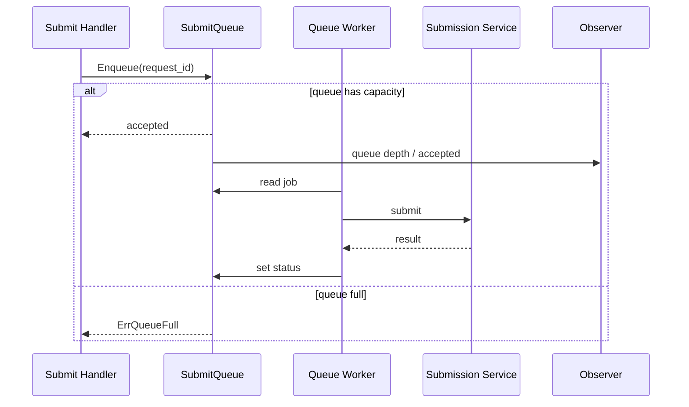

# SubmitQueue 提交削峰链路

## 1. 解决什么问题

SubmitQueue 解决答卷瞬时提交洪峰拖垮业务服务、MongoDB、Outbox 和 MQ 的问题。它不是为了提高单请求速度，而是把瞬时洪峰变成有界处理能力。

## 2. 所在位置

SubmitQueue 位于 collection-server submit handler 之后、SubmissionService 真正写入业务之前。handler 受理请求后调用 `SubmitQueued`，队列 worker 再执行实际提交。

## 3. 设计目标

有界排队；队列满快速失败；提交状态可查询；重复 request_id 复用正在处理的状态；队列深度可观测；不把无限等待留给 HTTP 请求。

## 4. 整体流程

## 5. 核心数据结构

`submitJob` 包含 context、request_id、writer_id 和提交请求；`SubmitStatusResponse` 保存 queued、processing、completed、failed 等状态；队列内部有有界 channel、worker pool、状态 TTL 和 observer。

## 6. 正常流程

请求入队成功后立即返回受理状态。队列 worker 按固定并发读取 job，调用实际提交逻辑，完成后写入提交状态。客户端通过 request_id 查询提交结果。

## 7. 异常流程

队列满返回 `submit queue full`；相同 request_id 的重复入队复用 in-flight 状态；失败请求需要新的 request_id；状态超过 TTL 后清理；当前 SubmitQueue 不暴露 drain / shutdown 控制面。

## 8. 幂等 / 降级 / 背压

SubmitQueue 只负责削峰和有界排队，不替代 SubmitGuard。队列满时快速失败是对下游的背压信号，避免所有请求进入 DB / Outbox / MQ。

## 9. 可选方案

只做限流会拒绝过多可处理请求；直接写 MQ 会改变提交接口语义并推迟核心校验；Nginx 排队不理解业务状态；客户端重试会加剧洪峰。

## 10. 当前方案取舍

选择应用内有界队列，因为它能按业务语义保存提交状态、暴露队列指标，并在下游能力有限时保护提交链路。

## 11. 观测指标

queue length、accepted count、reject count、processing count、status TTL cleanup、worker duration、submit p95、queue full rate。

## 12. 代码事实源

- [../../../internal/collection-server/application/answersheet/submit_queue.go](../../../internal/collection-server/application/answersheet/submit_queue.go)
- [../../../internal/collection-server/application/answersheet/submit_queue_worker_pool.go](../../../internal/collection-server/application/answersheet/submit_queue_worker_pool.go)
- [../../../internal/collection-server/application/answersheet/submission_service.go](../../../internal/collection-server/application/answersheet/submission_service.go)
- [../../../internal/collection-server/options/options.go](../../../internal/collection-server/options/options.go)
- [../../../internal/collection-server/transport/rest/handler/answersheet_handler.go](../../../internal/collection-server/transport/rest/handler/answersheet_handler.go)
