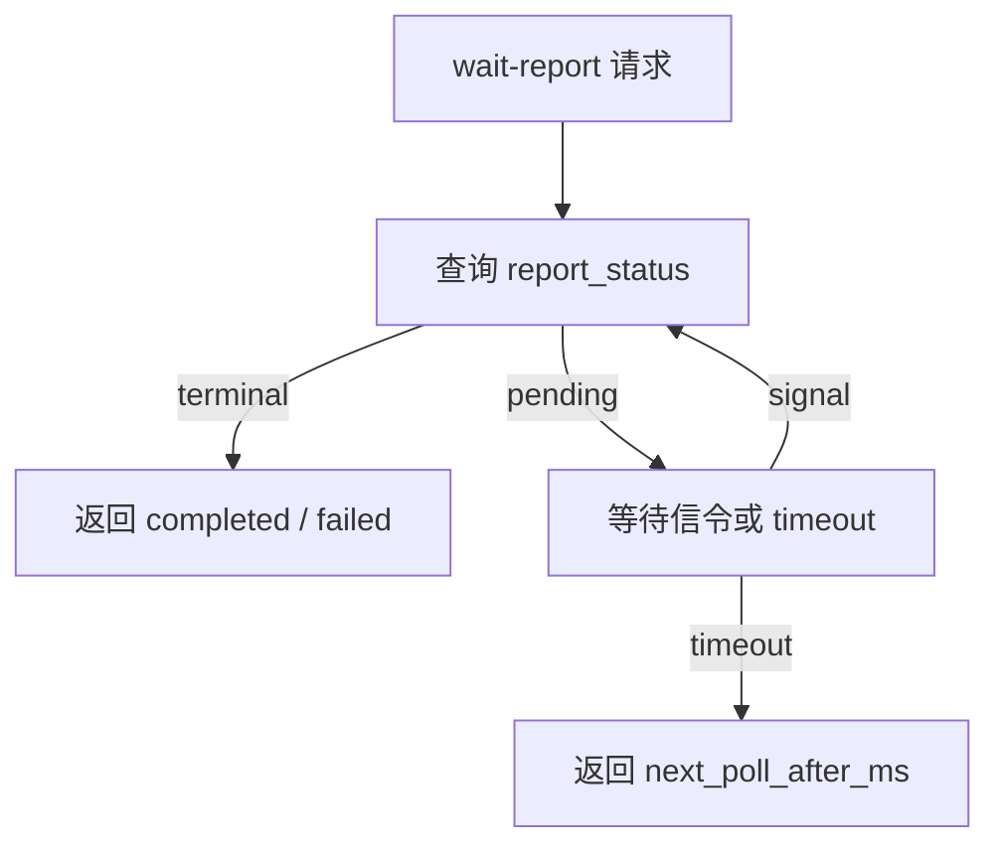

# Report 长轮询查询链路

## 1. 解决什么问题

长轮询解决短轮询在报告生成期间产生大量无效请求的问题。服务端等待一段时间，有结果立即返回；没有结果则超时并返回下一次查询建议。

## 2. 所在位置

长轮询位于 collection-server 的 report wait 服务和一次性信令之间。它读取 report status cache，并订阅 best-effort signal。

## 3. 设计目标

减少无效查询；报告完成后尽快返回；等待有明确超时；连接数受控；信令丢失不影响最终正确性。

## 4. 整体流程

## 5. 核心数据结构

wait context、report_id、assessment_id、timeout、status cache、signal channel、next_poll_after_ms、active waiter。

## 6. 正常流程

请求进入后先查状态；未完成则等待 15 到 25 秒级超时窗口；worker 完成报告后写 report status 并 publish signal；等待请求被唤醒，重新读取状态后返回。

## 7. 异常流程

信令丢失时等待请求超时返回 `next_poll_after_ms`；客户端断开时 context cancel；Redis 异常时退化为超时等待或短轮询建议；超过最大等待连接数时快速返回 pending。

## 8. 幂等 / 降级 / 背压

wait 请求幂等；服务端必须限制 active waiters、timeout 和每个 report 的重复等待；信令失败不影响 report status 写入；超时是正常背压出口。

## 9. 可选方案

短轮询实现简单但请求量大；WebSocket 更实时但连接管理、鉴权、断线重连和运维成本更高；把等待请求交给 MQ 不符合职责。

## 10. 当前方案取舍

长轮询作为短轮询和 WebSocket 之间的折中：显著减少无效查询，同时保持 HTTP 兼容。现行接入指南中 `wait-report` 仍保留兼容，但新接入优先遵循报告状态接口和按配置启用的推送能力。

## 11. 观测指标

active waiters、wake by signal count、timeout count、client cancel count、wait duration P95/P99、signal publish failed、status cache hit、pending QPS。

## 12. 代码事实源

- [../../../internal/collection-server/application/reportwait/service.go](../../../internal/collection-server/application/reportwait/service.go)
- [../../../internal/collection-server/application/reportwait/cache_adapter.go](../../../internal/collection-server/application/reportwait/cache_adapter.go)
- [../../../internal/pkg/reportstatus](../../../internal/pkg/reportstatus)
- [../../../configs/signals.yaml](../../../configs/signals.yaml)
- [../../04-接口与运维/12-小程序报告等待接入指南.md](../../04-接口与运维/12-小程序报告等待接入指南.md)
