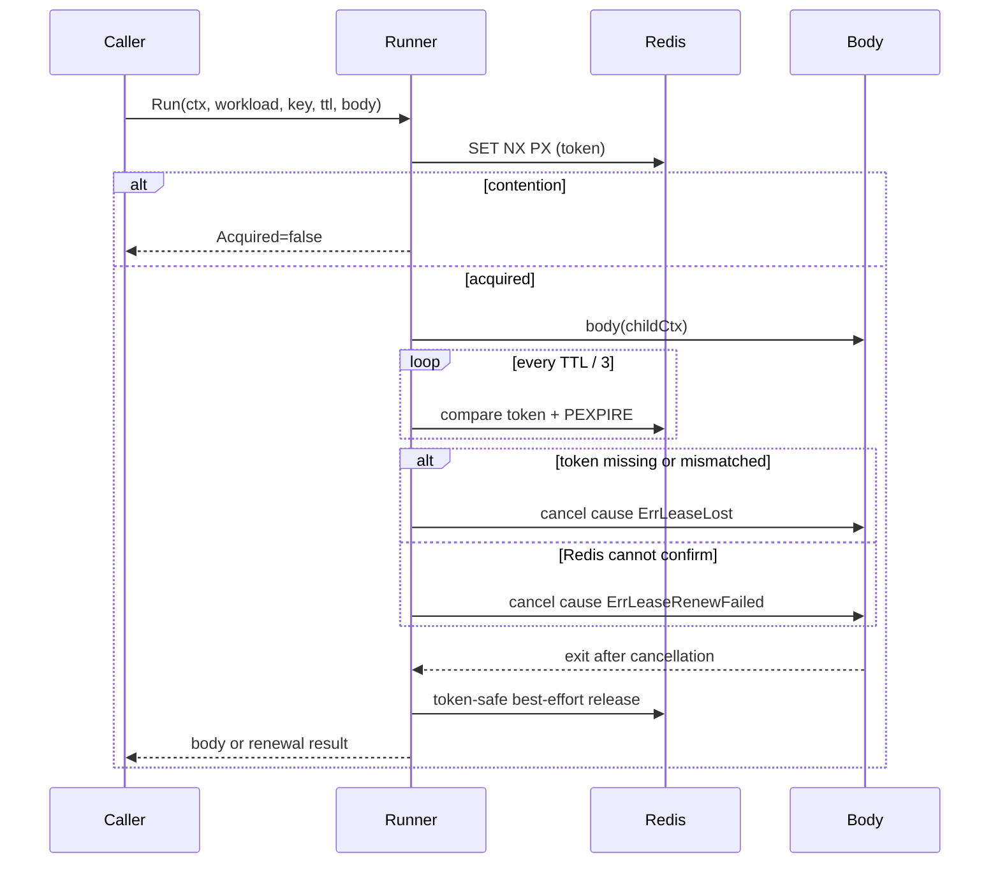

# LockLease 租约锁与续租治理

LockLease 是独立于 cache 的进程级基础设施子系统。它统一管理语义目录、Redis adapter、key builder、租约执行器、续租、指标和治理投影；`redisruntime/bootstrap` 只提供 `lock_lease` family handle，不再创建锁管理器。

## 1. 能力目录

[`internal/pkg/locklease/catalog.go`](../../../internal/pkg/locklease/catalog.go) 是唯一事实源：

| workload | 进程 | 语义 | 默认 TTL |
| --- | --- | --- | --- |
| `answersheet_processing` | worker | duplicate_suppression | 5m |
| `plan_scheduler_leader` | apiserver | leader | 50s |
| `statistics_sync_leader` | apiserver | leader | 30m |
| `statistics_sync` | apiserver | task_lock | 30m |
| `behavior_pending_reconcile` | apiserver | leader | 30s |
| `evaluation_consistency_reconcile` | apiserver | leader | 30s |
| `behavior_journey_scan_leader` | apiserver | leader | 25m |
| `collection_submit` | collection-server | idempotency | 5m |

目录不可变，配置 binding、Runner 和治理快照都从该目录派生。Redis family 仍为 `lock_lease`，namespace 仍为 `cache:lock`，滚动发布不改变已有锁 key。

## 2. 租约生命周期



续租没有比例、重试次数等动态参数：周期固定为 `TTL / 3`，一次失败立即 fail-closed。Runner 会等待 body 响应取消；业务代码必须把 child context 继续传给数据库、gRPC 和循环。若 body 不退出，Runner 不会伪装成功或遗留后台写入，并按续租周期持续告警。

错误分类：

- `ErrLeaseAcquireFailed`：初次 Redis 获取失败；worker 保持 degraded-open。
- `ErrLeaseLost`：token 不匹配或 key 已过期；取消 child context。
- `ErrLeaseRenewFailed`：Redis 无法确认所有权；取消 child context。
- release 始终 token-safe、best-effort，错误记录在 `RunResult.ReleaseErr`，不覆盖主体结果。

## 3. 调用方语义

- scheduler leader：竞争失败跳过 tick；获取、续租或丢锁使 tick 失败，下轮重试。
- `statistics_sync` task lock：竞争失败返回 busy；续租失败取消同步并返回错误。
- worker：竞争失败视为 duplicate 并 ACK；初次获取失败 degraded-open；获取后丢锁返回错误，消息进入 NACK/retry。
- collection submit：竞争失败映射 `ResourceExhausted`；续租失败映射 `Unavailable`，客户端使用同一幂等键重试。done marker 在受保护 closure 成功路径内写入，随后才释放锁。显式 `idempotency_key` 优先，否则使用 `request_id`，同一 effective key 会传入 apiserver 的 Mongo 唯一幂等记录。

## 4. 配置与上线

```yaml
lock_lease:
  renewal_enabled: true
```

代码零值为 `false`，兼容没有该字段的旧配置；当前 dev/prod 配置显式启用。发生异常时可将单个进程配置改为 `false` 并重启，只关闭续租，不回退模块结构、key 或竞争语义。

## 5. 观测与治理

Canonical 指标：

```text
qs_locklease_operation_total{component,name,operation="acquire|renew|release",result="ok|contention|error|unavailable|lost"}
```

韧性 outcome 包含 `lock_renewed`、`lock_lost`、`lock_renew_error`。治理快照按进程从目录派生，展示 `ttl_seconds`、`renewal_mode`、`renew_every_seconds`，并结合 workload enable binding 与 `lock_lease` family 实际健康状态生成 `configured/degraded/reason`。

兼容期继续双写 `qs_cache_lock_acquire_total`、`qs_cache_lock_release_total`、`qs_cache_lock_degraded_total`；这些指标已 deprecated，本版本不删除。治理接口不返回完整 Redis key，也没有任意强制释放能力。

## 6. 排障顺序

1. 查看 `lock_lease` family 的 configured、available、last_error。
2. 按 component/workload 检查 `qs_locklease_operation_total` 的 `renew/error/lost`。
3. 检查 `qs_resilience_decision_total` 的 `lock_renew_error` 与 `lock_lost`。
4. scheduler 查看 tick failure；worker 查看 NACK/retry；collection 查看 failed/retry 与 effective idempotency key。
5. 确认业务 body 使用 Runner 提供的 child context；否则丢锁后 Runner 会等待并告警。

## 7. 验证

```bash
go test -race ./internal/pkg/locklease/... \
  ./internal/apiserver/runtime/scheduler \
  ./internal/collection-server/application/answersheet \
  ./internal/worker/handlers
```

本轮不提供 fencing token、exactly-once 承诺、namespace 迁移或任意锁强制释放接口。
