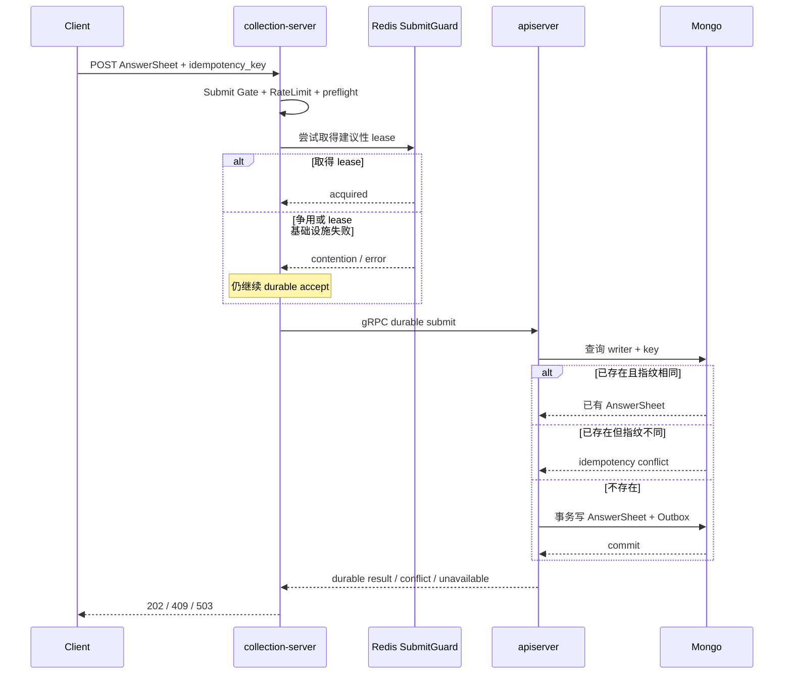

# 可靠提交：SubmitGuard 与幂等

## 1. 结论

答卷提交的正确性不依赖 Redis SubmitGuard。当前可靠边界是：

```text
同一业务意图
  = writer_id + idempotency_key + 内容指纹

成功受理
  = Mongo 中可读到唯一 AnswerSheet
  + 对应 Outbox 已在同一事务落盘
```

SubmitGuard 是建议性 Redis lease。它可以提供跨实例的短期 ownership 信号和观测，但 Redis 不保存最终提交结果，争用者也不会被当作业务冲突。最终裁决仍由 Mongo 完成。

## 2. 完整提交链



`SubmissionService.AcceptDurably` 的总 deadline 生产基线为 2 秒。它先完成已发布问卷与答案结构 preflight，再进入 SubmitGuard 和 gRPC durable accept。

## 3. `request_id` 与 `idempotency_key`

| 标识 | 作用 | 重试时是否复用 |
| --- | --- | --- |
| `request_id` | 追踪一次 HTTP 尝试及其跨服务日志 | 通常每次请求不同 |
| `idempotency_key` | 标识同一用户的一次业务意图 | 同一意图必须复用 |

同一业务重试可以得到新的 `request_id`，但应返回同一个 `answersheet_id`。因此“返回同一个结果”指同一 durable 业务结果，不要求整个 HTTP JSON 字节完全相同。

`idempotency_key` 当前要求 8–128 个安全字符。服务端按 `writer_id + idempotency_key` 建立作用域，避免不同用户使用相同 key 相互冲突。

## 4. 三种重复场景

| writer + key | 内容指纹 | 当前结果 | 语义 |
| --- | --- | --- | --- |
| 首次出现 | 任意合法内容 | 202 + 新 AnswerSheet ID | 新业务意图被 durable accept |
| 已存在 | 相同 | 202 + 原 AnswerSheet ID | 同一意图重复投递，客户端无需感知“重复” |
| 已存在 | 不同 | 409 | 同一个 key 被复用于不同意图 |

如果两个 collection 实例几乎同时提交，不能承诺“网络上先到的请求”获胜。能承诺的是：Mongo 唯一约束只允许一个提交事实成立，首次成功提交者的指纹成为该 key 的事实；另一方相同则复用，不同则冲突。

## 5. Mongo 为什么是最终真相

`internal/apiserver/infra/mongo/answersheet/durable_submit.go` 建立 partial unique index：

```text
(submit_meta.writer_id, submit_meta.idempotency_key)
```

查询已有记录后：

- stored fingerprint 等于本次 fingerprint：返回已有 AnswerSheet；
- fingerprint 不同：返回 `ErrIdempotencyConflict`；
- 没有记录：尝试插入，唯一键处理并发竞争。

这套约束靠近主事实，能跨越：

- 两个 collection 实例；
- 两个 apiserver 实例；
- Redis 故障；
- collection 重启；
- 客户端超时后的重试。

Redis lease 的 TTL、网络分区或进程暂停都可能让两个持有者在时间上重叠，所以 lease 不能替代唯一键。

## 6. 202 的 durable 边界

apiserver 的 `transactionalSubmissionDurableStore` 在同一 Mongo transaction 内：

1. 插入带 submit metadata 的 AnswerSheet；
2. stage `AnswerSheetSubmitted` Outbox event；
3. commit 后才把结果返回给 collection。

如果 Mongo commit 结果未知，代码会使用脱离原请求取消信号的 500ms read-only recovery window 查询已完成提交。只有实际查到 durable AnswerSheet 才能继续承认成功；否则返回错误，不猜测 202。

这保证：

```text
HTTP 202
  => AnswerSheet 已 durable
  => Outbox 已 durable
  != Assessment 已同步创建
```

Assessment 由后续 Outbox/MQ/worker 异步链创建。202 不是“整条测评链已完成”。

## 7. SubmitGuard 的真实行为

### 7.1 结果矩阵

| SubmitGuard 情况 | 当前 application 行为 |
| --- | --- |
| guard/runner 未装配 | degraded-open，直接 durable accept |
| lease 基础设施在 body 前失败 | degraded-open，直接 durable accept |
| 成功取得 lease | 在 lease body 内 durable accept |
| lease 争用 | `acquired=false`，调用方再次直接 durable accept |
| body 已执行后返回错误 | 返回 body 的 durable accept 结果，不再重复 fallback |
| release 失败 | 记录/返回 release 信息，不改变已完成业务事实 |

### 7.2 一个容易忽略的事实

当前争用者不会等待持有者完成，也不会从 Redis 读取 `:done` 结果，而是直接继续调用 Mongo。因此现行 SubmitGuard 不保证“同一时刻只有一个请求到 DB”，也不对顺序重试做结果缓存。

更准确的评价是：

- 它是建议性 coordination hook；
- 正确性完全不能依赖它；
- 当前调用策略对重复 DB 调用的削减有限；
- 若未来实现 contender 等待、singleflight 或结果复用，那仍只是性能优化，最终唯一键仍不可删除。

状态：`待补证据`。SubmitGuard 是否值得保留，应结合 lock contention、Mongo duplicate-key、同 key 重复率和额外 Redis RTT 做数据决策。

## 8. 为什么第二个请求不是 429

429 表示“当前请求速率或准入容量超出预算”，不是“key 重复”。在容量充足时：

- 同 key、同内容是合法重试，应返回同一业务结果；
- 同 key、不同内容是业务冲突，应返回 409；
- 只有 Gate 或 RateLimit 饱和，才因为容量返回 429。

如果一看到重复 key 就立即 429，客户端无法可靠区分“服务忙”与“前一次已经成功”，反而可能继续重试并制造更多流量。

## 9. 没有进程内 SubmitQueue

当前可靠提交主链不包含 in-process queue：

- HTTP 请求在 2 秒受理窗口内同步等待 durable 结果；
- Submit Gate 只是有界信号量，不是拥有任务生命周期的队列；
- architecture test 禁止重新引入 `SubmitQueue`、`SubmitQueued` 和 collection 同步创建 Assessment。

进程内队列无法独立提供 crash durability。若把 202 建立在“已放入内存队列”上，进程崩溃会丢失已承认的提交。

## 10. 状态码与客户端行为

| 状态 | 客户端建议 |
| --- | --- |
| 202 | 保存 `answersheet_id`；异步查询 Assessment/report readiness |
| 409 | 停止用该 key 重试不同内容，生成新业务意图 key 或修复客户端 |
| 429 | 遵循 `Retry-After`，指数退避并加抖动，复用原 key |
| 503 | 结果未被服务确认；遵循退避，复用原 key 重试以查询/收敛已有结果 |

503 不等于“一定没写入”。未知 commit 场景下复用原 key，正是幂等协议存在的理由。

## 11. 验证入口

- collection guard：`internal/collection-server/infra/redisops/submit_guard_test.go`
- collection service：`internal/collection-server/application/answersheet/submission_service_test.go`
- HTTP 映射：`internal/collection-server/transport/rest/handler/answersheet_handler_test.go`
- apiserver transaction：`internal/apiserver/application/survey/answersheet/transactional_durable_store_test.go`
- Mongo 并发幂等：`internal/apiserver/infra/mongo/answersheet/durable_submit_integration_test.go`
- 架构边界：`internal/collection-server/application/answersheet/reliable_submission_architecture_test.go`

## 12. 学习问题

如果第一次请求已经在 Mongo commit，但 collection 在收到 gRPC 响应前断线，客户端用同一 key 和相同内容重试：

1. 为什么第二次仍可能安全得到 202？
2. 如果第二次改了一个答案，为什么必须是 409？
3. 为什么 Redis 中记录一个“done”结果仍不能替代 Mongo 查询？
