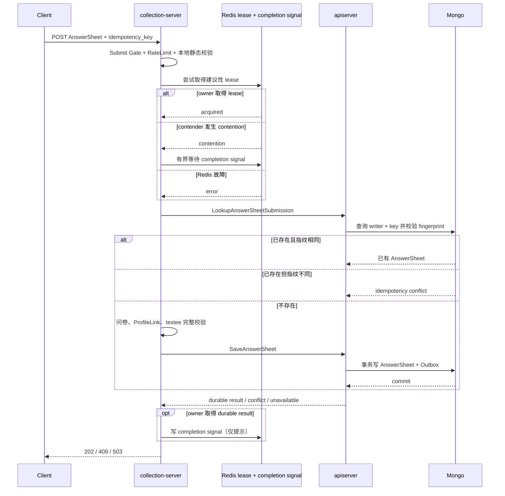

# 可靠提交：跨实例合并与幂等

## 1. 结论

答卷提交的正确性不依赖 Redis lease。当前可靠边界是：

```text
同一业务意图
  = writer_id + idempotency_key + 内容指纹

成功受理
  = Mongo 中可读到唯一 AnswerSheet
  + 对应 Outbox 已在同一事务落盘
```

`SubmitCoalescer` 使用建议性 Redis lease 合并多个 collection-server
实例收到的相同提交。它只减少重复事务竞争：Redis 完成信号只负责唤醒
contender，contender 仍通过 apiserver 的 durable lookup 取得并校验结果。
最终裁决始终由 Mongo 完成。

## 2. 完整提交链



`SubmissionService.AcceptDurably` 的总 deadline 生产基线为 2 秒。它在进入
`SubmitCoalescer` 前只做不访问远程依赖的 envelope 校验。owner、contender、
Redis degraded-open 和关闭 coalescer 的路径都会先调用
`LookupAnswerSheetSubmission`；只有 miss 才执行已发布问卷、ProfileLink、testee
和完整保存。生产配置的 contender 等待预算为 500ms；代码会在请求预算接近耗尽
时进一步缩短等待，为必须执行的 durable readback 保留时间。

这使已经 commit 的相同请求不受问卷下线、ProfileLink 变化或相关读取依赖故障
影响。HTTP 层仍必须把请求认证为同一 writer；持久 hit 只返回原
`answersheet_id`，不泄露答卷内容。

## 3. `request_id` 与 `idempotency_key`

| 标识 | 作用 | 重试时是否复用 |
| --- | --- | --- |
| `request_id` | 追踪一次 HTTP 尝试及其跨服务日志 | 通常每次请求不同 |
| `idempotency_key` | 标识同一用户的一次业务意图 | 同一意图必须复用 |

同一业务重试可以得到新的 `request_id`，但应返回同一个 `answersheet_id`。因此“返回同一个结果”指同一 durable 业务结果，不要求整个 HTTP JSON 字节完全相同。

`idempotency_key` 当前要求 8–128 个安全字符。服务端按 `writer_id + idempotency_key` 建立作用域，避免不同用户使用相同 key 相互冲突。

## 4. 三种重复场景

| writer + key | 内容指纹 | 当前结果 | 语义 |
| --- | --- | --- | --- |
| 首次出现 | 任意合法内容 | 202 + 新 AnswerSheet ID | 新业务意图被 durable accept |
| 已存在 | 相同 | 202 + 原 AnswerSheet ID | 同一意图重复投递，客户端无需感知“重复” |
| 已存在 | 不同 | 409 | 同一个 key 被复用于不同意图 |

如果两个 collection 实例几乎同时提交，不能承诺“网络上先到的请求”获胜。能承诺的是：Mongo 唯一约束只允许一个提交事实成立，首次成功提交者的指纹成为该 key 的事实；另一方相同则复用，不同则冲突。

## 5. Mongo 为什么是最终真相

`internal/apiserver/infra/mongo/answersheet/durable_submit.go` 建立 partial unique index：

```text
(submit_meta.writer_id, submit_meta.idempotency_key)
```

查询已有记录后：

- 当前文档优先读取接受时冻结的 `submit_meta.fingerprint`；
- 旧文档或 legacy 幂等记录缺少 fingerprint 时，才按既有算法从 AnswerSheet
  回退计算，不做数据迁移；
- stored fingerprint 等于本次候选 fingerprint：返回已有 AnswerSheet；
- fingerprint 不同：返回 `ErrIdempotencyConflict`；
- 没有记录：尝试插入，唯一键处理并发竞争。

回读一次 Mongo 即同时取得 AnswerSheet 和有效 fingerprint。找到文档但无法
映射 AnswerSheet、无法得到有效 fingerprint 或读取异常时必须返回错误，不能
伪装为 miss。

这套约束靠近主事实，能跨越：

- 两个 collection 实例；
- 两个 apiserver 实例；
- Redis 故障；
- collection 重启；
- 客户端超时后的重试。

Redis lease 的 TTL、网络分区或进程暂停都可能让两个持有者在时间上重叠，所以 lease 不能替代唯一键。

## 6. 202 的 durable 边界

apiserver 的 `transactionalSubmissionDurableStore` 在同一 Mongo transaction 内：

1. 插入带 submit metadata 的 AnswerSheet；
2. stage `AnswerSheetSubmitted` Outbox event；
3. commit 后才把结果返回给 collection。

如果 Mongo commit 结果未知，代码会使用脱离原请求取消信号的 500ms read-only recovery window 查询已完成提交。只有实际查到 durable AnswerSheet 才能继续承认成功；否则返回错误，不猜测 202。

这保证：

```text
HTTP 202
  => AnswerSheet 已 durable
  => Outbox 已 durable
  != Assessment 已同步创建
```

Assessment 由后续 Outbox/MQ/worker 异步链创建。202 不是“整条测评链已完成”。

## 7. SubmitCoalescer 的真实行为

### 7.1 结果矩阵

| 情况 | 当前 application 行为 |
| --- | --- |
| coalescer 关闭或 runner 未装配 | 直接执行 Mongo durable path |
| lease acquire 基础设施失败 | degraded-open，立即执行 Mongo durable path |
| 成功取得 lease | owner 在 lease body 内执行 durable submit |
| lease 争用 | contender 有界等待 Redis completion signal，然后执行 durable readback |
| completion signal 读写失败 | 不影响 durable 结果；contender 立即进入 durable readback |
| 等待超时或 stale lease | 不返回 429；等待预算耗尽后进入 durable readback |
| request cancellation | 停止等待，不执行额外 readback |
| release/renew 失败，但 owner 已取得 durable 结果 | 记录 LockLease 指标，不推翻已确认的 Mongo 结果 |

### 7.2 一个容易忽略的事实

completion signal 的 Redis value 是固定提示值，不是 AnswerSheet 结果。即使 signal
存在、陈旧或内容异常，contender 仍会调用
`LookupAnswerSheetSubmission`；只有明确 miss 才进入 `SaveAnswerSheet`。
新 collection 滚动遇到旧 apiserver 返回 `Unimplemented` 时，临时回退
`SaveAnswerSheet`，由其既有 early durable lookup 保证正确性。其他 readback
错误不能伪装成 miss。

因此 100 个并发相同请求的目标不是“只收到一个 HTTP 响应”，而是：

- 一个 owner 进入新建 AnswerSheet + Outbox transaction；
- contender 等 owner durable commit 后命中 Mongo durable lookup；
- 不让 100 个请求在首次 lookup 都 miss 后同时展开 attribution 与 transaction；
- Redis 不可用时，100 个请求仍由 Mongo 唯一键和 fingerprint 安全收敛。

`submit.coalescing_enabled=false` 是运行时回滚点：关闭后移除 Redis 合并效率，
但仍执行持久结果优先回读，不改变 202、409 或 Mongo durable correctness。

## 8. 为什么第二个请求不是 429

429 表示“当前请求速率或准入容量超出预算”，不是“key 重复”。在容量充足时：

- 同 key、同内容是合法重试，应返回同一业务结果；
- 同 key、不同内容是业务冲突，应返回 409；
- 只有 Gate 或 RateLimit 饱和，才因为容量返回 429。

如果一看到重复 key 就立即 429，客户端无法可靠区分“服务忙”与“前一次已经成功”，反而可能继续重试并制造更多流量。

## 9. 没有进程内 SubmitQueue

当前可靠提交主链不包含 in-process queue：

- HTTP 请求在 2 秒受理窗口内同步等待 durable 结果；
- Submit Gate 只是有界信号量，不是拥有任务生命周期的队列；
- architecture test 禁止重新引入 `SubmitQueue`、`SubmitQueued` 和 collection 同步创建 Assessment。

进程内队列无法独立提供 crash durability。若把 202 建立在“已放入内存队列”上，进程崩溃会丢失已承认的提交。

## 10. 状态码与客户端行为

| 状态 | 客户端建议 |
| --- | --- |
| 202 | 保存 `answersheet_id`；异步查询 Assessment/report readiness |
| 409 | 停止用该 key 重试不同内容，生成新业务意图 key 或修复客户端 |
| 429 | 遵循 `Retry-After`，指数退避并加抖动，复用原 key |
| 503 | 结果未被服务确认；遵循退避，复用原 key 重试以查询/收敛已有结果 |

503 不等于“一定没写入”。未知 commit 场景下复用原 key，正是幂等协议存在的理由。

## 11. 验证入口

- collection coalescer：`internal/collection-server/infra/redisops/submit_coalescer_test.go`
- collection service：`internal/collection-server/application/answersheet/submission_service_test.go`
- durable lookup application：`internal/apiserver/application/survey/answersheet/submission_lookup_test.go`
- gRPC lookup 契约：`internal/apiserver/transport/grpc/service/answersheet_test.go`
- HTTP 映射：`internal/collection-server/transport/rest/handler/answersheet_handler_test.go`
- apiserver transaction：`internal/apiserver/application/survey/answersheet/transactional_durable_store_test.go`
- Mongo 并发幂等：`internal/apiserver/infra/mongo/answersheet/durable_submit_integration_test.go`
- 架构边界：`internal/collection-server/application/answersheet/reliable_submission_architecture_test.go`
- 双实例 100 重复请求：`scripts/perf/k6-submit-coalescing.js`

持久化阶段指标的所有权固定如下，避免一次回读被重复计数：

- explicit lookup 用例只记录 `explicit_readback`；
- application 的首次提交预检查只记录 `early_lookup`；
- transactional store 只记录 `pretransaction_lookup`、`transaction` 和
  `transaction_error_recovery`；
- Mongo repository 只执行数据访问，不记录 application 阶段名称。

## 12. 学习问题

如果第一次请求已经在 Mongo commit，但 collection 在收到 gRPC 响应前断线，客户端用同一 key 和相同内容重试：

1. 为什么第二次仍可能安全得到 202？
2. 如果第二次改了一个答案，为什么必须是 409？
3. 为什么 Redis completion signal 只能唤醒 contender，不能替代 Mongo 查询？
