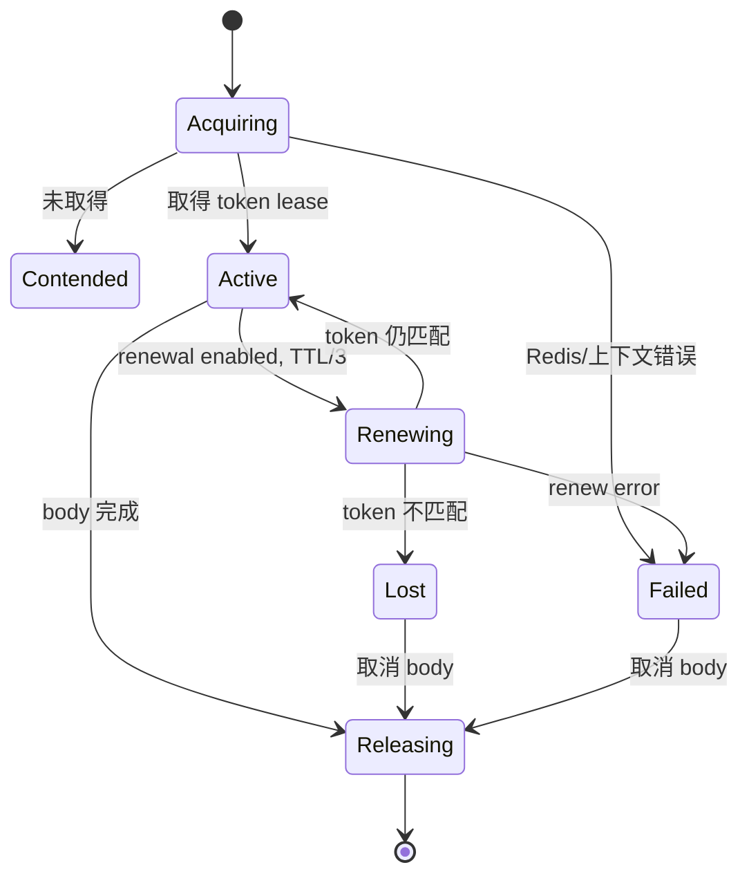

# LockLease 与长任务互斥

## 1. 结论

LockLease 回答的是“在一段有限时间内，哪个实例有资格执行”，不是“哪个实例永远拥有业务事实”。

当前统一 subsystem 提供：

- Redis token lease 的 acquire / renew / release；
- 按 catalog 绑定 workload、component、kind 和默认 TTL；
- 可选自动续租，周期为 TTL / 3；
- 失租或续租失败时取消 body context；
- leader 人工让权后的 cooldown 与有界等待；
- 统一快照、决策和 operation 指标。

业务 body 必须响应 context cancellation；持久化写仍需唯一键、状态机、版本或 fencing 等更靠后的约束。

## 2. Workload catalog

`internal/pkg/resilience/locklease/catalog.go` 是当前内置目录：

| component | workload | kind | 默认 TTL | 用途 |
| --- | --- | --- | ---: | --- |
| worker | `answersheet_processing` | duplicate suppression | 5m | 抑制同一答卷事件并发处理 |
| apiserver | `plan_scheduler_leader` | leader | 50s | 计划调度器 leader |
| apiserver | `statistics_sync_leader` | leader | 30m | 统计同步调度 leader |
| apiserver | `statistics_sync` | task lock | 30m | 统计任务串行化 |
| apiserver | `evaluation_consistency_reconcile` | leader | 30s | 一致性 reconcile leader |
| collection-server | `collection_submit` | idempotency | 5m | 提交建议性并发 lease |

catalog 中的 renewal mode 是 `auto` 能力描述；进程配置 `lock_lease.renewal_enabled` 决定运行时是否真正启动续租。当前三个 production 配置均为 `false`，dev 配置为 `true`。

这意味着生产环境里的长任务必须特别关注 TTL 是否覆盖执行时间。catalog 声明支持续租，不代表生产实际正在续租。

## 3. Lease 生命周期



取得 Redis lease 后，subsystem 还会在进程内原子登记 active run，避免 leader cooldown 与新任务穿透同一个时间窗。

## 4. 续租与取消

启用 renewal 后：

1. 每 `TTL / 3` 尝试 renew；
2. renew 返回未持有，产生 `ErrLeaseLost`；
3. renew 基础设施错误，产生 `ErrLeaseRenewFailed`；
4. subsystem 使用 cancel cause 取消 body context；
5. body 返回后，若它只返回 nil 或 cancellation error，subsystem 返回更具体的 lease 错误。

如果 body 忽略 context cancellation：

- Redis lease 可能已过期，另一实例取得新 lease；
- 旧 body 仍可能继续执行；
- subsystem 只能持续告警，无法强制停止任意 Go 代码。

所以“失租后停止持有者动作”是协作式契约，不是进程级强杀。

## 5. Release 不是正确性提交

Release 使用 token 校验，只释放当前持有者自己的 lease。release 失败通常只意味着 Redis key 可能等到 TTL 自然过期：

- 不应把已成功的业务 transaction 回滚成失败；
- 不应由 release error 覆盖 body 的真实业务结果；
- 应记录 operation metric 和日志；
- 后续竞争者可能短暂多等一个 TTL。

租约释放与业务 commit 是两条不同的状态线。

## 6. 调用方决定 fail-open 还是 fail-closed

统一 subsystem 返回明确结果，但调用方必须根据业务损失选择策略。

### 6.1 collection SubmitGuard

- acquire 基础设施失败：degraded-open，继续 Mongo durable accept；
- contention：继续 Mongo durable accept；
- 原因：lease 只降噪，Mongo 唯一键保护业务事实。

### 6.2 worker AnswerSheet duplicate suppression

- acquire 基础设施失败或 manager 不可用：degraded-open，继续 handler；
- contention：认为另一个消费者正在处理，记录 duplicate skipped 并返回 nil；
- 原因：锁用于 best-effort 重复抑制，后续 application/持久化层仍必须可重入。

### 6.3 leader 与 task lock

- contention：本实例不执行；
- acquire/renew/lease loss：向调用方返回错误并取消 body；
- 原因：双 leader 或双长任务的副作用可能更大，不能像 SubmitGuard 一样无条件绕过。

相同 Redis lease 原语，在不同业务语义下不能统一规定 fail-open。

## 7. Leader 让权与 cooldown

`RelinquishLeader` 用于有目标地让某个 apiserver 实例释放 leader 执行权：

1. control plane 向目标实例发命令；
2. 目标 subsystem 设置 workload cooldown；
3. 取消当前 active leader body；
4. 在 timeout 内等待 body 退出；
5. control state 保存 cooldown，实例重启后也能 reconcile；
6. cooldown 到期前，本实例不会重新 acquire。

没有 cooldown，刚让权的实例可能立即再次抢回 leader，使人工操作失去意义。

当前 production `system_governance.resilience.release_lock=false`，action registry 将其标记为 planned/disabled，不能把让权接口描述为已开放生产操作。

## 8. 为什么 lease 不能替代 fencing

设想：

1. A 取得 lease；
2. A 长时间 GC pause，lease 过期；
3. B 取得新 lease并写数据库；
4. A 恢复，继续用旧执行权写数据库。

仅凭 Redis token，数据库不知道 A 已经过期。要阻止旧持有者写入，需要在持久化层比较单调递增 fencing token、版本号或状态机 CAS。

qs-server 当前通用 LockLease 提供随机 ownership token，用于安全 renew/release；它不是对所有业务存储生效的单调 fencing token。文档和面试中必须区分这两个概念。

## 9. Key 与信息安全

Redis adapter 通过统一 keyspace builder 构造 key，并用随机 token 标识持有者。治理快照不暴露原始业务 key，只暴露 workload capability、TTL、renewal mode、active 数与 Redis family 健康。

这避免把答卷 ID、用户标识或完整 Redis key 当作低基数监控 label。

## 10. 可观测性

通用 operation counter：

```text
qs_locklease_operation_total{
  component,
  name,
  operation,
  result
}
```

同时通过统一决策指标观察 `lock_acquired`、`lock_contention`、`lock_error`、`duplicate_skipped`、`degraded_open` 等结果。运行时 snapshot 提供：

- configured / degraded / reason；
- TTL；
- renewal mode / renew interval；
- active runs。

告警不能只看“Redis up”。更直接的问题是：

- renew 是否失败；
- contention 是否突增；
- body 是否在 cancellation 后仍未退出；
- release error 是否导致长时间假占用；
- production 是否错误关闭了需要续租的长任务。

## 11. 当前限制与验证

| 状态 | 内容 |
| --- | --- |
| `已实现` | 六个 workload 的统一 catalog、token-safe acquire/renew/release、active run 和 cooldown。 |
| `已实现` | renewal failure/loss 取消 body，并对不合作 body 告警。 |
| `待补证据` | production renewal 全部关闭是否符合每个任务的最大执行时长，需要运行数据验证。 |
| `待补证据` | 需要逐 workload 证明持久化副作用具备幂等、CAS 或 fencing 边界。 |
| `规划改造` | 对确需强互斥的写路径引入持久化 fencing token。 |

测试入口：

- `internal/pkg/resilience/locklease/subsystem/subsystem_test.go`
- `internal/pkg/resilience/locklease/redisadapter/lock_test.go`
- `internal/worker/handlers/answersheet_handler_test.go`

## 12. 学习问题

1. 为什么 TTL 设得很长不能从根本上解决旧持有者问题？
2. production 关闭 renewal 后，30 分钟 statistics task lock 最危险的两种情况是什么？
3. worker 在 Redis 故障时继续消费，为什么要求 handler 本身仍然幂等？
