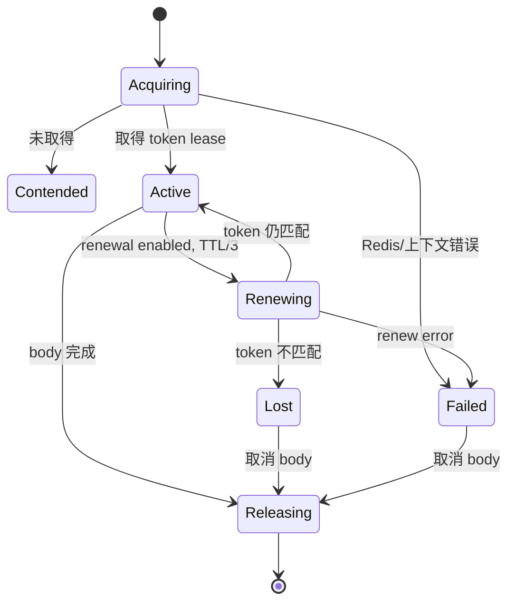

# LockLease 与长任务互斥

## 1. 结论

LockLease 回答的是“在一段有限时间内，哪个实例有资格执行”，不是“哪个实例永远拥有业务事实”。

当前统一 subsystem 提供：

- Redis token lease 的 acquire / renew / release；
- 按 catalog 绑定 workload、component、kind 和默认 TTL；
- 可选自动续租，周期为 TTL / 3；
- 失租或续租失败时取消 body context；
- leader 人工让权后的 cooldown 与有界等待；
- 统一快照、决策和 operation 指标。

业务 body 必须响应 context cancellation；持久化写仍需唯一键、状态机、版本或 fencing 等更靠后的约束。

## 2. Workload catalog

`internal/pkg/resilience/locklease/catalog.go` 是当前内置目录：

| component | workload | kind | 默认 TTL | 用途 |
| --- | --- | --- | ---: | --- |
| worker | `answersheet_processing` | duplicate suppression | 5m | 抑制同一答卷事件并发处理 |
| apiserver | `plan_scheduler_leader` | leader | 50s | 计划调度器 leader |
| apiserver | `statistics_sync_leader` | leader | 30m | 统计同步调度 leader |
| apiserver | `statistics_sync` | task lock | 30m | 统计任务串行化 |
| apiserver | `evaluation_consistency_audit` | leader | 30s | Evaluation 全周期一致性审计 leader |
| apiserver | `evaluation_lease_recovery` | leader | 30s | Evaluation 过期执行租约恢复 leader |
| apiserver | `interpretation_lease_recovery` | leader | 30s | Interpretation 过期执行租约恢复 leader |
| apiserver | `ai_explanation_prompt_evaluation_lease_recovery` | leader | 30s | AI Prompt 评测过期 prepared checkpoint 唤醒 leader |
| apiserver | `ai_explanation_participant_lease_recovery` | leader | 30s | Participant AI 解读过期 Run 的耐久唤醒 leader |
| apiserver | `report_catalog_audit` | leader | 30s | 报告目录审计 leader |
| apiserver | `mongo_consistency_audit` | leader | 30s | Mongo 跨集合一致性只读巡检 leader |
| worker | `attention_projection_reconcile` | leader | 30m | Attention 投影恢复 leader |
| apiserver | `authz_role_projection_reconcile` | leader | 15m | IAM 员工角色 pending 投影收敛 leader |
| collection-server | `collection_submit` | duplicate suppression | 5m | 跨实例提交 owner lease |

catalog 中的 renewal mode 是 `auto` 能力描述；三个进程的版本化 dev/prod 配置均声明启用
`lock_lease.renewal_enabled`。这些 YAML 只表达仓库配置意图，不证明目标环境合并后的 effective value。

### 2.1 DefaultTTL、caller override 与 snapshot

catalog 表中的 TTL 是 `Capability.Spec.DefaultTTL`，只在调用方传入的 TTL 小于等于 0 时作为回退值。`LockLease.Run` 接受 caller override，实际 acquire、renew 周期和续租 TTL 都使用本次调用解析后的 TTL。

例如：

- `plan_scheduler_leader` 的 catalog DefaultTTL 是 50s；
- 仓库 `configs/apiserver.prod.yaml` 为 plan scheduler 声明 `lock_ttl: 2m`；
- 这是仓库版本化配置意图，不证明目标环境已使用 2m；
- 当前 runtime snapshot 仍按 catalog DefaultTTL 投影该 workload，因此会显示 50s 和约 16s 的续租间隔，而不是 caller 的 2m 和 40s。

因此 snapshot 中的 `ttl_seconds` / `renew_every_seconds` 表示 catalog 默认能力，不是 active run 的 effective TTL。排障时必须同时核对 caller 配置和调用点；不能只依据 snapshot 判断正在运行的 lease 预算。

## 3. Lease 生命周期


```mermaid
stateDiagram-v2
    [*] --> Acquiring
    Acquiring --> Contended: 未取得
    Acquiring --> Active: 取得 token lease
    Acquiring --> Failed: Redis/上下文错误
    Active --> Renewing: renewal enabled, TTL/3
    Renewing --> Active: token 仍匹配
    Renewing --> Lost: token 不匹配
    Renewing --> Failed: renew error
    Active --> Releasing: body 完成
    Lost --> Releasing: 取消 body
    Failed --> Releasing: 取消 body
    Releasing --> [*]
```

取得 Redis lease 后，subsystem 还会在进程内原子登记 active run，避免 leader cooldown 与新任务穿透同一个时间窗。

## 4. 续租与取消

启用 renewal 后：

1. 每 `TTL / 3` 尝试 renew；
2. renew 返回未持有，产生 `ErrLeaseLost`；
3. renew 基础设施错误，产生 `ErrLeaseRenewFailed`；
4. subsystem 使用 cancel cause 取消 body context；
5. body 返回后，若它只返回 nil 或 cancellation error，subsystem 返回更具体的 lease 错误。

如果 body 忽略 context cancellation：

- Redis lease 可能已过期，另一实例取得新 lease；
- 旧 body 仍可能继续执行；
- subsystem 只能持续告警，无法强制停止任意 Go 代码。

所以“失租后停止持有者动作”是协作式契约，不是进程级强杀。

## 5. Release 不是正确性提交

Release 使用 token 校验，只释放当前持有者自己的 lease。release 失败通常只意味着 Redis key 可能等到 TTL 自然过期：

- 不应把已成功的业务 transaction 回滚成失败；
- 不应由 release error 覆盖 body 的真实业务结果；
- 应记录 operation metric 和日志；
- 后续竞争者可能短暂多等一个 TTL。

租约释放与业务 commit 是两条不同的状态线。

## 6. 调用方决定 fail-open 还是 fail-closed

统一 subsystem 返回明确结果，但调用方必须根据业务损失选择策略。

### 6.1 collection SubmitCoalescer

- acquire 基础设施失败：degraded-open，继续 Mongo durable accept；
- contention：有界等待 completion signal，再从 Mongo durable readback；
- signal 读写失败或等待超时：不返回 429，进入 Mongo durable path；
- 原因：lease 只降噪，Mongo 唯一键保护业务事实。

### 6.2 worker AnswerSheet duplicate suppression

- acquire 基础设施失败或 manager 不可用：degraded-open，继续 handler；
- contention：认为另一个消费者正在处理，记录 duplicate skipped 并返回 nil；
- 原因：锁用于 best-effort 重复抑制，后续 application/持久化层仍必须可重入。

### 6.3 leader 与 task lock

- contention：本实例不执行；
- acquire/renew/lease loss：向调用方返回错误并取消 body；
- 原因：双 leader 或双长任务的副作用可能更大，不能像 SubmitCoalescer 一样降级到持久层幂等裁决。

相同 Redis lease 原语，在不同业务语义下不能统一规定 fail-open。

## 7. Leader 让权与 cooldown

`RelinquishLeader` 用于有目标地让某个 apiserver 实例释放 leader 执行权：

1. control plane 向目标实例发命令；
2. 目标 subsystem 设置 workload cooldown；
3. 取消当前 active leader body；
4. 在 timeout 内等待 body 退出；
5. control state 保存 cooldown，实例重启后也能 reconcile；
6. cooldown 到期前，本实例不会重新 acquire。

没有 cooldown，刚让权的实例可能立即再次抢回 leader，使人工操作失去意义。

仓库 `apiserver.prod.yaml` 当前声明 `system_governance.resilience.release_lock=false`，action registry 会在采用该配置时把它标记为 planned/disabled。这个值只是版本化配置意图，不能据此断言目标环境的 effective flag，也不能把让权接口描述为已开放操作。

## 8. 为什么 lease 不能替代 fencing

设想：

1. A 取得 lease；
2. A 长时间 GC pause，lease 过期；
3. B 取得新 lease并写数据库；
4. A 恢复，继续用旧执行权写数据库。

仅凭 Redis token，数据库不知道 A 已经过期。要阻止旧持有者写入，需要在持久化层比较单调递增 fencing token、版本号或状态机 CAS。

qs-server 当前通用 LockLease 提供随机 ownership token，用于安全 renew/release；它不是对所有业务存储生效的单调 fencing token。文档和排障中必须区分这两个概念。

### 8.1 候选协调机制

| 方案 | 更适合的场景 | 不能忽略的边界 |
| --- | --- | --- |
| Redis token lease（当前通用原语） | leader、重复工作抑制、短期执行资格 | 网络分区/GC pause 后旧 body 可能继续；依赖协作式取消 |
| DB row lock | 同一数据库内的短事务互斥 | 长任务会长期占连接/事务，不适合跨存储副作用 |
| DB advisory lock | 单数据库内协调且能接受 provider 绑定 | 连接断开语义、跨存储和迁移成本需单独治理 |
| Kubernetes Lease | 部署级 leader election | 不直接保护业务实体，也不覆盖非 K8s 环境 |
| 持久 fencing token + 写入校验 | 旧 owner 写会破坏不可恢复不变量 | 所有副作用存储都必须携带并校验单调 token，改造范围最大 |

选择依据不是“哪个锁更强”，而是最终副作用在哪里、允许旧 owner 做到什么程度。SubmitCoalescer 允许失租 owner 最终与 Mongo unique 竞争；强互斥资金/版本推进类动作则通常必须在写入点拒绝旧 token。

### 8.2 什么时候必须升级为 fencing

满足以下条件时，仅调整 TTL 或开启续租都不够：

1. body 的副作用不能靠幂等、唯一键或状态 CAS 收敛；
2. 旧 owner 在失租后继续写会覆盖新 owner 的合法结果；
3. 外部系统无法撤销或补偿该副作用；
4. 运行环境存在可能超过 TTL 的暂停、网络分区或长尾执行。

此时应让最终存储比较 version/fencing token。续租只降低重叠概率，不能成为安全性证明。

## 9. Key 与信息安全

Redis adapter 通过统一 keyspace builder 构造 key，并用随机 token 标识持有者。治理快照不暴露原始业务 key，只暴露 workload capability、TTL、renewal mode、active 数与 Redis family 健康。

这避免把答卷 ID、用户标识或完整 Redis key 当作低基数监控 label。

## 10. 可观测性

通用 operation counter：

```text
qs_locklease_operation_total{
  component,
  name,
  operation,
  result
}
```

同时通过统一决策指标观察 `lock_acquired`、`lock_contention`、`lock_error`、`duplicate_skipped`、`degraded_open` 等结果。运行时 snapshot 提供：

- configured / degraded / reason；
- catalog DefaultTTL；
- renewal mode / 基于 catalog DefaultTTL 计算的 renew interval；
- active runs。

snapshot 当前不记录 caller override 或 active run 的 effective TTL；例如 plan scheduler 的配置意图 2m 不会覆盖 snapshot 中的 catalog 默认 50s。这是观测边界，不应被解释成 runtime 已按 snapshot 数值执行。

告警不能只看“Redis up”。更直接的问题是：

- renew 是否失败；
- contention 是否突增；
- body 是否在 cancellation 后仍未退出；
- release error 是否导致长时间假占用；
- 运行配置是否错误关闭了需要续租的长任务。

## 11. 当前限制与验证

| 状态 | 内容 |
| --- | --- |
| `已实现` | 十四个 workload 的统一 catalog、token-safe acquire/renew/release、active run 和 cooldown。 |
| `已实现` | renewal failure/loss 取消 body，并对不合作 body 告警。 |
| `配置意图` | 仓库 dev/prod YAML 声明启用自动续租；仍需核对目标环境 effective value。 |
| `观测缺口` | runtime snapshot 只投影 catalog DefaultTTL，不展示 caller override 或 active run effective TTL。 |
| `待运行证据` | 需按 workload 观察 renew error/lost 与 cancellation 后 body 退出时间。 |
| `待补证据` | 需要逐 workload 证明持久化副作用具备幂等、CAS 或 fencing 边界。 |
| `当前未实现` | 通用持久化 fencing token 不属于当前 LockLease 能力。 |

测试入口：

- `internal/pkg/resilience/locklease/subsystem/subsystem_test.go`
- `internal/pkg/resilience/locklease/redisadapter/lock_test.go`
- `internal/worker/handlers/answersheet_handler_test.go`

## 12. 验证问题

1. 为什么 TTL 设得很长不能从根本上解决旧持有者问题？
2. 如果错误关闭 renewal，30 分钟 statistics task lock 最危险的两种情况是什么？
3. worker 在 Redis 故障时继续消费，为什么要求 handler 本身仍然幂等？
