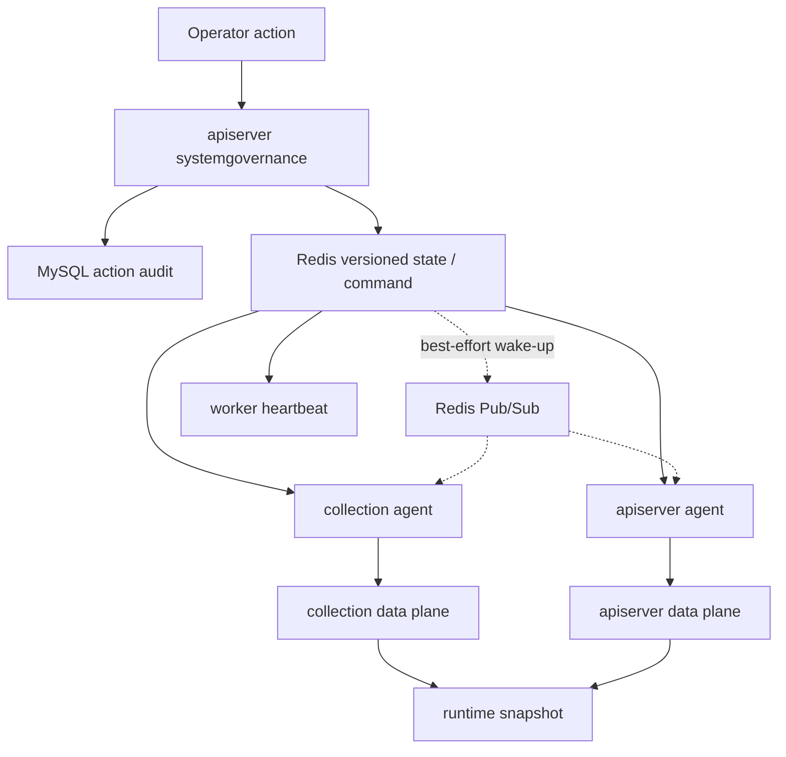

# 运行时治理与故障恢复

## 1. 结论

qs-server 的 resilience data plane 与 control plane 分离：

- data plane 在每个进程内执行 RateLimit、Gate、Backpressure 和 LockLease；
- control plane 通过版本化状态、命令、心跳和审计调整 data plane；
- Redis Pub/Sub 只加速唤醒，版本化 Redis state 才是 control agent 的收敛来源；
- apiserver/worker 的 data plane 在 control Redis 不可用时仍按本地配置运行；
- collection 在 control 开启时要求首次 state sync 成功后才 ready。

当前生产 action flag 全部关闭。动态限流和 leader 让权具备代码路径，但不等于已开放生产操作；queue control 更是保留协议而没有活跃 queue runtime。

## 2. 数据面与控制面



`internal/pkg/resilience/control` 只定义 transport-neutral contract，不实现具体 RateLimit、Queue、Backpressure 或 Lease。真正的数据面仍归进程自己的 subsystem。

## 3. 三个进程的职责

| 进程 | control 行为 | data plane |
| --- | --- | --- |
| collection-server | 首次 sync、每秒 reconcile、心跳、处理 collection command | Redis/local budgets、HTTP/gRPC Gates、SubmitCoalescer/LockLease |
| apiserver | 每秒 reconcile、心跳、发布治理 state/command、处理 leader command | local budgets、dependency Backpressure、leader/task LockLease |
| worker | 每秒心跳 | duplicate suppression LockLease |

实例身份包含 `component + instance_id + generation`。generation 防止同一个 instance ID 重启后与旧心跳混淆。

## 4. 版本化状态如何收敛

RateLimit override 使用 Redis `CompareAndSwap`：

1. operator 必须提交 `expected_version`；
2. state store 比较当前版本；
3. 匹配才写入下一版本；
4. override 可带 TTL，最大 24 小时，默认 30 分钟；
5. agent 定期读取比本地更新的版本并 reconcile；
6. TTL 到期或 reset 后恢复配置 baseline。

这防止两个 operator 基于同一个旧快照互相覆盖。版本冲突要求重新读取，不应静默 last-write-wins。

Rate budget 自身也保留：

- version；
- source：`config` 或 `governance`；
- expires_at；
- global/user policy。

本地 limiter 在 policy 切换时有 1 秒 conservative transition；Redis distributed limiter 当前不保留这段双 limiter 过渡。

## 5. Pub/Sub 为什么不是事实

state store 在 CAS、delete 或 publish command 成功后，向 signal channel best-effort publish：

- publish error 不撤销已经写入的 versioned state；
- 订阅 channel 有界，事件可以被丢弃；
- agent 每秒周期 reconcile，最终仍会读取 state；
- Pub/Sub 只是降低配置生效延迟。

这与报告唤醒、缓存失效信号的原则相同：可丢信号只能促使读者提前检查事实，不能替代事实。

## 6. Readiness 与控制面故障

### 6.1 collection 冷启动

当 `resilience.control.enabled=true`：

- `Sync` 要求 state store 与 ops Redis family 可用；
- 需要先应用已注册 queue 的 desired state；
- 成功后 `ControlSynchronized=true`；
- `/readyz` 在同步前返回 503 `synchronizing`。

首次同步成功后，后台 reconcile 的单次错误不会把已工作的 data plane 清空；agent 会继续周期重试。

### 6.2 apiserver 与 worker

apiserver 的注释和装配明确：control store 不可用时，本地 data-plane policy 仍可使用。worker 没有 control readiness gate，只在能使用 command store 时发布 heartbeat。

因此不能笼统地说“Redis 不可用，整个系统都不能 ready”。不同 Redis family、不同进程和不同阶段的策略不同，需看 readiness 绑定。

## 7. Runtime action 现状

### 7.1 Tune RateLimit

代码支持：

- `apiserver` 和 `collection-server`；
- `override` 与 `reset`；
- global/user 同时调整；
- expected-version CAS；
- TTL 自动回收；
- agent 重启后 reconcile。

但生产：

```yaml
system_governance:
  resilience:
    tune_rate_limit: false
```

action registry 因而将 `resilience.tune_rate_limit` 标记为 planned/disabled。状态：`已实现但生产未启用`。

### 7.2 Release leader

代码支持向指定 apiserver instance 发布 `resilience.release_lock`，等待命令结果并设置 workload cooldown。

生产 `release_lock=false`，同样不对 operator 开放。状态：`已实现但生产未启用`。

### 7.3 Drain / Resume queue

control contract、governor 和 collection command agent 仍保留 queue drain/resume 路径，但当前有三项事实：

1. production `drain_queue=false`、`resume_queue=false`；
2. action registry 没有暴露这两个 action descriptor；
3. production composition 没有 `RegisterQueue` 调用，只有测试注册 fake queue。

因此当前 runtime snapshot 的 queue 列表为空，答卷提交也没有 SubmitQueue。状态：`遗留协议 / 待清理决策`，不是现行队列治理能力。

## 8. Action 审计与幂等

治理操作会改变运行时行为，不能只写一条普通日志。

### 8.1 MySQL 是 claim authority

`system_governance_action_runs` 以 `(org_id, request_id)` 收敛 action：

- 新 request ID 插入 `running`，取得执行权；
- 同 request ID 正在运行，返回 conflict；
- 同 request ID 已完成，重放原 terminal result/error；
- 同 request ID 被用于另一个 action，返回 conflict。

这与业务幂等相同：稳定 request ID 标识一次 operator 意图，持久化唯一约束决定是否执行。

### 8.2 Redis 只保存 terminal fallback

如果 action 已执行，但 MySQL `Complete` 在 3 秒重试窗口内仍失败：

- terminal result/error 写入 ops Redis fallback；
- fallback 使用 `SETNX`，没有 TTL；
- 后续同 request ID 优先重放 fallback，不重复执行 action；
- recovery runner 每 30 秒、每批最多 100 条回填 MySQL；
- MySQL 完成后删除 fallback。

如果 MySQL completion 和 Redis fallback 都失败，执行器返回“outcome could not be persisted”，不能向 operator 伪造可重放的成功。

Redis fallback 不是 action claim authority。开始执行前仍必须由 MySQL claim，避免在 MySQL 故障时无审计地执行高风险操作。

## 9. 故障矩阵

| 故障 | 当前行为 | 不变量 |
| --- | --- | --- |
| Pub/Sub 丢消息 | 周期 reconcile state | 不靠信号保存配置事实 |
| control Redis 冷启动不可用 | collection 不 ready；apiserver/worker data plane 仍按本地基线 | 不使用未知远端状态假装同步 |
| control Redis 运行期短暂错误 | 保留已应用 policy，后台重试 | 不把错误状态覆盖本地 |
| stale expected version | version conflict | 不做静默覆盖 |
| action MySQL claim 失败 | action 不执行 | 无审计 claim 不做高风险操作 |
| action 已执行、MySQL complete 失败 | Redis terminal fallback，后续回填 | 不重复执行，不丢 terminal outcome |
| command target 不存在 | noop | 不假装目标执行成功 |
| command 部分实例失败 | partial/failed/timeout 明确返回 | 不把部分完成压成 ok |

## 10. 安全边界

治理 action descriptor 声明 risk level、enabled/planned 和 `RequiresConfirmation`。action audit 记录：

- org、actor user；
- request ID、action ID；
- component、target instance；
- input；
- started/finished time；
- terminal result 或结构化 error。

启用 action flag 只是最后一道配置开关，不能替代 API 的身份认证、组织范围和授权校验。任何新增 action 都必须同时补 registry、schema、executor、governor、审计、幂等和恢复测试。

## 11. 当前限制与规划

| 状态 | 内容 |
| --- | --- |
| `已实现` | 版本化 rate state、周期 reconcile、best-effort signal、实例心跳。 |
| `已实现` | MySQL action claim + Redis terminal fallback + recovery runner。 |
| `已实现但生产未启用` | tune rate limit、release leader。 |
| `遗留协议` | queue control 有 contract/executor 测试，但无生产 queue 注册与 action descriptor。 |
| `规划改造` | Redis 限流故障状态机若落地，应复用 control state/version/audit，而不是藏在单实例内存里。 |

## 12. 学习问题

1. 为什么 Pub/Sub 成功不能证明所有实例已经应用新 policy？
2. 为什么 action 的 Redis fallback 只保存 terminal result，而不在 MySQL 挂掉时直接充当 claim authority？
3. 如果 tune-rate action 在 5 个实例中只有 4 个 reconcile 成功，操作页面应展示“成功”还是“部分收敛”？需要什么证据？
